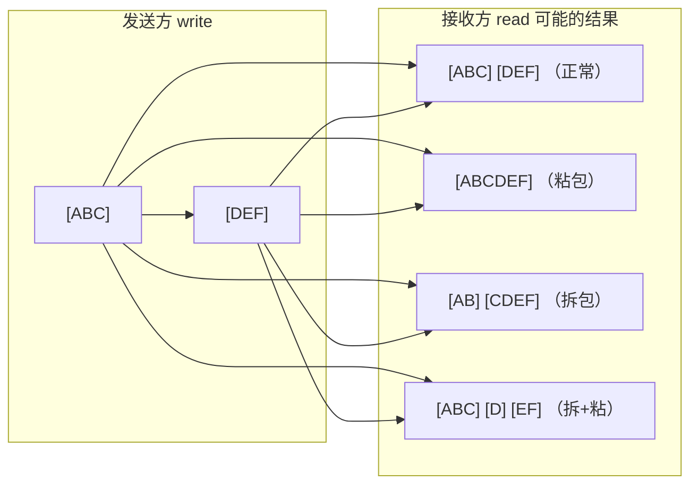

---

title: "TIME_WAIT 与粘包拆包"

created: "2026-07-20"

tags:

  - 八股文

  - 计算机网络

---

# TIME_WAIT 与粘包拆包

## 一句话总结

> **TIME_WAIT = 主动关闭方最后等 2MSL 的"保险期"；粘包/拆包 = TCP 是字节流没消息边界，应用层得自己划界。**

---

## 一、TIME_WAIT 状态

（详见 [[计算机基础/计算机网络/02-TCP三次握手|TCP 三次握手与四次挥手]]。这里只做速记。）

### 1.1 为什么主动关闭方要等 2MSL？

**MSL**（Maximum Segment Lifetime，最大报文生存时间，Linux 默认 60s）。等 2MSL 两个原因：

1. **保证最后的 ACK 能到达对端**：若对端没收到 ACK 会重发 FIN，这期间还能补确认。

2. **让本次连接的所有报文从网络消失**：避免旧连接的延迟报文串到新连接里。

### 1.2 TIME_WAIT 过多怎么办？

高并发短连接场景下，大量 TIME_WAIT 占用端口：

| 方案 | 说明 | 风险 |

| :--- | :--- | :--- |

| `tcp_tw_reuse = 1` | 复用 TIME_WAIT 连接 | 可能收到旧报文 |

| 减小 MSL | 缩短等待 | 连接可靠性下降 |

| 用长连接 | 减少开关次数 | 需维护连接池 |

| 负载均衡 | 分散压力 | 架构变复杂 |

### 1.3 补充：CLOSE_WAIT 过多？

`CLOSE_WAIT` 是**被动关闭方**的状态。过多说明**程序没正确 close 连接**（漏写关闭 / 连接池配置不合理），不是内核参数问题——查代码。

---

## 二、粘包 / 拆包（TCP 特有的坑）
### 2.1 为什么 TCP 会有粘包？

**根因：TCP 是面向字节流的协议，不保留"消息边界"。** 它只保证字节顺序和可靠，不管你应用层一条"消息"从哪到哪。UDP 相反——面向数据报，有保护消息边界，**不存在粘包**。

> 像什么？TCP 像水流，你倒进去"ABC""DEF"两瓢，水流出来可能是混在一起的"ABCDEF"；UDP 像快递，一箱一箱分开送。

### 2.2 产生原因

- **Nagle 算法**：为减少小包数量，把多个小数据合并成一个大包再发。

- **发送/接收缓冲区**：应用层多次 write 的数据先攒在发送缓冲区，TCP 决定何时发；接收方一次 read 可能读到缓冲区里攒的多包。

- **MSS 限制**：一个包太大（超过 MSS，典型 1460 字节）会被拆成多段。

### 2.3 接收方可能读到的四种情况

### 2.4 解决方案（核心：应用层自己定义边界）

| 方案 | 做法 | 适用 | 优缺点 |

| :--- | :--- | :--- | :--- |

| **长度字段（最推荐）** | 包头固定 4 字节存 body 长度，先读长度再读内容 | 变长消息通用 | 可靠、无转义问题；实现稍复杂 |

| **特殊分隔符** | 每条消息末尾加 `\n` / `\r\n` 等 | 文本协议（Redis/SMTP） | 简单；分隔符不能出现在正文 |

| **定长消息** | 每包固定长度，不足补位 | 长度高度固定 | 极简；浪费带宽、不灵活 |

| **关闭 Nagle（TCP_NODELAY）** | 设 `TCP_NODELAY` 让小包立即发 | 实时性要求高 | 减少粘包几率，但**不能根治**（流式本质） |

> ❗ 重点：**关 Nagle 只是降低概率，不能根治粘包**——因为 TCP 天生是流。根治只能靠应用层协议划边界（长度字段最通用）。

---

## 速记卡（面试闪卡）

**Q1：一句话讲清「TIME_WAIT 与粘包拆包」到底是什么？**

A：TIME_WAIT 是主动关闭方等 2MSL 的保险期；粘/拆包因 TCP 是字节流无边界，需应用层自己划界。

**Q2：TIME_WAIT 状态 —— 怎么理解？**

A：主动关闭方发完最后 ACK 后不立刻走，要等 2MSL（Linux 默认 60s×2）的"保险期"：一是防对端没收到 ACK 重发 FIN 时能补确认，二是让本次连接的旧报文从网络消失，避免串到新连接。就像退房后酒店留两天缓冲，防止你落下的东西被下个客人误领。这叫 TIME_WAIT（时间等待）状态。

**Q3：粘包拆包根因 —— 怎么理解？**

A：TCP 是面向字节流的协议，只保顺序和可靠，不保留"消息边界"——你写"ABC""DEF"，读出来可能是混在一起的"ABCDEF"。UDP 面向数据报有边界，不粘包。就像水流 vs 快递：水流混着流，快递一箱箱分开送。这叫 stream（字节流）无边界。

**Q4：粘包产生原因 —— 怎么理解？**

A：三个推手：Nagle 算法把小包攒成大包、发送/接收缓冲区分批收发、超过 MSS（约 1460 字节）被拆段。所以接收方可能读到粘包、拆包或又粘又拆。这叫 Nagle algorithm（纳格算法）和 buffer batching（缓冲批处理）。

**Q5：解决方案 —— 怎么理解？**

A：根治只能应用层自己划界：最通用是"长度字段"（包头 4 字节存 body 长）；文本协议用 `\n` 分隔符；定长消息补位；实时性高可关 Nagle（TCP_NODELAY）但只是降概率、不根治。就像寄快递约定"先报重量再寄货"，双方才知道一箱到哪为止。

**Q6：核心速记主线有哪些？**

- TIME_WAIT：主动关闭方等 2MSL，保 ACK 与防旧报文

- 根因：TCP 字节流无消息边界（UDP 有，不粘包）

- 成因：Nagle 合并、缓冲区批收发、超 MSS 拆分

- 方案：长度字段最通用；分隔符/定长；关 Nagle 不根治

**口诀**

A：TCP 字节流无界，

粘包拆包惹灾孽；

长度字段来划界，

等待 2MSL 才解结。

## 相关链接

- 📋 目录：[[00-计算机网络]]

- 📚 学习清单：[[八股文学习路线图]]

- 🔗 [[02-TCP三次握手|TCP 三次握手与四次挥手]] — TIME_WAIT 的出处

- 🔗 [[03-TCP可靠性与拥塞控制|TCP 可靠性与拥塞控制]] — 滑动窗口/流量控制基础

- 🔗 [[04-TCP与UDP区别|TCP vs UDP]] — 为什么 UDP 不粘包

