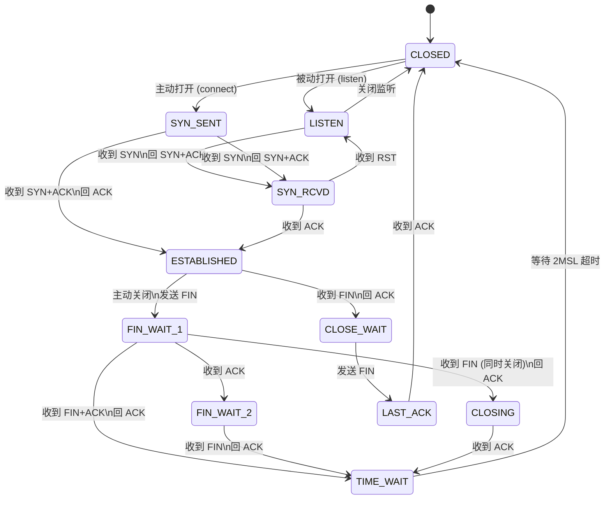

---

title: "TCP状态机完整图"

created: "2025-07-12"

tags:

  - 八股文

  - 计算机网络

---

# TCP状态机完整图

## TCP 状态机完整图
### 状态转换总览

### 11 种状态逐个详解

> TCP 连接一生会经历 11 种状态。**蓝色路径**是客户端（主动方）走的路，**绿色路径**是服务端（被动方）走的路，两条路在 ESTABLISHED 汇合。

#### 连接建立阶段（4 个状态）

| 状态 | 谁进入 | 触发条件 | 通俗理解 |
| :--- | :--- | :--- | :--- |
| **CLOSED** | 初始状态 | 无连接 | 什么都没发生，白纸一张 |
| **LISTEN** | 服务端 | 调用 `listen()` | 服务端开门营业，等客人来 |
| **SYN_SENT** | 客户端 | 调用 `connect()`，发 SYN | 客户端敲门："有人在吗？" |
| **SYN_RCVD** | 服务端 | 收到 SYN，回 SYN+ACK | 服务端应声："在的，你也确认一下" |
| **ESTABLISHED** | 双方 | 收到 ACK | 握手完成，开始通话 |

#### 连接关闭阶段（6 个状态）

| 状态 | 谁进入 | 触发条件 | 通俗理解 |
| :--- | :--- | :--- | :--- |
| **FIN_WAIT_1** | 主动关闭方 | 发送 FIN | "我说完了，要挂了" |
| **FIN_WAIT_2** | 主动关闭方 | 收到对方 ACK | 对方说"知道了"，但还没挂 |
| **CLOSE_WAIT** | 被动关闭方 | 收到对方 FIN | 对方先挂了，等你也挂 |
| **CLOSING** | 双方同时关闭 | 收到 FIN 而非 ACK（罕见） | 两人同时说"拜拜" |
| **LAST_ACK** | 被动关闭方 | 发完自己的 FIN | "我也挂了，确认一下" |
| **TIME_WAIT** | 主动关闭方 | 收到对方 FIN，回 ACK | 等一会儿再彻底关闭（2MSL） |

### 客户端路径（主动连接 + 主动关闭）

### 服务端路径（被动连接 + 被动关闭）

> **注意**：TIME_WAIT 只出现在**主动关闭**的一方。通常客户端先关闭，所以客户端走 TIME_WAIT。但如果服务端先 `close()`（如 HTTP/1.0 短连接），服务端也会进入 TIME_WAIT。

---

## 延伸追问
### Q1：为什么 TIME_WAIT 要等 2MSL？

> 两个原因：

> 1. **保证最后的 ACK 能被重传**：主动关闭方发的最后一个 ACK 可能丢失。如果丢了，被动关闭方会超时重传 FIN。如果主动关闭方已经 CLOSED，收到重传的 FIN 会回 RST，导致被动关闭方异常。等 2MSL 就是为了在这段时间内能收到重传的 FIN 并重新发 ACK。

> 2. **让旧连接的报文在网络中消逝**：防止上一个连接的延迟数据包被误认为是新连接的数据。MSL（Maximum Segment Lifetime）是报文最大存活时间，2MSL 确保一个往返后旧包必然消失。

>

> 详细分析见 [[05-TIME_WAIT与粘包拆包|TIME_WAIT 与粘包拆包]]。

### Q2：CLOSE_WAIT 堆积是什么原因？怎么排查？

> **CLOSE_WAIT 堆积 = 应用层 Bug**。被动关闭方收到 FIN 后进入 CLOSE_WAIT，需要应用层调用 `close()` 才能发 FIN 进入 LAST_ACK。如果应用不调用 `close()`，连接就一直卡在 CLOSE_WAIT。

>

> **常见原因**：

> - 连接池未正确释放连接

> - 异常处理未关闭 socket

> - 线程阻塞导致来不及处理关闭事件

>

> **排查命令**：`ss -tan state close-wait` 或 `netstat -an | grep CLOSE_WAIT`

### Q3：三次握手中，第三次 ACK 丢失会怎样？

> 服务端卡在 **SYN_RCVD** 状态，会重传 SYN-ACK（默认最多 5 次，间隔指数退避）。如果客户端已进入 ESTABLISHED 并发了数据，服务端收到数据后也会进入 ESTABLISHED。如果一直没收到，服务端超时后关闭连接，回到 LISTEN 或 CLOSED。

### Q4：Linux 内核的两个连接队列是什么？

> Linux 为每个监听 socket 维护两个队列：

> 1. **SYN 队列（半连接队列）**：存放 SYN_RCVD 状态的连接——服务端收到了 SYN，发了 SYN-ACK，等最终 ACK。

> 2. **Accept 队列（全连接队列）**：存放已完成三次握手的 ESTABLISHED 连接，等应用 `accept()` 取走。

>

> `listen()` 的 backlog 参数控制 Accept 队列大小。队列满后新连接会被拒绝或忽略。

### Q5：什么是同时关闭（Simultaneous Close）？

> 双方几乎同时调用 `close()` 发 FIN，双方都从 ESTABLISHED → FIN_WAIT_1 → CLOSING → TIME_WAIT → CLOSED。这种情况罕见，但 TCP 协议必须正确处理。CLOSING 状态就是为此设计的。

---

## 速记卡（面试闪卡）

**Q1：一句话讲清「TCP状态机完整图」到底是什么？**

A：TCP 连接一生经历 11 种状态：客户端走蓝路径、服务端走绿路径，在 ESTABLISHED 汇合。

**Q2：连接建立阶段（4 个状态） —— 怎么理解？**

A：握手：CLOSED→（connect）SYN_SENT→（收到 SYN+ACK）ESTABLISHED 是客户端蓝路；CLOSED→（listen）LISTEN→（收到 SYN）SYN_RCVD→ESTABLISHED 是服务端绿路。像打电话：敲门、应声、互认三步走完才通话。

**Q3：连接关闭阶段（6 个状态） —— 怎么理解？**

A：挥手：主动方 FIN_WAIT_1→2→TIME_WAIT（等 2MSL），被动方 CLOSE_WAIT→LAST_ACK→CLOSED；双方同时关走 CLOSING。TIME_WAIT 只出现在主动关闭方，是"等会儿再关"防旧包串门。

**Q4：关键追问：TIME_WAIT 为啥等 2MSL —— 怎么理解？**

A：两个原因：① 保最后 ACK 能重传——丢了对方会重发 FIN，等期间能重发 ACK；② 让旧连接报文在网络消逝，防被误认成新连接。MSL 是报文最大存活时间，2MSL 保一个往返后旧包必消失。

**Q5：关键追问：CLOSE_WAIT 堆积与连接队列 —— 怎么理解？**

A：CLOSE_WAIT 堆积＝应用 Bug：被动方收到 FIN 后要应用调 close() 才发 FIN，不调就一直卡着（连接池没释放／异常没关 socket）。Linux 还有两个队列：SYN 队列（半连接／SYN_RCVD）、Accept 队列（全连接／等 accept），backlog 控大小。

**Q6：核心速记主线有哪些？**

- 11 状态：建立 4 个、关闭 6 个，客户端蓝路服务端绿路汇于 ESTABLISHED

- 三次握手：CLOSED→SYN_SENT→ESTABLISHED 与 LISTEN→SYN_RCVD→ESTABLISHED

- TIME_WAIT 只主动方有，等 2MSL（重传 ACK＋旧包消逝）

- CLOSE_WAIT 堆积是应用没调 close()，用 ss/netstat 排查

- 两个队列：SYN 半连接队列＋Accept 全连接队列

**口诀**

A：握手蓝客绿服行，ESTABLISHED 汇中庭

主动关闭 TIME_WAIT，两 MSL 满方安宁

CLOSE_WAIT 堆积是应用病，不调 close 卡门庭

队列分半连与全连，backlog 限流莫看轻

## 相关链接

- 📋 目录：[[00-计算机网络]]

- 📚 学习清单：[[八股文学习路线图]]

- 🔗 [[02-TCP三次握手|TCP三次握手与四次挥手]] — 握手与挥手流程

- 🔗 [[05-TIME_WAIT与粘包拆包|TIME_WAIT与粘包拆包]] — TIME_WAIT 深度分析

- 🔗 [[03-TCP可靠性与拥塞控制|TCP可靠性与拥塞控制]] — 可靠性机制详解

- 🔗 [[07-TCP高频追问汇总|TCP高频追问汇总]] — 更多 TCP 题

