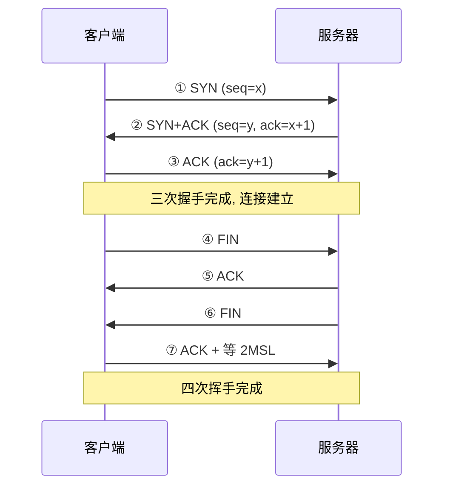

---

title: "TCP高频追问汇总"

created: "2025-07-12"

tags:

  - 八股文

  - 计算机网络

---

# TCP高频追问汇总

## 常见追问汇总

> 本篇为 TCP 题速查汇总，每题附简要答案。详细原理见各专题笔记。

### Q1：TCP 三次握手过程？

> 客户端发送 SYN（seq=x）→ 服务器回复 SYN+ACK（seq=y, ack=x+1）→ 客户端发送 ACK（ack=y+1）。三次握手确认双方收发能力都正常，并同步初始序列号（ISN）。

>

> 详见 [[02-TCP三次握手|TCP三次握手与四次挥手]]。

### Q2：为什么不是两次握手？

> 两次握手无法防止**历史连接**：延迟的旧 SYN 可能导致服务器误建连接、资源浪费。三次握手让客户端能确认"这是我要的连接"——如果收到过期的 SYN+ACK，客户端可以发 RST 终止。

### Q3：TCP 四次挥手过程？

> 客户端发送 FIN → 服务器回复 ACK → 服务器发送 FIN → 客户端回复 ACK 并等待 2MSL。四次挥手因为 TCP 是全双工，需要各自独立关闭自己的那半条通道。

>

> 详见 [[02-TCP三次握手|TCP三次握手与四次挥手]]。

### Q4：为什么客户端要等 2MSL？

> 两个原因：① 确保最后的 ACK 能到达服务器（如果丢失，服务器会重发 FIN，客户端还能重传 ACK）；② 确保旧连接的报文从网络中消失，不影响新连接。

>

> 详见 [[05-TIME_WAIT与粘包拆包|TIME_WAIT 与粘包拆包]]。

### Q5：TIME_WAIT 过多怎么办？

> ① 开启 `tcp_tw_reuse` 复用 TIME_WAIT 连接；② 使用长连接减少连接建立/关闭次数；③ 负载均衡分散压力；④ 调整 `tcp_max_tw_buckets` 限制最大数量。

>

> 详见 [[05-TIME_WAIT与粘包拆包|TIME_WAIT 与粘包拆包]]。

### Q6：CLOSE_WAIT 过多怎么办？

> CLOSE_WAIT 是**被动关闭方**的状态，过多说明程序没有正确关闭连接。检查代码是否遗漏了 `close()` 调用，或者连接池配置是否合理。

>

> 详见 [[06-TCP状态机|TCP 状态机]]。

### Q7：如果服务器突然宕机，客户端会怎样？

> 客户端发数据会收到 RST（连接重置），或者超时重传多次后放弃连接。TCP Keep-Alive 机制可以定期探测连接是否存活（默认 2 小时无活动后开始探测）。

### Q8：SYN Flood 攻击是什么？怎么防御？

> 攻击者发送大量 SYN 报文但不完成三次握手，耗尽服务器**半连接队列**（SYN 队列）。

>

> **防御**：SYN Cookie（不分配资源，把信息编码在序列号里）、增加半连接队列大小、限制 SYN 速率。

### Q9：TCP 和 UDP 怎么选？QUIC 是什么？

> TCP 适合需要可靠传输的场景（网页、文件、支付）；UDP 适合实时性要求高的场景（直播、游戏、DNS）。QUIC 基于 UDP 实现了可靠传输 + 多路复用 + 内置加密，是 HTTP/3 的传输层。

>

> 详见 [[04-TCP与UDP区别|TCP与UDP区别]]。

### Q10：流量控制和拥塞控制有什么区别？

> **流量控制**是接收方告诉发送方"我还能收多少"（滑动窗口），保护接收方。**拥塞控制**是发送方根据网络状况调整发送速度（慢启动/拥塞避免），保护网络。

>

> 详见 [[03-TCP可靠性与拥塞控制|TCP可靠性与拥塞控制]]。

---

## 一图流（Mermaid）

## 速记卡（面试闪卡）

**Q1：一句话讲清「TCP高频追问汇总」到底是什么？**

A：TCP 高频追问汇总把握手挥手、等待时长、状态堆积与流控拥塞一次说清。

**Q2：握手与挥手——建立与关闭 —— 怎么理解？**

A：三次握手 SYN→SYN+ACK→ACK，确认双方收发能力并同步初始序号 ISN；四次挥手因 TCP 全双工，各自独立关半条通道。像两人打电话：互相确认"听得到吗"才开聊，挂电话得两边都说再见（three-way handshake / four-way wave）。

**Q3：为何三次而非两次 + 2MSL —— 怎么理解？**

A：两次握手挡不住历史连接——延迟的旧 SYN 会让服务器误建连接白费资源；三次让客户端能发 RST 终止。客户端等 2MSL 是为保最后 ACK 到达、并让旧报文从网络消失。像确认对方真在线的暗号，多一轮才保险（ISN / 2MSL）。

**Q4：状态堆积——TIME_WAIT 与 CLOSE_WAIT —— 怎么理解？**

A：TIME_WAIT 过多是主动关闭方太多，开 tcp_tw_reuse、用长连接、调桶数；CLOSE_WAIT 过多是被动方没调 close()，查连接池与代码。像停车场：出口堵了是主动方问题，车位被占不死是应用没放手（TIME_WAIT / CLOSE_WAIT）。

**Q5：流量控制 vs 拥塞控制 —— 怎么理解？**

A：流量控制是接收方用滑动窗口告诉发送方"我还能收多少"，保护接收方；拥塞控制是发送方据网络状况调速（慢启动/拥塞避免），保护网络。一个护近端、一个护整网（flow control / congestion control）。

**Q6：核心速记主线有哪些？**

- 握手：SYN→SYN+ACK→ACK，同步 ISN 防历史连接

- 挥手：全双工各自关半通道，客户端等 2MSL

- 状态：TIME_WAIT 开 reuse，CLOSE_WAIT 查 close()

- 控速：流控护接收方，拥塞护网络

**口诀**

A：三次握手防旧连，同步 ISN 才保险；

四次挥手各关半，2MSL 清旧包全；

TIME_WAIT 开复用，CLOSE_WAIT 查没关；

流控护收拥塞网，TCP 追问一遍遍。

## 相关链接

- 📋 目录：[[00-计算机网络]]

- 📚 学习清单：[[八股文学习路线图]]

- 🔗 [[02-TCP三次握手|TCP三次握手与四次挥手]] — 握手与挥手详解

- 🔗 [[06-TCP状态机|TCP状态机]] — 11 种状态

- 🔗 [[03-TCP可靠性与拥塞控制|TCP可靠性与拥塞控制]] — 可靠性与拥塞控制

- 🔗 [[05-TIME_WAIT与粘包拆包|TIME_WAIT与粘包拆包]] — TIME_WAIT 深度分析

- 🔗 [[04-TCP与UDP区别|TCP与UDP区别]] — TCP/UDP/QUIC 对比

