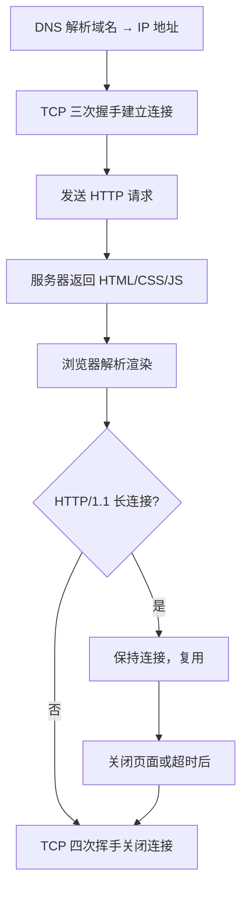

---

title: "TCP实战场景分析"

created: "2025-07-12"

tags:

  - 八股文

  - 计算机网络

---

# TCP实战场景分析

## TCP 实战场景分析
### 场景 1：浏览器访问网页

> 从输入 URL 到页面展示，TCP 连接的完整生命周期。



> 详见 [[14-浏览器输入URL到页面展示|浏览器输入URL到页面展示]]。

### 场景 2：高并发服务器 TIME_WAIT 优化

> **问题**：大量短连接导致 TIME_WAIT 过多，端口耗尽，新连接 bind 失败。

**解决方案**：

```python

# 使用连接池复用连接，避免频繁建立/关闭 TCP 连接

import aiohttp

import asyncio

async def fetch(session, url):

    async with session.get(url) as response:

        return await response.text()

async def main():

    # 创建连接池，复用 TCP 连接

    connector = aiohttp.TCPConnector(limit=100, ttl_dns_cache=300)

    async with aiohttp.ClientSession(connector=connector) as session:

        tasks = [fetch(session, f"http://api.example.com/{i}") for i in range(100)]

        await asyncio.gather(*tasks)

asyncio.run(main())

```

> 其他方案：开启 `tcp_tw_reuse`、使用长连接（HTTP/1.1 Keep-Alive）、负载均衡分散连接。详见 [[05-TIME_WAIT与粘包拆包|TIME_WAIT 与粘包拆包]]。

### 场景 3：网络调试常用命令

```bash

# 查看 TCP 连接状态分布

ss -tan | awk 'NR>1 {states[$1]++} END { for (s in states) printf "%-15s %d\n", s, states[s] }' | sort -k2 -rn

# 查看特定状态连接

ss -tan state time-wait    # TIME_WAIT 连接

ss -tan state close-wait   # CLOSE_WAIT 连接（Bug 探测器）

ss -tan state established  # 活跃连接

# 查看内核参数

sysctl net.ipv4.tcp_tw_reuse

sysctl net.ipv4.tcp_max_syn_backlog

sysctl net.ipv4.tcp_max_tw_buckets

# 抓包分析三次握手

tcpdump -i eth0 port 80 -w handshake.pcap

```

### 场景 4：SYN Flood 攻击排查与防御

> **现象**：服务器 SYN_RCVD 状态连接暴增，CPU 和内存正常但新连接建立失败。

```bash

# 查看半连接队列大小

ss -tan state syn-recv | wc -l

# 查看当前 SYN backlog 配置

sysctl net.ipv4.tcp_max_syn_backlog

# 查看是否开启 SYN Cookie

sysctl net.ipv4.tcp_syncookies

```

**防御措施**：

1. 开启 SYN Cookie（`tcp_syncookies=1`）：不分配资源，把信息编码在序列号里

2. 增加半连接队列大小（`tcp_max_syn_backlog`）

3. 限制 SYN 速率（防火墙规则）

> 详见 [[07-TCP高频追问汇总|TCP高频追问汇总]] Q8。

---

## 速记卡（面试闪卡）

**Q1：一句话讲清「TCP实战场景分析」到底是什么？**

A：TCP 实战场景分析是看 TCP 在真实业务中怎么握手、复用、排障——从开网页到抗 SYN Flood。

**Q2：一、浏览器访问网页全流程 —— 怎么理解？ —— 怎么理解？**

A：像去餐厅吃饭：先 DNS 查地址（问路），再 TCP 三次握手（进门寒暄建立连接），点单发 HTTP 请求（点菜），厨房回 HTML/CSS/JS（上菜），吃完 HTTP/1.1 长连接可复用或四次挥手关门。英文：three-way handshake / long connection。

**Q3：二、TIME_WAIT 优化 —— 怎么理解？ —— 怎么理解？**

A：像大量短租退房后房间暂不腾出：高并发短连接让 TIME_WAIT 堆满端口，新连接 bind 失败。解法是用连接池复用 TCP 连接（aiohttp TCPConnector）、开 tcp_tw_reuse、上长连接、靠负载均衡分散。英文：TIME_WAIT / connection pool。

**Q4：三、网络调试常用命令 —— 怎么理解？ —— 怎么理解？**

A：像给网络拍 CT：ss -tan 看各状态连接分布，专门盯 time-wait、close-wait（Bug 探测器）、established；sysctl 查 tcp_tw_reuse / tcp_max_syn_backlog 等内核参数；tcpdump 抓三次握手包。英文：ss / tcpdump / sysctl。

**Q5：四、SYN Flood 攻击排查与防御 —— 怎么理解？ —— 怎么理解？**

A：像黄牛占着挂号不给信息：服务器 SYN_RCVD 暴增、CPU 正常但新连接建不起来。防御三招：开 SYN Cookie（信息编码进序列号、不占资源）、加大半连接队列、限 SYN 速率。英文：SYN Flood / SYN Cookie。

**Q6：核心速记主线有哪些？**

- 全链路：DNS→三次握手→HTTP→渲染→长连接复用/四次挥手

- TIME_WAIT：短连接过多占端口，连接池+tw_reuse+长连接解

- 调命令：ss 看状态分布、sysctl 看内核参数、tcpdump 抓握手

- SYN Flood：SYN_RCVD 暴增，开 SYN Cookie+扩队列+限速

- 排障观：close-wait 多=对方不关连接，是代码 Bug 信号

**口诀**

A：TCP 实战看全流，握手建连饭馆游；

TIME_WAIT 占端口，连接池里复用兜；

ss 抓包看状态，SYN Flood Cookie 守；

长连接省握手，线上安稳免犯愁。

## 相关链接

- 📋 目录：[[00-计算机网络]]

- 📚 学习清单：[[八股文学习路线图]]

- 🔗 [[02-TCP三次握手|TCP三次握手与四次挥手]] — 握手与挥手流程

- 🔗 [[06-TCP状态机|TCP状态机]] — 状态转换

- 🔗 [[05-TIME_WAIT与粘包拆包|TIME_WAIT与粘包拆包]] — TIME_WAIT 优化

- 🔗 [[14-浏览器输入URL到页面展示|浏览器输入URL到页面展示]] — 完整网络流程

