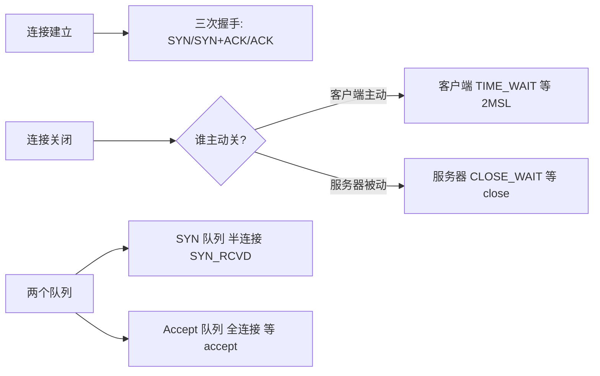

# TCP易错点总结
## TCP 易错点总结

| # | 误区 | 正解 |
| :---: | :--- | :--- |
| 1 | ❌ 两次握手就能建立连接 | ✅ 两次握手无法防止**历史连接**，延迟的旧 SYN 会导致误建连接。三次握手让客户端能确认"这是我要的连接" |
| 2 | ❌ 四次挥手必须是四次 | ✅ 如果服务器没有数据要发，第二三次（ACK 和 FIN）可以合并为一次发送，变成三次挥手 |
| 3 | ❌ TIME_WAIT 是坏状态 | ✅ TIME_WAIT 是**正常状态**，确保连接可靠关闭 + 旧报文消逝。过多才需要优化 |
| 4 | ❌ 关闭连接就是直接断开 | ✅ 需要四次挥手，双方各自关闭自己那半条通道（TCP 是全双工） |
| 5 | ❌ SYN 报文可以携带数据 | ✅ SYN 报文不能携带数据。但**第三次握手的 ACK 可以**携带数据（此时连接已建立） |
| 6 | ❌ MSL 是固定值 | ✅ MSL 由系统配置，Linux 默认 60 秒，2MSL = 120 秒。可通过内核参数调整 |
| 7 | ❌ CLOSE_WAIT 是客户端状态 | ✅ CLOSE_WAIT 是**被动关闭方**（通常是服务器）的状态。过多 = 应用层没调 `close()` |
| 8 | ❌ 三次握手只建立连接 | ✅ 三次握手还**同步双方的初始序列号（ISN）**，这是可靠传输的基础 |
| 9 | ❌ 流量控制 = 拥塞控制 | ✅ **流量控制**是接收方通过滑动窗口告诉发送方"我还能收多少"（保护接收方）；**拥塞控制**是发送方根据网络状况调整速度（保护网络） |
| 10 | ❌ TCP 一定比 UDP 慢 | ✅ 裸 UDP 头部更小（8B vs 20B），但如果在 UDP 上实现可靠性（如 QUIC），实际开销可能接近 TCP。正确对比是"谁的失败行为匹配你的场景" |
| 11 | ❌ TIME_WAIT 只出现在客户端 | ✅ 谁主动关闭谁进 TIME_WAIT。HTTP/1.0 短连接中服务端主动关闭，服务端也会进 TIME_WAIT |
| 12 | ❌ 半连接队列 = 全连接队列 | ✅ **SYN 队列**（半连接）存放 SYN_RCVD 状态连接；**Accept 队列**（全连接）存放已完成握手但未被 `accept()` 取走的连接 |

---

## 一图流（Mermaid）

## 速记卡（面试闪卡）

**Q1：两次握手能建立连接吗？**
A：不能。无法防止历史连接，延迟的旧 SYN 会误建连接、浪费资源。

**Q2：四次挥手能合并成三次吗？**
A：能。若服务器无数据要发，ACK 和 FIN 合并发送，变成三次挥手。

**Q3：TIME_WAIT 是好是坏？**
A：正常状态，确保可靠关闭 + 旧报文消逝；过多才需优化（不是坏状态）。

**Q4：CLOSE_WAIT 是哪方状态？**
A：被动关闭方（通常服务器）。过多 = 应用层没调 close()。

**Q5：半连接队列 vs 全连接队列？**
A：SYN 队列（半连接，存 SYN_RCVD）；Accept 队列（全连接，已完成握手等 accept() 取走）。

> 🔑 口诀：两次握手防不住历史连接；挥手可合并成三次；TIME_WAIT 正常、CLOSE_WAIT 是被动方没 close；SYN 队列半连接、Accept 队列全连接。

---

## 相关链接

- 📋 目录：[[00-计算机网络]]
- 📚 学习清单：[[八股文学习清单]]
- 🔗 [[02-TCP三次握手|TCP三次握手与四次挥手]] — 握手与挥手详解
- 🔗 [[06-TCP状态机|TCP状态机]] — 11 种状态
- 🔗 [[03-TCP可靠性与拥塞控制|TCP可靠性与拥塞控制]] — 流量控制 vs 拥塞控制
- 🔗 [[04-TCP与UDP区别|TCP与UDP区别]] — TCP/UDP/QUIC 对比
- 🔗 [[07-TCP高频追问汇总|TCP高频追问汇总]] — 更多题
