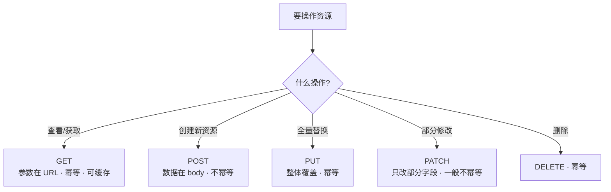

---

title: "GET与POST与PUT与DELETE请求方法"

created: "2025-07-12"

tags:

  - 八股文

  - 计算机网络

---

# GET与POST与PUT与DELETE请求方法

## 二、GET / POST / PUT / DELETE（请求方法）
### 2.1 用"餐厅"比喻理解每种方法

| 方法 | 做什么 | 餐厅比喻 | 举例 |
| :---: | :--- | :--- | :--- |
| **GET** | 查看/获取数据 | 看菜单 | 获取用户列表 |
| **POST** | 创建新资源 | 点一道新菜 | 注册新用户 |
| **PUT** | 整体替换资源 | 把整道菜换掉（全部重做） | 更新用户全部信息 |
| **PATCH** | 部分修改资源 | 只给菜加点辣（改一部分） | 只改用户的邮箱 |
| **DELETE** | 删除资源 | 把菜退掉 | 删除用户 |

#### 方法选择决策图



### 2.2 什么是请求体（Body）？

**通俗比喻**：你寄快递，快递单上写着**收件地址、寄件人**（这就是请求行和请求头），但你真正要寄的东西——一本书、一件衣服——装在**包裹里面**（这就是 body 请求体）。

```text

一个 HTTP 请求长这样：

POST /users HTTP/1.1              ← 请求行：方法 + 地址 + 协议版本

Host: api.example.com             ← 请求头：一些附加信息

Content-Type: application/json    ← 请求头：告诉服务器"我发的是 JSON"

Authorization: Bearer xxx         ← 请求头：token，证明你是谁

                                    （以上都是"快递单"）

─────────────────────────────────

{"name": "张三", "age": 25}       ← 请求体（body）：你真正要发的数据

                                    （这是"包裹里的东西"）

```

| 部分 | 是什么 | 快递比喻 | 例子 |
| :--- | :--- | :--- | :--- |
| **请求行** | 方法 + URL + 协议 | 快递单上的"寄往哪、什么快递" | `POST /users HTTP/1.1` |
| **请求头** (Header) | 附加信息 | 收件人、寄件人、备注 | `Content-Type: application/json` |
| **请求体** (Body) | 你要发的核心数据 | 包裹里的东西 | `{"name": "张三"}` |

**关键点**：

- **GET 请求没有 body**——你只是"看看菜单"，不需要带东西过去，参数放在 URL 里就行：`/users?page=1&size=10`

- **POST/PUT/PATCH 有 body**——你要"提交数据"给服务器，数据放在 body 里：`{"name": "张三"}`

- 请求头里的 `Content-Type` 告诉服务器 body 是什么格式：`application/json`（JSON）、`application/x-www-form-urlencoded`（表单）、`multipart/form-data`（文件上传）

```python

# FastAPI 里怎么取 body

from fastapi import FastAPI, Body          # 导入必要模块

app = FastAPI()                            # 创建应用实例

@app.post("/users")                        # POST 请求

def create_user(

    name: str = Body(),                    # 从 body 里取 name 字段

    age: int = Body()                      # 从 body 里取 age 字段

):

    return {"name": name, "age": age}      # 原样返回

# FastAPI 自动解析 JSON body，把字段赋值给函数参数

```

### 2.3 每种方法的详细对比

| 特性 | GET | POST | PUT | PATCH | DELETE |
| :--- | :---: | :---: | :---: | :---: | :---: |
| **语义** | 读取 | 创建 | 全量更新 | 部分更新 | 删除 |
| **有请求体？** | ❌ 没有（参数在 URL 里） | ✅ 有 | ✅ 有 | ✅ 有 | 可有可无 |
| **幂等？** | ✅ | ❌ | ✅ | ❌（一般） | ✅ |
| **安全？** | ✅ | ❌ | ❌ | ❌ | ❌ |
| **可缓存？** | ✅ | ❌（默认） | ❌ | ❌ | ❌ |

> **安全**（Safe）= 这个操作不会修改服务器上的数据。GET 是安全的——你只是看看菜单，不会改变任何东西。

>

> **幂等**（Idempotent）= 同一个请求执行 1 次和执行 N 次，结果一样。GET 是幂等的——你刷新页面 10 次，看到的内容不变。POST 不是幂等的——你提交表单 10 次，可能创建了 10 条记录。

### 2.4 GET vs POST（最高频）

| 对比 | GET | POST |
| :--- | :--- | :--- |
| **参数位置** | URL 里：`/users?page=1` | 请求体里：`{"name": "张三"}` |
| **参数长度** | URL 有长度限制（浏览器约 2048 字符） | 理论上无限制 |
| **可见性** | 参数在地址栏可见，不安全 | 参数在请求体里，不直接可见 |
| **缓存** | 浏览器会缓存 GET 结果 | 默认不缓存 |
| **书签** | 可以收藏为书签 | 不行 |
| **编码** | 只支持 URL 编码 | 支持多种编码（JSON、表单、文件） |
| **语义** | **获取数据**（不应该有副作用） | **提交数据**（应该有副作用：创建/修改） |

**生活场景**：

```text

GET  = 你走进书店，翻翻这本书看看目录（不改变任何东西）

POST = 你去收银台结账买书（创建了一笔交易记录，改变了店里的库存）

```

> **延伸追问：GET 请求能带请求体吗？**

> 技术上 HTTP 规范没禁止，但**浏览器和大多数工具不保证会发送 GET 的 body**。实际开发中永远不要给 GET 加 body，用 POST 或 URL 参数。

### 2.5 PUT vs PATCH

```text

PUT /users/1

{"name": "张三", "age": 25, "city": "北京"}

→ 把 id=1 的用户信息**整体替换**为上面的内容

→ 如果原来还有 email 字段但你没传，email 会被删掉或置空

PATCH /users/1

{"city": "上海"}

→ 只把 id=1 的用户的 city 改成"上海"

→ name、age 等其他字段不动

```

**生活场景**：

```text

PUT   = 你跟发型师说"给我剪成寸头"，整体换造型

PATCH = 你跟发型师说"刘海修短一点"，只改局部

```

### 2.6 幂等性详解（爱问）

**通俗比喻**：幂等就像你家楼下的电梯按钮——按 1 次和按 10 次，电梯都只来 1 次（理想情况下）。而非幂等就像按 1 次"打印"按钮出 1 张纸，按 10 次出 10 张纸。

#### GET — ✅ 幂等

> 你刷新页面 100 次，页面内容不会变。GET 只是"看"，不改变服务器状态。

#### PUT — ✅ 幂等

```text

PUT /users/1  {"name": "张三", "age": 25}

执行 1 次：name=张三, age=25

执行 10 次：还是 name=张三, age=25

```

> PUT 是**整体覆盖**——你每次都把整个资源换成你给的值，不管之前是什么。第 1 次和第 10 次的结果一样。

#### DELETE — ✅ 幂等

```text

DELETE /users/1

第 1 次：删除成功，用户没了

第 2 次：用户已经没了，返回 404，但服务器状态没变——用户还是不存在

```

> 幂等看的是**服务器状态**，不是返回值。返回 404 不代表不幂等，代表"已经删过了，结果和删 1 次一样"。

#### POST — ❌ 不幂等

```text

POST /orders  {"item": "手机"}

第 1 次：创建订单 #1

第 2 次：创建订单 #2

第 10 次：创建订单 #10

```

> 每次 POST 服务器都会**新建一条记录**，ID 递增。执行 N 次就产生 N 条数据，状态完全不同。

#### PATCH — ❌ 一般不幂等

PATCH 是"部分修改"，取决于你怎么写：

```json

// 这种不幂等

PATCH /users/1  {"age": "+1"}       // 第1次: 25→26, 第2次: 26→27

// 这种幂等

PATCH /users/1  {"age": 25}         // 第1次: age=25, 第10次: age=25

```

> PATCH **语义上不保证幂等**，因为常见的部分修改操作（计数器+1、追加元素）天然不是幂等的。但如果你写的是"设置为固定值"，它事实上幂等。答"一般不幂等，看具体实现"就行。

#### 一句话总结

| 方法 | 幂等？ | 核心原因 |
| :---: | :---: | :--- |
| GET | ✅ | 只读，不改状态 |
| PUT | ✅ | 全量覆盖，设 N 次结果一样 |
| DELETE | ✅ | 删掉后再删，状态不变（已经没了） |
| POST | ❌ | 每次创建新资源，N 次 = N 条记录 |
| PATCH | ❌ | 常见操作（+1、追加）会累积变化 |

#### 幂等性在实际开发中的意义：网络超时重试

```python

import requests                         # 导入 HTTP 请求库

# ---- GET 幂等：重试安全 ----

resp = requests.get("/api/users/1")     # 第一次请求，网络超时了

resp = requests.get("/api/users/1")     # 重试！没问题，结果一样（幂等）

# ---- POST 不幂等：重试有风险 ----

resp = requests.post("/api/orders", json={"item": "手机"})  # 创建订单，超时了

resp = requests.post("/api/orders", json={"item": "手机"})  # 重试！危险！可能创建了两个订单

```

> **怎么解决 POST 重试导致重复创建的问题？** 用 `request_id` 去重。

**通俗比喻**：你去银行办业务，取号机给你一个**排队号**（request_id）。你走到窗口说"我要存 100 块"，柜员办完后在系统里记录"排队号 A007 已办完"。如果你因为没听清又说了一遍"我要存 100 块"，柜员一看系统——"A007 已经办过了"——不会给你再存 100 块，而是把上次的结果告诉你。

**客户端**：每次请求带一个唯一 ID

```python

import requests, uuid                  # 导入 HTTP 库和 UUID 生成器

request_id = str(uuid.uuid4())          # 生成一个唯一的请求 ID，如 "a3f2c8b1-..."

# 发请求时带上 request_id（放在请求头里）

resp = requests.post(

    "/api/orders",                      # 创建订单接口

    json={"item": "手机"},              # 请求体

    headers={"X-Request-ID": request_id}  # 把 request_id 放在自定义请求头里

)

# 网络超时了，客户端重试——用同一个 request_id 再发一次

resp = requests.post(

    "/api/orders",

    json={"item": "手机"},

    headers={"X-Request-ID": request_id}  # 同一个 ID，服务端会认出这是重试

)

```

**服务端**：用 Redis 存已处理的 request_id

```python

from fastapi import FastAPI, Request, HTTPException  # 导入必要模块

import redis                                         # 导入 Redis 客户端

app = FastAPI()                                      # 创建应用实例

r = redis.Redis(host="localhost", port=6379, db=0)   # 连接 Redis（内存数据库，查得快）

@app.post("/api/orders")                             # 创建订单接口

async def create_order(request: Request):

    # ---- 第一步：取出客户端传来的 request_id ----

    request_id = request.headers.get("X-Request-ID") # 从请求头里取 request_id

    if not request_id:                               # 如果客户端没传

        raise HTTPException(400, "缺少 X-Request-ID")  # 报错，要求客户端传

    # ---- 第二步：检查这个 request_id 是不是已经处理过 ----

    cached = r.get(f"req:{request_id}")              # 去 Redis 里查：这个 ID 见过吗？

    if cached:                                       # 见过了（说明是重试）

        return json.loads(cached)                    # 直接返回上次的结果，不重复创建

    # ---- 第三步：没处理过，正常执行业务逻辑 ----

    order = {"id": 123, "item": "手机", "status": "created"}  # 创建订单（模拟）

    # ---- 第四步：把结果存进 Redis，key 是 request_id ----

    r.setex(                                         # setex = set + 过期时间

        f"req:{request_id}",                         # key：用 request_id 做唯一标识

        3600,                                        # 过期时间：1 小时后自动删除（防内存爆炸）

        json.dumps(order)                            # value：把订单结果序列化存进去

    )

    return order                                     # 返回创建的订单

```

**流程走一遍**：

```text

客户端第一次发：POST /api/orders, X-Request-ID: a3f2c8b1

  → Redis 里没有 a3f2c8b1

  → 创建订单 #123

  → 存入 Redis: req:a3f2c8b1 → 订单结果

  → 返回订单 #123

网络超时，客户端用同一个 ID 重试：POST /api/orders, X-Request-ID: a3f2c8b1

  → Redis 里有 a3f2c8b1！

  → 直接返回缓存的订单 #123，不重复创建

```

> **为什么用 Redis 不用数据库？** 查数据库要读硬盘（慢），查 Redis 是读内存（快 1000 倍）。去重是每次请求都要做的操作，必须快。

---

## 速记卡（面试闪卡）

**Q1：一句话讲清「GET与POST与PUT与DELETE请求方法」到底是什么？**

A：GET/POST/PUT/DELETE 是 HTTP 的四种核心请求方法，分别用于读取、创建、整体替换与删除资源。

**Q2：2.1 用"餐厅"比喻理解每种方法 —— 怎么理解？**

A：像去餐厅点单：GET 是翻菜单看一眼（只读取不改动），POST 是点一道新菜（创建资源），PUT 是把整道菜重做（整体替换资源），PATCH 是只给菜加点辣（部分改），DELETE 是把菜退掉（删除）。语义清晰就不会用错方法。

**Q3：2.2 什么是请求体（Body）？ —— 怎么理解？**

A：把 HTTP 请求想成寄快递：请求行和请求头是快递单（写收件地址、备注），请求体（Body，英文 Request Body）是包裹里真正要寄的东西（如 `{"name":"张三"}`）。GET 没有 body，参数放 URL 里（像只递单不寄东西）；POST/PUT/PATCH 有 body（真提交数据）。`Content-Type` 告诉服务器 body 是什么格式。

**Q4：2.4 GET vs POST（最高频） —— 怎么理解？**

A：最高频对比记住七点：GET 参数在 URL、有长度限制、地址栏可见、可缓存可收藏，语义是"读取"；POST 参数在请求体、理论无限长、不直接可见、默认不缓存，语义是"提交"（有副作用）。一句话：GET 看菜单不改变任何东西，POST 结账买书会留下交易记录。

**Q5：2.6 幂等性详解（爱问） —— 怎么理解？**

A：幂等（Idempotent）指执行 1 次和执行 N 次结果一样，像电梯按钮按 1 次和按 10 次都只来 1 次。GET/PUT/DELETE 幂等（PUT 全量覆盖、DELETE 删完再删还是没有），POST 不幂等（提交 10 次建 10 条记录），PATCH 一般不幂等。POST 重试怕重复创建，用 request_id（请求唯一 ID，英文 Request ID）去重。

**Q6：核心速记主线有哪些？**

- GET 读、POST 建、PUT 整体替换、PATCH 部分改、DELETE 删

- GET 无 body 参数在 URL；POST/PUT/PATCH 有 body（包裹里的东西）

- GET 可缓存可收藏、POST 有副作用默认不缓存

- 幂等：GET/PUT/DELETE 是，POST 否；POST 重试用 request_id 去重

**口诀**

A：GET 读 POST 建 PUT 全换，

DELETE 退菜 PATCH 改半边；

GET 无身参在网址，POST 包裹藏里面；

幂等按钮按多次，request_id 防重单。

## 相关链接

- 📋 目录：[[00-计算机网络]]

- 📚 学习清单：[[八股文学习路线图]]

- 🔗 [[19-HTTP基础|HTTP基础]] — HTTP 请求/响应结构

- 🔗 [[10-HTTP状态码|HTTP状态码]] — 各方法对应的状态码

- 🔗 [[22-RESTful设计|RESTful设计]] — RESTful API 设计规范

- 🔗 [[16-长连接与短连接与流水线|长连接与短连接]] — HTTP 连接管理

