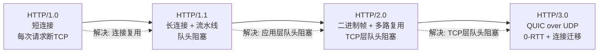

# HTTP版本演进1.0到3.0
## HTTP 版本演进：1.0 → 1.1 → 2.0 → 3.0

### 版本演进总览

| 版本 | 年份 | 核心特性 | 缺陷 |
| :--- | :---: | :--- | :--- |
| **HTTP/1.0** | 1996 | 短连接，每次请求断 TCP | 性能差，10 张图握手 10 次 |
| **HTTP/1.1** | 1997 | 默认长连接、流水线、Host 虚拟主机、缓存 max-age | 队头阻塞（一个慢全部卡）、文本传输 |
| **HTTP/2.0** | 2015 | 二进制帧、多路复用、HPACK 头部压缩、服务器推送 | TCP 层丢包阻塞整条连接 |
| **HTTP/3.0** | 2022 | 底层换 UDP（QUIC）、0-RTT 快速握手、网络切换不断连 | 普及中，用户态实现 CPU 开销略高 |

### 通俗理解

> - **HTTP/1.0**：每次打电话都要重新拨号
> - **HTTP/1.1**：保持通话不断线，但对方只能一个一个回答问题
> - **HTTP/2.0**：对方可以同时回答多个问题（多路复用），但电话线断了（TCP 丢包）所有问题都卡住
> - **HTTP/3.0**：换了一条不会堵的线路（UDP），即使某条消息丢了，其他消息不受影响

### 版本演进图

### 各版本详解

#### HTTP/1.0 — 短连接时代

> 每个请求都需要独立的 TCP 连接——三次握手 → 发请求 → 收响应 → 四次挥手。一个网页有 10 张图片？握手 10 次。

- **缺陷**：连接建立/关闭开销大，性能差
- **改进方向**：连接复用

#### HTTP/1.1 — 长连接 + 流水线

> 默认开启 `Connection: keep-alive`，多个请求复用同一个 TCP 连接。

| 特性 | 说明 |
| :--- | :--- |
| **长连接** | 多个请求共用一个 TCP 连接，避免重复握手 |
| **流水线** | 客户端可以连续发多个请求，不用等上一个响应 |
| **Host 头** | 支持虚拟主机，一个 IP 可以托管多个域名 |
| **缓存控制** | `Cache-Control: max-age` 精确控制缓存 |

**致命缺陷——队头阻塞（HOLB）**：虽然可以连续发请求，但服务器必须**按序响应**。如果第一个请求处理慢，后面的请求即使已准备好也得等。

> 详见 [[16-长连接与短连接与流水线|长连接与短连接与流水线]]。

#### HTTP/2.0 — 二进制帧 + 多路复用

| 特性 | 说明 |
| :--- | :--- |
| **二进制帧** | 不再是文本传输，拆成二进制 Frame，更高效 |
| **多路复用** | 一个 TCP 连接上多个请求**并行**传输，互不阻塞 |
| **HPACK** | 头部压缩，消除重复 Header 的冗余 |
| **服务器推送** | 服务器可以主动推送资源（CSS/JS）给客户端 |

**关键局限**：HTTP/2 解决了**应用层**的队头阻塞，但底层仍然是 TCP。TCP 保证按序交付——一个包丢了，所有 stream 都得等重传。这就是 **TCP 层队头阻塞**。

> 详见 [[15-HTTP2多路复用|HTTP/2 多路复用]]。

#### HTTP/3.0 — QUIC over UDP

> 彻底换底层：从 TCP 换成 **QUIC**（基于 UDP），集成 TLS 1.3。

| 特性 | 说明 |
| :--- | :--- |
| **QUIC 传输** | 基于 UDP，用户态实现，不需要改内核 |
| **0-RTT 握手** | 首次连接 1-RTT，重连 0-RTT（首个包就带数据） |
| **连接迁移** | 用 Connection ID 标识连接，WiFi→4G 切换不断连 |
| **per-stream 独立** | 每个 stream 独立 ACK/重传，一个流丢包不阻塞其他流 |

> 详见 [[04-TCP与UDP区别|TCP与UDP区别]] QUIC 部分。

### ❗ 易错点

> HTTP/2 **没有完全解决**队头阻塞——只解决了应用层的；底层 TCP 丢包时，整条连接的所有请求都会被阻塞。**HTTP/3 换 UDP（QUIC）才彻底解决。**

---

## 速记卡（面试闪卡）

**Q1：一句话讲清「HTTP版本演进1.0到3.0」到底是什么？**
A：| 版本 | 年份 | 核心特性 | 缺陷 |
| :--- | :---: | :--- | :--- |
| **HTTP/1.0** | 1996 | 短连接，每次请求断 TCP | 性能差，10 张图握手 10 次 |
| **HTTP/1.

**Q2：HTTP 版本演进：1.0 → 1.1 → 2.0 → 3.0 —— 怎么理解？**
A：| 版本 | 年份 | 核心特性 | 缺陷 |
| :--- | :---: | :--- | :--- |
| **HTTP/1.0** | 1996 | 短连接，每次请求断 TCP | 性能差，10 张图握手 10 次 |
| **HTTP/1.1** | 1997 | 默认长连接、流水线、Host 虚拟主机、缓存 max-age | 队头阻塞（一个慢全部卡）、文本传输 |
| **HTTP/2.

**Q3：核心速记主线有哪些？**
A：抓住这几根：HTTP 版本演进：1.0 → 1.1 → 2.0 → 3.0。

## 相关链接

- 📋 目录：[[00-计算机网络]]
- 📚 学习清单：[[八股文学习清单]]
- 🔗 [[15-HTTP2多路复用|HTTP/2多路复用]] — HTTP/2 二进制帧与多路复用详解
- 🔗 [[04-TCP与UDP区别|TCP与UDP区别]] — QUIC 协议深度对比
- 🔗 [[16-长连接与短连接与流水线|长连接与短连接与流水线]] — HTTP/1.1 长连接与流水线
- 🔗 [[13-HTTPS加密流程|HTTPS加密流程]] — TLS 加密层
