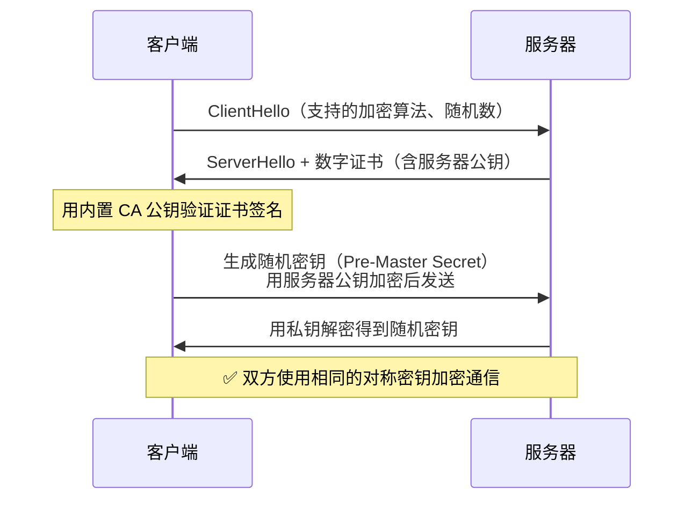

# HTTP与HTTPS加密流程
## 七、HTTP & HTTPS（安全核心，常见）

### 7.1 HTTP三大安全漏洞

| 漏洞 | 通俗解释 | 危害 |
| :--- | :--- | :--- |
| **窃听** | 明文传输，抓包就能看 | 账号密码被偷 |
| **伪装** | 无法验证对方身份 | 钓鱼网站伪装官网 |
| **篡改** | 报文可被中间人修改 | 页面被注入广告/恶意代码 |

### 7.2 HTTPS = HTTP + TLS加密层

```text
HTTP应用层 → TLS加密层 → TCP传输层 → 网络
```

> 所有HTTP报文**先加密再传输**，接收后**先解密再解析**。

### 7.3 两种加密算法（通俗理解）

#### 1）对称加密

> 加解密用**同一把钥匙**，速度快。

**问题：** 密钥怎么安全发给对方？网络传输会被窃听。

**比喻：** 你和朋友用同一把钥匙锁箱子，但怎么把钥匙安全地给朋友是个难题。

#### 2）非对称加密

> 一对密钥：**公钥（公开）**、**私钥（自己保管）**

**两种用法：**

| 用法 | 流程 | 作用 |
| :--- | :--- | :--- |
| **公钥加密，私钥解密** | 任何人拿公钥加密数据，只有私钥持有者能解密 | 加密数据，防偷看 |
| **私钥加密，公钥验签** | 私钥持有者加密签名，任何人用公钥验证 | 数字签名，防篡改+验身份 |

**数字签名通俗比喻：**

> - **私钥** = 你独有的私人公章
> - **公钥** = 公章复印件，全网公开
> - 流程：你用私钥给文件"盖章"（加密）→ 对方拿你的公钥"验章"（解密对比）
> - 作用：证明文件**一定是你发的**，中途**没人修改**

### 7.4 HTTPS混合加密流程（兼顾速度+安全）

```text
1. 握手阶段：非对称加密，安全交换对称加密的密钥
2. 业务阶段：对称加密，高速传输网页数据
3. 数字证书：防止中间人篡改公钥
```

#### 完整握手流程（简化版）



### 7.5 数字证书 & CA机构

> CA = 双方信任的**第三方公证处**

```text
1. 网站向CA申请证书，CA用CA私钥给网站公钥签名
2. 浏览器出厂内置CA公钥
3. 访问网站时，浏览器用CA公钥校验证书签名
4. 校验通过 → 网站身份真实，公钥没被劫持
5. 校验失败 → 浏览器弹出"不安全"警告
```

### 7.6 HTTP vs HTTPS 对比

| 维度 | HTTP | HTTPS |
| :--- | :--- | :--- |
| **端口** | 80 | 443 |
| **传输** | 明文 | 密文（TLS加密） |
| **速度** | 更快 | 有加解密损耗，略慢（差距很小） |
| **成本** | 免费 | 需要CA证书（有免费的Let's Encrypt） |
| **安全** | 窃听/篡改/钓鱼风险 | 加密+验身份+防篡改 |

---

## 速记卡（面试闪卡）

**Q1：一句话讲清「HTTP与HTTPS加密流程」到底是什么？**
A：| 漏洞 | 通俗解释 | 危害 |
| :--- | :--- | :--- |
| **窃听** | 明文传输，抓包就能看 | 账号密码被偷 |
| **伪装** | 无法验证对方身份 | 钓鱼网站伪装官网 |
| **篡改** | 报文可被中间人修改 | 页面被注入广告/恶意代码 |
所有HTTP报文**先加密再传输**，接收后**先解密再解析**。
加解密用**同一把钥匙**，速度快。

**Q2：七、HTTP & HTTPS（安全核心，常见） —— 怎么理解？**
A：| 漏洞 | 通俗解释 | 危害 |
| :--- | :--- | :--- |
| **窃听** | 明文传输，抓包就能看 | 账号密码被偷 |
| **伪装** | 无法验证对方身份 | 钓鱼网站伪装官网 |
| **篡改** | 报文可被中间人修改 | 页面被注入广告/恶意代码 |
所有HTTP报文**先加密再传输**，接收后**先解密再解析**。
加解密用**同一把钥匙**，速度快。

**Q3：核心速记主线有哪些？**
A：抓住这几根：七、HTTP & HTTPS（安全核心，常见）。


## 相关链接

- 📋 目录：[[00-计算机网络]]
- 📚 学习清单：[[八股文学习清单]]
- 🔗 [[计算机基础/计算机网络/28-对称加密与非对称加密与前向安全|对称加密与非对称加密]] — HTTPS 加密的密码学基础
- 🔗 [[计算机基础/计算机网络/27-XSS与CSRF与SQL注入防御|XSS与CSRF]] — 安全防御的不同层次：传输层 vs 应用层
- 🔗 HTTP版本演进 — HTTP/3 基于 QUIC 内置 TLS 1.3
- 🔗 [[01-OSI七层与TCP_IP四层|OSI七层模型]] — 表示层加密功能

