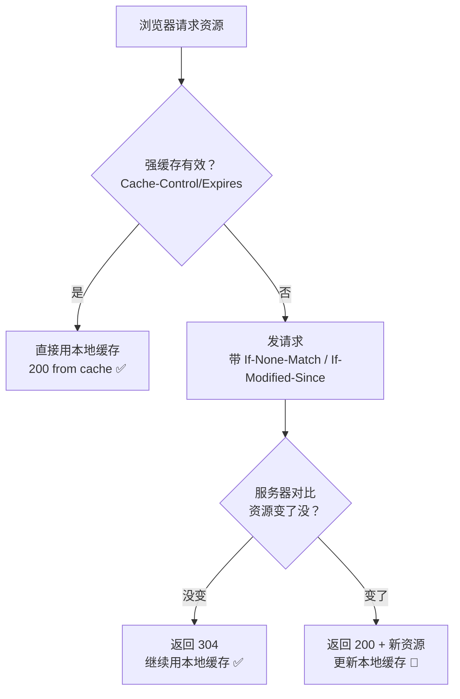

---

title: "HTTP缓存强缓存与协商缓存"

created: "2025-07-12"

tags:

  - 八股文

  - 计算机网络

---

# HTTP缓存强缓存与协商缓存

## HTTP缓存（强缓存与协商缓存·补充）

> 本篇是 [[19-HTTP基础|HTTP基础]] 与 [[35-HTTP强缓存与协商缓存|强缓存 vs 协商缓存]] 的**补充速览**，请求头速查已并入 [[19-HTTP基础|HTTP基础]]，深度原理看上面两篇。

### 4.1 HTTP缓存（减少请求，提速）

> 两类缓存，靠请求头+响应头配合控制。

#### 1）强缓存（不发请求）

> 资源没过期，**直接读本地文件**，连请求都不发。状态码 `200 (from cache)`。

**控制头：**

- `Cache-Control: max-age=3600`（缓存1小时，优先级高）

- `Expires: Thu, 01 Jan 2025 00:00:00 GMT`（过期时间点，已过时）

#### 2）协商缓存（发请求校验）

> 强缓存过期了，发请求**问服务器**资源更新没。

> - 未更新 → 返回 **304**，继续用本地缓存

> - 已更新 → 返回 **200 + 新资源**

**两组校验规则：**

| 方式 | 请求头 | 响应头 | 原理 |
| :--- | :--- | :--- | :--- |
| 时间校验 | `If-Modified-Since` | `Last-Modified` | 对比文件最后修改时间 |
| 指纹校验 | `If-None-Match` | `ETag` | 对比文件内容的唯一指纹（MD5等） |

> ETag比修改时间更精准：文件内容微调但修改时间不变，ETag能识别出来。

#### 缓存流程图

#### ❗ 易错点

> **304不是报错，是优化** — 说明缓存还能用，省了重新下载的流量和时间。

---

## 速记卡（面试闪卡）

**Q1：一句话讲清「HTTP缓存强缓存与协商缓存」到底是什么？**

A：HTTP 缓存就是"能不重新下载就别下载"：强缓存有效期内连请求都不发，协商缓存过期才问服务器"变没变"。

**Q2：强缓存怎么理解 —— 怎么理解？**

A：像冰箱里的剩饭：资源没过期，浏览器连门都不出（不发请求），直接拿本地文件，状态码 200 (from cache)。靠 Cache-Control: max-age（缓存 1 小时，现主流）和老旧的 Expires（绝对时间点）控制。

**Q3：协商缓存怎么理解 —— 怎么理解？**

A：像打电话问饭店"这饭还能吃吗"：强缓存过期后，浏览器带 If-None-Match / If-Modified-Since 去问服务器。时间派用 Last-Modified 比修改时间；指纹派用 ETag（Entity Tag 实体标签）比内容哈希，更精准。

**Q4：304 是报错吗 —— 怎么理解？**

A：大错特错，304 是"优化"不是报错！意思是"你本地缓存还能用，我就不重传了"，省了下载流量和时间。新手看到 3xx 以为出问题，其实 304 正是缓存生效、帮用户省流量的标志。

**Q5：强缓存和协商缓存怎么配合 —— 怎么理解？**

A：决策像过两道关：先看强缓存（Cache-Control / Expires）有效吗？有效就闷头用、连请求都不发；无效才进协商缓存，带指纹去问服务器，回 304 接着用或 200 换新。一句话：强缓存"闷头用"，协商缓存"问一句"。

**Q6：核心速记主线有哪些？**

- 强缓存不发请求：Cache-Control: max-age 优先，Expires 已过时

- 协商缓存发请求校验：ETag 指纹 vs Last-Modified 时间

- 304 是优化不是报错：省重新下载的流量

- 决策流：强缓存优先、失效再协商；ETag 比修改时间精准

**口诀**

A：强缓存闷头用，max-age 管寿命；

过期别慌问一句，ETag 指纹最较真。

304 不是报错，是省流量报平安；

先强后协两道关，重复下载靠边站。

## 相关链接

- 📋 目录：[[00-计算机网络]]

- 📚 学习清单：[[八股文学习路线图]]

- 🔗 [[19-HTTP基础|HTTP基础]] — 请求头与响应头基础

- 🔗 [[35-HTTP强缓存与协商缓存|HTTP强缓存与协商缓存]] — 缓存深度原理（本篇为其补充速览）

- 🔗 [[10-HTTP状态码|HTTP状态码]] — 304 状态码的含义

- 🔗 [[语言与框架/Redis/八股/06-缓存淘汰策略LRU与LFU|Redis缓存淘汰策略]] — HTTP缓存与Redis缓存的设计思路对比

