---

title: "网络段从输入URL到收到响应"

created: "2025-07-12"

tags:

  - 八股文

  - 计算机网络

---

# 网络段从输入URL到收到响应

### 1.1 URL 解析——浏览器先看懂你输入了什么

你输入：https://www.example.com:443/path?q=hello#section

| 部分 | scheme | host | port | path | query | hash |
| :--- | :--- | :--- | :---: | :--- | :--- | :--- |
| 值 | https | www.example.com | 443 | /path | ?q=hello | #section |
| 意思 | 用什么协议 | 找谁（要解析成IP） | 端口 | 路径 | 参数 | 锚点（不发给服务器） |

**浏览器自己先干两件事：**

1. **HSTS 强制 HTTPS**：HSTS（HTTP Strict Transport Security，强制 HTTPS 传输安全）——浏览器内置了一个"只走 HTTPS"的域名名单（如 `google.com`）。即使你输入 `http://`，浏览器内部直接改成 `https://`——不发起 HTTP 请求。这个名单叫 HSTS Preload List，Chrome/Firefox/Edge 共用同一份

2. **缓存查找**：还没发请求之前，浏览器先翻自己的 HTTP 缓存——强缓存命中了直接返回，DNS 都不走

---

### 1.2 DNS 解析——把域名翻译成 IP 地址

> **为什么需要 DNS？互联网靠 IP 通信，但人记不住 `142.250.80.46`，只记得 `google.com`。DNS 就是翻译官。**

#### 1.2.1 DNS 缓存链——四级缓存，能省则省

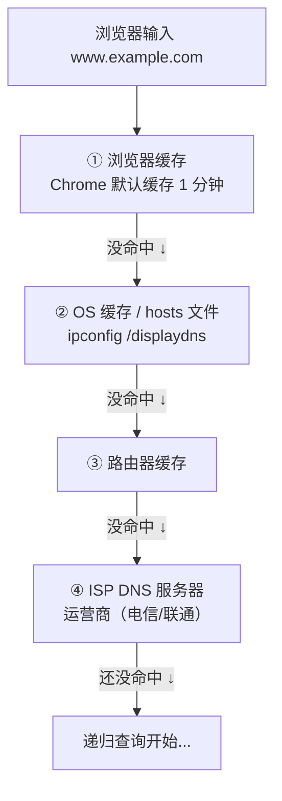

#### 1.2.2 先理解 DNS 的层级结构——域名从右往左读

**为什么 DNS 要分层级？** 互联网上有几十亿个域名，一台服务器不可能存下所有记录。DNS 的设计是——**把责任一层层分包出去，每级只管自己那一层的事**。

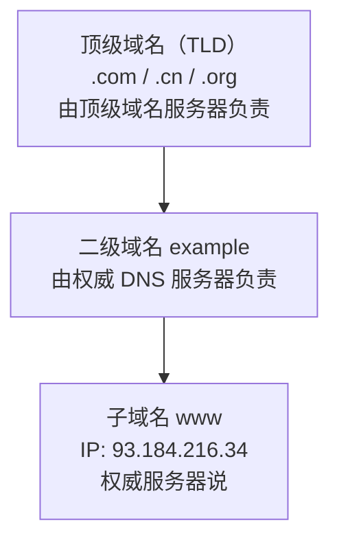

| 层级 | 服务器名称 | 存了什么？ | 例子 |
| :--- | :--- | :--- | :--- |
| 第一层 | 根域名服务器（Root DNS） | 全球 13 组，存所有顶级域名的"下一级找谁" | .com 的 NS 是谁<br/>.cn 的 NS 是谁 |
| 第二层 | 顶级域名服务器（TLD DNS） | 存某个顶级域下所有二级域名的"下一级找谁" | example.com 的 NS 是谁<br/>baidu.com 的 NS 是谁 |
| 第三层 | 权威 DNS 服务器（Authoritative） | 真正存 IP 的地方！域名和 IP 的最终对应关系 | www.example.com → IP<br/>mail.example.com → IP |

```text

类比——快递查地址：

  你要查"广东省广州市天河区张三"的详细门牌号。

  你问快递总部（ISP DNS）→ 总部一层层帮你问：

    根服务器    = 国家邮政总局    —— "广州在哪个省？你自己查广东省"

    TLD 服务器  = 广东省邮政局    —— "天河区在哪个市？广州市邮政局知道"

    权威服务器  = 广州市邮政局    —— "张三的门牌号是 天河路 100 号"

  每级只管自己管辖的范围，逐级缩小范围——这就是 DNS 的分层设计。

```

**DNS 里两种关键记录——NS 记录 vs A 记录：**

```text

NS 记录（Name Server）：告诉你"下一级找谁"

  → "我不知道 example.com 的 IP，但 ns1.example.com 知道——你去问它"

A 记录（Address）：域名 → IPv4 地址的最终映射

  → "www.example.com 的 IP 是 93.184.216.34"

  → 只有权威 DNS 服务器才能给出 A 记录

查询过程就是：

```

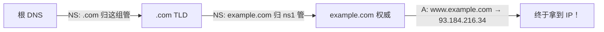

| 层级 | NS 记录（下一步找谁） | A 记录（最终答案） |
|:---|:---|:---|
| 根 DNS | ".com 归这一组服务器管，去问它们" | |
| .com TLD | "example.com 归 ns1.example.com 管，去问它" | |
| example.com | | "www.example.com 的 IP 是 93.184.216.34" ← 终于拿到 IP！ |

---

#### 1.2.3 DNS 递归查询 vs 迭代查询——逐级找上级

> **ISP = Internet Service Provider（互联网服务提供商）**——就是你家的宽带运营商：电信、联通、移动。每个 ISP 都有自己的 DNS 服务器，你的路由器 DHCP 自动配的就是 ISP 的 DNS。

```text

你问 ISP DNS："www.example.com 的 IP 是啥？"

```

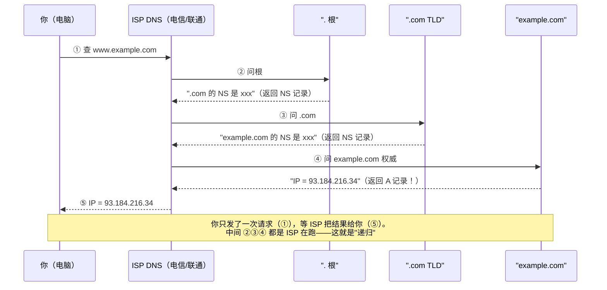

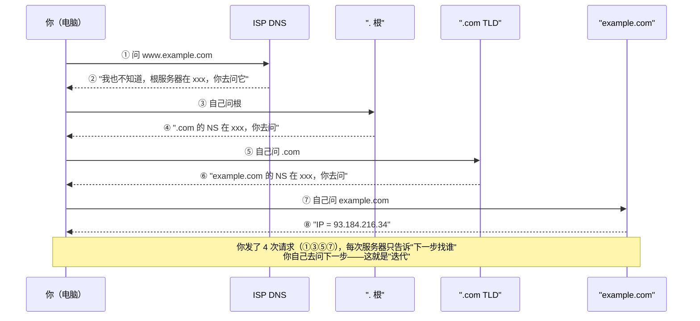

**现实中的混合模式：**

  实际 DNS 查询是"递归 + 迭代"混合：

    你 → ISP DNS：递归（你只问一次，ISP 给你最终答案）

    ISP DNS → 各级服务器：迭代（ISP 自己一层层问，每层只指路）

  为什么这样设计？

    ① 用户端简单——你不需要跑四趟

    ② ISP 可以缓存——查过一次 example.com，下个用户直接给，不用再跑

    ③ 根服务器压力小——如果全球几十亿设备都对根服务器递归，根服务器早炸了

        迭代模式下只有 ISP DNS 会问根，用户不直接问根

> **一句话讲清**："DNS 查询分递归和迭代——递归是本地 DNS 替你跑全程，你等着拿结果；迭代是每级只告诉你下一级找谁，你自己去问。实际部署中客户端到本地 DNS 是递归，本地 DNS 到各级服务器是迭代。"

#### 1.2.4 DNS 的常见记录类型

| 记录类型 | 含义 | 例子 |
| :--- | :--- | :--- |
| `A` | 域名 → IPv4 地址 | `example.com → 93.184.216.34` |
| `AAAA` | 域名 → IPv6 地址 | `example.com → 2606:2800:220:1:248:1893:25c8:1946` |
| `CNAME` | 别名 → 真名 | `www.example.com → example.com`（还得再查一次 A 记录） |
| `NS` | 某级域名的权威 DNS 服务器 | `example.com 的 DNS 服务器是 ns1.example.com` |
| `MX` | 邮件服务器 | `给 @example.com 发邮件 → 投递到 mail.example.com` |

---

### 1.3 TCP 三次握手——为什么不能是两次或四次？

> **拿到 IP 了，浏览器要和服务器建立 TCP 连接。TCP 是可靠传输——得先确认双方都能正常收发。**

#### 1.3.1 三次握手过程

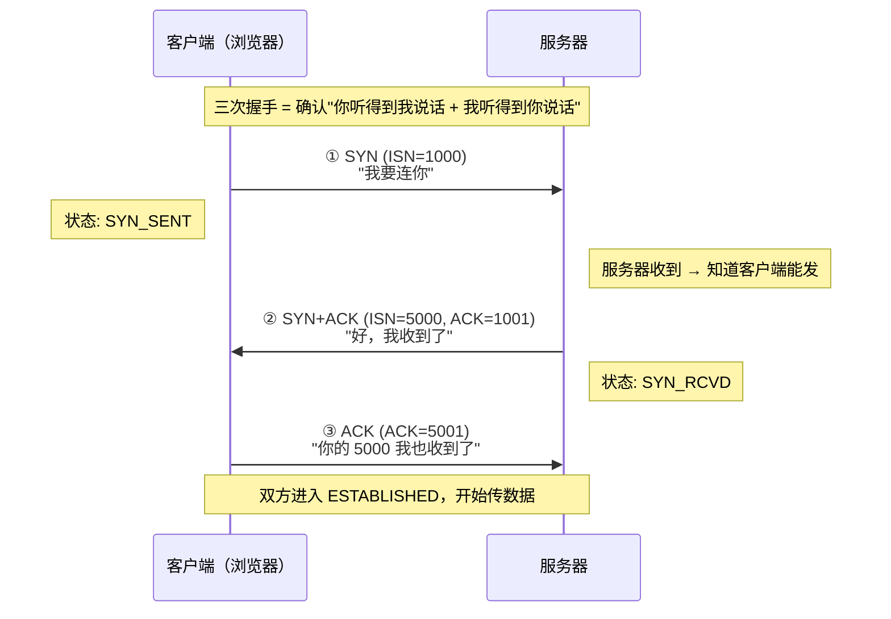

#### 1.3.2 为什么不是两次？——防历史连接

```text

如果只有两次握手（客户端 SYN → 服务器 SYN+ACK → 直接建立）：

假想场景——网络拥堵造成旧 SYN 延迟到达：

  客户端发送 SYN(seq=100)，但因为网络拥堵卡在路上

  客户端超时 → 发了新 SYN(seq=200) → 服务器收到 → 建立连接 → 传数据 → 关闭

  然后...旧 SYN(seq=100) 终于到了！

  两次握手模式下：

    服务器收到旧 SYN → 直接 ESTABLISHED → 等着收数据

    但客户端早就忘了这个连接 → 服务器的资源被浪费（半开连接）

  三次握手模式下：

    服务器收到旧 SYN → 回复 SYN+ACK

    客户端收到 SYN+ACK → "我根本没发过这个连接！" → 回复 RST 拒绝

    服务器收到 RST → 释放资源 ✅

```

> **一句话讲清**："三次握手本质是双方交换 ISN（初始序列号）并互相确认收发能力——第一次确认客户端能发，第二次确认服务器能收能发，第三次确认客户端能收。两次无法阻止历史连接，四次冗余——三次刚好。"

#### 1.3.3 为什么不是四次？

```text

四次的冗余在于——服务器把 SYN 和 ACK 合并在第二步发了。

如果分开：

  ① 客户端 SYN →

  ② 服务器 ACK（确认收到客户端的 SYN）

  ③ 服务器 SYN（发送自己的 SYN）

  ④ 客户端 ACK

但实际上 ②③ 可以合并，因为服务器收到 SYN 后立刻就可以发自己的 SYN+ACK。

TCP 头部设计就支持 SYN 和 ACK 标志位同时置 1——所以三步刚好。

```

#### 1.3.4 SYN Flood 攻击——进阶亮点

SYN Flood：攻击者大量发 SYN，但永远不回 ACK。

先解释什么是"半连接队列"：

  服务器收到 SYN 后，会把这个"还没完成的连接"暂存到一个队列里，

  等收到 ACK 后再从队列里取出来正式建立连接。

   这个暂存区就叫"半连接队列"（half-open queue），大小有限。

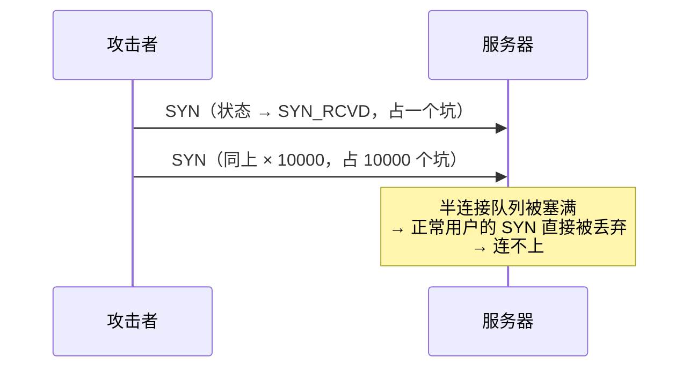

**防御方案：**

1. SYN Cookie：服务器收到 SYN 时不分配资源——把关键信息编码进 ISN 返回。客户端回复 ACK 时，从 ACK 号解出原始信息 → 验证合法才分配资源

2. 缩短 SYN Timeout——尽快释放半连接

3. 防火墙限流——同一 IP 的 SYN 频率限制

---

### 1.4 HTTPS 的 TLS 握手——在 TCP 之上再加一层安全（🟡 进阶）

> **如果 URL 是 `https://`，TCP 三次握手之后还得做 TLS 握手。HTTP 明文传输——你在星巴克连 WiFi，隔壁桌能直接看到你发了什么。TLS 把数据加密——隔壁只能看到乱码。**

#### 1.4.0 生活类比——寄一个上锁的快递，但对方没你的钥匙

```text

你要给远方的朋友寄一个密码箱，里面是你们的聊天内容。

问题：朋友没有密码箱的钥匙——你怎么把钥匙安全送到他手上？

❌ 方案 A：把钥匙也放快递里寄过去

   → 快递员打开箱子就能看到钥匙 → 等于没锁

❌ 方案 B：先打电话告诉他密码

   → 电话可能被窃听

✅ 方案 C（TLS 的思路）：

   ① 朋友先寄给你一把"开着的挂锁"（公钥）——谁都能拿到这把锁

   ② 你把"密码箱的钥匙"用这把挂锁锁起来，寄给朋友

   ③ 朋友用自己的"挂锁钥匙"（私钥）打开挂锁 → 拿到密码箱钥匙

   ④ 之后你们就用密码箱（对称加密）通信——又快又安全

   快递员能截获什么？

     - 开着的挂锁 → 拿到也没用

     - 被挂锁锁住的包裹 → 没有私钥打不开

     - 之后用密码箱加密的内容 → 没有密码箱钥匙，解不开

```

**映射到 TLS：**

| 快递类比 | TLS 术语 | 大白话 |
| :--- | :--- | :--- |
| 开着的挂锁 | 服务器公钥（Public Key） | 谁都能拿到的加密工具——只能"锁"，不能"开" |
| 挂锁钥匙 | 服务器私钥（Private Key） | 服务器死死攥手里的解密工具——能"开"这把锁 |
| 密码箱 | 对称密钥（Session Key） | 双方共享的临时密码——加解密都快，但只能这两方知道 |
| 把密码箱钥匙锁进挂锁 | `ClientKeyExchange` | 客户端用公钥加密对称密钥 → 只有服务器能用私钥解开 |
| 确认双方都有钥匙 | `Finished` | 双方各发一条"握手结束"，用 Session Key 加密——能互相解密就说明密钥一致 |

#### 1.4.1 核心思路：非对称加密协商密钥 → 对称加密传数据

```text

为什么混合使用两种加密？

  非对称加密（公钥加密、私钥解密）：

    ✅ 安全——公钥公开也不怕，只有私钥持有者能解密

    ❌ 慢——计算量大，比对称加密慢 100-1000 倍

  对称加密（同一把密钥加解密）：

    ✅ 快——计算量小，适合大量数据

    ❌ 密钥分发问题——你没法安全地把密钥告诉对方（传的过程中可能被偷）

  TLS 的解法：

    握手阶段 → 用非对称加密（慢但安全）把对称密钥协商好

    通信阶段 → 用对称加密（快）传实际数据

    各取所长！

```

#### 1.4.2 TLS 1.2 握手——4 步走完，每一步在做什么

```text

先看术语：

  加密套件 = 客户端说"我支持 AES、ChaCha20、RSA 这些加密算法，你选一个咱俩都用"

  Random_C = 客户端生成的一个随机数（后面的 Session Key 要混入这个）

  Random_S = 服务器生成的一个随机数（同上——双方都提供随机性，防止某一方的随机数生成器有缺陷）

  Pre-Master Secret = 又一个随机数！客户端生成，用服务器公钥加密发送——握手最关键的机密

   Session Key = 把 Random_C + Random_S + PreMaster 三个值按约定算法算出来的最终密钥

                 为什么用三个数？——保证只要任一方的随机数是好的，密钥就安全

```

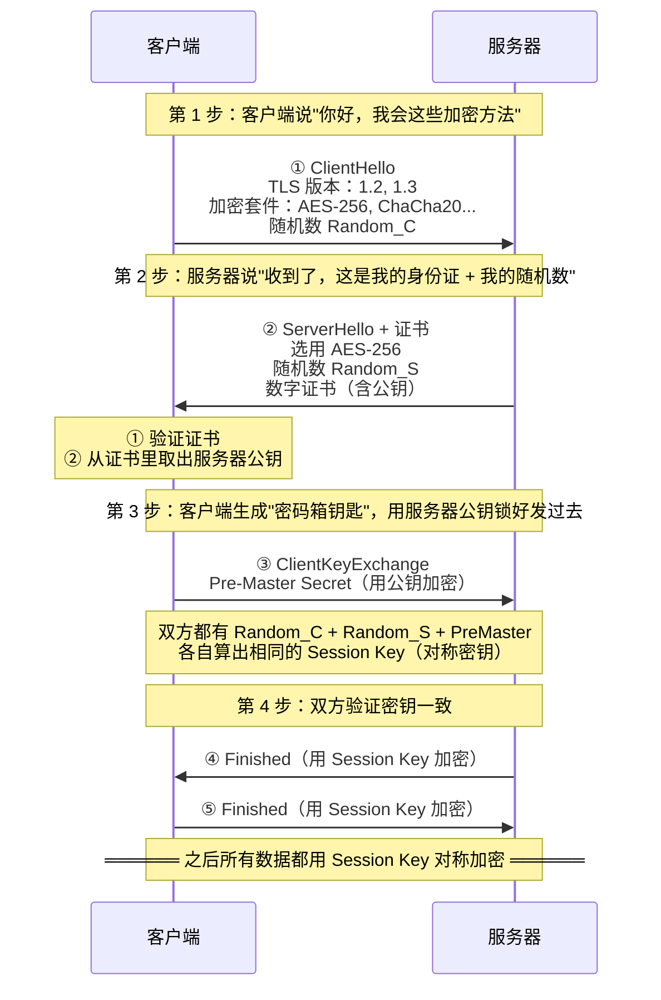

**为什么中间人破解不了？——关键在第 3 步**

```text

假设有个攻击者在网络中间截获了全部通信：

  攻击者拿到了：

    ① ClientHello（Random_C）         → 拿到了，但没用

    ② 服务器证书 + Random_S           → 拿到了 Random_S，拿到了证书里的公钥

    ③ 用公钥加密的 PreMaster          → 拿到了！但是被公钥加密了……没有私钥解不开！

  攻击者没有私钥 → 解不开 PreMaster → 算不出 Session Key → 后面的对称加密内容全是乱码

   这就是 TLS 安全的核心——公钥可以公开，但私钥永远只在服务器手里。

```

#### 1.4.2b RTT 到底怎么数的？——把时间轴拉直看

RTT（Round Trip Time）= 一个数据包从发出到收到回复的时间 = 一次"来回"

"半往返" = 0.5 RTT = 数据只走了单程（发送方到接收方）

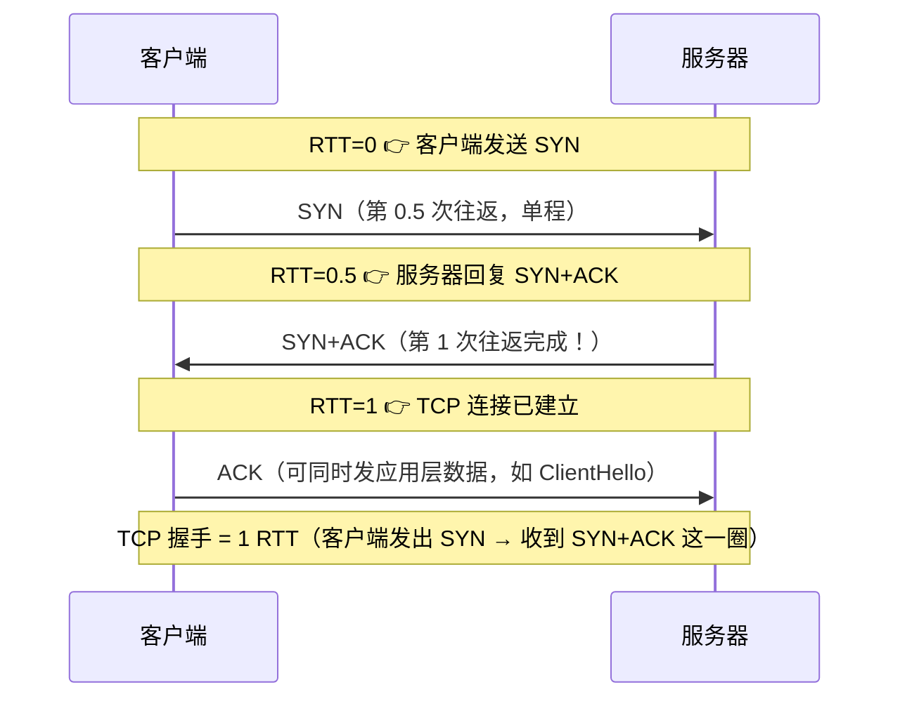

**再看 TLS 1.2 握手——为什么是 2 RTT？**

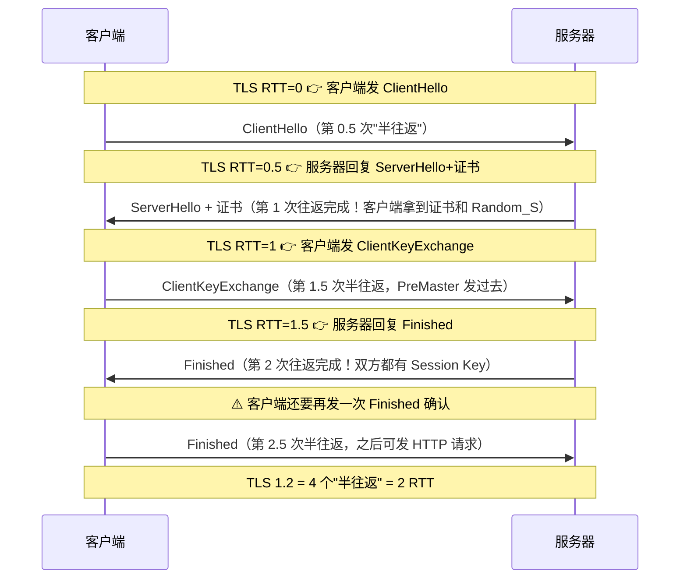

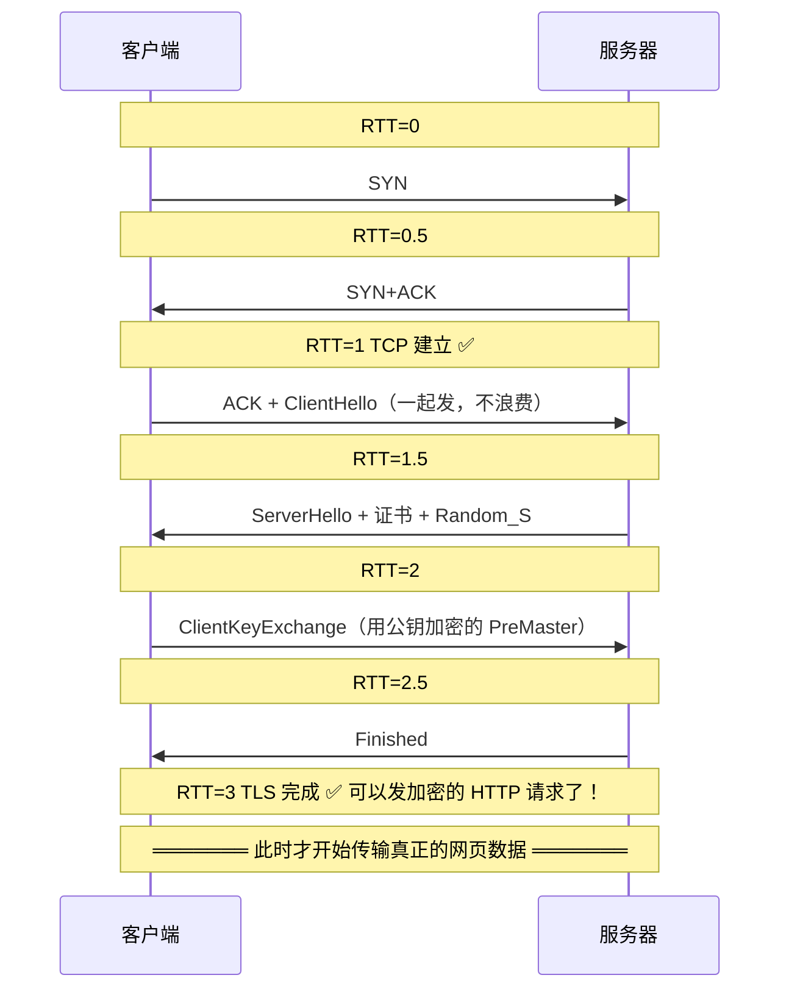

总结：TCP(1 RTT) + TLS 1.2(2 RTT) = 3 RTT 后才能发 HTTP 请求

**TLS 1.3 怎么省到 1 RTT 的？**

TLS 1.3 做了两个优化：

① 砍掉加密套件协商——客户端不需要列一堆让服务器选

   客户端在 ClientHello 里直接猜服务器用什么加密方式，

    把密钥材料（Key Share）一起发过去

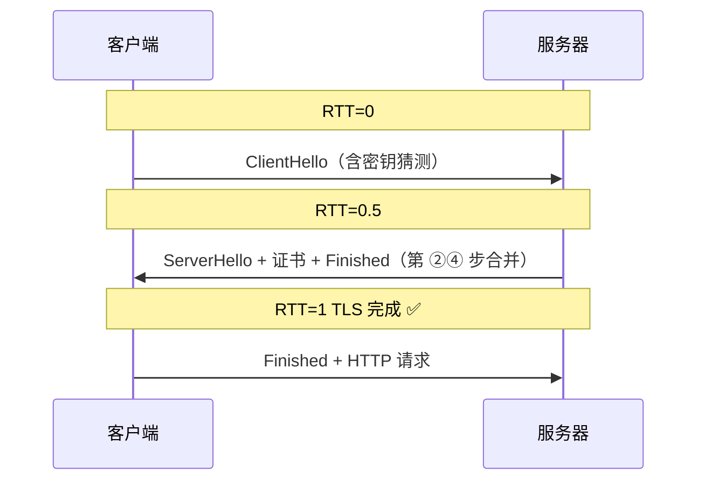

TLS 1.3 = 1 RTT

TCP(1 RTT) + TLS 1.3(1 RTT) = 2 RTT 总共

| RTT | TLS 1.2 (2 RTT) | TLS 1.3 (1 RTT) |
|:---:|:---|:---|
| RTT=0 | ClientHello ──→ | ClientHello+密钥 ──→ |
| RTT=0.5 | ←── ServerHello | ←── 全部回复 |
| RTT=1 | ClientKeyExchange ──→ | Finished + HTTP! ✅ |
| RTT=1.5 | ←── Finished | |
| RTT=2 | HTTP 请求 ✅ | |

> **一句话讲清**："TCP 三次握手用掉 1 个 RTT——从发 SYN 到收 SYN+ACK。TLS 1.2 握手需要 4 个半往返 = 2 个 RTT。所以 HTTPS 首次连接总共 3 个 RTT 后才能发 HTTP 请求。TLS 1.3 把服务器回复合并成一次，握手压到 1 RTT，总共只需 2 RTT。如果用户之前连过这个服务器，还可以用 Session Resumption（0-RTT）——连 TLS 握手都省了。"

#### 1.4.3 补充追问——数字证书怎么防止"假服务器"？

上面讲了 TLS 加密通信的过程——但还有一个前提问题：

> **你怎么知道跟你握手的"真是" example.com，而不是一个假服务器？**

> 就像有人给你寄了快递，自称是银行的——你得先确认他真是银行的。

##### 数字证书 = HTTPS 世界的身份证

**证书里有什么？**

- ① 域名（example.com）—— 身份证上的名字

- ② 服务器公钥 —— 你之后要用它加密 PreMaster

- ③ 颁发机构（CA）的信息 —— 谁发的身份证（公安局）

- ④ 有效期 —— 身份证有没有过期

- ⑤ CA 的数字签名 —— 公安局的防伪印章

##### 浏览器怎么验证证书？

1. **用 CA 的公钥验证数字签名**

   - 每个浏览器出厂时就内置了全球受信任 CA 的公钥（约 140 多个机构）

   - 用 CA 公钥解密证书的签名 → 和证书内容算出来的哈希值对比

   - 一样 = 证书没被篡改（攻击者改了证书内容，签名就对不上了）

2. **检查域名是否匹配**

   - 证书上写的 example.com，你现在访问的也是 example.com

   - 假证书写着 example.com 但实际是攻击者的服务器 → CA 不会给攻击者发 example.com 的证书！

3. **检查是否过期**

   - 证书有有效期（通常 3 个月到 1 年）

4. **检查是否被吊销**

   - 有些证书虽然没过期，但私钥泄露了——CA 会把它们加入"吊销名单"（CRL）

   - 浏览器查这个名单 → 在名单上 → 拒绝连接

全部通过 → 信任这个服务器 → 用证书里的公钥继续 TLS 流程

##### 核心安全保证——为什么假服务器搞不到有效的证书？

**攻击者想伪装成 example.com：**

- **方案 A：自己生成假证书**

  → 浏览器用内置 CA 公钥验证签名 → 验不过！→ 🔒 浏览器显示"不安全"警告

- **方案 B：去 CA 申请 example.com 的证书**

  → CA 要求证明"你真的拥有 example.com"——通常在 DNS 上做验证

  → 攻击者无法控制 example.com 的 DNS → 申请被拒

- **方案 C：攻破 CA 本身**（历史上发生过，如 2011 年 DigiNotar 事件）

  → 浏览器厂商会紧急吊销这个 CA，推送更新

  → 这是 TLS 信任体系的"最终防线漏洞"，但概率极低

---

### 1.5 HTTP 请求与响应——浏览器终于说话了
#### 1.5.1 HTTP 请求报文结构

```text

GET /path?q=hello HTTP/1.1           ← 请求行：方法 + 路径 + 协议版本

Host: www.example.com                ← 请求头（Headers）

Connection: keep-alive

User-Agent: Mozilla/5.0 ...

Accept: text/html,application/xhtml+xml

Accept-Encoding: gzip, deflate, br

Cookie: session_id=abc123

                                     ← 空行（\r\n\r\n）——头结束，体开始

                                     ← 请求体（GET 请求没有体）

```

| 方法 | 含义 | 幂等？ | 缓存？ |
| :--- | :--- | :---: | :---: |
| `GET` | 拿资源 | ✅ | ✅ 可缓存 |
| `POST` | 提交数据（创建资源） | ❌ | ❌ 不可缓存 |
| `PUT` | 全量更新 | ✅ | ❌ |
| `PATCH` | 部分更新 | ❌ | ❌ |
| `DELETE` | 删除 | ✅ | ❌ |
| `HEAD` | 只要响应头，不要体 | ✅ | ✅ |
| `OPTIONS` | 问服务器支持哪些方法——CORS 预检请求（跨域请求前浏览器先发个 OPTIONS 问"我能请求你吗"） | ✅ | ❌ |

#### 1.5.2 HTTP 响应报文结构

```text

HTTP/1.1 200 OK                       ← 状态行：协议版本 + 状态码 + 原因短语

Content-Type: text/html; charset=utf-8 ← 响应头

Content-Length: 1234

Cache-Control: max-age=3600

ETag: "abc123"

Set-Cookie: user_token=xyz; HttpOnly

                                       ← 空行

<!DOCTYPE html>                        ← 响应体

<html>...

```

#### 1.5.3 🔴 HTTP 缓存——最高频追问

> **浏览器拿到的 HTML 可能是从缓存直接读的……也可能根本不发请求。**

```text

缓存分为两种——强缓存（不发请求）和协商缓存（发请求问一声）

```

##### 强缓存（不发请求——浏览器直接用自己的缓存）

```text

HTTP/1.0: Expires: Wed, 21 Oct 2025 07:28:00 GMT

          → 在这个时间之前，浏览器直接用缓存，不发请求

          → 但客户端时间不准就出问题

HTTP/1.1: Cache-Control: max-age=3600

          → 从请求时刻起 3600 秒内直接用缓存

          → 不依赖客户端时间，更好

命中强缓存 → 状态码显示 200 (from disk cache) 或 200 (from memory cache)

```

##### 协商缓存（发请求问服务器"我的缓存还能用吗"）

**① Last-Modified / If-Modified-Since**

- 服务器响应带 `Last-Modified: 文件最后修改时间`

- 下次请求带 `If-Modified-Since: 上次记录的时间`

- 服务器比对：

  - 没改 → 304 Not Modified（无响应体，浏览器用缓存）

  - 改了 → 200 OK + 新内容

> 缺点：秒级精度——1 秒内改多次检测不到

**② ETag / If-None-Match（更精准）**

- 服务器响应带 `ETag: "文件的哈希值"`

- 下次请求带 `If-None-Match: "上次记录的哈希"`

- 服务器比对：

  - 哈希一样 → 304 Not Modified

  - 哈希变了 → 200 OK + 新内容

> 优点：精确到内容级别，任何修改都能检测到

#### 1.5.4 缓存判断流程图——浏览器实际怎么走

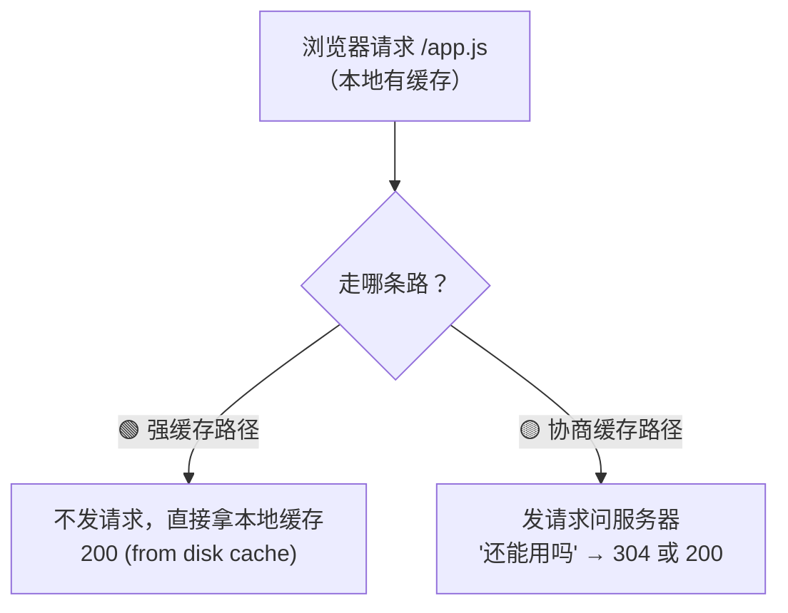

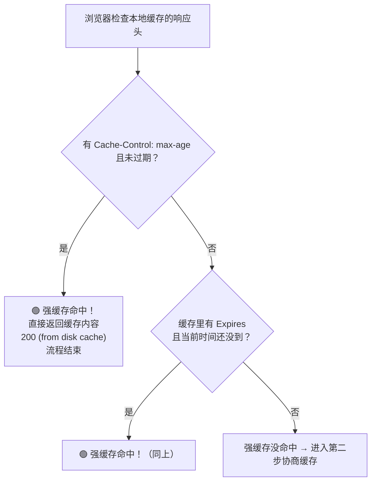

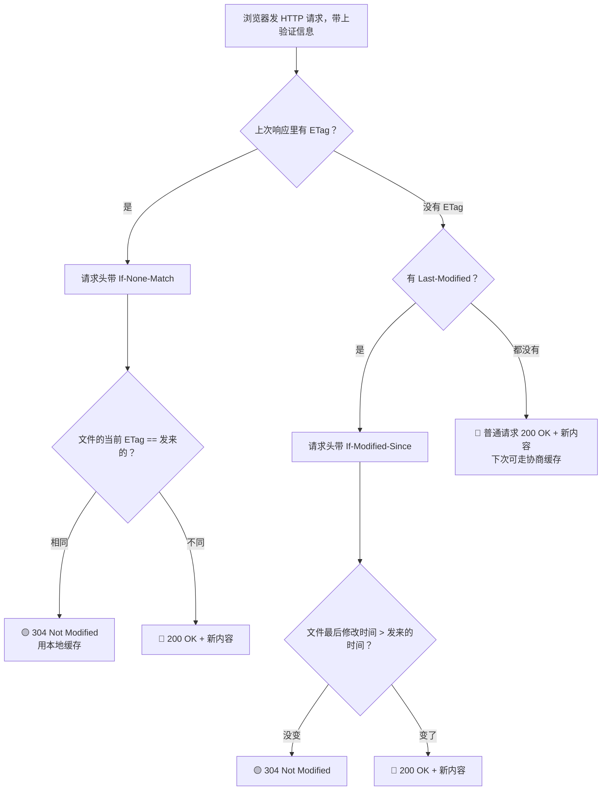

##### 特殊情况：Cache-Control: no-cache

> **no-cache 这个名字容易误导——它不是"不缓存"，而是"缓存了但每次必须验证"。**

有 `no-cache` → 跳过强缓存检查，直接进协商缓存 → 每次都要发请求问服务器，但服务器可能回 304

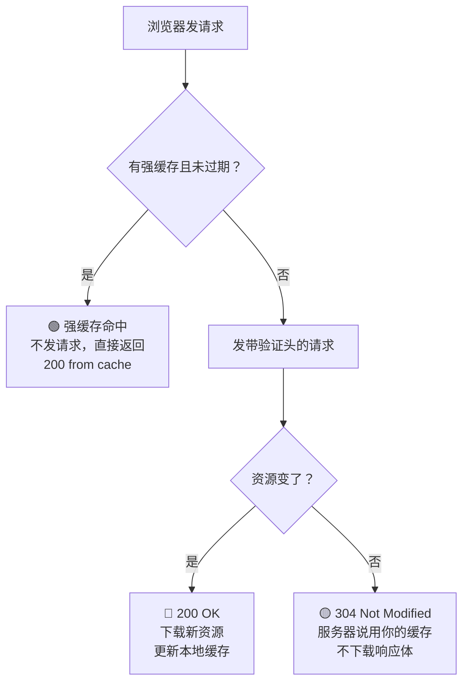

#### 1.5.5 为什么 JS/CSS 用强缓存，HTML 用协商缓存？

这是常见的延伸追问的"为什么"——背后是一个很简单的逻辑链。

##### 先理解"文件名带 hash"是什么意思

平时你写的代码：

```javascript

import { Button } from './components/Button.jsx'

```

Webpack/Vite 打包后输出：

```text

button.chunk.abc123.js    ← "abc123" 是文件内容的哈希值

                             内容不变 → hash 不变

                             内容改了 → hash 变了 → 文件名变了！

```

所以：

- 改了一行 CSS → chunk.css 的 hash 从 abc123 变成 def456

- HTML 里引用的 URL 从 `/css/chunk.abc123.css` 变成 `/css/chunk.def456.css`

- 对浏览器来说，这是两个完全不同的 URL！

##### JS/CSS 为什么可以配强缓存（max-age=31536000，一年）？

因为"内容变了 = URL 变了 = 新资源"。

**场景 A：代码没改，重新部署**

→ chunk.abc123.js 的 hash 不变 → URL 不变 → 浏览器用缓存 ✅

**场景 B：代码改了，发新版本**

→ chunk.abc123.js → chunk.def456.js（新 hash、新 URL）

→ 浏览器本地只有 abc123 的缓存，没有 def456 的缓存

→ 发请求下载 def456 ✅（自动拿到最新版）

**场景 C：代码改了，但用户用的是旧 HTML（见下方）→ 💀**

##### HTML 为什么必须配协商缓存（no-cache）？

HTML（index.html）是整个应用的入口——它负责告诉浏览器："你要加载的 JS 文件是 chunk.def456.js，CSS 文件是 style.abc123.css"

**❌ 如果 HTML 也配强缓存（比如缓存一周）：**

1. 周一：用户访问 → HTML 缓存到本地（引用 chunk.v1.js）

2. 周三：你发新版本 → chunk.v1.js 改成 chunk.v2.js，HTML 也更新了

3. 周四：用户再来 → 浏览器直接用周一缓存的 HTML

   - HTML 里引用的是 chunk.v1.js！

   - 浏览器下载 chunk.v1.js → 旧版 JS 运行旧逻辑

   - 更要命的是：服务器上可能已经没有 chunk.v1.js 了（部署时删了旧文件）→ 404！页面白屏！

**✅ HTML 用 no-cache（协商缓存）：**

1. 周一：用户访问 → HTML 带 ETag 缓存到本地

2. 周四：用户再来 → 浏览器发请求："ETag 还是 abc 吗？"

3. 服务器："不，ETag 变成 def 了，给你新 HTML"

4. 新 HTML 引用 chunk.v2.js → 浏览器下载新 JS → 最新版 ✅

5. 如果没发新版 → 服务器回 304 → 用本地缓存 ✅

##### 一句话总结

| 文件类型 | 策略 | 为什么？ |
|:---|:---|:---|
| JS/CSS | 强缓存 | 内容变了 = hash 变了 = 新 URL，不怕缓存冲突 |
| HTML (index) | 协商缓存 (no-cache) | HTML 是入口，必须保证每次拿到最新的，才能引用到最新的 JS/CSS 文件名 |

> **类比——快递站：** JS/CSS = 快递柜里的包裹（包裹号 = hash，内容变了就换柜子号）；HTML = 快递柜的显示屏（必须每次刷新看最新——"你的包裹在几号柜"）

> **一句话讲清**："JS/CSS 用强缓存是因为文件名带了内容 hash——内容不变 hash 不变，直接从缓存拿；内容变了 hash 跟着变，等于新 URL，浏览器自然去下载。HTML 用协商缓存是因为它是入口文件——强缓存了 HTML，用户就拿不到最新的 JS/CSS 引用，可能白屏或跑旧代码。这就是 Webpack 的 `[contenthash]` 和 `Cache-Control: no-cache` 配合使用的原理。"

---

## 速记卡（面试闪卡）

**Q1：一句话讲清「网络段从输入URL到收到响应」到底是什么？**

A：网络段是指从你输入网址到服务器把数据送回来的全过程：解析 URL、查 DNS、握手、发请求收响应。

**Q2：浏览器抢跑了哪两件事？ —— 怎么理解？**

A：像进门前先翻钥匙——HSTS（HTTP Strict Transport Security，强制 HTTPS 传输安全）内置名单把你输的 http 偷偷改 https；再翻 HTTP 缓存，命中强缓存连 DNS 都省了。

**Q3：DNS 怎么把域名翻成 IP？ —— 怎么理解？**

A：像查快递地址——你问国家邮政总局（根服务器），它让你去省局（TLD 顶级域服务器），省局让你去市局（权威服务器），市局才告诉你门牌号（A 记录 = 域名到 IPv4 的最终映射）。

**Q4：递归和迭代查询啥区别？ —— 怎么理解？**

A：像你让跑腿小哥代办（递归：你只问一次，ISP DNS 替你跑全程）；小哥每到一个关卡只问"下一步找谁"（迭代：每级只返回下一级地址）。实际是客户端→本地 DNS 递归、本地 DNS→各级迭代的混合。

**Q5：拿到 IP 后怎么连上服务器？ —— 怎么理解？**

A：像先握手确认双方能听能说——TCP 三次握手（SYN→SYN+ACK→ACK）建可靠连接；若是 https 再做 TLS（Transport Layer Security，传输层安全）握手，用非对称加密协商出对称密钥再传数据。

**Q6：核心速记主线有哪些？**

- 先把 URL 拆成七段（scheme/host/port/path/query/hash），HSTS 逼上 HTTPS、翻缓存抢跑

- DNS 四级缓存 + 根/TLD/权威三层 + 递归迭代配合

- NS 记录指路、A 记录给最终 IP，只有权威服务器能给 A

- TCP 三次握手建连，TLS 协商对称密钥，发请求收响应转渲染

**口诀**

A：URL拆七段先抢跑，HSTS逼你上HTTPS。

DNS三级像查地址，递归迭代配合好。

握手三次连上船，TLS协商对称钥。

网络半场跑完事，交棒渲染画页面。

## 相关链接

- 📋 目录：[[00-计算机网络]]

- 📚 学习清单：[[八股文学习路线图]]

- 🔗 [[14-浏览器输入URL到页面展示|浏览器输入URL到页面展示]] — 完整流程（含渲染段）

- 🔗 [[34-DNS解析过程|DNS解析过程]] — 网络段的第一步

- 🔗 [[23-浏览器渲染段从HTML到像素|浏览器渲染段]] — 网络段之后的渲染段

