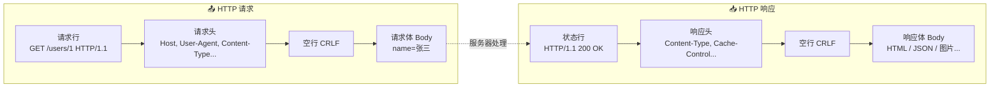

---

title: "HTTP基础全套"

created: "2025-07-12"

tags:

  - 八股文

  - 计算机网络

---

# HTTP基础全套

## 三、HTTP 基础全套（求职重中之重）
### 3.1 客户端 & 服务器

- **客户端**：**主动发请求**（浏览器、APP、Postman）

  > 例：你打开Chrome搜新闻，Chrome就是客户端

- **服务器**：**被动接收请求，返回数据**（Nginx、Java后端服务）

  > 例：百度机房处理你请求的机器是服务器

- **核心规则**：原生HTTP只能客户端主动请求，服务器不能主动发消息（引出轮询/WebSocket）

#### HTTP 通信模型

### 3.2 HTTP常用请求方法（9种只背高频5个）

| 方法 | 用途 | 幂等性 | 参数位置 | 例子 |
| :---: | :--- | :---: | :--- | :--- |
| **GET** | 查询数据，只读 | ✅ 幂等 | URL | 查询商品列表 `/goods/list` |
| **POST** | 新增/提交数据 | ❌ 非幂等 | Body | 登录、注册、上传文件 |
| **PUT** | 全量更新资源 | ✅ 幂等 | Body | 完整修改用户全部信息 |
| **PATCH** | 局部更新资源 | ❌ 非幂等 | Body | 只修改用户昵称 |
| **DELETE** | 删除资源 | ✅ 幂等 | URL/Body | 删除订单 |

补充：

- **OPTIONS**：跨域预检请求（CORS会自动发）

- **HEAD**：只拿响应头，不拿页面内容（用于检测资源是否存在）

#### 幂等通俗解释

> 同一个请求发1次和发100次，服务器结果完全一样。

> - GET查询100次不会产生脏数据 ✅

> - 连续点POST提交会创建100条重复订单 ❌

> - DELETE删除一个已删除的资源，结果还是"不存在" ✅

### 3.3 GET vs POST 核心区别（最高频题）

| 维度 | GET | POST |
| :--- | :--- | :--- |
| **参数位置** | 拼在URL后面 `?id=1&name=tom` | 放在请求Body里 |
| **客户端安全** | 参数存浏览器历史、日志，易泄露 | 不暴露在地址栏 |
| **服务器安全** | 只读不改数据（HTTP规范的安全方法） | 会新增/修改数据 |
| **大小限制** | 受URL长度限制（浏览器一般2-8KB） | 理论无上限，适合上传 |
| **缓存** | 浏览器自动缓存 | 默认不缓存 |
| **幂等性** | 幂等 | 非幂等 |

#### ❗ 易错点：POST比GET更安全？

> **错！** HTTP下两者全明文，POST只是参数不在URL展示，抓包照样能看到。真正加密靠**HTTPS**。

### 3.4 HTTP状态码（只背求职高频）

|   分类    |   状态码   | 含义                     | 通俗解释                  |
| :-----: | :-----: | :--------------------- | :-------------------- |
| **1xx** |   100   | Continue               | 继续发请求体                |
|         |   101   | Switching Protocols    | 切换WebSocket协议         |
| **2xx** |   200   | OK                     | 正常返回                  |
|         |   201   | Created                | 创建资源成功（POST后）         |
|         |   204   | No Content             | 成功但无返回内容（DELETE后）     |
| **3xx** |   301   | Moved Permanently      | 永久跳转（浏览器以后自动跳）        |
|         |   302   | Found                  | 临时跳转（下次还问旧地址）         |
|         | **304** | Not Modified           | **缓存命中，不用下载资源**       |
| **4xx** |   400   | Bad Request            | 参数格式错误                |
|         |   401   | Unauthorized           | 未登录/认证失败              |
|         |   403   | Forbidden              | 有权限但禁止访问（登录了但没权限）     |
|         |   404   | Not Found              | 页面/接口不存在              |
|         |   405   | Method Not Allowed     | 请求方法不对（接口要POST你用了GET） |
|         |   415   | Unsupported Media Type | 传参格式错误（要JSON你传表单）     |
| **5xx** |   500   | Internal Server Error  | 服务器代码报错               |
|         |   502   | Bad Gateway            | 后端服务挂了（Nginx转发失败）     |
|         |   503   | Service Unavailable    | 服务过载/维护中              |
|         |   504   | Gateway Timeout        | 接口执行超时                |

#### 通俗比喻

> - **4xx** = 你送快递送错了（你的问题）：地址写错了(404)、门卫不让你进(403)、你没带身份证(401)

> - **5xx** = 快递到了但仓库出问题了（服务器的问题）：仓库着火了(500)、仓库太忙处理不过来(503)

---

### 3.5 高频请求头（必背）

> 请求头（Request Headers）= 客户端发给服务器的**附加描述信息**，键值对格式，告诉服务器"我是谁、我要什么、缓存规则、跨域来源"。

| 请求头 | 作用 | 通俗理解 |
| :--- | :--- | :--- |
| **Host** | 访问的域名 | 一台服务器跑多个网站，靠 Host 区分该响应哪个 |
| **User-Agent** | 浏览器 / 手机型号 | 服务器据此返回适配的页面（PC 还是 Mobile） |
| **Cookie** | 自动携带登录凭证 | "我之前登录过，这是我的凭证" |
| **Authorization** | 鉴权令牌（如 JWT） | 接口鉴权用，Bearer Token 放这里 |
| **Content-Type** | 请求体格式 | `application/json` 最常用，告诉服务器怎么解析 Body |
| **Cache-Control** | 缓存控制 | `no-cache` 强制校验缓存 |
| **Origin** | 跨域来源域名 | CORS 跨域时用，服务器据此决定是否放行 |
| **Accept** | 能接受的响应格式 | `text/html`、`application/json` |

> 💡 `Accept` 是"我想要什么"，`Content-Type` 是"我发的是什么"——一对反义词，别搞反。

---

## 速记卡（面试闪卡）

**Q1：一句话讲清「HTTP基础全套」到底是什么？**

A：HTTP 是客户端主动发请求、服务器被动回数据的无状态应用层协议，原生服务器不能主动推消息。

**Q2：请求方法与幂等（methods & idempotency） —— 怎么理解？**

A：类比：HTTP 方法像点菜动词：GET 只读（幂等，查100次不变样），POST 新增（非幂等，连点创建100条重复单），PUT/PATCH 改全部/局部，DELETE 删。幂等（idempotent）就是发1次和100次服务器结果一样。（Safe vs not）

**Q3：GET 和 POST 区别（GET vs POST） —— 怎么理解？**

A：类比：别被忽悠说 POST 更安全——他俩明文一样，抓包都看得见！真区别在：GET 参数挂 URL（有长度限制、进浏览器历史），POST 放 Body（适合上传、不进地址栏）。真加密靠 HTTPS（TLS），不是靠换方法。（Not about safety）

**Q4：状态码怎么记（status codes） —— 怎么理解？**

A：类比：状态码像快递结果：2xx 正常送达（200 OK）；3xx 地址跳转（304 缓存命中不重下）；4xx 你的问题——写错门牌404、没带证401、门卫不让进403；5xx 仓库的问题——着火500、太忙503。分清楚"谁的锅"。（Whose fault）

**Q5：高频请求头（request headers） —— 怎么理解？**

A：类比：请求头（headers）像信封备注：Host 告诉多站点服务器该响应哪个；Cookie/Authorization 带登录凭证（JWT）；Content-Type 说 Body 是 JSON 还是表单；Origin 管跨域。记住 Accept 是"我要啥"、Content-Type 是"我发啥"。（Envelope notes）

**Q6：核心速记主线有哪些？**

- HTTP 客户端主动请求、服务器被动响应，原生无状态、不能主动推

- 方法幂等：GET/PUT/DELETE 幂等，POST/PATCH 非幂等

- GET 参数在 URL、POST 在 Body；安全靠 HTTPS 不是靠方法

- 状态码：2xx 成功 / 3xx 跳转缓存 / 4xx 客户端错 / 5xx 服务端错

- 高频请求头：Host、Cookie、Authorization、Content-Type、Origin

**口诀**

A：HTTP 客户端喊，服务器被动回；

GET 读 POST 写，幂等要分清；

安全不靠换方法，加密请用 HTTPS；

状态码辨锅主，2成3跳4你5仓。

## 相关链接

- 📋 目录：[[00-计算机网络]]

- 📚 学习清单：[[八股文学习路线图]]

- 🔗 [[10-HTTP状态码|HTTP状态码]] — 状态码详解

- 🔗 [[11-GET与POST与PUT与DELETE|GET与POST与PUT与DELETE]] — 请求方法与幂等性

- 🔗 [[22-RESTful设计|RESTful设计]] — RESTful API 设计规范

- 🔗 [[13-HTTPS加密流程|HTTPS加密流程]] — HTTP vs HTTPS

