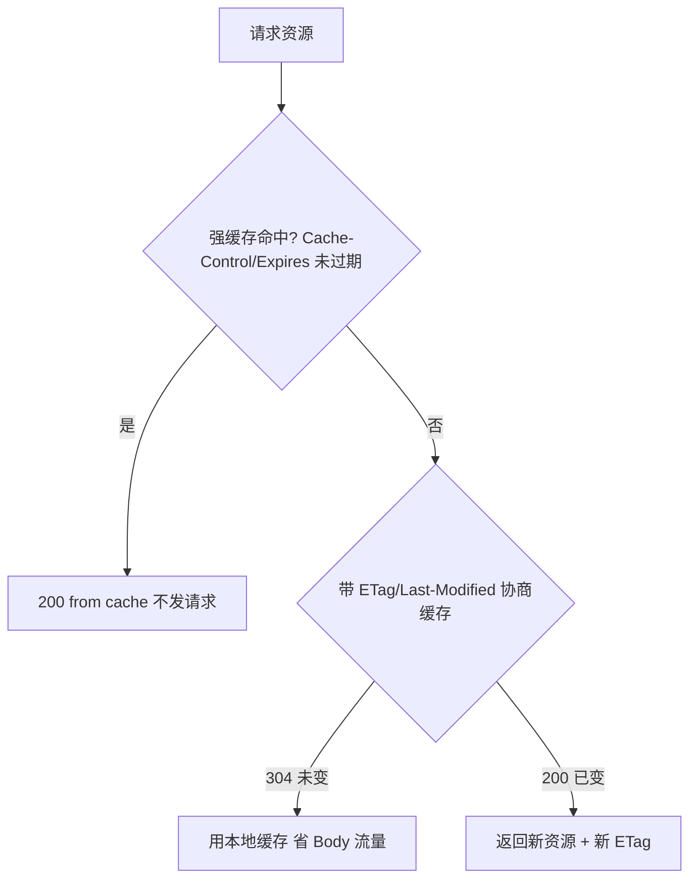

---

title: "HTTP高频题汇总"

created: "2025-07-12"

tags:

  - 八股文

  - 计算机网络

---


# HTTP高频题汇总

## 十二、求职高频题汇总（带参考答案）


HTTP 是的"必考题"，几乎每一场后端/前端都会问到。下面这 12 道题覆盖了 HTTP  80% 以上的知识点，每道题都给出了想听到的核心回答和进阶亮点。


---


### Q1：GET 和 POST 的区别？


**核心回答（3 个维度）：**

1. **语义**：GET 是获取资源（查询），POST 是提交/创建资源

2. **参数位置**：GET 参数在 URL 里（`?key=value`），POST 参数在 Body 里

3. **幂等性**：GET 是幂等的（多次请求结果一样），POST 不是幂等的（多次请求可能创建多条记录）


**进阶补充：**

- URL 长度限制不是 HTTP 协议规定的，是浏览器/服务器的实现限制（如 IE 限制 2083 字节）

- **安全误区**：HTTP 明文下 GET 和 POST 都不安全（Wireshark 抓包都可见），加密靠 HTTPS

- GET 可以被缓存、收藏为书签、保留浏览器历史；POST 默认不缓存

- GET 可以带 Body（规范没禁止），但工程实践不推荐（很多框架会忽略）

- RESTful 设计建议 GET 只读不写——如果搜索引擎爬虫爬到了 `GET /delete?id=1`，你的数据就没了


---


### Q2：Cookie 和 Session 的区别？


**核心回答：**


| 维度 | Cookie | Session |
| :--- | :--- | :--- |
| 存储位置 | 浏览器（客户端） | 服务器（内存/Redis） |
| 安全性 | 低，客户端可篡改 | 高，数据在服务端 |
| 传输体积 | 每次请求自动携带，可能大（最多 4KB） | 只传 sessionId，体积极小 |
| 服务器开销 | 无 | 大，分布式需共享 Session |
| 生命周期 | 可设置长期保存 | 服务器可主动失效 |


**通俗比喻：**

- Session = 酒店前台存你的身份证（服务器存数据），只给你一张房卡（sessionId）

- Cookie = 你把身份证复印件揣兜里到处走（客户端存所有信息）


**易错点：** Session 不是完全不用 Cookie——绝大多数场景下 sessionId 靠 Cookie 传递。只有禁用 Cookie 时才用 URL 重写兜底（`?jsessionid=xxx`）。


---


### Q3：Cookie / Session / Token 三者区别？


**一句话总结：Cookie 是容器，Session 是服务端状态，Token 是自包含凭证。**


| 对比维度 | Cookie | Session | Token (JWT) |
| :--- | :--- | :--- | :--- |
| 存储位置 | 客户端（浏览器） | 服务器内存/Redis | 客户端（localStorage/Cookie） |
| 状态 | 无状态 | 有状态 | 无状态（自包含） |
| 跨域支持 | 受同源策略限制 | 依赖 Cookie 跨域 | 天然支持跨域 |
| 扩展性 | 好 | 差（需 Session 共享） | 好（天然支持分布式） |
| 移动端 | 不友好 | 不友好 | 友好 |
| 吊销 | 简单（清 Cookie） | 简单（删 Session） | 难（需黑名单） |


**为什么不直接用 Session 要用 JWT？**

- **分布式/微服务友好**：JWT 无状态，任何服务器拿到 Token 验签就行，不需要共享 Session

- **跨平台**：浏览器、App、小程序都支持

- **减少数据库查询**：JWT Payload 里自带用户信息


**JWT 的缺点：** 签发后未过期无法主动撤销（不能"踢下线"），需要配合黑名单或短过期+Refresh Token。


---


### Q4：HTTPS 的加密流程，为什么要用混合加密？


**核心回答：** HTTPS = HTTP + TLS/SSL，握手阶段用**非对称加密**传密钥，业务数据用**对称加密**。


**流程（TLS 1.2 简化版）：**

1. 客户端 → 服务器：TLS 版本 + 支持的加密套件 + 随机数 1

2. 服务器 → 客户端：选择的加密套件 + 服务器证书（含公钥）+ 随机数 2

3. 客户端验证证书合法性，生成随机数 3（Pre-Master Secret），用服务器公钥加密后发送

4. 双方用 3 个随机数生成**会话密钥**（对称密钥），后续通信都用这个密钥


**为什么要混合加密？**

- **对称加密**（AES 等）：速度快，但密钥怎么传到对方手上？直接传会被中间人偷走

- **非对称加密**（RSA 等）：天然安全（公钥加密只有私钥能解），但计算量极大，不适合加密大段业务数据

- **混合方案**：用非对称加密搞定"密钥配送"问题，然后用对称加密搞定"数据加密"问题——取长补短


**TLS 1.3 优化：** 握手只需 1-RTT（1.2 需要 2-RTT），还支持 0-RTT 模式（对已访问过的网站）。


---


### Q5：HTTP/1.1 vs HTTP/2 vs HTTP/3 核心区别？


**核心回答：**


| 特性 | HTTP/1.1 | HTTP/2 | HTTP/3 |
| :--- | :--- | :--- | :--- |
| 发布时间 | 1997 | 2015 | 2022 |
| 传输层 | TCP | TCP | QUIC（UDP） |
| 连接 | 持久连接 | 单连接多路复用 | 单连接多路复用 |
| 数据格式 | 文本（明文） | 二进制帧 | 二进制帧 |
| 队头阻塞 | 应用层存在 | 传输层（TCP）存在 | 基本解决 |
| 头部压缩 | 无 | HPACK | QPACK |
| 服务器推送 | 无 | 支持 | 支持 |
| 连接迁移 | 不支持（切换网络需重连） | 不支持 | 支持（Connection ID） |


**一句话概括演进思路：** HTTP/1.1 解决"能不能复用连接"，HTTP/2 解决"能不能并行发请求"，HTTP/3 解决"TCP 本身能不能不阻塞"。


---


### Q6：什么是队头阻塞？HTTP/2 解决了吗？


**核心回答：**


**定义**：队头阻塞（Head-of-Line Blocking）是指前面的请求/响应慢了，把后面的全给堵住了。HTTP/1.1 的"请求-响应"模型要求响应必须严格按请求的发送顺序返回，形成 FIFO 队列。


**HTTP/2 解决了一半：**

- ✅ 解决了 **HTTP 应用层** 的队头阻塞：通过二进制分帧 + 多路复用，不同请求的帧可以交错发送，不再需要按顺序

- ❌ 没解决 **TCP 传输层** 的队头阻塞：HTTP/2 的所有流共享一个 TCP 连接，TCP 是有序传输的——丢了一个包，所有流都等重传


**HTTP/3 彻底解决：** 换成基于 UDP 的 QUIC 协议，每个流独立，丢包只影响自己的流。


**通俗比喻：**

- HTTP/1.1 = 单车道，车必须按顺序过，一辆抛锚全堵

- HTTP/2 = 多车道（分帧交错），但共用一座容易塌的桥（TCP），桥塌了哪条车道都过不去

- HTTP/3 = 每条车道有自己的独立桥梁（QUIC 独立流），哪座塌了都不影响别的


---


### Q7：强缓存和协商缓存的区别？ETag 和 Last-Modified 哪个优先？


**核心回答：**


| 对比 | 强缓存 | 协商缓存 |
| :--- | :--- | :--- |
| 发请求吗 | ❌ 不发，直接用本地 | ✅ 发请求，服务器决定 |
| 控制头 | `Cache-Control` / `Expires` | `ETag` + `If-None-Match` / `Last-Modified` + `If-Modified-Since` |
| 状态码 | 200 (from disk/memory cache) | 304 Not Modified（资源未变）或 200（资源有更新） |
| 优先级 | 优先于协商缓存 | 强缓存过期后才走协商 |


**ETag vs Last-Modified：ETag 优先级更高**


| 对比项 | ETag | Last-Modified |
| :--- | :--- | :--- |
| 精度 | 精确（文件内容哈希，如 MD5） | 秒级精度（文件修改时间） |
| 误判风险 | 低 | 高：1 秒内多次修改会漏判；只 touch 文件内容未变也会误判 |
| 计算开销 | 有（需计算哈希） | 低 |
| 优先级 | **高于** Last-Modified | 低于 ETag |


**流程：** 强缓存过期 → 带 ETag/If-None-Match 发请求 → 服务器比对 → 相同返回 304（无 Body 省流量）→ 不同返回 200 + 新资源 + 新 ETag。


---


### Q8：跨域是什么？怎么解决？


**核心回答：**


**跨域** = 浏览器同源策略的限制：协议、域名、端口三者任一不同就是跨域。同源策略阻止恶意网站读取你已登录的其他网站的响应数据。


**五种解决方案（从推荐到不推荐）：**


| 方案 | 原理 | 适用 |
| :--- | :--- | :--- |
| **CORS** | 服务器加 `Access-Control-Allow-Origin` 响应头 | 前后端分离、微服务（最标准） |
| **Nginx 反向代理** | 前端和 API 用同一域名，Nginx 转发到后端 | 生产环境最常用 |
| **Webpack DevServer Proxy** | 开发环境代理 | 本地开发 |
| **JSONP** | `<script>` 标签不受同源限制，回调函数取数据 | 只支持 GET，老旧方案 |
| **postMessage** | iframe 之间通信 | 窗口/iframe 跨域通信 |


---


### Q9：从输入 URL 到页面展示的全过程？


**核心回答（7 个步骤）：**


```text

1. URL 解析 → 2. DNS 解析（域名→IP）→ 3. TCP 三次握手

→ 4. TLS 握手（HTTPS）→ 5. 发 HTTP 请求

→ 6. 服务器处理并返回响应 → 7. 浏览器解析渲染 → 8. TCP 四次挥手

```


**浏览器渲染阶段详解：**

1. 解析 HTML → 构建 DOM 树

2. 解析 CSS → 构建 CSSOM 树

3. DOM + CSSOM → 渲染树（Render Tree）

4. 布局（Layout/Reflow）：计算每个节点在屏幕上的精确位置和大小

5. 绘制（Paint）：将渲染树绘制到屏幕上

6. 合成（Composite）：GPU 合成各图层显示


**加分点：** 知道 DNS 有缓存（浏览器缓存 → 系统 hosts → 路由器缓存 → ISP DNS → 根域名服务器递归查询）；知道 HTML 解析是"边下载边解析"而不是"全部下载完再解析"；知道 `<script>` 标签会阻塞 DOM 解析（除非加 async/defer）。


---


### Q10：HTTP 状态码 301/302/304/401/403/502/504 分别是什么意思？


**核心回答：**


| 状态码 | 含义 | 典型场景 | 关键细节 |
| :--- | :--- | :--- | :--- |
| 301 | 永久重定向 | 域名迁移、HTTP→HTTPS | 被浏览器缓存，SEO 权重转移 |
| 302 | 临时重定向 | 未登录跳转登录页 | 不缓存，每次请求；POST 可能变 GET |
| 304 | 未修改 | 协商缓存命中 | **不是错误，是优化**！无 Body，省流量 |
| 401 | 未认证 | 未登录/Token 过期 | "你是谁？" |
| 403 | 无权限 | 已登录但角色权限不够 | "你配吗？" |
| 404 | 未找到 | URL 错误、资源已删除 | 有时故意返回 404 而非 403（隐藏资源存在性） |
| 500 | 服务器内部错误 | 后端代码抛异常 | 看日志定位 |
| 502 | 网关错误 | Nginx 连不上后端（后端挂了） | 上游服务返回无效响应或未启动 |
| 504 | 网关超时 | Nginx 等后端响应超时 | 上游处理太慢（如慢 SQL 查了 60 秒） |


---


### Q11：数字签名的作用？HTTPS 证书链是怎么验证的？


**核心回答：**


**数字签名** = 对"消息内容"做哈希，再用**私钥加密**哈希值。验证时用**公钥解密**，比对哈希值。两个作用：

1. **证明发送方身份**（只有持有私钥的人才能生成这个签名）

2. **防止报文篡改**（任何修改都会导致哈希对不上）


**证书链验证过程：**

```text

你的浏览器 ← 服务器证书（含公钥）← 中间 CA 签名 ← 根 CA 签名

                    ↑ 浏览器逐级验证 ↑

               用上级证书的公钥解密签名，比对哈希

             一直追溯到内置的根证书，形成信任链

```


任何一级校验失败，浏览器就会提示"不安全"。


---


### Q12：为什么需要 WebSocket？和 HTTP 轮询有什么区别？


**核心回答：**


**HTTP 轮询的问题：**

- **短轮询**：定时发请求问"有新消息吗？"，大部分请求返回"没有"，浪费资源，实时性差

- **长轮询**：请求挂起直到有数据或超时，比短轮询好但仍是一问一答


**WebSocket 优势：**

- **全双工通信**：建立连接后，客户端和服务器都可以随时发送数据，不需要等对方先发

- **轻量头部**：建立连接后的数据帧只有 2-14 字节头部，HTTP 请求头动辄几百字节

- **持久连接**：跟 HTTP 长连接不同，WebSocket 连接专为实时通信设计

- **实时性**：服务器有数据就推，延迟极低


**典型场景：** 在线聊天、股票行情推送、多人在线游戏、协作编辑。


---


> **复习建议：** 不要求一字不差背答案，但核心点必须准确。实践中最好的状态是"像给别人解释一样"回答问题——用自己的话讲清楚原理，而不是机械背诵。


---

## 一图流（Mermaid）





## 速记卡（面试闪卡）


**Q1：一句话讲清「HTTP高频题汇总」到底是什么？**

A：HTTP 面试高频题精粹：GET/POST 语义、Cookie/Session/Token 认证、混合加密与 HTTP 版本演进等核心考点一网打尽。


**Q2：GET vs POST 区别 —— 怎么理解？**

A：语义上 GET 是「去货架拿东西」(查询)、POST 是「填表下单」(提交)。参数位置 GET 在 URL、POST 在 Body；幂等性 GET 多次一样、POST 可能建多条。误区：明文下都不安全，加密靠 HTTPS。


**Q3：Cookie / Session / Token —— 怎么理解？**

A：Cookie 是揣兜里的身份证复印件（客户端、可篡改）；Session 是酒店前台存的身份证（服务端、只给房卡 sessionId）；Token(JWT) 是自包含门票（无状态、天然跨域，但难吊销）。三者解决「你怎么证明是你」。


**Q4：HTTPS 为什么混合加密 —— 怎么理解？**

A：对称加密(AES)快但密钥配送会被偷；非对称加密(RSA)安全但慢。HTTPS 握手用 RSA 传密钥、业务用 AES 加密数据——取长补短。像把钥匙装进保险箱寄过去，之后再明文飞信。TLS 1.3 握手只要 1-RTT。


**Q5：HTTP 版本演进 —— 怎么理解？**

A：H1.1 文本+持久连接（解决复用）；H2 二进制帧+多路复用（解决并行，但仍共享 TCP，传输层队头阻塞没解）；H3 换 QUIC(UDP)（解决传输层阻塞+连接迁移）。一句话：能复用→能并行→不阻塞。


**Q6：核心速记主线有哪些？**

- GET 查 POST 交；参数在 URL/Body；明文都不安全

- Cookie 容器、Session 状态、Token 自包含无状态

- 混合加密：握手 RSA 传密钥、业务 AES 加密

- H2 解应用层队头阻塞、H3(QUIC) 解传输层；强缓存不发请求、协商缓存 304


**口诀**

A：GET 查 POST 交

明文全都不安全

Cookie Session Token

混合加密最稳当


## 相关链接


- [[14-浏览器输入URL到页面展示|URL到页面展示]]

- HTTP版本演进

- [[10-HTTP状态码|HTTP状态码]]

- [[13-HTTPS加密流程|HTTPS加密流程]]

- [[35-HTTP强缓存与协商缓存|HTTP强缓存与协商缓存]]

- 📋 目录：[[00-计算机网络]]

- 📚 学习清单：[[八股文学习路线图]]

