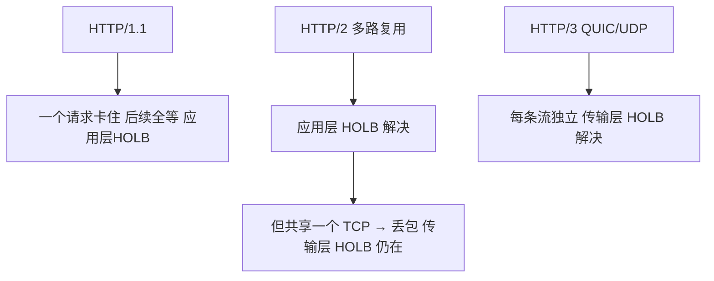

# HTTP高频易错坑点
## 十三、高频易错坑点（踩雷避坑）

实践中 HTTP 的坑，十个候选人有八个会踩。不是知识没学到，而是这些细节太容易混淆。下面按"误区 → 正解 → 为什么爱问"的结构，帮你把雷区排一遍。

### 核心易错表

| # | 误区 | 正解 | 为什么爱问 |
| :---: | :--- | :--- | :--- |
| 1 | ❌ POST 比 GET 更安全 | ✅ HTTP 明文下两者全暴露，加密靠 HTTPS。用 Wireshark 抓包，GET 的 URL 参数和 POST 的 Body 都能直接看到 | 考察你是否理解 HTTP 本质是明文传输，"安全"不是 HTTP 层面的事 |
| 2 | ❌ POST 一定发两个 TCP 数据包 | ✅ 这是浏览器实现细节（某些浏览器先发 Header 再发 Body），不是 HTTP 协议的硬性规定，不同浏览器行为不同 | 考察你是否分得清"协议规定"和"具体实现" |
| 3 | ❌ 304 是错误状态码 | ✅ 304 Not Modified 是正向优化——协商缓存命中，服务器告诉你"用本地的就行"。它属于 3xx 重定向系列但不算真正的重定向，因为没有跳转到新地址 | 考察你是否懂缓存机制，很多人看到 3xx 就以为出错了 |
| 4 | ❌ 非对称加密用来加密大段数据 | ✅ 非对称加密（RSA 等）计算量极大，只用来加密短小的对称密钥。真正的业务数据用对称加密（AES 等），这就是 HTTPS 的"混合加密"设计 | 考察 HTTPS 原理，区分对称/非对称各自的分工 |
| 5 | ❌ Session 完全不用 Cookie | ✅ 绝大多数场景下 sessionId 靠 Cookie 传递。只有禁用 Cookie 时才用 URL 重写兜底（`?jsessionid=xxx`） | 考察 Cookie 和 Session 的依赖关系，很多人以为是两个独立方案 |
| 6 | ❌ HTTP/2 完全解决了队头阻塞 | ✅ HTTP/2 只解决了**应用层**（HTTP 协议层）的队头阻塞。但所有流共享一个 TCP 连接，TCP 丢包会导致**传输层**队头阻塞，所有 Stream 都被卡。HTTP/3 换 QUIC 才从根本上解决 | 考察对协议演进的理解深度，尤其要区分"应用层"和"传输层" |
| 7 | ❌ 长连接 = WebSocket | ✅ HTTP/1.1 长连接仍是"一问一答"的请求-响应模型；WebSocket 是**全双工**通信，握手后服务器能主动推送，协议也完全不同（ws:// / wss://） | 考察对"长连接"概念的多维度理解——TCP 长连接、HTTP 长连接、WebSocket 长连接都不完全等同 |
| 8 | ❌ Cookie 存数据很安全 | ✅ Cookie 在客户端明文存储，用户可以直接修改。HttpOnly 只防 JS 读取不防篡改；Secure 只确保传输加密不确保存储安全。敏感数据必须加密后存或放服务端 | 考察 Cookie 安全属性的边界——每个属性各管一摊，不是万能药 |
| 9 | ❌ HTTPS 很慢，影响性能 | ✅ 现代硬件（CPU 有 AES-NI 指令集）下 TLS 加解密损耗极小。TLS 1.3 握手只需 1-RTT，还有 Session 复用机制。性能影响基本可以忽略 | 考察对 HTTPS 性能的认知是否还停留在十年前 |
| 10 | ❌ GET 请求绝对不能带 Body | ✅ HTTP 规范（RFC 7231）没有明确禁止 GET 带 Body，但语义上不推荐（GET 是"获取"，Body 暗示"提交"）。更关键的是：很多框架、代理、缓存会忽略或拒绝 GET 的 Body | 考察对 HTTP 规范 vs 工程实践的区分 |
| 11 | ❌ 301 和 302 只是"永久"和"临时"的区别 | ✅ 还有**缓存行为**和 **SEO** 的区别！301 会被浏览器强制缓存（下次直接跳不请求服务器），搜索引擎会转移权重到新地址；302 不会被缓存，每次都会问服务器，搜索引擎保留原地址。域名迁移必须用 301，用 302 会导致 SEO 灾难 | 考察 HTTP 对搜索引擎的影响和浏览器缓存策略，这是区分初级和高级的分水岭 |
| 12 | ❌ HTTPS 意味着"这个网站安全" | ✅ HTTPS 只保证**传输过程加密**和**身份认证**，不保证网站本身没有恶意代码。钓鱼网站也可以用 HTTPS（现在 90% 以上的钓鱼站都有 HTTPS）。小绿锁不代表网站善良 | 考察安全常识——加密不等于无害 |
| 13 | ❌ CORS 是一种安全机制 | ✅ CORS 恰恰相反，它是**对同源策略的放松**。没有 CORS 的时候，所有跨域都被禁止；CORS 让服务器能说"这个域名我信得过，放开"。跨域请求其实已经发出去了，CORS 只控制浏览器是否把响应交给 JS | 考察对 CORS 本质的理解——它不是加锁，是开锁 |
| 14 | ❌ Cookie 的 HttpOnly 和 Secure 作用一样 | ✅ HttpOnly 防 **XSS**（禁止 JS 读取 Cookie）；Secure 防**中间人攻击**（只在 HTTPS 下发）。两者管的是不同攻击向量，设置一个不等于设了两个 | 考察 Cookie 各安全属性的独立作用，不能混为一谈 |
| 15 | ❌ 协商缓存发了请求，所以没价值 | ✅ 304 返回时没有 Body，省掉了传输资源文件的大头流量（图片/JS/CSS 动辄几百 KB）。虽然发了一次往返，但相比重新下载，带宽和时间都省了 | 考察对缓存性能的量化理解 |

### 补充：状态码对比重点

**301 vs 302 vs 307**

| 对比项 | 301 Moved Permanently | 302 Found | 307 Temporary Redirect |
| :--- | :--- | :--- | :--- |
| 语义 | 永久迁移 | 临时跳转 | 临时重定向（严格） |
| 浏览器缓存 | ✅ 强制缓存，下次不请求 | ❌ 不缓存，每次都问 | ❌ 不缓存 |
| SEO | 权重转移到新地址 | 保留原地址 | 保留原地址 |
| POST 变 GET | ✅ 会 | ✅ 会（历史遗留问题） | ❌ 保持原方法 |
| 典型场景 | 域名迁移、HTTP→HTTPS | 未登录跳转、临时活动页 | 需要保持 POST 的重定向 |

**401 vs 403**

| 对比项 | 401 Unauthorized | 403 Forbidden |
| :--- | :--- | :--- |
| 核心问题 | **你是谁？**（身份认证失败） | **你配吗？**（权限认证失败） |
| 常见原因 | 未登录、Token 过期、密码错误 | 已登录但角色权限不够、IP 被封 |
| 解决方式 | 重新登录获取 Token | 联系管理员开通权限 |
| 关联响应头 | `WWW-Authenticate` | 无特定头 |

---
> **复习建议：** 先把上面的表格过一遍，每一个误区都用自己话讲一遍"为什么会这么问"。实践中被问到这些坑，如果你能主动说"这里有一个常见的误区是……"，会直接在心里给你加分。

---
## 一图流（Mermaid）

## 速记卡（面试闪卡）

**Q1：POST 比 GET 安全吗？**
A：不。明文下都暴露，加密靠 HTTPS。抓包两者都能看到。

**Q2：304 是错误状态码吗？**
A：不是。协商缓存命中，返回时无 Body 省流量，属 3xx 但非真正重定向。

**Q3：HTTP/2 完全解决队头阻塞了吗？**
A：只解决应用层；所有流共享一个 TCP 连接，TCP 丢包仍卡住所有 Stream。HTTP/3 换 QUIC 才根本解决。

**Q4：CORS 是安全机制吗？**
A：不是，是对同源策略的放松（开锁不是加锁）。跨域请求已发出，CORS 只控制浏览器是否把响应交给 JS。

**Q5：301 vs 302 区别？**
A：301 永久+强制缓存+转移 SEO 权重（域名迁移用）；302 临时+不缓存+保留原地址。

> 🔑 口诀：POST 不比 GET 安全（明文都露）；304 是缓存命中非错误；H2 解应用层 HOLB、H3 解传输层；CORS 是开锁不是加锁；301 永久、302 临时。

---

## 相关链接

- [[10-HTTP状态码|HTTP状态码]]
- [[11-GET与POST与PUT与DELETE|GET与POST与PUT与DELETE]]
- HTTP版本演进
- [[13-HTTPS加密流程|HTTPS加密流程]]
- 📋 目录：[[00-计算机网络]]
- 📚 学习清单：[[八股文学习清单]]
