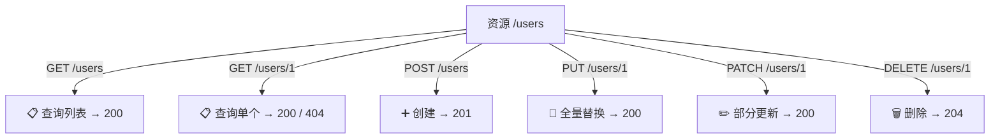

## 三、RESTful 设计（架构风格）

### 3.1 REST 是什么？

> **REST（Representational State Transfer）** 不是协议，是一种**API 设计风格**。核心思想：把一切都看作"资源"，用 HTTP 方法表示"对资源做什么操作"。

**通俗比喻**：RESTful API 就像一个**自助餐厅的取餐系统**：

```text
资源 = 菜品（用户、订单、文章...）
URL  = 菜品的位置（/冷菜区/凉拌黄瓜）
HTTP 方法 = 你要对这个菜做什么（看/拿/换/扔掉）

RESTful 设计 = 把所有操作统一成"找到资源位置 + 告诉我你要干嘛"
```

### 3.2 RESTful 的核心原则

| 原则 | 说明 | 例子 |
| :--- | :--- | :--- |
| **资源用名词，不用动词** | URL 表示"是什么"，不是"做什么" | ✅ `/users` ❌ `/getUsers` |
| **用 HTTP 方法表示操作** | GET 查、POST 建、PUT 改、DELETE 删 | `GET /users` 查所有用户 |
| **无状态** | 每个请求自带全部信息，服务器不记你之前干了啥 | 每次请求都带 token |
| **统一接口** | 所有资源都用同一套方式操作 | 用户、订单、文章都用 GET/POST/PUT/DELETE |
| **分层系统** | 客户端不关心背后有几层（缓存、网关、负载均衡） | 你只管发请求，中间经过什么你不知道 |

#### RESTful 资源操作映射图



### 3.3 URL 设计规范

#### ✅ 正确示范

```text
GET    /users              → 获取用户列表
GET    /users/1            → 获取 id=1 的用户
POST   /users              → 创建新用户
PUT    /users/1            → 更新 id=1 的用户（全量）
PATCH  /users/1            → 更新 id=1 的用户（部分）
DELETE /users/1            → 删除 id=1 的用户

GET    /users/1/orders     → 获取用户 1 的订单列表（子资源）
GET    /users/1/orders/5   → 获取用户 1 的第 5 号订单
```

#### ❌ 错误示范

```text
GET    /getUsers           → ❌ URL 里有动词（GET 已经表示"获取"了）
POST   /createUser         → ❌ 同上，POST 已经表示"创建"
GET    /user/delete/1      → ❌ 用 GET 做删除操作，违反语义
POST   /users/1/delete     → ❌ URL 里有动词，应该用 DELETE /users/1
GET    /users/getAll       → ❌ 应该是 GET /users
```

### 3.4 状态码配合 RESTful

| 操作 | 成功状态码 | 说明 |
| :--- | :---: | :--- |
| GET /users | 200 | 返回用户列表 |
| GET /users/1 | 200 | 返回单个用户 |
| GET /users/999（不存在） | 404 | 找不到 |
| POST /users | **201** | 创建成功（返回新资源） |
| PUT /users/1 | 200 | 更新成功（返回更新后的资源） |
| PATCH /users/1 | 200 | 部分更新成功 |
| DELETE /users/1 | **204** | 删除成功（没有返回体） |

### 3.5 完整 FastAPI 示例

```python
from fastapi import FastAPI, HTTPException         # 导入 FastAPI 和异常类
from pydantic import BaseModel                      # 导入数据验证模型

app = FastAPI()                                     # 创建应用实例

# ---- 模拟数据库 ----
fake_db = {                                         # 假装这是数据库
    1: {"id": 1, "name": "张三", "age": 20},
    2: {"id": 2, "name": "李四", "age": 22},
}

class UserCreate(BaseModel):                        # 创建用户时的数据格式
    name: str                                       # 必填：用户名
    age: int                                        # 必填：年龄

class UserUpdate(BaseModel):                        # 更新用户时的数据格式
    name: str | None = None                         # 可选：用户名
    age: int | None = None                          # 可选：年龄

# ---- GET /users：获取用户列表 ----
@app.get("/users")                                  # GET 方法，路径 /users
def list_users():
    return list(fake_db.values())                   # 返回所有用户

# ---- GET /users/{id}：获取单个用户 ----
@app.get("/users/{user_id}")                        # GET 方法，路径带参数
def get_user(user_id: int):
    if user_id not in fake_db:                      # 用户不存在
        raise HTTPException(status_code=404, detail="用户不存在")  # 抛 404
    return fake_db[user_id]                         # 返回该用户

# ---- POST /users：创建用户 ----
@app.post("/users", status_code=201)                # POST 方法，成功返回 201
def create_user(user: UserCreate):                  # 请求体自动解析为 UserCreate
    new_id = max(fake_db.keys()) + 1                # 生成新 id
    new_user = {"id": new_id, **user.model_dump()}  # 组装用户数据
    fake_db[new_id] = new_user                      # 存入"数据库"
    return new_user                                 # 返回创建的用户（201 Created）

# ---- PUT /users/{id}：全量更新 ----
@app.put("/users/{user_id}")                        # PUT 方法
def replace_user(user_id: int, user: UserCreate):   # 全量更新需要所有字段
    if user_id not in fake_db:                      # 用户不存在
        raise HTTPException(status_code=404, detail="用户不存在")  # 抛 404
    updated = {"id": user_id, **user.model_dump()}  # 用新数据完全替换
    fake_db[user_id] = updated                      # 更新"数据库"
    return updated                                  # 返回更新后的用户

# ---- PATCH /users/{id}：部分更新 ----
@app.patch("/users/{user_id}")                      # PATCH 方法
def update_user(user_id: int, user: UserUpdate):    # 部分更新，字段可选
    if user_id not in fake_db:                      # 用户不存在
        raise HTTPException(status_code=404, detail="用户不存在")  # 抛 404
    stored = fake_db[user_id]                       # 取出原有数据
    updates = user.model_dump(exclude_unset=True)   # 只取客户端实际传了的字段
    stored.update(updates)                          # 合并：只改传了的字段
    return stored                                   # 返回更新后的用户

# ---- DELETE /users/{id}：删除用户 ----
@app.delete("/users/{user_id}", status_code=204)   # DELETE 方法，成功返回 204
def delete_user(user_id: int):
    if user_id not in fake_db:                      # 用户不存在
        raise HTTPException(status_code=404, detail="用户不存在")  # 抛 404
    del fake_db[user_id]                            # 删除用户
    # 204 不返回任何内容
```

### 3.6 非 CRUD 操作怎么设计？

有些操作不好用名词表示，比如"登录""发送验证码""导出报表"。

**方案一：用动词作子资源（推荐）**

```text
POST   /users/1/activate     → 激活用户 1
POST   /auth/login            → 登录
POST   /auth/logout           → 登出
POST   /orders/5/cancel       → 取消订单 5
GET    /reports/export        → 导出报表
```

> **规则**：动词放在资源后面，用 POST 触发。不是所有操作都能完美映射到 CRUD，别死板。

**方案二：用状态转换表示**

```text
PATCH /orders/5
{"status": "cancelled"}       → 通过修改状态来"取消"订单
```

> 这种更 RESTful，但不如方案一直观。团队选一种统一就行。

---

## 速记卡（面试闪卡）

**Q1：一句话讲清「---- 模拟数据库 ----」到底是什么？**
A：**REST（Representational State Transfer）** 不是协议，是一种**API 设计风格**。核心思想：把一切都看作"资源"，用 HTTP 方法表示"对资源做什么操作"。
**通俗比喻**：RESTful API 就像一个**自助餐厅的取餐系统**：
| 原则 | 说明 | 例子 |
| :--- | :--- | :--- |

**Q2：三、RESTful 设计（架构风格） —— 怎么理解？**
A：**REST（Representational State Transfer）** 不是协议，是一种**API 设计风格**。核心思想：把一切都看作"资源"，用 HTTP 方法表示"对资源做什么操作"。
**通俗比喻**：RESTful API 就像一个**自助餐厅的取餐系统**：
| 原则 | 说明 | 例子 |
| :--- | :--- | :--- |

**Q3：核心速记主线有哪些？**
A：抓住这几根：三、RESTful 设计（架构风格）。


## 相关链接

- 📋 目录：[[00-计算机网络]]
- 📚 学习清单：[[八股文学习清单]]
- 🔗 [[19-HTTP基础|HTTP基础]] — HTTP 方法与状态码基础
- 🔗 [[11-GET与POST与PUT与DELETE|GET与POST与PUT与DELETE]] — 请求方法与幂等性详解
- 🔗 [[10-HTTP状态码|HTTP状态码]] — RESTful 中的状态码使用规范
- 🔗 [[11-GET与POST与PUT与DELETE|GET与POST与PUT与DELETE]] — 请求方法与幂等性详解
- 🔗 [[10-HTTP状态码|HTTP状态码]] — RESTful 状态码配合
- 🔗 [[19-HTTP基础|HTTP基础]] — HTTP 请求/响应结构

