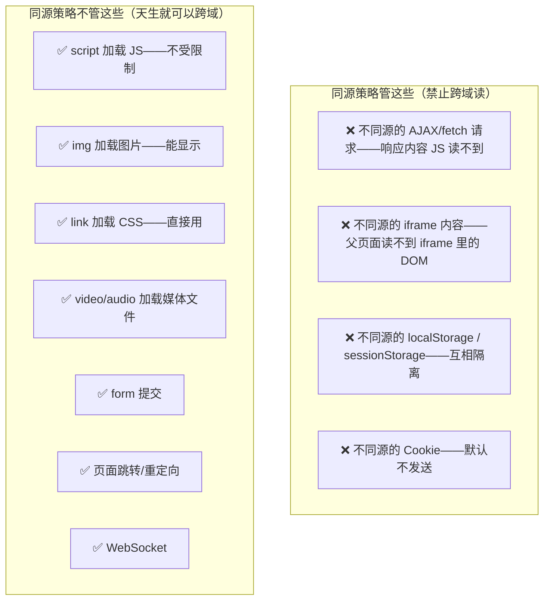

---

title: "同源策略"

created: "2025-07-12"

tags:

  - 八股文

  - 计算机网络

---

# 同源策略

## 第一章：同源策略——浏览器为什么要管这么宽？
### 1.1 先理解"没有同源策略的世界有多危险"

```text

你正常用浏览器，同时打开了两个标签页：

  标签A：你的网银页面（bank.com）——你已经登录了

  标签B：一个"免费领优惠券"的钓鱼页面（evil.com）

如果没有同源策略，evil.com 页面里的 JS 可以：

  ① 用 fetch 发请求到 bank.com/transfer?to=hacker&amount=10000

     → 浏览器自动携带你在 bank.com 的 Cookie → 请求以你的身份发出去

     → 钱被转走了 💀

  ② 用 fetch 读 bank.com/balance 的返回内容

     → 你的账户余额直接被偷走

  ③ 用 iframe 加载 bank.com，然后读 iframe 里的 DOM

     → 你的账号信息全部暴露

同源策略拦截的就是上面这些——

  禁止不同源的页面之间互读数据（DOM、Cookie、localStorage、Ajax 响应）。

```

### 1.2 同源怎么判定——"长得很像但不是一回事"

```text

源 = 协议 + 域名 + 端口（三者全一样才算同源）

以 http://www.example.com:80/page.html 为基准：

```

| URL | 是否同源？ | 原因 |
| :--- | :---: | :--- |
| http://www.example.com/other.html | ✅ 同源 | 路径不同不算跨域 |
| http://www.example.com:80/api/data | ✅ 同源 | 端口 80 是 HTTP 默认，等价 |
| https://www.example.com | ❌ 不同源 | 协议不同（http vs https） |
| http://api.example.com | ❌ 不同源 | 域名不同（子域名也算不同源！） |
| http://www.example.com:8080 | ❌ 不同源 | 端口不同 |
| http://example.com | ❌ 不同源 | 域名不同（没有 www） |

```text

关键规律：

  ① 路径不同不算跨域——同源只看协议+域名+端口，不管路径

  ② 子域名也是不同源——api.example.com 和 www.example.com 互为跨域

  ③ 端口不同就是跨域——localhost:3000 和 localhost:8000 是跨域！

```

### 1.3 同源策略管什么、不管什么



> **一句话讲清**："同源策略是浏览器的安全基石——它默认禁止不同源的页面互读数据，防止恶意网站窃取用户信息。但 `<script>`、``、`<link>` 等标签加载资源不受限制——这也是 JSONP 能绕过跨域的根本原因。"

---

## 速记卡（面试闪卡）

**Q1：一句话讲清「同源策略」到底是什么？**

A：同源策略是浏览器安全基石：默认禁止不同源页面互读数据，防恶意网站偷你的信息。

**Q2：一、怎么判定同源 —— 怎么理解？**

A：源＝协议＋域名＋端口，三者全同才算同源，跟路径无关。以 http://www.example.com:80 为基准：同路径／other.html 同源；但 https（协议不同）、api.example.com（子域不同）、:8080（端口不同）、example.com（没 www）都不同源。记三句：路径不同不算、子域也算跨域、端口不同就是跨域。

**Q3：一、同源策略管什么不管什么 —— 怎么理解？**

A：管"跨域读数据"：不同源 fetch/Ajax 响应 JS 读不到、iframe DOM 读不到、localStorage 互相隔离、Cookie 默认不发送。不管"天生能跨域加载"：script/img/link/video/form/跳转/WebSocket 不受限——这也正是 JSONP 钻空子的地方。

**Q4：一、限制方是浏览器而非服务器 —— 怎么理解？**

A：同源策略是"浏览器默认关门"，CORS 是"服务器配合开门"。服务器收到跨域请求照样处理返回，只是浏览器看到响应没正确 CORS 头（Access-Control-Allow-Origin）就拒交 JS。所以 curl/Postman 测跨域"正常"——因为它不是浏览器，没有这道门禁。

**Q5：一、script 跨域是双刃剑 —— 怎么理解？**

A：script 标签能跨域加载执行，是因为同源策略只拦"读"不拦"加载执行"。JSONP 借此：后端把数据塞进 handleData({...}) 返回，前端预定义 handleData 即拿到。好处老浏览器也能跨域，坏处只支持 GET、易注入、靠超时兜底——2025 年正经项目用 CORS，JSONP 提一嘴"过时"即可。

**Q6：核心速记主线有哪些？**

- 同源＝协议＋域名＋端口三者全同；路径不同不算跨域

- 子域名不同、端口不同即跨域（localhost:3000≠:8000）

- 管"跨域读"（DOM/Cookie/localStorage/Ajax），不管"加载资源"（script/img/link…）

- 危险场景：恶意页借已登录 Cookie 发转账、读 iframe DOM

- 限制方是浏览器不是服务器；CORS 是服务器配合放行的机制

**口诀**

A：协议域名端口三兄弟，缺一就是不同源

子域端口都算数，路径不同不犯嫌

管你跨域读数据，不管加载资源链

浏览器把门关为限，CORS 放行才周全

## 相关链接

- 📋 目录：[[00-计算机网络]]

- 📚 学习清单：[[八股文学习路线图]]

- 🔗 [[26-CORS跨域资源共享|CORS跨域资源共享]] — CORS 是解决跨域的主流方案

- 🔗 [[30-跨域与CORS|跨域与CORS]] — 跨域补充笔记

- 🔗 [[33-五种跨域解决方案|五种跨域解决方案]] — 跨域方案汇总

