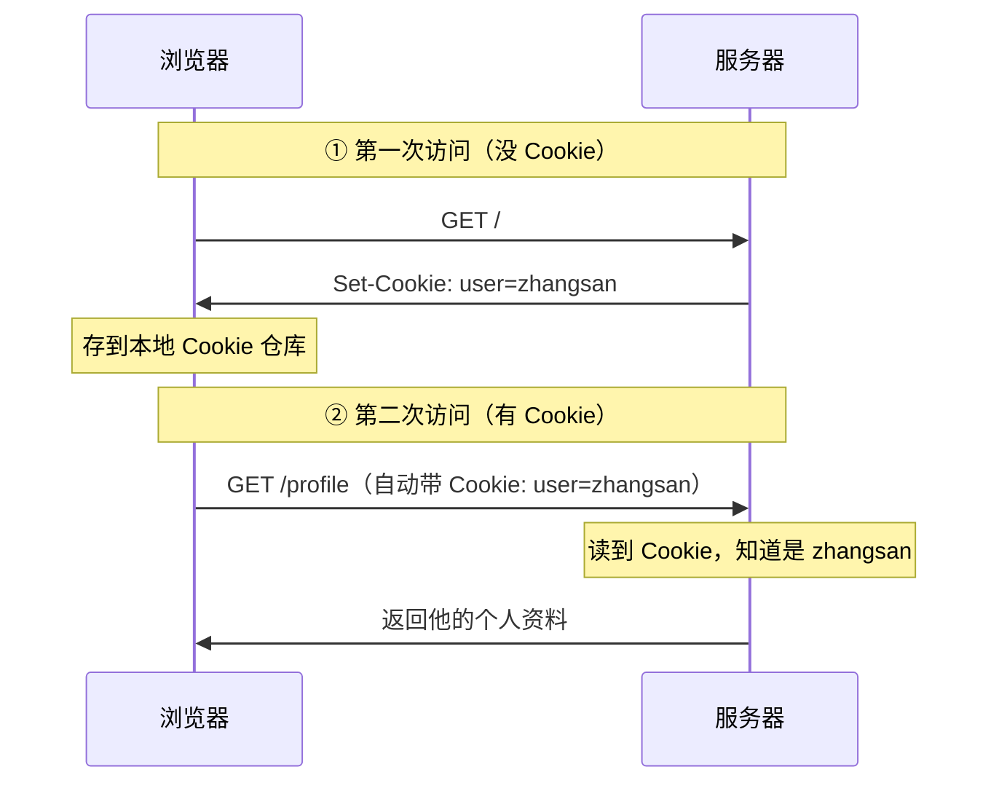
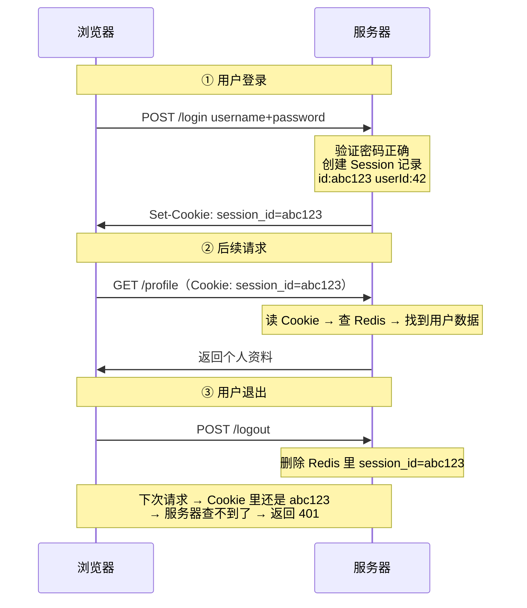
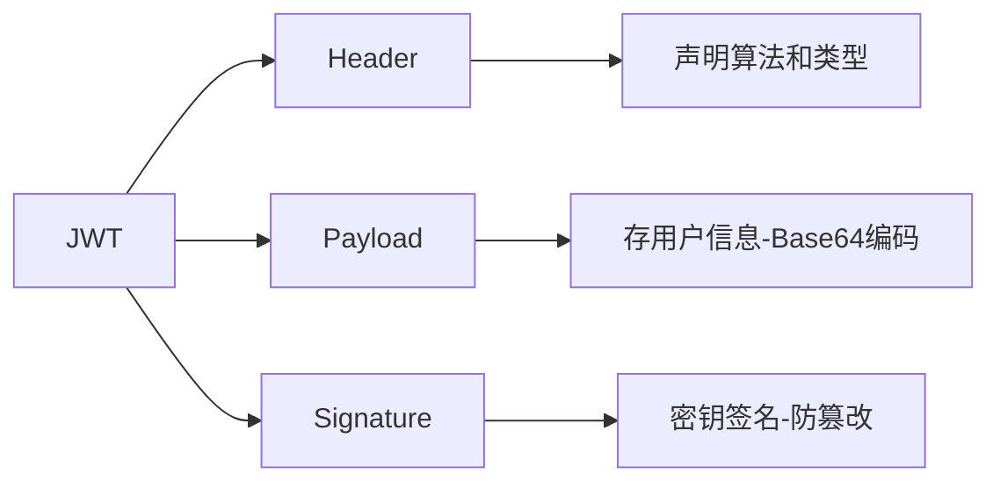
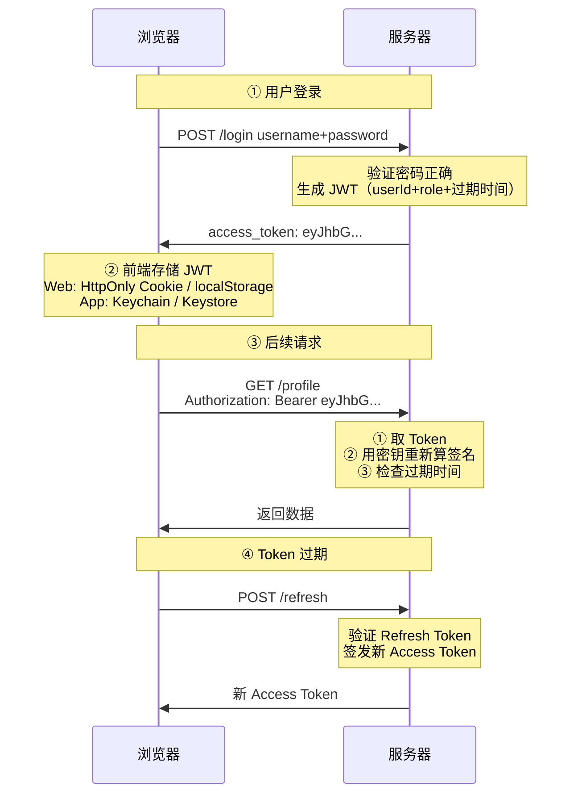
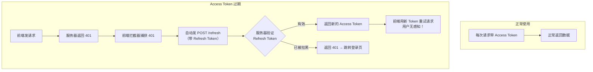

---

title: "Cookie与Session与Token认证三兄弟"

created: "2025-07-12"

tags:

  - 八股文

  - 计算机网络

---


# Cookie与Session与Token认证三兄弟

## 第四章：Cookie、Session、Token——认证三兄弟到底什么关系


> 的经典连环问：Cookie 是什么？Session 是什么？Token 又是什么？它们有什么区别？为什么有了 Cookie+Session 还要用 JWT？一个一个拆。


### 4.0 先讲清楚：HTTP 为什么"无状态"


```text

HTTP 协议本身不记得任何用户信息。


你第一次请求：POST /login → 输入账号密码 → 服务器返回"登录成功"

你第二次请求：GET /profile → 服务器："你是谁？我不认识你"


这就是"无状态"——每次请求都是独立的，服务器不记得刚才发生过什么。


类比——失忆症的餐厅服务员：

  你坐下 → "我要一份牛排" → 服务员端来牛排

  你："再来一杯可乐"

  服务员："你是谁？你什么时候来的？你刚才点了什么？"


解决方案：给你一个"号码牌"（Cookie/Session/Token），

         每次和服务员说话时举一下牌子→服务员就知道你是谁了。

```


### 4.1 Cookie——浏览器里的小本本


```text

Cookie 是浏览器提供的存储容器——服务器可以往里面放东西，浏览器自动携带。

```


##### Cookie 的生命周期——服务器怎么"发牌"给浏览器


1. **服务器在响应头里说："记住这个"**

   ```text

   HTTP/1.1 200 OK

   Set-Cookie: session_id=abc123; HttpOnly; Secure; SameSite=Lax

   ```


2. **浏览器收到 → 存到本地 Cookie 仓库 → 下次访问同域名自动带**

   ```text

   GET /profile HTTP/1.1

   Host: app.example.com

   Cookie: session_id=abc123    ← 浏览器自动加，你不需要写代码

   ```


3. **服务器读取 Cookie → 知道你是谁 → 返回你的个人资料**


##### Cookie 的本质属性——这些必问


> Cookie 不是"认证方案"——它是一个"存储容器"。

> Cookie 里可以存 SessionID，也可以存 JWT Token，也可以存用户名。

> 它只是浏览器提供的一个存储+自动携带机制。


**重要属性：**


| 属性 | 说明 |
| :--- | :--- |
| **Name/Value** | 键值对。`session_id=abc123` |
| **Domain** | 哪些域名可以读取这个 Cookie。设为 `.example.com` 则子域名共享 |
| **Path** | 哪些路径可以读取。设为 `/` 则全站可用 |
| **Expires** | 绝对过期时间。不设 = 会话 Cookie，关浏览器就消失 |
| **Max-Age** | 相对过期时间（秒）。优先级 > Expires |
| **HttpOnly** | 设了 JS 读不到。防 XSS 脚本偷 Cookie |
| **Secure** | 只有 HTTPS 才发送。防明文抓包 |
| **SameSite** | 跨站时发不发（见下表） |


**SameSite 三个值：**


| 值 | 行为 | 场景 |
| :--- | :--- | :--- |
| **Strict** | 最严，a.com 的页面里点链接跳到 b.com，Cookie 不带 | 银行等高安全场景 |
| **Lax** | 适度，a.com 里点链接跳 b.com 会带，但 img/iframe/ajax 不带（浏览器默认） | 大多数网站 |
| **None** | 不限制，但必须配 Secure | 需要跨站请求的场景 |


> 大小限制：单个 Cookie 约 4KB，每个域名下约 20-50 个





> **一句话讲清**："Cookie 是浏览器存储机制，不是认证方案。服务器通过 Set-Cookie 下发，浏览器后续同域请求自动携带。核心属性 HttpOnly（防 XSS 窃取）、Secure（仅 HTTPS 传输）、SameSite（防 CSRF）。Cookie 本身可用于存储 SessionID 或 JWT Token——它只是容器。"


### 4.2 Session——服务器帮你记着你是谁


Session 是服务端会话机制——用户数据存在服务器上，前端只拿一个"号码牌"（sessionId）。





**Session 的特点——优缺点一目了然：**


- ✅ 安全性高——用户数据在服务端，前端只有一个无意义的 sessionId

- ✅ 主动失效——服务器删掉 Session 记录 → 用户立刻被踢下线

- ✅ 可控性强——可以精确知道"当前有多少人在线"


- ❌ 服务器存储压力——百万用户在线 = 百万条 Session，吃内存

- ❌ 分布式麻烦——多台服务器需要共享 Session（Redis），增加架构复杂度

- ❌ 跨域不友好——Session 靠 Cookie 传递，跨域需额外配置

- ❌ 移动端不友好——App 没有 Cookie 机制


> **类比——酒店寄存：**

> 你住酒店（登录）→ 前台把你的行李存在储物间（服务器存 Session）

> → 给你一个号码牌（sessionId）→ 下次你举牌，前台去储物间拿你行李

> → 你退房（退出）→ 前台清空你的储物格

> 问题：如果你去另一家分店（另一台服务器），那边的储物间没有你的行李

> → 需要所有分店共用一个仓库（Redis 共享 Session）


> **一句话讲清**："Session 是服务端有状态会话——用户数据存服务器，前端通过 Cookie 携带 sessionId。优点是可主动踢人、安全性高；缺点是分布式需要 Redis 共享、服务器内存压力大、移动端适配差。"


### 4.3 Token（JWT）——服务器签个字，你自己带着


Token 是无状态凭证——服务器签发后就"撒手不管"。

用户自己保管 Token，每次请求带过来，服务器验证签名就认你。





一个真实的 JWT 长这样（三段用 `.` 分隔）：


```text

eyJhbGciOiJIUzI1NiIsInR5cCI6IkpXVCJ9.                          ← Header

eyJzdWIiOiI0MiIsInJvbGUiOiJ1c2VyIiwiZXhwIjoxNzM1Njg5NjAwfQ.    ← Payload

SflKxwRJSMeKKF2QT4fwpMeJf36POk6yJV_adQssw5c                      ← Signature

```


##### 逐段拆解——每一段里面装了什么


**第一段 Header（Base64 解码后）：**

```json

{

  "alg": "HS256",     ← 签名算法（HMAC-SHA256）

  "typ": "JWT"        ← 类型

}

```


**第二段 Payload（Base64 解码后）**——⚠️ 任何人 Base64 解码就能看到！不加密！

```json

{

  "sub": "42",                ← subject = 用户 ID

  "role": "user",             ← 用户角色

  "exp": 1735689600,          ← 过期时间（Unix 时间戳）

  "iat": 1735682400           ← 签发时间

}

```


> ⚠️ 绝对不能放密码、手机号、身份证号等敏感信息！Base64 不是加密！只是编码！解码只需一行代码！


**第三段 Signature（签名，用密钥算出来的）：**

```javascript

HMACSHA256(

  base64(Header) + "." + base64(Payload),

  secret_key    ← 服务器才知道的密钥

)

```


> 没有密钥就无法伪造签名 → 防篡改





**JWT 防篡改原理——为什么攻击者改不了 Payload：**


假设你是攻击者，截获了 JWT：


```text

eyJhbGciOi... . eyJzdWIiOiI0MiIsInJvbGUiOiJ1c2VyIn0= . SflKxwRJ...

```


你 Base64 解码 Payload → 看到 `{"sub":"42", "role":"user"}`。你把 `"role":"user"` 改成 `"role":"admin"` → 重新 Base64 编码 → 拼回 JWT → 发给服务器想冒充管理员。


服务器收到后：

1. 取出 Header + 被改过的 Payload

2. 用自己的密钥重新算签名

3. 发现你发来的签名 ≠ 服务器算出来的签名 → 签名对不上 → 拒绝！


这就是"只编码不加密"也能防篡改的原因——签名是拿密钥算的，没有密钥就算不出正确的签名。改 Payload 容易，但改签名做不到。


> **一句话讲清**："JWT 三段式——Header 声明算法，Payload 存用户信息（Base64 编码，不加密），Signature 用密钥对前两段签名。防篡改原理是——攻击者改了 Payload 但改不了签名，服务器重新算签名对不上就拒绝。所以 JWT 不需要加密 Payload，签名本身就保证了完整性。"


### 4.4 双 Token 机制——为什么要有两个 Token


```text

前面说了 JWT 的一个致命问题：签发后无法主动失效。


假设只用一个 Token，有效期设 7 天：

  用户手机被偷 → 改了密码 → 但旧的 Token 还在 7 天有效期内

  → 小偷拿旧 Token 照样能访问 → 💀


如果设短有效期（15 分钟）：

  每 15 分钟用户就得重新登录一次 → 用户体验崩了

```


**双 Token 解法——用两个 Token 各司其职：**


| Token | 用途 | 有效期 | 存储 | 特点 |
| :--- | :--- | :---: | :--- | :--- |
| **Access Token** | 日常业务请求 | 短（15 分 ~ 2 小时） | 内存 / localStorage | 即使泄露，15 分钟后自动失效 |
| **Refresh Token** | 只换新 Access Token | 长（7 天 ~ 30 天） | HttpOnly Cookie / 安全存储 | 踢人时拉黑，用户换不了 Access Token → 被迫重新登录 |





> **类比——公司的门禁卡系统：** Access Token = 临时门禁卡（有效期一天，丢了风险可控），Refresh Token = 员工证（有效期一年，锁在钱包里，丢可挂失）。


> **一句话讲清**："双 Token 是 JWT 无法主动失效的业界标准解法——Access Token 短效期频繁用，Refresh Token 长效期只换新不用来做业务。需要踢人时把 Refresh Token 加入黑名单，最长等待时间 = Access Token 有效期。Facebook、Google 都这么干。"


---


## 速记卡（面试闪卡）


**Q1：一句话讲清「Cookie与Session与Token认证三兄弟」到底是什么？**

A：认证三兄弟是解决 HTTP 无状态的三种"号码牌"：Cookie 容器、Session 服务端存、Token 自携。


**Q2：Cookie——浏览器的小本本 —— 怎么理解？**

A：Cookie 是浏览器提供的存储+自动携带机制，服务器用 Set-Cookie 下发，同域请求自动带。它只是容器，里面可放 SessionID 也可放 Token。像失忆服务员给你个号码牌，每次你举牌他就认得你（Cookie / Set-Cookie）。


**Q3：Session——服务端帮你记着 —— 怎么理解？**

A：Session 把用户数据存在服务端，前端只拿一个无意义的 sessionId。优点是能主动踢人、安全；缺点是百万在线吃内存、分布式要 Redis 共享。像酒店寄存：给你号码牌，行李存总台，换分店得共用仓库（server-side session / Redis）。


**Q4：Token（JWT）——服务器签个字你自帯 —— 怎么理解？**

A：JWT 三段式：Header 声明算法、Payload 存用户信息（Base64 不加密）、Signature 用密钥签名防篡改。服务器验签名就认你，自己保管不用服务端存。改了 Payload 改不了签名，所以对不上就拒（JWT / Signature）。


**Q5：双 Token——为何要两个 —— 怎么理解？**

A：JWT 签发后无法主动失效，单 Token 要么有效期长（被盗风险）要么短（总重登）。双 Token 各司其职：Access 短效常用，Refresh 长效只换新、拉黑即踢人。像门禁卡（短）加员工证（长可挂失）（Access/Refresh Token）。


**Q6：核心速记主线有哪些？**

- Cookie：浏览器存储容器，HttpOnly 防 XSS、Secure 仅 HTTPS、SameSite 防 CSRF

- Session：服务端存状态，安全可控但分布式需 Redis

- JWT：三段式自携，签名防篡改，Payload 不加密

- 双 Token：Access 短效 + Refresh 长效，拉黑即踢人


**口诀**

A：Cookie 是号码牌，容器自动带过来；

Session 存总台，sessionId 作钥匙开；

JWT 三段签名护，自携凭证随身带；

双 Token 长短配，拉黑刷新把人裁。


## 相关链接


- 📋 目录：[[00-计算机网络]]

- 📚 学习清单：[[八股文学习路线图]]

- 🔗 [[29-Cookie与Session|Cookie与Session]] — Cookie 与 Session 基础知识

- 🔗 [[10-HTTP状态码|HTTP状态码]] — 401/403 状态码与认证的关系


