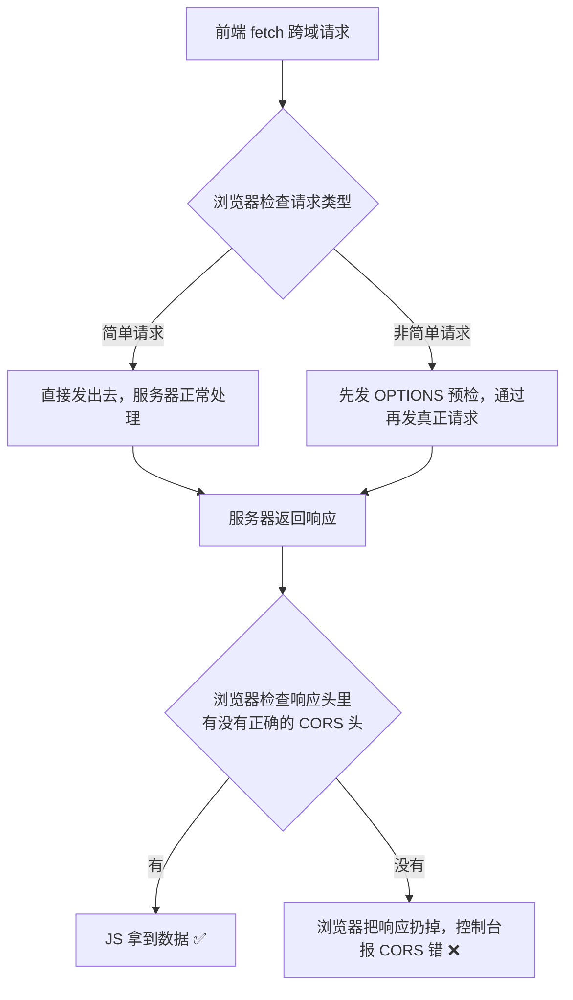
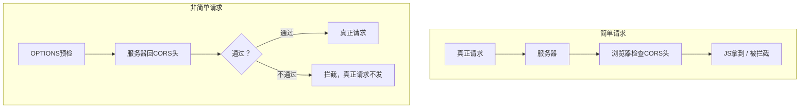

---

title: "CORS跨域资源共享"

created: "2025-07-12"

tags:

  - 八股文

  - 计算机网络

---

# CORS跨域资源共享

## 第二章：CORS——服务器说"我让你跨"
### 2.0 核心认知：跨域请求实际发出去了吗？

先说清楚最容易被误解的地方：



**关键：请求确确实实发出去了，服务器也处理了。是浏览器拿到了响应但不给 JS。**

> 类比——门卫看快递：快递员（服务器）把包裹（响应）送到你家楼下。门卫（浏览器）一看寄件地址（Origin）→ 不在白名单上 → 包裹扣下，不给你。包裹确实到了，快递确实送了——是门卫拦的。

### 2.1 简单请求 vs 非简单请求——分界线决定要不要预检
### 简单请求——同时满足三个条件（缺一不可）

| 条件 | 说明 |

| :--- | :--- |

| ① 方法 | GET、POST、HEAD（三者之一） |

| ② 头部 | 只能用"安全列表"内的请求头：Accept、Accept-Language、Content-Language、Content-Type<br/>不能加自定义头（如 Authorization、X-Token 等） |

| ③ Content-Type | 只能是这三种：`application/x-www-form-urlencoded`、`multipart/form-data`、`text/plain` |

> 注意：`application/json` 不是安全列表里的 Content-Type！只要 Content-Type 是 `application/json` → 非简单请求！

### 非简单请求——以下任何一条满足都是

| 条件 | 说明 |

| :--- | :--- |

| ① 方法 | PUT、DELETE、PATCH、OPTIONS |

| ② 头部 | 带了自定义请求头（Authorization、X-Custom-Header、Content-Type 之外的头） |

| ③ Content-Type | `application/json`（你项目里 99% 的接口都是这个！） |

这就是为什么你的项目一定会触发 OPTIONS 预检——因为你用 axios 发 POST，Content-Type 默认就是 `application/json`。

### 2.2 简单请求——直接发，浏览器在请求头加上 Origin

```text

GET /api/users HTTP/1.1

Host: api.example.com

Origin: http://localhost:3000         ← 浏览器自动加的，告诉服务器"我来自哪里"

服务器收到后，如果想允许这个来源，就在响应头里加上：

HTTP/1.1 200 OK

Access-Control-Allow-Origin: http://localhost:3000   ← "我允许你跨域读我的数据"

Content-Type: application/json

浏览器收到响应 → 检查 Access-Control-Allow-Origin 是否包含当前 Origin

  → 包含 → JS 拿到数据 ✅

  → 不包含 → 扔响应，报 CORS 错 ❌

```

### 2.3 非简单请求——先问"能不能来"，服务器说行再来

```javascript

axios.post('http://api.example.com/users', data)

// Content-Type: application/json  ← 非简单请求！触发预检！

```

##### 第一步：浏览器自动发 OPTIONS 预检请求（不需要你写任何代码）

```text

OPTIONS /api/users HTTP/1.1

Host: api.example.com

Origin: http://localhost:3000

Access-Control-Request-Method: POST                    ← "我打算用 POST 方法"

Access-Control-Request-Headers: content-type           ← "我会带 content-type 头"

```

服务器收到 → 检查自己是否允许这个来源 + 这个方法 + 这个头

- **允许** → 返回：

```text

HTTP/1.1 200 OK

Access-Control-Allow-Origin: http://localhost:3000

Access-Control-Allow-Methods: GET, POST, PUT, DELETE   ← "这些方法我允许"

Access-Control-Allow-Headers: Content-Type, Authorization ← "这些头我允许"

Access-Control-Max-Age: 86400                          ← "这个预检结果缓存 24 小时"

```

- **不允许** → 返回 200 但没有这些头 → 浏览器拦截，真正请求不发

##### 第二步：预检通过 → 浏览器才发真正的 POST 请求

```text

POST /api/users HTTP/1.1

Host: api.example.com

Origin: http://localhost:3000

Content-Type: application/json

{"name": "张三", "age": 22}

```

服务器正常返回：

```text

HTTP/1.1 200 OK

Access-Control-Allow-Origin: http://localhost:3000

Content-Type: application/json

{"id": 1, "name": "张三"}

```

浏览器再次检查 Access-Control-Allow-Origin → 通过 → JS 拿到数据 ✅



**Access-Control-Max-Age 的作用——预检不用每次都发：**

同一个 URL，同样的请求方法+头，浏览器会在 Max-Age 秒内复用预检结果。

比如 Max-Age=86400（24小时）：

- 第一次 POST /api/users → 发 OPTIONS

- 接下来 24 小时内 POST /api/users → 不再发 OPTIONS，直接用缓存结果

> 类比——出入证：第一天进门，保安查你身份证、工作证、健康码（OPTIONS 预检）。给你办了个出入证（缓存），有效期 24 小时。今天之内再进出，出示出入证就行，不用再查三件套。

> **一句话讲清**："CORS 把请求分成简单和非简单两种。简单请求（GET/POST/HEAD + 安全列表头 + 安全列表 Content-Type）直接发，浏览器自动带 Origin。非简单请求（JSON Content-Type、自定义头、PUT/DELETE）先发 OPTIONS 预检——问服务器是否允许当前来源+方法+头，通过后才发真正的请求。用 Max-Age 缓存预检结果，避免每次都问。"

### 2.4 六个关键 CORS 响应头——缺一报错

| Header | 干什么？ | 缺了会怎样？ |

| :--- | :--- | :--- |

| ① Access-Control-Allow-Origin<br/>例: http://localhost:3000 | 告诉浏览器"这些来源可以读我"<br/>可以是具体域名，不能用 * + 凭证同用 | 最常见的 CORS 报错原因 |

| ② Access-Control-Allow-Methods<br/>例: GET, POST, PUT, DELETE | 告诉浏览器"这些方法我允许"<br/>非简单请求必须包含你要用的方法 | 预检返回的方法不在列表里→拦截 |

| ③ Access-Control-Allow-Headers<br/>例: Content-Type, Authorization | 告诉浏览器"这些请求头我允许"<br/>非简单请求必须包含你要用的头 | 你带了 Authorization 但没列在这→拦截 |

| ④ Access-Control-Allow-Credentials<br/>例: true | 告诉浏览器"允许携带 Cookie/凭证"<br/>必须和前端 withCredentials 配对 | 设为 true 才能真正跨域传 Cookie |

| ⑤ Access-Control-Max-Age<br/>例: 86400（24小时） | 预检结果缓存多久（秒）<br/>建议设 86400，浏览器有上限（Chrome 2h） | 每次请求都预检，多一次往返 |

| ⑥ Access-Control-Expose-Headers<br/>例: X-Total-Count | 告诉浏览器"这些响应头 JS 可以读"<br/>你的自定义响应头 JS 读不到→加在这 | JS 默认只能读 safe-listed 响应头 |

### 特别注意——两个经典翻车场景

**场景一：带了 Authorization 头但没配 Allow-Headers**

前端：`axios.get(url, { headers: { Authorization: 'Bearer xxx' }})`

后端：只配了 `Access-Control-Allow-Origin`

→ 预检时发现 Authorization 不在 Allow-Headers 里

→ 浏览器拦截：`Request header field Authorization is not allowed by Access-Control-Allow-Headers`

**场景二：想跨域带 Cookie 但只配了 Allow-Origin: \***

后端：`Access-Control-Allow-Origin: *` + `Access-Control-Allow-Credentials: true`

→ 浏览器：你配了 Credentials 就不能用 `*`！

→ 必须把 `*` 改成具体域名——这是浏览器的硬限制，不是后端 bug

### 2.5 CORS 头怎么配——后端代码直接抄
##### FastAPI 配 CORS（Python 后端——你的项目用这个）

```python

from fastapi import FastAPI

from fastapi.middleware.cors import CORSMiddleware

app = FastAPI()

origins = [

    "http://localhost:3000",       # React 开发服务器

    "https://your-frontend.com",   # 生产环境前端域名

]

app.add_middleware(

    CORSMiddleware,

    allow_origins=origins,         # ✅ 白名单具体域名，不要用 ["*"]

    allow_credentials=True,        # ✅ 允许携带 Cookie

    allow_methods=["GET", "POST", "PUT", "DELETE"],  # 只开放需要的方法

    allow_headers=["Content-Type", "Authorization"], # 只开放需要的头

    expose_headers=["X-Total-Count"],                 # 让前端 JS 能读到自定义响应头

    max_age=86400,                 # 预检缓存 24 小时

)

```

##### Express.js 配 CORS（Node 后端）

```javascript

const cors = require('cors');

app.use(cors({

    origin: ['http://localhost:3000', 'https://your-frontend.com'],

    credentials: true,

    methods: ['GET', 'POST', 'PUT', 'DELETE'],

    allowedHeaders: ['Content-Type', 'Authorization'],

}));

```

##### Nginx 反向代理配 CORS（生产环境推荐——不需要改后端代码）

```nginx

# 但如果仍需给外部暴露 API，加上 CORS 头：

location /api/ {

    # 处理 OPTIONS 预检

    if ($request_method = 'OPTIONS') {

        add_header Access-Control-Allow-Origin 'https://your-frontend.com';

        add_header Access-Control-Allow-Methods 'GET, POST, PUT, DELETE';

        add_header Access-Control-Allow-Headers 'Content-Type, Authorization';

        add_header Access-Control-Max-Age 86400;

        return 204;    # 预检直接返回，不往后端转发

    }

    # 正常请求也加 CORS 头

    add_header Access-Control-Allow-Origin 'https://your-frontend.com';

    add_header Access-Control-Allow-Credentials 'true';

    proxy_pass http://backend:8000;

}

```

---

## 速记卡（面试闪卡）

**Q1：一句话讲清「CORS跨域资源共享」到底是什么？**

A：CORS 是浏览器的一道"门卫"：跨域请求服务器其实处理了，只是响应头不对就不让 JS 拿。

**Q2：一、核心认知：请求到底发出去没 —— 怎么理解？ —— 怎么理解？**

A：像门卫扣快递：快递员（服务器）把包裹（响应）送到楼下，门卫（浏览器）一看寄件地址（Origin）不在白名单，就把包裹扣下不给。请求确确实实发出去了、服务器也处理了，是浏览器拿到响应却不交给 JS。英文：Origin / same-origin policy。

**Q3：二、简单请求 vs 非简单请求 —— 怎么理解？ —— 怎么理解？**

A：像进楼分两种：简单请求（GET/POST/HEAD + 安全头 + 表单型 Content-Type）直接进，浏览器自动带 Origin；非简单请求（JSON 的 Content-Type、自定义头、PUT/DELETE）先发 OPTIONS 预检"问能不能来"，通过才发真请求。你的 axios 默认 JSON 必触发预检。英文：preflight / OPTIONS。

**Q4：三、六个关键 CORS 响应头 —— 怎么理解？ —— 怎么理解？**

A：像门卫手里的六张牌：Allow-Origin 说"谁可进"、Allow-Methods 说"哪些动作"、Allow-Headers 说"带哪些头"、Allow-Credentials 说"能否带 Cookie"、Max-Age 说"预检缓存多久"、Expose-Headers 说"JS 能读哪些响应头"。缺一浏览器就拦截报错。英文：Access-Control-Allow-*。

**Q5：四、经典翻车与怎么配 —— 怎么理解？ —— 怎么理解？**

A：像两个常踩的坑：带了 Authorization 却没配 Allow-Headers→拦截；想带 Cookie 却用 Allow-Origin:*（配了 Credentials 就不能用 *，必须写具体域名）。配法：FastAPI 用 CORSMiddleware 白名单、Nginx 反代把前后端代理同域从根上消跨域。英文：CORS middleware / reverse proxy。

**Q6：核心速记主线有哪些？**

- 本质：CORS 是浏览器策略，请求已发出、服务器已处理，门卫拦响应

- 两类：简单请求直接发带 Origin；非简单先 OPTIONS 预检再发

- 六头：Allow-Origin/Methods/Headers/Credentials/Max-Age/Expose-Headers

- 翻车：缺 Allow-Headers 拦自定义头；* 配 Credentials 必须改具体域

- 配置：后端白名单中间件，或 Nginx 反代同域从根上消除跨域

**口诀**

A：CORS 门卫把关严，请求已发响应拦；

简单直进预检问，JSON 必触 OPTIONS 探；

六张头牌缺一张，浏览器前报错瘫；

带 Cookie 莫用星，同域反代最舒坦。

## 相关链接

- 📋 目录：[[00-计算机网络]]

- 📚 学习清单：[[八股文学习路线图]]

- 🔗 [[24-同源策略|同源策略]] — 同源策略是 CORS 的前提

- 🔗 [[30-跨域与CORS|跨域与CORS]] — 跨域补充笔记

- 🔗 [[33-五种跨域解决方案|五种跨域解决方案]] — 其他跨域方案

