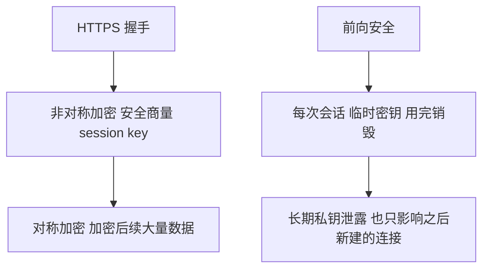

# 对称加密 vs 非对称加密 + 前向安全

## 一句话总结

> **对称加密是你和她用同一个密码本，快但密码怎么给到她是个问题。非对称加密是你们各自有公钥和私钥，公钥随便给、私钥自己藏，慢但安全地解决了密码传递问题。前向安全就是每次会话用临时密码——今天的私钥泄露了，昨天的通信记录也解不了。**

---

## 🌰 对称加密

### 什么是

你和朋友通信，商量好一个密码本。

```text
你写"今天吃了吗" → 用密码本加密 → "X#7kP" → 朋友收到 → 用同一个密码本解密 → "今天吃了吗"
```

加密和解密用的是同一个密钥。

> **像什么？** 你和闺蜜约好，用同一本暗号书。你写"今晚老地方见" → 查暗号书 → "@#$%" → 闺蜜收到 → 查同一本暗号书 → "今晚老地方见"

### 优缺点

**优点：**
- 速度快（比非对称快几百到几千倍）
- 适合加密大量数据（视频流、文件传输）

**缺点：**
- 密钥怎么安全地给对方？
- 如果你俩的密码本被中间人截获了，加密就破了

> **像什么？** 你把密码本寄给闺蜜。寄的路上被中间人拍了照。以后你们所有的暗号他都能看懂。

### 常见的对称加密算法

| 算法 | 特点 | 用在 |
| :--- | :--- | :--- |
| **AES** | 目前最常用，速度快，安全 | HTTPS 加密通信、WiFi 加密、文件加密 |
| **ChaCha20** | Google 推出，手机端比 AES 更快 | HTTPS（TLS 1.3）、移动端通信 |

---

## 二、非对称加密

### 什么是

每人有两把钥匙：公钥 + 私钥。

- **公钥**：可以给任何人。谁都可以用你的公钥加密信息
- **私钥**：只有你自己有。只有你的私钥能解密用你公钥加密的信息

你和朋友各自生成一对密钥。

你要给朋友发消息：
- 你用朋友的公钥加密消息
- 只有朋友的私钥能解开
- 中间人拿到密文，没有私钥，解不开

反过来，朋友要给你发消息：他用你的公钥加密，只有你的私钥能解开。

> **像什么？** 你给全世界发了一堆打开的锁（公钥）。谁想给你寄信，就把信放进箱子，用你的锁锁上。只有你有钥匙（私钥）能打开。锁在运输路上被抢走了也没用——抢锁的人没有钥匙。

### 优缺点

**优点：**
- 不用传输密钥
- 公钥公开给大家，私钥自己藏好就行
- 解决了"密钥怎么给对方"的问题

**缺点：**
- 慢（比对称加密慢几百倍）
- 不适合加密大量数据

> **像什么？** 你给朋友寄一个保险箱。保险箱用一个大家都能看到的锁（公钥）锁着。只有朋友有钥匙（私钥）能打开。但每次开箱都要用钥匙对准锁孔转半天（慢）。你不可能每次寄一封信都这么搞。

### 常见的非对称加密算法

| 算法 | 特点 | 用在 |
| :--- | :--- | :--- |
| **RSA** | 最经典，安全，但慢。密钥越长越安全（2048位基本，4096位更安全） | HTTPS 证书、SSH 登录 |
| **ECDSA** | 椭圆曲线版，比 RSA 快，密钥更短。RSA 2048位 ≈ ECDSA 256位 | TLS 1.3、区块链 |
| **DH** | 专门用于"密钥交换"（双方在不安全通道上商量出同一个密钥） | 前向安全（后面会讲） |

---

## 三、它们实际是怎么配合的？

现实中不会只用一种。

**HTTPS 的做法：**

##### 第一步：用非对称加密安全地商量出一个临时密钥（session key）

- 浏览器用服务器的公钥加密一段随机数发给服务器
- 只有服务器的私钥能解开
- 双方用这个随机数算出 session key

或者用 ECDHE（前面讲过的 key_share 方式），双方交换公开数字，各自算出同一个 session key。

##### 第二步：用对称加密真正传输数据

后续所有 HTTP 请求和响应都用 session key 加密。快。

**为什么这么设计？**
- 非对称加密负责"安全地商量密码"（慢但安全，只用一次）
- 对称加密负责"快速加密大量数据"（快，一直用）

> **像什么？** 你去朋友家借住。第一次见面的流程：
> 1. 你们各自拿出身份证确认身份（非对称加密，验证你是谁）
> 2. 你们一起设置大门指纹锁（商量 session key）
> 3. 之后你直接用指纹开门进出（对称加密，方便快速）
>
> ① 和 ② 虽然麻烦，但只做一次。③ 之后每天都用，方便。

---

## 四、前向安全（Forward Secrecy）

### 前向安全解决什么问题

如果没有前向安全：

- 服务器有一对 RSA 密钥（公钥和私钥）
- 私钥是永久的，存在服务器上

你和服务器通信的过程：
1. 你用自己的公钥加密 session key 发给服务器
2. 服务器用私钥解密，拿到 session key
3. 之后所有的通信都用 session key 加密

**问题来了：**
如果有人一直在记录你的所有加密通信。
某天服务器被黑客攻破了，私钥泄露了。
黑客用私钥解密之前记录的 session key。
然后用 session key 解密你过去所有的通信内容。

> **一次泄露，全部完蛋 ❌**

### 前向安全怎么解决？

核心思想：每次会话都用临时密钥，用完就扔。

每次连接时，双方临时生成一对密钥。
这次会话结束就销毁。
下一次连接，重新生成一对新的。

即使某天服务器的长期私钥泄露了：
- 黑客只能解密泄露后新建立的连接
- 之前的通信记录，因为临时密钥已经销毁了
- 没有临时密钥 → 解不了

> **像什么？**
> - 没有前向安全 = 你家大门用一把永远不变的锁。小偷拿到钥匙 → 过去和未来的记录都能开
> - 有前向安全 = 你每次出门都用一次性密码锁。今天的密码明天就扔了。小偷拿到今天的密码 → 只能开今天的门。昨天的打不开

**再具体一点——DH 密钥交换：**
- 你和朋友要商量一个只有你俩知道的数字
- 你们不用先商量好密码
- 你们各自选一个秘密数字，交换一些公开信息
- 各自能算出同一个结果
- 中间人只知道公开信息，算不出最终数字
- 而且每次连接都重新选秘密数字
- 这次连接用的数字，下次不用
- 这次会话的密钥只用于这次，泄露了也只影响这次会话

### TLS 里怎么实现的？

| 模式 | 方式 | 前向安全？ |
| :--- | :--- | :---: |
| **TLS 1.2 RSA 密钥交换** | 浏览器用服务器的 RSA 公钥加密预主密钥 | ❌ 现在基本不用了 |
| **TLS 1.2 DHE / ECDHE** | 双方用 DH 或 ECDH 临时生成密钥对，每次连接都不同 | ✅ |
| **TLS 1.3** | 只支持 ECDHE 密钥交换（RSA 密钥交换被彻底移除） | ✅ 强制要求 |

---

## 五、一句话讲清

> **延伸提问："对称加密和非对称加密有什么区别？"**
>
> "对称加密用同一个密钥加密解密，速度快，但密钥怎么安全地给对方是个问题。AES 是最常用的对称加密。
>
> 非对称加密有公钥和私钥，公钥公开、私钥自己藏。解决了密钥传递问题，但慢几百倍。RSA 和 ECDSA 是常用的。
>
> 实际使用中两者配合：非对称加密安全地商量出 session key，对称加密用 session key 加密后续的大量数据。"

> **延伸提问："前向安全是什么？"**
>
> "前向安全解决的是'一次泄露，全部完蛋'的问题。如果没有前向安全，服务器的私钥一旦泄露，过去所有的加密通信记录都能被解密。
>
> 前向安全的做法是每次会话都用临时密钥，用完就销毁。即使长期私钥泄露了，也只能影响之后新建的连接，之前的解不了。
>
> TLS 1.3 已经强制要求前向安全了。"

---

## 记忆口诀

> **对称加密一本密码本——加解密都快，但怎么把密码本给对方是个问题。**
> **非对称加密公钥私钥——公钥公开、私钥自藏，解决了密码传递问题，但慢。**
> **实际用是两者配合：非对称商量临时密钥，对称加密具体数据。**
> **前向安全 = 每次会话用临时密钥，用完就扔。私钥泄露了也只影响之后，过去的解不了。**
> **TLS 1.3 强制前向安全，已经不支持 RSA 密钥交换了。**


## 一图流（Mermaid）



## 速记卡（面试闪卡）

**Q1：对称加密和非对称加密的区别？**
A：对称用同一个密钥加解密，快（AES），但密钥怎么安全给对方是问题；非对称有公钥（公开）+私钥（自藏），解决了密钥配送，但慢几百倍（RSA/ECDSA）。

**Q2：为什么用混合加密？**
A：非对称负责"安全地商量密码"（只用一次），对称负责"快速加密大量数据"（一直用），取长补短。

**Q3：前向安全解决什么问题？**
A：没有前向安全时，服务器长期私钥一旦泄露，过去所有被记录的通信都能被解密（一次泄露全部完蛋）。前向安全让每次会话用临时密钥、用完销毁。

**Q4：TLS 1.3 和前向安全？**
A：TLS 1.3 只支持 ECDHE 密钥交换，已彻底移除 RSA 密钥交换，强制前向安全。

> 🔑 口诀：对称一本密码本快但难传递；非对称公钥私钥解决传递但慢；混合=非对称商量密钥、对称加密数据；前向安全=临时密钥用完扔，私钥泄露也不怕。

---

## 相关链接

- 📋 目录：[[00-计算机网络]]
- 📚 学习清单：[[八股文学习清单]]
- 🔗 [[计算机基础/计算机网络/13-HTTPS加密流程|HTTPS加密流程]] — HTTPS是加密算法的工程应用
- 🔗 [[计算机基础/计算机网络/27-XSS与CSRF与SQL注入防御|XSS与CSRF]] — 安全的两个维度：加密vs防御
- 🔗 [[AI与Agent/知识/八股/26-MCP协议核心概念|MCP协议]] — AI Agent安全涉及加密与认证
