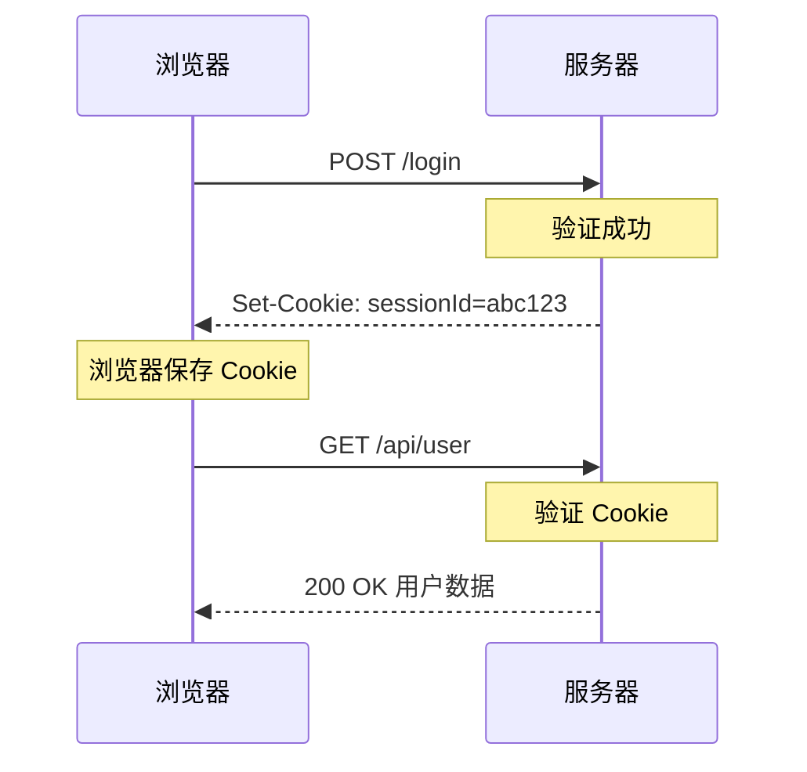
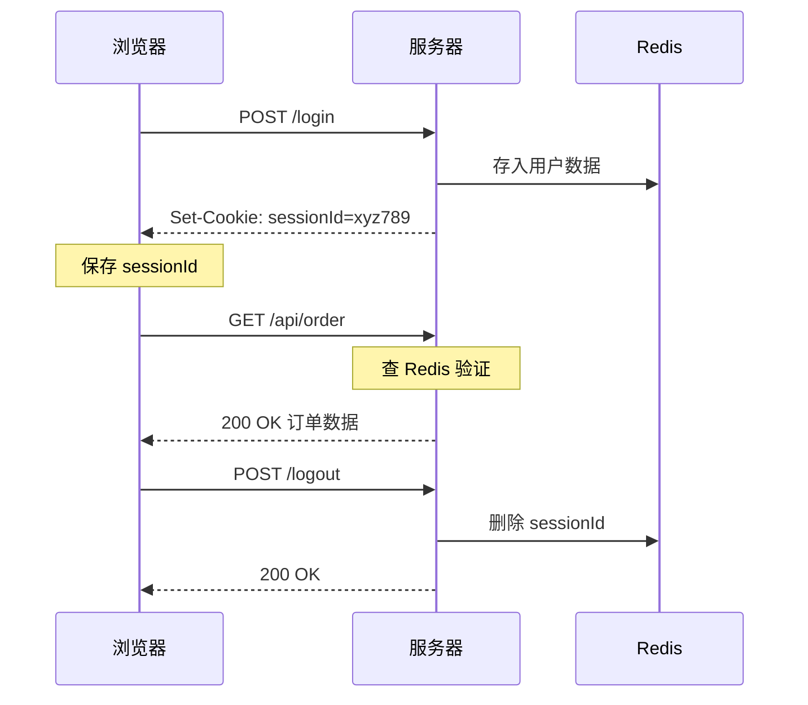

---

title: "HTTP无状态Cookie与Session"

created: "2025-07-12"

tags:

  - 八股文

  - 计算机网络

---


# HTTP无状态Cookie与Session

## 六、HTTP 无状态、Cookie、Session（必考题）


HTTP 最大的特点之一就是**无状态（Stateless）**——服务器不记得你是谁，每次请求对服务器来说都是一个"新朋友"。但这显然不现实——你登录淘宝后刷新页面，服务器肯定得记得你是谁。怎么做到的？Cookie 和 Session 就是解决方案。


### 1) 无状态：HTTP 的"脸盲症"


**一句话：HTTP 协议本身不会记录用户的任何信息，两次请求之间没有任何关联。**


就像你去一家只做外卖的餐厅——每次点餐老板都不记得你上次点了什么，你每次都得重新自我介绍："老板，我是刚才那个点宫保鸡丁的人，再来一份米饭。"


这显然不行。所以我们需要一套机制来**"在无状态的 HTTP 上加一层有状态的会话"**——这就是 Cookie 和 Session 的使命。


### 2) Cookie：客户端的小记事本


**本质：** Cookie 是服务器发送到浏览器并保存在本地的一小块文本数据（最大 4KB）。每次访问同域名时，浏览器会自动把它带上。


**工作流程：**





**Cookie 发送机制：**

1. 用户登录成功 → 服务器响应头 `Set-Cookie: token=abc123` 下发标识

2. 浏览器把这个键值对存在本地

3. 后续所有同域名的请求，浏览器**自动**在请求头带上 `Cookie: token=abc123`

4. 服务器读取 Cookie 识别用户身份


**Cookie 禁用后的兜底方案：** URL 重写——把身份参数拼在网址后面（`http://example.com/page?sessionId=abc123`）。但这种方式既丑又不安全（参数会暴露在 URL 里），现代项目基本不用。


### 3) Cookie 核心属性（必问）


每一个 Cookie 属性都在解决一个特定的安全问题或使用场景问题：


| 属性 | 作用 | 不设会怎样 | 通俗理解 |
| :--- | :--- | :--- | :--- |
| **Name/Value** | 键值对，存身份数据 | Cookie 不存在 | `token=abc123`，这是核心数据 |
| **Domain** | 控制哪些域名能携带此 Cookie | 默认当前域名（不含子域名） | `.baidu.com` 表示所有子域名都能用 |
| **Path** | 控制哪些路径能携带 | 默认当前路径 | `/admin` 表示只在管理页面携带 |
| **Expires** | 过期时间点（绝对时间） | 不设 = 会话 Cookie，关浏览器就消失 | `Expires=Wed, 09 Jun 2027 10:18:14 GMT` |
| **Max-Age** | 存活秒数（相对时间） | 优先用 Expires | `Max-Age=3600` 表示 1 小时后过期 |
| **HttpOnly** | JS 无法读取此 Cookie | JS 能通过 `document.cookie` 读取 | **防 XSS**：黑客注入脚本也偷不走登录凭证 |
| **Secure** | 仅 HTTPS 连接才发送 | HTTP 也发送 | **防中间人**：明文传输时不暴露 Cookie |
| **SameSite** | 限制跨站携带 | 默认 Lax（大多数现代浏览器） | **防 CSRF**：`Strict` 最严，`Lax` 折中，`None` 放开 |


**Expires vs Max-Age：** Max-Age 优先级更高（HTTP/1.1 引入），单位是秒。两者都不设 = 会话 Cookie（Session Cookie），浏览器关闭就自动清除。


#### 重点：HttpOnly 和 Secure 的区别（高频考点）


```text

场景：你的网站被 XSS 攻击，黑客注入了一段 JS 脚本。

```


- **HttpOnly = true**：JavaScript 的 `document.cookie` **读不到**这个 Cookie。黑客就算注入了恶意 JS 脚本，也拿不到你的登录凭证。**防 XSS（跨站脚本攻击）**。

- **Secure = true**：只有 HTTPS 加密连接才会发送这个 Cookie。如果你用 HTTP 访问，Cookie 根本不会被传输。**防中间人攻击**——就算有人在你家 Wi-Fi 上抓包，也看不到你的 Cookie。


**陷阱：** 这两个属性管的是**不同的攻击向量**——HttpOnly 不管传输安不安全，Secure 不管 JS 能不能读。都设上才是正确姿势。


#### SameSite 属性——防 CSRF


```text

场景：你登录了 bank.com，Cookie 里有你的登录凭证。

      你收到一封邮件，里面有 。

      浏览器加载这张"图片"时，会自动带上 bank.com 的 Cookie。

      银行以为是你本人在操作，钱就被转走了。

      这就是 CSRF（跨站请求伪造）攻击。

```


**SameSite 三种模式：**


| 值 | 行为 | 适用场景 |
| :--- | :--- | :--- |
| **Strict** | 完全禁止跨站携带 Cookie | 安全性最高，但用户从外部链接点进来会丢失登录态 |
| **Lax**（默认） | 允许顶级导航的 GET 请求携带（如点链接跳转） | 推荐：既防 CSRF，又不影响正常浏览体验 |
| **None** | 允许所有跨站请求携带 | 必须同时设 `Secure=true`，如嵌入第三方支付页面 |


### 4) Session：服务器端的"档案柜"


**本质：** Session 是服务器为了保存用户状态而创建的一种机制。服务器在内存/Redis/数据库里维护一个映射表：`sessionId → { userId, 权限, 登录时间... }`。


**工作流程：**





**通俗比喻：**

- Session = 酒店前台存你的身份证（服务器存数据），只给你一张房卡（sessionId）

- 每次你去餐厅吃饭（发请求），亮一下房卡（传 sessionId），服务员一查系统（Redis）："哦，303 房间的王先生，您的餐费可以挂房账"


**易错点：Session 不是不用 Cookie！**

绝大多数场景下，sessionId 靠 Cookie 传递（键名通常是 `JSESSIONID` 或自定义的 `sessionId`）。"Server 存 Session，Cookie 只是送 sessionId 的快递员"——没有快递员，房卡送不到你手上。


### 5) Cookie vs Session 对比


| 维度 | Cookie | Session |
| :--- | :--- | :--- |
| **存储位置** | 浏览器本地 | 服务器内存/Redis/DB |
| **安全性** | 低，数据在客户端易被篡改 | 高，敏感数据不暴露给客户端 |
| **容量** | 4KB（每个 Cookie） | 无限制（取决于服务器内存） |
| **服务器开销** | 无（客户端自己存） | 大，每个用户都占服务器内存 |
| **传输体积** | 每次请求自动携带，可能很大 | 只传简短 sessionId，体积极小 |
| **生命周期** | 可设长期（如"记住我"7 天） | 服务器可主动失效（强制下线） |
| **跨域** | 受同源策略限制 | 依赖 Cookie 传递，也受同源限制 |
| **分布式** | 天然支持 | 需要共享存储（Redis 集中存） |


### 6) Cookie vs Session vs Token（JWT）全方位对比


到了高阶阶段，会进一步追问："除了 Cookie + Session，你还知道什么方案？Token 有什么优势？"


| 对比维度 | Cookie | Session | Token (JWT) |
| :--- | :--- | :--- | :--- |
| 存储位置 | 客户端 | 服务端 | 客户端 |
| 状态性 | 无状态 | **有状态**（存数据） | **无状态**（自包含） |
| 服务器查库 | 无需 | 需要（Redis/DB） | 无需（验签就行） |
| 分布式友好 | ✅ | ❌（需共享 Session） | ✅（天然支持） |
| 移动端 | ❌ 不友好 | ❌ 不友好 | ✅ 友好 |
| 吊销 | 简单 | 简单 | 难（需黑名单） |
| 跨平台 | 浏览器专属 | 依赖 Cookie | 全平台通用 |


**Token (JWT) 是什么？**


JWT（JSON Web Token）= 一段包含用户信息、经过签名的字符串，结构是 `Header.Payload.Signature`。

- Header：`{"alg": "HS256", "typ": "JWT"}`

- Payload：`{"userId": 123, "role": "admin", "exp": 1753000000}`（Base64 编码，**不是加密，可以解码看内容！**）

- Signature：用密钥对 Header+Payload 签名，防篡改


**为什么 JWT 适合分布式？**

传统 Session 方案：用户登录在服务器 A → Session 存在 A 的内存 → 下次请求被负载均衡到服务器 B → B 没有这个 Session → 用户以为自己被踢了。解决方案是用 Redis 集中存 Session，但这增加了架构复杂度。


JWT 方案：用户登录拿到 Token → 请求到任意服务器 → 服务器只验证 Token 签名和过期时间 → 无需查任何存储 → 天然支持分布式。


**JWT 的弱点：**

- **签发后无法主动撤销**（不能"踢人下线"）——只能等过期或用黑名单机制

- **体积较大**（通常几百字节），每次请求都要传

- **Payload 只是 Base64 编码不是加密**——不要在 Payload 里放密码等敏感信息


### 7) 如何选择？实战建议


| 场景 | 推荐方案 |
| :--- | :--- |
| 传统单体应用、后台管理系统 | Cookie + Session（Redis 存 Session） |
| 前后端分离 SPA | JWT（存内存）+ Refresh Token（存 HttpOnly Cookie） |
| App / 小程序 | JWT（Bearer Token 放 Header） |
| 微服务架构 | JWT（无状态，服务间传递身份信息） |
| 需要"踢人下线"功能 | Session（服务器直接删）或 JWT + 黑名单 |
| SSO 单点登录 | JWT 或 CAS 等专门协议 |


---


## 速记卡（面试闪卡）


**Q1：一句话讲清「HTTP无状态Cookie与Session」到底是什么？**

A：Cookie 与 Session 是解决 HTTP 无状态、让服务器"记住"用户的两种会话机制。


**Q2：2) Cookie：客户端的小记事本 —— 怎么理解？**

A：Cookie（英文 Cookie）是服务器发给浏览器、存在本地的一小块文本（最大 4KB），之后同域名请求浏览器自动带上，像随身带的小记事本。登录后服务器下发 `Set-Cookie: sessionId=abc`，你之后每次请求都自动"亮一下"证明身份。禁用 Cookie 还能用 URL 重写兜底（但参数暴露在网址里不安全）。


**Q3：4) Session：服务器端的"档案柜" —— 怎么理解？**

A：Session（英文 Session）是服务器为保存用户状态建的映射表 `sessionId → {userId, 权限...}`，存在内存/Redis/DB，像酒店前台存你身份证、只给你房卡。易错点：Session 不是不用 Cookie！sessionId 多数靠 Cookie 传递（键名 JSESSIONID），Cookie 只是送房卡的快递员——没有它房卡送不到你手上。


**Q4：5) Cookie vs Session 对比 —— 怎么理解？**

A：核心差异：Cookie 存浏览器本地（4KB、易被改、不占服务器），Session 存服务器（安全、占内存）。传输上 Cookie 每次自动带、可能很大，Session 只传简短 sessionId。生命周期 Cookie 可长期（记住我 7 天），Session 服务器可主动失效（强制下线）。分布式下 Cookie 天然支持，Session 需 Redis 共享存储。


**Q5：6) Cookie vs Session vs Token（JWT）全方位对比 —— 怎么理解？**

A：再加 Token（JWT，JSON Web Token）：Cookie/Token 存客户端、Session 存服务端；Session 有状态（需查库）、Token 无状态（自包含、验签即可）、JWT 天然分布式友好。JWT 弱点：签发后难撤销（只能等过期或黑名单）、体积几百字节、Payload 只是 Base64 不是加密（别放密码）。实战：传统单体用 Session+Redis，前后端分离/移动端用 JWT。


**Q6：核心速记主线有哪些？**

- 无状态：HTTP 本身不记用户信息，两次请求无关联（脸盲症）

- Cookie 存客户端小记事本、自动携带；Session 存服务端档案柜、靠 Cookie 传 sessionId

- Cookie vs Session：位置/安全/容量/分布式差异

- Token(JWT) 无状态自包含、分布式友好，但难撤销、Payload 非加密


**口诀**

A：HTTP 脸盲不记事，Cookie 小本随身带；

Session 档案柜里存，房卡靠 Cookie 送过来；

对比看位置与安全，分布式要 Redis 共享；

JWT 自包含免查库，难撤销要记心怀。


## 相关链接


- [[25-Cookie与Session与Token认证三兄弟|Cookie与Session与Token]]

- [[10-HTTP状态码|HTTP状态码]]

- [[21-HTTP易错坑点|HTTP易错坑点]]

- 📋 目录：[[00-计算机网络]]

- 📚 学习清单：[[八股文学习路线图]]

