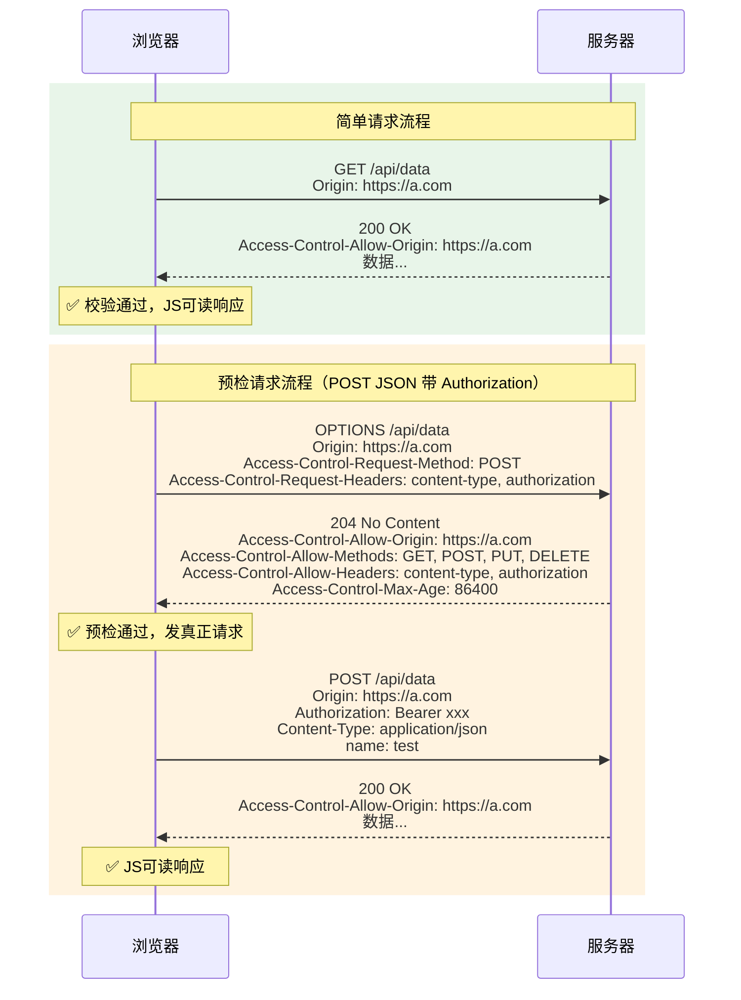

---

title: "跨域与CORS"

created: "2025-07-12"

tags:

  - 八股文

  - 计算机网络

---

# 跨域与CORS

## 八、跨域与 CORS（前端/全栈必考）


跨域，全栈开发的"新手梦魇"。几乎每个前端同学都见过那句红字：`has been blocked by CORS policy`。但是别慌，看完这篇，你可以把 CORS 当成你的仆人而不是你的敌人。


### 1) 什么是跨域——同源策略


浏览器的**同源策略（Same-Origin Policy）**：协议（scheme）、域名（host）、端口（port）三者必须**完全相同**，有一个不同就是跨域。


```text

https://www.example.com:443/path/page.html

^^^^^^  ^^^^^^^^^^^^^^^^^ ^^^

  协议         主机        端口

```


**同源判断速查表：**


| URL A | URL B | 结果 | 原因 |
| :--- | :--- | :--- | :--- |
| `http://a.com/page` | `http://a.com/api` | ✅ 同源 | 路径不同无所谓 |
| `http://a.com` | `https://a.com` | ❌ 跨域 | 协议不同 |
| `http://a.com` | `http://b.com` | ❌ 跨域 | 域名不同 |
| `http://a.com` | `http://a.com:8080` | ❌ 跨域 | 端口不同 |
| `http://www.a.com` | `http://api.a.com` | ❌ 跨域 | 子域名不同也算不同域名 |
| `http://192.168.1.1` | `http://a.com` | ❌ 跨域 | IP 和域名指向同一台机器也跨 |


**通俗理解：** 同源策略就像小区的门禁卡——a.com 小区发的卡，不能刷开 b.com 小区的门。协议是进小区的方式（走路还是开车），域名是小区地址，端口是小区的具体楼栋。三者都对上才放你进去。


### 2) 为什么有同源策略


**一句话：防止恶意网站偷你的数据。**


没有同源策略的世界有多可怕：

1. 你登录了银行网站 `bank.com`，Cookie 里存着你的登录凭证

2. 你顺手点开一个钓鱼网站 `evil.com`

3. `evil.com` 悄悄用 JavaScript 发请求到 `bank.com/api/account`

4. 因为 Cookie 会自动带上，`bank.com` 以为是你自己在操作

5. 你的余额、交易记录全被 `evil.com` 读走了


同源策略的作用就是：**让 evil.com 上的 JS 无法读取 bank.com 返回的数据**。它限制的是三个层面：

- **DOM 访问**：不同源的页面不能通过 JS 互相操作 DOM

- **Web 数据**：XHR/Fetch 请求不能读取不同源的响应

- **网络通信**：浏览器阻止非同源的 AJAX 请求


### 3) 核心误区：请求发出去了吗？


**一个很多人搞错的点：跨域时，请求其实发出去了，服务器也处理了、返回了数据。浏览器只是不给你的 JS 读响应。**


浏览器不是"防火墙"，它拦不住网络请求发出去。它只是一个"门卫"：

- 请求：发出去，服务器收到，处理，返回

- 响应回来：门卫看一眼，"你不是同源的，这包数据不能给你"

- 你看到的报错：就是门卫把响应数据扣下了


**铁律：同源策略/CORS 只控制一件事——响应回来后，浏览器要不要把数据交给前端 JS。不是请求被拦截，是响应不给用。**


### 4) CORS：合法跨域的通行证


CORS（Cross-Origin Resource Sharing，跨域资源共享）不是什么安全机制，它是**对同源策略的"放松"**。服务器主动告诉浏览器："我允许哪些外域来访问我"。


核心就是服务器在响应头里加一个字段：


```http

Access-Control-Allow-Origin: https://example.com

# 或者允许所有（不能用 * 的时候带上 credentials）

Access-Control-Allow-Origin: *

```


### 5) 简单请求 vs 预检请求


浏览器会根据请求特征，自动判断走"简单"还是"预检"路线。


#### 简单请求（Simple Request）


**满足以下全部条件，才是简单请求：**


| 条件 | 要求 |
| :--- | :--- |
| 方法 | 仅限 `GET`、`HEAD`、`POST` |
| Content-Type | 仅限 `application/x-www-form-urlencoded`、`multipart/form-data`、`text/plain` |
| 请求头 | 只包含浏览器默认允许的头，无自定义头（如 `Authorization`、`X-Token` 等） |
| 其他 | 没用 `ReadableStream`、没注册 `XMLHttpRequest.upload` 事件监听 |


**简单请求流程：** 直接发请求，浏览器自动加 `Origin` 头 → 服务器返回 `Access-Control-Allow-Origin` → 浏览器校验通过 → JS 能读响应。


#### 预检请求（Preflight Request）


**只要不满足简单请求的任一条件，浏览器会先发 OPTIONS 请求"探路"，批准后才发真正的请求。**


**触发预检的常见场景（你项目里基本都会踩）：**


| 场景 | 举例 | 会预检吗 |
| :--- | :--- | :---: |
| POST 发 JSON | `Content-Type: application/json` | ✅ 会 |
| 带 Authorization | `Authorization: Bearer xxx` | ✅ 会 |
| 自定义 Header | `X-Request-Id: 12345` | ✅ 会 |
| 非简单方法 | PUT、DELETE、PATCH | ✅ 会 |


**重要陷阱：** POST 不一定是简单请求！最爱问这个——如果你 POST 的数据是 `Content-Type: application/json`（现代 API 最常见的写法），就会触发预检。





### 6) 常见 CORS 响应头速查


| 响应头 | 作用 | 示例 |
| :--- | :--- | :--- |
| `Access-Control-Allow-Origin` | 允许的域名 | `https://example.com` 或 `*` |
| `Access-Control-Allow-Methods` | 允许的方法 | `GET, POST, PUT, DELETE` |
| `Access-Control-Allow-Headers` | 允许的请求头 | `Content-Type, Authorization` |
| `Access-Control-Allow-Credentials` | 是否允许携带 Cookie | `true` |
| `Access-Control-Max-Age` | 预检结果缓存时间（秒） | `86400`（24小时） |
| `Access-Control-Expose-Headers` | 允许 JS 读取的响应头 | `X-Total-Count, Link` |


### 7) CORS 常见坑点（排障必问）


**坑 1：`allowCredentials=true` 时，`Allow-Origin` 不能是 `*`**


```http

# ❌ 浏览器会拒绝

Access-Control-Allow-Origin: *

Access-Control-Allow-Credentials: true


# ✅ 必须用具体的源

Access-Control-Allow-Origin: http://localhost:3000

Access-Control-Allow-Credentials: true

```


**坑 2：带 Cookie 需要"三件套"**

- 后端：`Access-Control-Allow-Credentials: true`

- 前端：`fetch(url, { credentials: 'include' })` 或 axios 的 `withCredentials: true`

- Cookie 本身：`SameSite` 属性不能是 `Strict`（跨站 Cookie 现代浏览器限制更严）


**坑 3：预检失败最常见的原因**

- 后端没处理 OPTIONS 请求（很多框架默认不处理）

- `Access-Control-Allow-Headers` 没包含 `Authorization` 或自定义头

- `Access-Control-Allow-Methods` 没包含 PUT/DELETE

- 网关（Nginx）把 CORS 头吞了——后端确实返回了，但浏览器看不到


### 8) 解决跨域的方案


| 方案 | 原理 | 适用场景 |
| :--- | :--- | :--- |
| **CORS 后端配置** | 服务器加 `Access-Control-Allow-*` 响应头 | 前后端分离、微服务（最推荐） |
| **JSONP** | 利用 `<script>` 标签不受同源限制，通过回调函数获取数据 | 只支持 GET，老旧方案，基本不推荐 |
| **Nginx 反向代理** | 让浏览器请求同源的前端域名，Nginx 转发到后端 | 生产环境最常用 |
| **Webpack DevServer Proxy** | 开发环境代理到后端 | 本地开发 |


**Nginx 反向代理示例（最实用的生产方案）：**


```nginx

server {

    listen 80;

    server_name www.example.com;


    # 前端静态资源

    location / {

        root /usr/share/nginx/html;

        index index.html;

        try_files $uri $uri/ /index.html;

    }


    # API 代理到后端

    location /api/ {

        proxy_pass http://backend-server:8080/;

        proxy_set_header Host $host;

        proxy_set_header X-Real-IP $remote_addr;

    }

}

```


核心思想：前端和 API 都用 `www.example.com` 这个域名，对浏览器来说就是同源，压根不存在跨域问题。


---


## 速记卡（面试闪卡）


**Q1：一句话讲清「跨域与CORS」到底是什么？**

A：跨域是浏览器同源策略限制不同源页面互读数据，CORS 是服务器放松该限制、放行特定外域的合法机制。


**Q2：八、跨域与 CORS（前端/全栈必考） —— 怎么理解？**

A：像小区门禁：协议、域名、端口三者任一不同即跨域。同源策略防恶意网站偷你数据（如 evil.com 读 bank.com 的响应），它限制的是“响应能否交给前端 JS”。Same-Origin Policy（同源策略）。


**Q3：同源策略与跨域判断 —— 怎么理解？**

A：像三把锁全对才进：协议（http/https）、主机（域名）、端口三者完全一致才同源，路径不同无所谓，子域名/IP 不同都算跨。核心铁律——请求照发、服务器照处理，只是浏览器扣下响应不给 JS。Origin（源）。


**Q4：简单请求与预检请求 —— 怎么理解？**

A：像免检与报关：简单请求（GET/HEAD/POST+表单类 Content-Type+无自定义头）直接发，带 CORS 头即过；带 Authorization、自定义头或非简单方法会先发 OPTIONS 预检，批准才发真请求。Preflight（预检请求）。


**Q5：CORS 解决跨域的方案 —— 怎么理解？**

A：像多种通关方式：后端加 Access-Control-Allow-* 头（最推荐）、JSONP（仅 GET 老旧）、Nginx 反向代理（生产常用，让前后端同域）、DevServer 代理（本地开发）。CORS（跨域资源共享）。


**Q6：核心速记主线有哪些？**

- 跨域：同源策略限制，协议域名端口任一不同即跨

- 误区：请求照发服务器照处理，浏览器只扣响应

- 请求：简单请求直发，带授权/自定义头触发预检

- 方案：CORS 头、JSONP、Nginx 代理、DevServer 代理


**口诀**

A：同源三锁协议域端口，一个不同就跨域

请求照发服务器应，浏览器只扣响应去

带 Authorization 头，预检 OPTIONS 先问起

CORS 头 Nginx 代理，跨域通关多套棋


## 相关链接


- [[24-同源策略|同源策略]]

- [[26-CORS跨域资源共享|CORS跨域资源共享]]

- [[33-五种跨域解决方案|五种跨域解决方案]]

- 📋 目录：[[00-计算机网络]]

- 📚 学习清单：[[八股文学习路线图]]

