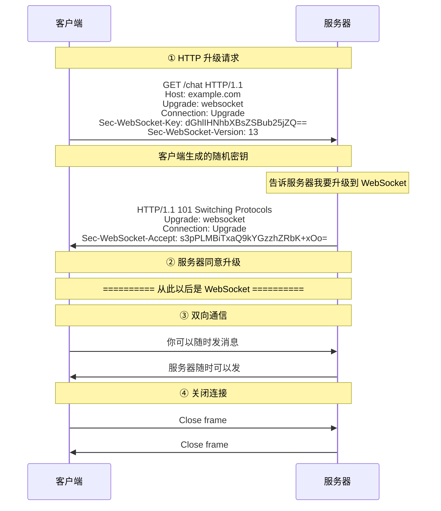
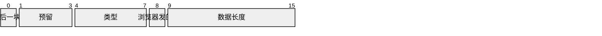
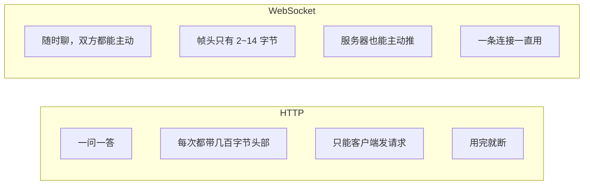

---

title: "WebSocket 全双工通信"

created: "2025-07-12"

tags:

  - 八股文

  - 计算机网络

---

# WebSocket 全双工通信

## 一句话总结

> **WebSocket 就是 HTTP 升级成的"长连接管道"——建立连接后，服务器和浏览器随时可以给对方发消息，不用像 HTTP 那样一问一答来回折腾。**

---

## 🌰 先搞懂"为什么需要 WebSocket"

HTTP 的工作方式：

你打开一个网页，网页里有个股票价格。

HTTP 只能：你问 → 服务器答。

要显示实时价格怎么办？

**方案一：轮询（Polling）**

- 浏览器每隔 1 秒发一次 HTTP 请求："现在股价多少？"

- 服务器返回："100 块"

- 1 秒后又问："现在股价多少？" → 服务器返回："101 块"

- 问题：大部分请求是浪费的（价格又没变）。而且 1 秒的延迟对于实时数据已经很慢了。

**方案二：长轮询（Long Polling）**

- 浏览器发请求："股价变了告诉我"

- 服务器不马上返回，一直等着。价格变了 → 才返回。

- 浏览器收到后立刻发下一个请求。

- 比轮询好一点，但每次还要新建 HTTP 连接，还是要发 HTTP 头部（几百字节的"废话"）。

都不好。

> **像什么？**

> - 轮询 = 你每隔 1 分钟打电话给奶茶店："奶茶好了没？" 一直问，问到好了为止。中间的大部分电话都是废话。

> - WebSocket = 你坐在店里，店员做好了直接喊你。"你的奶茶好了！" 你坐着等就行，不用反复问。店员做好也能叫你。你也能随时喊："再加一杯！"

---

## 二、WebSocket 是什么

WebSocket 是建立在 TCP 之上的全双工通信协议。

**什么叫全双工？**

- 双方可以同时发送数据

- 不像 HTTP 的半双工：你发一句我回一句，不能同时说

- 更不是单工：只能一方说一方听（收音机）

**全双工的例子：**

实时语音通话，你说话的同时也能听到对方说话。

WebSocket 就是这个道理，浏览器和服务器能同时发消息。

**WebSocket 和 HTTP 的关系：**

- 连接是用 HTTP 升级过来的（这一下是 HTTP）

- 升级成功后就不再用 HTTP 了（后面全是 WebSocket）

- 一个连接，一直用，随时发。不需要反复建连接

---

## 三、WebSocket 连接建立过程

**关键点：**

升级请求：看起来就是一个普通的 HTTP GET 请求。

区别是有 `Upgrade: websocket` 头部。

**Sec-WebSocket-Key / Accept = 对暗号**

你要加入一个秘密社团，社团的接头暗号有两种卡片。

- **第一张卡是你要发的**——上面写着一串随机数。这就是 `Sec-WebSocket-Key`。客户端生成一长串随机 Base64 字符串。

- **第二张卡是接头人回的**——他拿到你的随机数，加上只有真社团才知道的一句话，算出另一串数字给你。这就是 `Sec-WebSocket-Accept`。服务器把 Key 加上固定字符串（`258EAFA5-E914-47DA-95CA-C5AB0DC85B11`，这是 RFC 6455 规定的公开常量），做 SHA-1 哈希，再 Base64 编码。

关键：中间如果有假接头人（缓存代理服务器），他算不出只有真社团才知道的那句话。他发回来的 Accept 就是错的。浏览器一验证不对，就知道对面是假服务器，立刻拒绝。

> Key/Accept 不是为了加密。只是为了确保对面真的是懂 WebSocket 的服务器，不是缓存代理在乱回。之后真正的数据加密，靠的是 HTTPS（wss://）那一层的 TLS 加密。

**101 状态码：**

只有 WebSocket 升级响应用这个状态码。表示"协议切换"。

**之后：**

HTTP 连接已经升级成 WebSocket 连接。双方通过这个 TCP 连接直接收发 WebSocket 帧。不再有 HTTP 头部（省了很多带宽）。

---

## 四、WebSocket 的数据帧结构
### 什么是"帧"

WebSocket 不直接传原始数据，而是把数据装进一个一个的"帧"里。

帧 = 一个包装盒子。盒子上贴着标签（帧头），里面装着真正的数据（payload）。

> **就像你寄快递：**

> 你寄的不是光溜溜的东西，而是放进纸箱（帧）里。

> 纸箱上贴着快递单（帧头）：

> - "里面是啥？" → 文本还是图片

> - "多重？" → 数据长度

> - "这箱是不是最后一箱？" → 大数据拆成多箱，这是不是最后一箱

> - "谁发的？" → 浏览器发的还是服务器发的（影响要不要掩码）

>

> 有了包装，接收方就不用猜了。

> 来了一个帧，先看帧头，就知道怎么处理，不用等全部收完。

### 帧头（快递单）长什么样

帧头只占据 2～14 字节（取决于数据大小）。相比 HTTP 头部动不动几百字节，非常轻量。

字段解释：

| 字段 | 位 | 意思 |

| --- | --- | --- |

| FIN | 1 bit | **这块数据是不是最后一块？** 大数据拆成多帧时，最后一块 FIN=1，前面的 FIN=0 |

| RSV | 3 bits | 预留位，平时全是 0。扩展协议时用（比如 WebSocket 压缩） |

| Opcode | 4 bits | **里面是什么？** 1 = 文本，2 = 二进制，8 = 关闭连接，9 = Ping，A = Pong |

| MASK | 1 bit | **这是浏览器发的吗？** 浏览器→服务器必须=1，服务器→浏览器=0 |

| Pay Len | 7 bits | 数据有多长？如果数据 > 125 字节，这个字段只告诉你"去查下一段" |

那 7 位（最大 127）不够怎么办？

数据大小有三种情况：

| 数据大小 | 帧头 | 说明 |

| :--- | :---: | :--- |

| ≤ 125 字节 | 2 字节 | 数据直接跟在帧头后面 |

| 126～65535 字节（小图） | 4 字节 | Pay Len 写 126，后面还有 2 字节专门写长度 |

| 65536～2^63 字节（大文件） | 10 字节 | Pay Len 写 127，后面还有 8 字节专门写长度 |

> **像什么？** 寄快递时：小东西 → 直接贴一张快递单（2 字节帧头）。大箱子 → 快递单上写"见附加单"，再加贴一张。超大箱子 → 再加更长的附加单。

### 为什么浏览器发的数据要"掩码"（MASK=1）

MASK 位 = 1，表示这个数据被"混淆"过。

**混淆规则：**

- 浏览器在帧头里带上一段 4 字节的"掩码密钥"

- 数据在发送前，跟掩码密钥做一次 XOR 运算

- 服务器收到后，用同样的掩码密钥做一次 XOR，还原原始数据

**问题是：为什么浏览器发的数据要混淆，服务器发的不用？**

故事：2008 年左右，有个安全漏洞。你打开了一个恶意网页。这个网页的 JavaScript 给 WebSocket 服务器发了一个请求。但请求的数据被中间缓存代理看到了。这个缓存代理以为数据是一个 HTTP 响应（因为数据碰巧长得像 HTTP 头）。缓存代理把数据缓存起来了。之后其他用户访问同一个网站 → 拿到了这个"假响应"（缓存中毒）。

**解决方案就是掩码：**

- 浏览器发出的所有数据都先做 XOR 混淆

- 中间人看到的是乱码，不可能冒充 HTTP 响应

- 服务器有掩码密钥，能还原

- 缓存代理没法"碰巧看懂"了

所以 MASK=1 是"我来自浏览器"的标记。目的是保护中间缓存不被污染。不是为了加密（加密靠 TLS）。

### 再说 Opcode：为什么分文本和二进制？

计算机只能用二进制（0101），但 WebSocket 让你选择"我怎么理解这些数据"。

**文本帧（opcode = 0x1）：**

- 数据是 UTF-8 编码的字符串

- WebSocket 会自动帮你解码成文字

- 你收到的是可以直接读的"你好"

**二进制帧（opcode = 0x2）：**

- 数据是原始字节流

- WebSocket 不做任何解码

- 你收到的是 0101...，你自己决定怎么解析（图片、文件、ProtoBuf）

**区别：**

- 文本帧 = 对方告诉你"这是中文，已经翻译好了"

- 二进制帧 = 对方给你一堆原材料，你自己加工

实际使用中，聊天消息用文本帧（JSON），文件传输用二进制帧。

---

## 五、WebSocket 和 HTTP 的区别

---

## 六、WebSocket 的保活（心跳）

WebSocket 是长连接。长连接有个问题：连接可能被中间路由或防火墙断开。（你那边觉得还连着，实际上中间断了。）

怎么确认连接还活着？使用 **Ping / Pong 帧**。

浏览器或服务器发送 Ping 帧。对方收到后回复 Pong 帧。

> **像什么？** 你和朋友隔着墙聊天。你每隔一段时间喊一声"还在吗？"朋友回"在呢！"如果喊了没回应 → 要么朋友走了，要么墙倒了。

一般服务器每隔一段时间发送 Ping。一段时间内没收到 Pong → 判定连接断开 → 清理资源。客户端超时没收到 Pong → 认为网络出了问题 → 可以自动重连。

---

## 七、实际开发中需要注意的点
### 断线重连

WebSocket 连接会因为网络波动、服务器重启等原因断开。不处理断线的话，用户看起来"网页没反应了"。

**常见做法：**

- 浏览器端检测到 `onclose` 或 `onerror` 事件

- 等待 1 秒 → 重新连接

- 连续失败 → 等待时间加倍（指数退避）

- 最多重试 N 次 → 提示用户"网络异常"

### 心跳保活

如上一条所说。一般服务器 30 秒发一次 Ping。客户端 10 秒没收到 Pong → 判定断开 → 重连。

### 数据和业务层

WebSocket 只提供"数据通道"。它不关心你传输的是什么格式。

所以业务上需要自己定义协议：

- 每条消息的格式是什么？

- JSON 还是二进制？

- 消息类型（登录、聊天、心跳、通知等）怎么区分？

比如：`{ "type": "chat", "from": "user1", "content": "你好" }`

服务端根据 `type` 字段判断怎么处理。

---

## 八、实际应用场景

**实时聊天**

- 微信、Slack 等即时通讯。消息来了服务器直接推

- 不需要用户刷新页面才能看到新消息

**实时通知**

- 邮箱新邮件通知、系统告警

- 服务器一有事件就推给浏览器

**协同编辑**

- 多人同时编辑一个文档

- A 改了内容 → WebSocket 推给 B 和 C，B 和 C 的页面实时更新

**实时行情**

- 股票、加密货币价格

- 每秒推送几十次价格变化，HTTP 轮询做不到这种频率

**在线游戏**

- 回合制或实时对战

- 服务器推对手的操作，你推自己的操作给服务器

---

## 九、和 SSE（Server-Sent Events）的区别

实践中可能会被问到。

**SSE：**

- 也是 HTTP 上的长连接

- 但是单工的——只能服务器给浏览器发消息，浏览器不能发

- 比 WebSocket 简单，不需要升级协议，就是普通 HTTP 响应

- 浏览器自带 EventSource API

- 适合：服务器单向推送（消息通知、日志流）

**WebSocket：**

- 全双工。浏览器和服务器都能主动发

- 适合：需要双向通信的场景（聊天、游戏）

**怎么选：**

- 只需要服务器推 → SSE 就够了，简单

- 需要双向通信 → WebSocket

---

## 一句话讲清

> **延伸提问："WebSocket 和 HTTP 有什么区别？"**

>

> "HTTP 是半双工的，一问一答。要实现实时数据要么轮询（浪费请求）要么长轮询（延迟高）。

>

> WebSocket 是全双工的，建立连接后双方随时可以发消息。连接是通过 HTTP 升级上来的（101 Switching Protocols），升级后就不再是 HTTP 了，走 WebSocket 自己的二进制帧格式。

>

> WebSocket 的优势是：建立一次连接，一直用，省去了反复建连的开销。服务器可以主动推数据，不需要客户端去轮询。头部信息少（只有几十字节的帧头），省带宽。"

>

> **延伸提问："WebSocket 的连接怎么建立的？"**

>

> "通过 HTTP Upgrade 机制。客户端发一个 GET 请求，头部带上 Upgrade: websocket 和 Sec-WebSocket-Key（客户端生成的随机密钥）。服务器回复 101 Switching Protocols，并在 Sec-WebSocket-Accept 返回对密钥计算的哈希值。客户端验证哈希值，确认是真正的 WebSocket 服务器。之后连接升级完成，进入 WebSocket 协议通信。"

---

## 记忆口诀

> **WebSocket = HTTP 升级成的全双工长连接管道。双方随时发，服务器也能主动推。**

> **连接过程：HTTP 升级请求 → 101 Switching Protocols → 一直通信。**

> **帧类型记住三个：文本帧（传 JSON）、二进制帧（传文件）、Ping/Pong（保活心跳）。**

> **客户端发数据必须掩码（防缓存攻击），服务器发数据不用掩码。**

> **需要断线重连和心跳保活，不然连接断了你不知道。SSE 是阉割版的 WebSocket，只能服务器推。**

## 速记卡（面试闪卡）

**Q1：一句话讲清「WebSocket 全双工通信」到底是什么？**

A：WebSocket 是建立在 TCP 之上的全双工长连接协议，连接后双方随时互发消息，专为实时通信而生。

**Q2：一句话总结 —— 怎么理解？**

A：像升级成长久热线：WebSocket（全双工通信协议）是 HTTP 升级成的长连接管道，建立后服务器和浏览器随时互发，不像 HTTP 一问一答来回折腾。

**Q3：🌰 先搞懂"为什么需要 WebSocket" —— 怎么理解？**

A：像坐店里等奶茶 vs 每分钟打电话问：轮询（Polling）反复问"好了没"全是废话；长轮询（Long Polling）稍好但仍要重建连接。WebSocket 让店员做好了直接喊你，双向零废话。

**Q4：二、WebSocket 是什么 —— 怎么理解？**

A：像一条双向高速公路：WebSocket 是全双工（Full-duplex，双方同时说），建立在 TCP 之上；连接由一次 HTTP 升级而来，升级后不再是 HTTP，不再带几百字节头部。

**Q5：三、WebSocket 连接建立过程 —— 怎么理解？**

A：像秘密社团对暗号：客户端发带 Upgrade: websocket 和 Sec-WebSocket-Key 的 HTTP 请求，服务器回 101 Switching Protocols 和用 RFC6455 常量算出的 Sec-WebSocket-Accept，验明正身后才升级。

**Q6：核心速记主线有哪些？**

- WebSocket 是全双工长连接，建立在 TCP 之上，解决实时通信（聊天、协同、游戏）

- 靠 HTTP Upgrade 握手：ClientHello 到 101 Switching Protocols 再转 WebSocket 帧

- Sec-WebSocket-Key 与 Accept 是验明正身的对暗号，不为加密（真加密靠 wss 的 TLS）

- 数据装进帧（Frame）传输，客户端发必须掩码防缓存攻击，Ping 与 Pong 做心跳保活

**口诀**

A：HTTP 一问一答烦，升级 101 换长管

全双工两边都能说，轮询废话靠边站

Key Accept 对暗号，验明正身防假站

数据装帧像快递，真加密靠 wss 伞

## 相关链接

- 📋 目录：[[00-计算机网络]]

- 📚 学习清单：[[八股文学习路线图]]

- 🔗 [[32-SSE服务器推送|SSE服务器推送]] — WebSocket vs SSE 全双工与单工对比

- 🔗 [[16-长连接与短连接与流水线|长连接与短连接]] — WebSocket 是一种持久连接方案

- 🔗 HTTP版本演进 — WebSocket 与 HTTP 协议的关系

