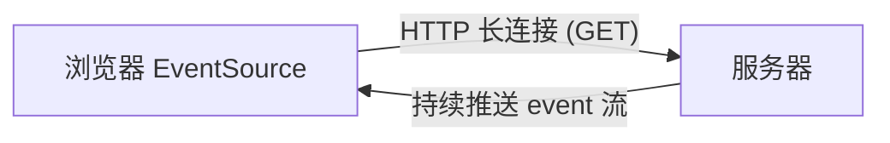
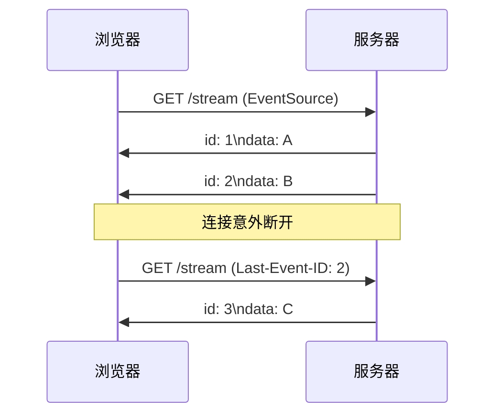

---

title: "SSE 服务器推送"

created: "2026-07-20"

tags:

  - 八股文

  - 计算机网络

---


# SSE 服务器推送

## 一句话总结


> **SSE（Server-Sent Events）= 服务器通过一条普通的 HTTP 长连接，单向、持续地把数据"推"给浏览器。浏览器只收，不主动发。**


---


## 一、SSE 是什么


- 基于 **HTTP** 的单向通信技术：只能 **服务器 → 浏览器**。

- 使用 `text/event-stream` 媒体类型，数据以纯文本流形式持续发送。

- 浏览器原生提供 **EventSource** API，几行代码就能用，无需手动解析帧。





> 像什么？你订了报纸，邮局每天把新报纸塞进你家信箱（单向），你不用每次都跑去邮局问"有新报纸吗"。


---


## 二、基本用法（浏览器侧）


```javascript

const es = new EventSource("/api/stream");

es.onmessage = (e) => {

  console.log("收到消息:", e.data);

};

es.addEventListener("custom", (e) => {

  console.log("自定义事件:", e.data);

});

```


服务器每发一段，格式形如（`\n\n` 表示一条 event 结束）：


```text

data: 第一条消息\n\n

event: custom\ndata: 自定义内容\n\n

```


---


## 三、断线重连（SSE 的强项）


SSE 自带 **自动重连** 机制，这是它相比裸 WebSocket 的一大优势：


- 连接断开后，浏览器 **自动重新发起** EventSource 连接，无需手写重连逻辑。

- 服务器可发送 `id: <序号>` 字段标记每条消息。

- 重连时浏览器自动带上 **`Last-Event-ID`** 请求头，服务器可据此 **断点续传**，只补发丢失之后的消息。





---


## 四、常问：SSE vs WebSocket


| 维度 | SSE | WebSocket |

| :--- | :--- | :--- |

| 通信方向 | 单向（服务器→浏览器） | 全双工（双向） |

| 底层协议 | 普通 HTTP（长连接） | HTTP 升级（101）后独立帧协议 |

| 浏览器 API | 原生 EventSource | 需手写或库（如 ws） |

| 断线重连 | **内置自动重连 + Last-Event-ID** | 需手写指数退避重连 |

| 数据格式 | 文本流（text/event-stream） | 文本帧 / 二进制帧 |

| 适用场景 | 消息通知、日志流、行情推送 | 聊天、协同编辑、游戏 |


> **怎么选**：只需要服务器推 → SSE 更简单（自带重连）；需要双向通信 → WebSocket。


---


## 速记卡（面试闪卡）


**Q1：一句话讲清「SSE 服务器推送」到底是什么？**

A：SSE 是基于 HTTP 长连接的单向服务器推送技术，浏览器原生 EventSource 接收，自带断线重连。


**Q2：一、SSE 是什么 —— 怎么理解？**

A：SSE（Server-Sent Events，服务器发送事件）只能服务器→浏览器单向推，数据用 text/event-stream 纯文本流。浏览器原生 EventSource API 几行就能用，不用手写解析帧。像订报纸塞信箱，你只收不问。


**Q3：二、基本用法（浏览器侧） —— 怎么理解？**

A：浏览器 `new EventSource('/api/stream')`，onmessage 收默认事件，addEventListener 收自定义事件。服务器每段以 `\n\n` 两个换行结束一条；可带 `event:` 类型字段。纯文本流与 HTTP 生态完全兼容，能走代理和 CDN。


**Q4：三、断线重连（SSE 的强项） —— 怎么理解？**

A：SSE 最大优势：连接断了浏览器自动重连，不用手写。服务器给每条消息发 `id:` 序号；重连时浏览器自动带 Last-Event-ID 头，服务器据此断点续传只补丢失之后的，不重复。WebSocket 得自己写指数退避。


**Q5：四、常问：SSE vs WebSocket —— 怎么理解？**

A：SSE 单向、普通 HTTP 长连接、原生 EventSource、内置重连；WebSocket 全双工、需 101 升级成独立帧协议、要手写库、重连自写。选型：只需服务器推→SSE 简单；需双向→WebSocket。


**Q6：核心速记主线有哪些？**

- SSE 单向 HTTP 长连接推送，原生 EventSource

- 数据 `\n\n` 分隔，text/event-stream 文本流

- 自动重连 + id/Last-Event-ID 断点续传

- 对比 WebSocket：单向 vs 全双工、内置重连 vs 手写


**口诀**

A：SSE 单向只收话，

EventSource 原生佳；

\n\n 分条 id 记，

断线自连续前缘。


## 相关链接


- 📋 目录：[[00-计算机网络]]

- 📚 学习清单：[[八股文学习路线图]]

- 🔗 [[31-WebSocket全双工通信|WebSocket]] — SSE 是"阉割版"的单向推送，WebSocket 是双向

- 🔗 [[14-浏览器输入URL到页面展示|URL到页面展示]] — 推送场景的网络基础

- 🔗 HTTP版本演进 — SSE 基于 HTTP/1.1 长连接

