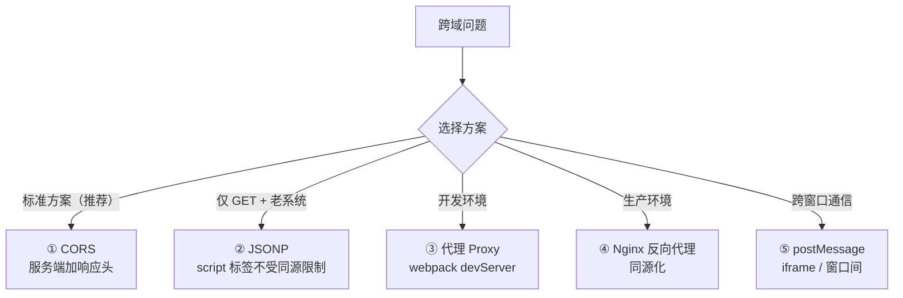

# 工程上五种跨域解决方案
## 第三章：工程上五种跨域解决方案

#### 五种方案决策图



### 3.1 方案一：CORS（配响应头）——最标准的做法

**适用场景：** 你控制了后端代码，可以加 CORS 响应头
**优点：** 标准方案，浏览器原生支持，安全可控
**缺点：** 需要改后端；多环境（dev/staging/prod）需要维护多个域名白名单

**实现：** 见上面 2.5 的代码。
**一句话讲清：**"生产环境用白名单校验 Origin——不能直接把请求里的 Origin 反射回去，那样等于允许所有来源。"

### 3.2 方案二：JSONP（仅 GET，考古级方案）

**核心原理：** `<script>` 标签不受同源策略限制。利用这个特性——把数据包在函数调用里返回，前端提前定义好这个函数。

##### 前后端代码——看一次就知道为什么没人用了

**前端：**
```html
<script>
  function handleData(data) {     // ← 提前定义好回调函数
    console.log(data);
  }
</script>
<script src="http://api.example.com/data?callback=handleData"></script>
<!-- 这个 script 标签加载的"JS 文件"实际上是后端返回的 JSON 包裹在函数调用里 -->
```

**后端返回的不是 JSON，是一段"看起来像 JS 调用"的文本：**
```javascript
handleData({"name": "张三", "age": 22})
```
→ 浏览器把它当 JS 执行 → 调用了 handleData 函数 → 数据拿到了！

这就是 JSONP = JSON with Padding（用函数调用把 JSON "包"起来）。

**优缺点：**
- ✅ 兼容性好——IE6 都能用
- ❌ 只支持 GET——POST/PUT/DELETE 全做不了
- ❌ 不安全——后端完全信任前端传的函数名，容易被注入
- ❌ 错误处理困难——script 加载失败只能靠超时兜底
- ❌ 2025 年了，别用了。提一句"过时方案，仅作了解"就行。

### 3.3 方案三：Vite/Webpack 开发代理（本地开发首选）

**适用场景：** 本地开发时前端跑在 localhost:3000，后端跑在 localhost:8000
**原理：** 开发服务器在中间拦截请求→转发到后端→拿回响应→加上正确的 Origin 返回给浏览器。整个过程中，浏览器以为自己一直在和 localhost:3000 通信（同源！）

##### Vite 配置（vite.config.ts）

```typescript
export default defineConfig({
  server: {
    proxy: {
      '/api': {
        target: 'http://localhost:8000',   // 后端地址
        changeOrigin: true,                // 改 Origin 头为后端地址
        rewrite: (path) => path.replace(/^\/api/, ''),  // /api/users → /users
      }
    }
  }
});
```

→ 前端代码写 `axios.get('/api/users')`（不写域名！因为同源）
→ Vite 开发服务器拦截 /api 开头的请求 → 转发到 http://localhost:8000
→ 浏览器看到的是同源请求 → 不存在跨域！

> **类比——代购：**
> 你想买日本的东西 → 日本店铺不寄中国（跨域限制）
> 你找代购（开发代理）→ 代购在日本帮你买（服务器间通信没有跨域）
> → 代购寄给你 → 你收到包裹，发货地址是代购的国内地址（对你来说这是同源）

### 3.4 方案四：Nginx 反向代理（生产环境首选）

**适用场景：** 生产环境——前端 React/Vue build 产物 + 后端 API 部署在同一台机器
**原理：** Nginx 把前端静态文件和后端 API 都挂在同一个域名下。用户浏览器只看到一个域名 → 根本不存在跨域！

##### Nginx 配置

```nginx
server {
    listen 80;
    server_name app.example.com;       # 只有一个域名

    # 前端静态文件
    location / {
        root /var/www/frontend/dist;
        try_files $uri /index.html;    # SPA 路由 fallback
    }

    # 后端 API——用 /api 前缀区分
    location /api/ {
        proxy_pass http://127.0.0.1:8000;   # 反向代理到后端
        proxy_set_header Host $host;
        proxy_set_header X-Real-IP $remote_addr;
    }
}
```

→ 用户访问 `http://app.example.com` → Nginx 返回前端页面
→ 前端 `axios.get('/api/users')` → 同域名！不跨域！
→ Nginx 收到 `/api/users` → 转发给后端 → 后端返回 → Nginx 返回给浏览器
→ 整个链路浏览器只和 app.example.com 打交道

> 这比配 CORS 更好——CORS 是"允许跨域"，反向代理是"消除跨域"。从根源解决问题。

### 3.5 方案五：postMessage + iframe（特殊场景）

**适用场景：** 两个不同域的页面需要通信（如主页面和嵌入的第三方 iframe）
**原理：** HTML5 的 postMessage API 允许不同源的窗口之间安全传递消息

##### 示例——父页面（a.com）和 iframe（b.com）互发消息

**父页面（a.com）：**
```javascript
const iframe = document.getElementById('child-frame');
iframe.contentWindow.postMessage('你好，我是父页面', 'https://b.com');
//                                                     ↑ 指定目标 Origin，防止消息泄露

window.addEventListener('message', (event) => {
  if (event.origin !== 'https://b.com') return;  // ⚠️ 必须验证来源！
  console.log('iframe 回复：', event.data);
});
```

**iframe 页面（b.com）：**
```javascript
window.addEventListener('message', (event) => {
  if (event.origin !== 'https://a.com') return;  // ⚠️ 必须验证来源！
  console.log('父页面说：', event.data);
  event.source.postMessage('收到！', event.origin);
});
```

**适用场景：** 第三方支付页面嵌入、在线文档协作、微前端子应用通信

### 3.6 五种方案速查——直接甩表

| 方案 | 适用场景 | 一句话 | 需要改什么？ |
| :--- | :--- | :--- | :--- |
| CORS | 你能改后端 | 服务器加响应头告诉浏览器"允许" | 改后端代码 |
| JSONP | 历史遗留（别用） | script 标签不受跨域限制 | 前后端都要改 |
| 开发代理 | 本地开发 | Vite/Webpack 中间拦截转发 | 改前端配置 |
| Nginx 反向代理 | 生产环境（推荐） | 前端+API 同域名，从根源消除 | 改 Nginx 配置 |
| postMessage | iframe 跨域通信 | HTML5 API，窗口间安全通信 | 改双方页面 |

> ✅ 开发环境：用 Vite/Webpack proxy——零配置，爽
> ✅ 生产环境：用 Nginx 反向代理——同域名，无跨域
> ✅ 对外 API：用 CORS 白名单——精确控制，安全
> ❌ JSONP：别用了——2025 年了

---


## 速记卡（面试闪卡）

**Q1：一句话讲清「工程上五种跨域解决方案」到底是什么？**
A：**适用场景：** 你控制了后端代码，可以加 CORS 响应头
**优点：** 标准方案，浏览器原生支持，安全可控
**缺点：** 需要改后端；多环境（dev/staging/prod）需要维护多个域名白名单
**实现：** 见上面 2.5 的代码。
**一句话讲清：**"生产环境用白名单校验 Origin——不能直接把请求里的 Origin 反射回去，那样等于允许所有来源。

**Q2：第三章：工程上五种跨域解决方案 —— 怎么理解？**
A：**适用场景：** 你控制了后端代码，可以加 CORS 响应头
**优点：** 标准方案，浏览器原生支持，安全可控
**缺点：** 需要改后端；多环境（dev/staging/prod）需要维护多个域名白名单
**实现：** 见上面 2.5 的代码。
**一句话讲清：**"生产环境用白名单校验 Origin——不能直接把请求里的 Origin 反射回去，那样等于允许所有来源。"
**核心原理：**  标签不受同源策略限制。

**Q3：核心速记主线有哪些？**
A：抓住这几根：第三章：工程上五种跨域解决方案。


## 相关链接

- 📋 目录：[[00-计算机网络]]
- 📚 学习清单：[[八股文学习清单]]
- 🔗 [[24-同源策略|同源策略]] — 跨域的前提
- 🔗 [[26-CORS跨域资源共享|CORS跨域资源共享]] — CORS 详解
- 🔗 [[30-跨域与CORS|跨域与CORS]] — 跨域补充笔记

