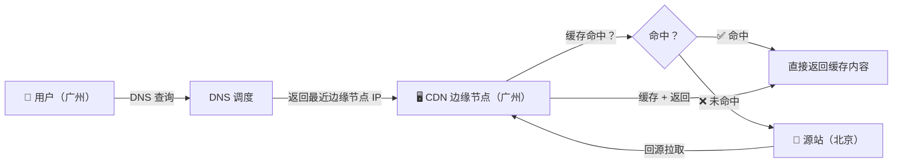
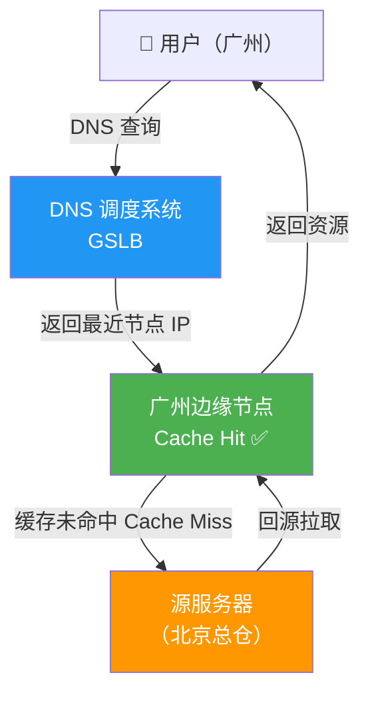
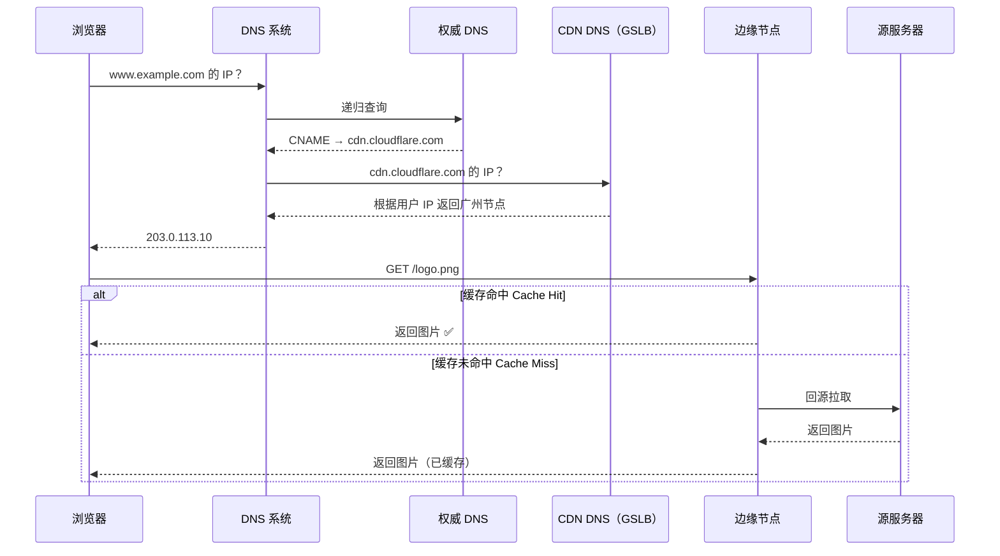

---

title: "CDN 原理与 DNS 调度"

created: "2025-07-12"

tags:

  - 八股文

  - 计算机网络

---

# CDN 原理与 DNS 调度

## 一句话总结

> **CDN 就是在全国各地（甚至全世界）提前部署一大堆缓存服务器，你访问网站时自动把你引到离你最近的那一台，省得每次都要跑到源站去取。DNS 调度就是这个"把你引到最近节点"的导航系统。**

#### CDN 架构一览



---

## 一、先搞懂"为什么要用 CDN"

**没有 CDN 的世界：**

你的网站服务器放在北京（源站 = 原始服务器）。一个用户在广州访问你的网站。

用户请求一个 2MB 的图片：

- 广州 → 北京：距离 2000 公里

- 数据要经过几十个路由器

- 光往返延迟（RTT）就要 30-50 毫秒

- 高峰期网络拥堵 → 更慢

- 100 个广州用户同时访问 → 每个都要从北京拉 2MB 图片

- 北京的服务器带宽 100Mbps → 带宽打满，所有人都卡

**用 CDN 之后：**

你提前把图片分发到全国各地的 CDN 节点服务器上。广州的 CDN 节点上已经有这张图片了。

用户请求同一个图片：

- 广州 → 广州本地 CDN 节点：距离 10 公里

- 延迟 1-2 毫秒

- 直接从本地节点拉，带宽压力被分散到各个节点上

**效果：**

- 加载时间从 2 秒降到 50 毫秒

- 北京的源服务器带宽从 100Mbps 降到 5Mbps

---

## 二、CDN 是怎么工作的
### CDN 架构总览



### CDN 的组成

**源服务器（Origin Server）**

- 真正存着你网站原始数据的地方

- 通常只有一台（或几台做负载均衡）

**CDN 节点（Edge Server / PoP）**

- 分布在各地的小型数据中心，每个节点里有一堆缓存服务器

- 每个节点都缓存着你网站的静态资源（图片、CSS、JS、视频）

- 全国可能有几千个节点

**DNS 调度系统（GSLB = Global Server Load Balancing）**

- 负责决定"哪个节点离这个用户最近"

- 用户请求资源时先问 DNS，DNS 返回离用户最近的节点 IP

**回源（Origin Pull）**

- 节点上没有用户要的资源时，节点自己去源服务器取

- 取回来后缓存起来，下次其他人访问就不用去源站了

> **像什么？**

> 源服务器 = 中央仓库（总仓）。CDN 节点 = 各个城市的分仓。DNS 调度系统 = 物流调度中心。

>

> 用户在广州买东西：物流调度中心说："去广州分仓拿"（不需要去北京总仓）。广州分仓没有这个货 → 去北京总仓调货（回源）。调来后放广州分仓，下次广州的人再买直接拿。

>

> 这就是 CDN。

### 一次完整的 CDN 请求



你访问 `https://www.example.com/logo.png`

**前提：**

- example.com 接入了 CDN

- 配置好了 CNAME 记录，指向 CDN 服务商的域名（比如 `example.com.cdn.cloudflare.com`）

**步骤：**

1. **浏览器问 DNS：** "www.example.com 的 IP 是什么？"

2. **DNS 递归查询** → 找到 example.com 的权威 DNS 服务器。权威 DNS 返回的不是真实 IP，而是 CNAME 记录：

   ```text

   www.example.com → www.example.com.cdn.cloudflare.com

   ```

3. **浏览器重新问 DNS：** "www.example.com.cdn.cloudflare.com 的 IP 是什么？"

4. **这次落到了 CDN 服务商的 DNS 服务器上**。CDN 的 DNS 服务器根据用户来源 IP 判断用户的位置："用户来自广州，广东电信网络"。查调度表 → 返回离用户最近的广州节点 IP：`203.0.113.10`

5. **浏览器向 203.0.113.10 发起 HTTP 请求** `GET /logo.png`

6. **广州节点检查自己有没有缓存 logo.png**

   - 有 → 直接返回（缓存命中 / Cache Hit）✅

   - 没有 → 去源服务器取（回源），缓存下来，再返回（缓存未命中 / Cache Miss）

7. **浏览器拿到图片，渲染页面**

整个过程用户完全无感知。用户只看到自己问了 DNS，拿到了 IP，发了 HTTP 请求，收到了图片。

---

## 三、DNS 调度（GSLB）
### DNS 调度是怎么决定"最近"的？

"最近"不是物理距离最近。是网络距离最近。

网络距离 ≈ 延迟最小（ping 值最低）的节点。

判断方式有两种：

#### 方式一：按 IP 地理位置（Geo DNS）

CDN 的 DNS 服务器有一张 IP 归属地表：

- 1.2.3.4 → 广州市，中国电信

- 5.6.7.8 → 纽约市，美国 Verizon

- ...

用户来问 DNS，CDN 服务器根据用户 IP："哦，你是广州电信用户" → 返回广州电信节点的 IP。"你是北京联通用户" → 返回北京联通节点的 IP。

**优点：** 简单，查表就行，延迟低。

**缺点：** IP 归属地可能不准（有些 IP 段归属地数据过时了）。广州用户可能用海南节点最稳定（取决于网络拓扑），但 IP 归属地是广州，硬给你广州的节点，不一定最优。

#### 方式二：按实时延迟探测（RTT-based）

CDN 的调度系统实时探测各节点到不同地区用户的延迟。

用户问 DNS 时，调度系统不是直接查表。而是动态计算："这个用户到哪个节点延迟最低？"

更精确。但需要实时数据，复杂度高。

一般大厂 CDN（Cloudflare、Akamai、阿里云 CDN）两种方式都用：Geo DNS 做粗筛，实时探测做微调。

### DNS 调度的局限性

DNS 调度有个固有问题：**DNS 缓存**。

用户在浏览器访问 example.com：浏览器问本地 DNS 服务器（比如 114.114.114.114）。114.114.114.114 拿到结果后会缓存起来（TTL = 300 秒）。

**问题：** 如果广州节点挂了，CDN 调度系统立刻把用户的流量切到深圳节点。但 114.114.114.114 的缓存还没过期（还要等 5 分钟）。这 5 分钟里，用户还是被引到挂掉的广州节点。

**怎么解决？**

1. **设置短 TTL**（比如 30 秒）。短 TTL 让 DNS 缓存很快过期，调度更新得快。缺点：DNS 查询更频繁，对 DNS 服务器压力大

2. **智能 DNS + HTTP 重定向双重保障**。DNS 给用户返回一个固定的 CDN 入口 IP。这个入口 IP 的服务器收到请求后，再做一次 HTTP 302 重定向："去这个 IP 拿，那个离你更近 / 还没挂"。多了一层控制，但多了 1 次 RTT

3. **Anycast**（下面讲）

---

## 四、Anycast——CDN 的终极武器
### 什么是 Anycast

正常情况下，一个 IP 地址只能对应一台服务器。

**Anycast 不同：** 同一个 IP 地址同时分配给多个节点。广州节点有这个 IP，北京节点也有这个 IP（多个节点共享一个 IP）。路由器根据 BGP 路由协议，自动把用户的数据包发到"离他最近的"那个节点。

用户访问这个 IP → 路由器看 BGP 路由表 → 最近的节点接收请求。

### Anycast 解决了什么问题

解决了 DNS 调度的缓存问题。

**CDN 用 Anycast IP：**

- 所有节点共享一个或几个 IP

- 用户不需要 DNS 调度，直接请求这些 IP

- 路由协议自动帮用户选最近的节点

**具体流程：**

1. CDN 给所有节点分配同一个 IP：1.2.3.4

2. 用户对 1.2.3.4 发起 HTTP 请求

3. 互联网上的路由器根据 BGP 协议："1.2.3.4 在广州、北京、上海都有。这个用户从深圳来 → 离广州最近 → 发到广州。"

4. 请求到达广州节点

**广州节点挂了怎么办？**

路由器自动收到 BGP 路由更新：广州的 1.2.3.4 路不可达。下一个最近的节点（比如深圳节点）接手所有流量。用户完全无感知。

**Anycast + 短 TTL DNS：**

- DNS 只返回 Anycast IP（不需要频繁换 IP）

- 路由层的故障切换是实时的（几秒到几十秒）

- 比等 DNS 缓存过期快得多

大型 CDN 都使用 Anycast：Cloudflare、Google Cloud CDN、AWS CloudFront 都用了 Anycast。

---

## 五、CDN 缓存策略

CDN 节点缓存的内容通常是有 TTL 的，过期了就要回源重新取。

**什么时候缓存？**

- 一般只缓存"静态资源"：图片、CSS、JS、字体文件、视频

- 不缓存"动态内容"：每个用户的个性化页面、API 响应、登录后的数据

但也不是绝对的，有些 CDN 支持"动态加速"：动态内容不缓存，但通过 CDN 的网络优化路由来加速传输。比如 CDN 节点之间用专线通信，比公网快。

### 缓存的 TTL 怎么控制

源服务器通过 HTTP 响应头来控制 CDN 的缓存行为：

| 指令 | 含义 | 说明 |
| :--- | :--- | :--- |
| `Cache-Control: max-age=3600` | CDN 节点缓存 1 小时 | 1 小时内用户请求直接返回缓存，1 小时后回源验证 |
| `Cache-Control: s-maxage=86400` | 专门控制 CDN（代理缓存）的 TTL | 比 max-age 优先级高。max-age 控制浏览器，s-maxage 控制 CDN |
| `Cache-Control: no-cache` | CDN 不缓存这个响应 | 每次都要回源 |

CDN 节点一般也会自己配置缓存规则：就算源服务器没响应头，CDN 也可以强制缓存某些文件类型。`.jpg` 默认缓存 7 天，`.html` 默认缓存 0 秒。

### 缓存刷新（Purge / 预热）

**缓存刷新（Purge）：**

你更新了 logo.png，但 CDN 节点上还是旧版。主动通知 CDN："把这个文件的缓存清掉"。下次用户请求 → 回源拉取最新版。

**缓存预热（Preload）：**

大版本上线前，先把新资源主动推送到所有 CDN 节点。用户上线时直接命中缓存，不需要等回源。

> **像什么？** Purge = 仓库发出通知："旧批次的产品全部下架，去总仓领新货"。Preload = 新车发布前一天，先把展车送到全国 4S 店。第二天发布会，用户直接去店里看，不需要等调货。

---

## 一句话讲清

> **延伸提问："CDN 是怎么工作的？"**

>

> "CDN 的核心是把静态资源缓存到离用户最近的节点上。用户请求资源时，通过 DNS 调度把用户引到最近的节点。

>

> 具体流程：浏览器请求资源 → DNS 解析 → 权威 DNS 返回 CNAME → CNAME 指向 CDN 服务商的域名 → CDN 的 DNS 根据用户 IP 返回最近的节点 IP → 用户直接访问该节点。如果节点没有缓存的资源，就去源服务器取（回源）。"

>

> **延伸提问："CDN 怎么找到最近的节点？"**

>

> "主要通过 DNS 调度（GSLB）。有两种方式：一是 Geo DNS，根据用户 IP 查地理位置表，返回对应区域的节点。二是基于实时延迟探测，动态计算。大型 CDN 还会用 Anycast——所有节点共享同一个 IP，路由器根据 BGP 协议自动把用户路由到最近的节点。Anycast 的好处是故障切换快，不需要等 DNS 缓存过期。"

---

## 记忆口诀

> **CDN = 全国各地的缓存分仓，用户访问时自动引到最近的分仓。**

> **DNS 调度 = CDN 的导航系统，根据用户 IP 返回最近的节点地址。**

> **节点没缓存就回源取——去总仓拿货。**

> **Anycast = 所有节点共享一个 IP，路由器自动选最近的。挂了秒切，不用等 DNS 缓存过期。**

> **静态资源缓存 TTL 用 Cache-Control 控制，更新资源记得做 Purge 刷新缓存。**

## 速记卡（面试闪卡）

**Q1：一句话讲清「CDN 原理与 DNS 调度」到底是什么？**

A：CDN 是把静态资源提前缓存到离用户最近的节点，DNS 调度当导航把你引到最近那台，省得每次都跑源站。

**Q2：没有 CDN 会怎样？ —— 怎么理解？**

A：像全村都去北京总仓买酱油——广州人到北京 2000 公里、带宽打满全堵死；CDN 像在小区门口开了分仓，下楼就拿，源站带宽从 100M 降到 5M。

**Q3：一次完整 CDN 请求怎么走？ —— 怎么理解？**

A：像寄快递填收件人——浏览器问 DNS，权威 DNS 回 CNAME 指向 CDN 域名，CDN 的 DNS（GSLB = Global Server Load Balancing，全局负载均衡）按你 IP 挑最近节点 IP；节点有缓存直接给，没有就回源（去总仓取）再缓存。

**Q4：DNS 调度怎么判定"最近"？ —— 怎么理解？**

A：像外卖按收货地址派单——Geo DNS 按 IP 归属地表粗筛（广州电信→广州电信节点）；更准的用实时延迟探测（RTT-based）动态算。大厂两种都用。缺点是 DNS 缓存可能导致切节点慢。

**Q5：Anycast 凭啥是终极武器？ —— 怎么理解？**

A：像全城共享同一个报警电话——所有节点共用一个 IP（Anycast），路由器按 BGP 协议自动把你引到最近节点；某节点挂了，路由更新后流量秒切到下一个，不用等 DNS 缓存过期。

**Q6：核心速记主线有哪些？**

- 没有CDN：所有请求都跑源站，跨城延迟高、带宽易打满

- CDN三件套：源站(总仓) + 边缘节点(分仓) + GSLB调度(导航)

- DNS调度靠Geo DNS粗筛 + 实时探测微调，缓存是软肋

- Anycast共享IP路由选近、故障秒切；缓存TTL用Cache-Control控制，更新要Purge

**口诀**

A：CDN全国开分仓，就近取货不用跑。

DNS调度当导航，Geo探测挑近旁。

节点没货去回源，总仓取来再缓存。

Anycast共享一个IP，挂了秒切真干脆。

## 相关链接

- 📋 目录：[[00-计算机网络]]

- 📚 学习清单：[[八股文学习路线图]]

- 🔗 [[34-DNS解析过程|DNS解析过程]] — CDN 基于 DNS 调度

- 🔗 [[14-浏览器输入URL到页面展示|浏览器输入URL到页面展示]] — CDN 在全流程中的位置

- 🔗 [[35-HTTP强缓存与协商缓存|HTTP强缓存与协商缓存]] — CDN 缓存与 HTTP 缓存的关系

