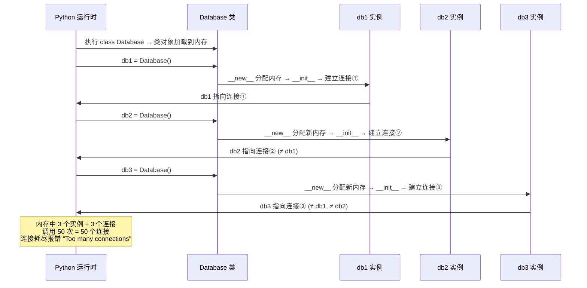
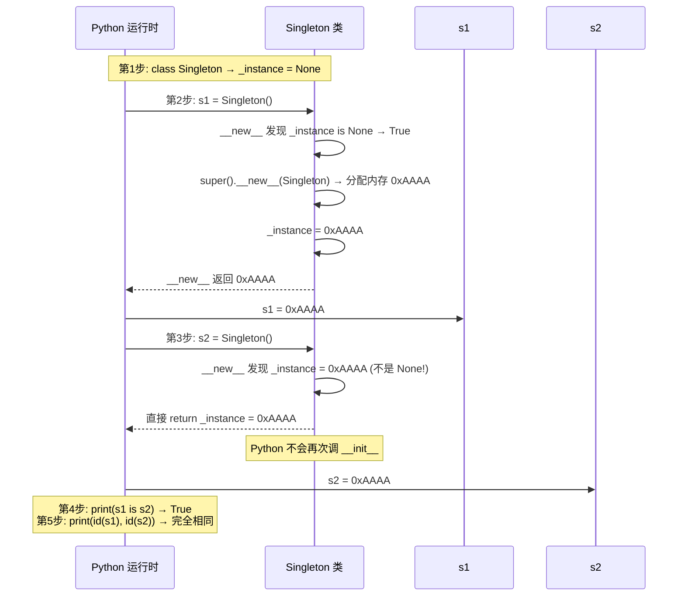
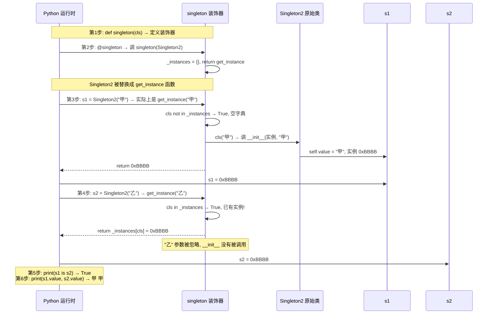
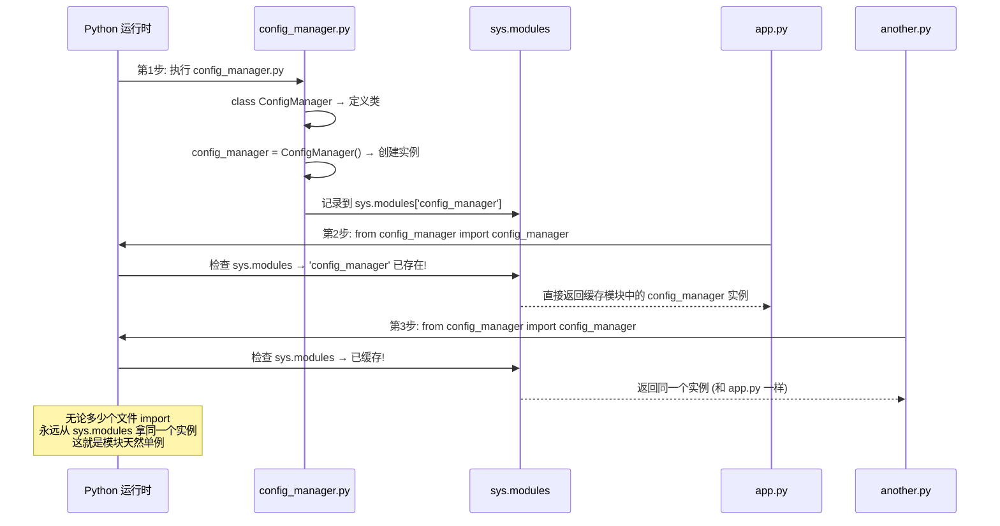
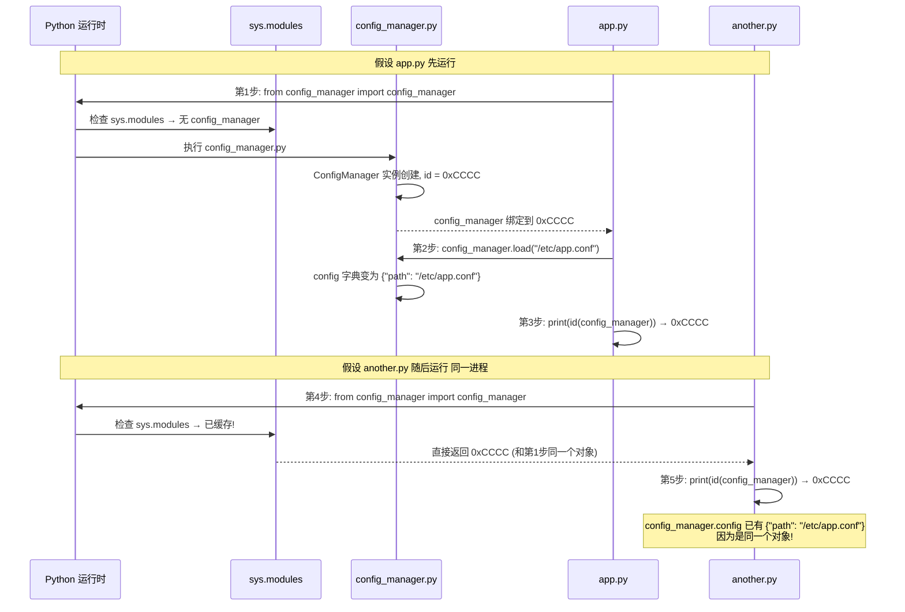
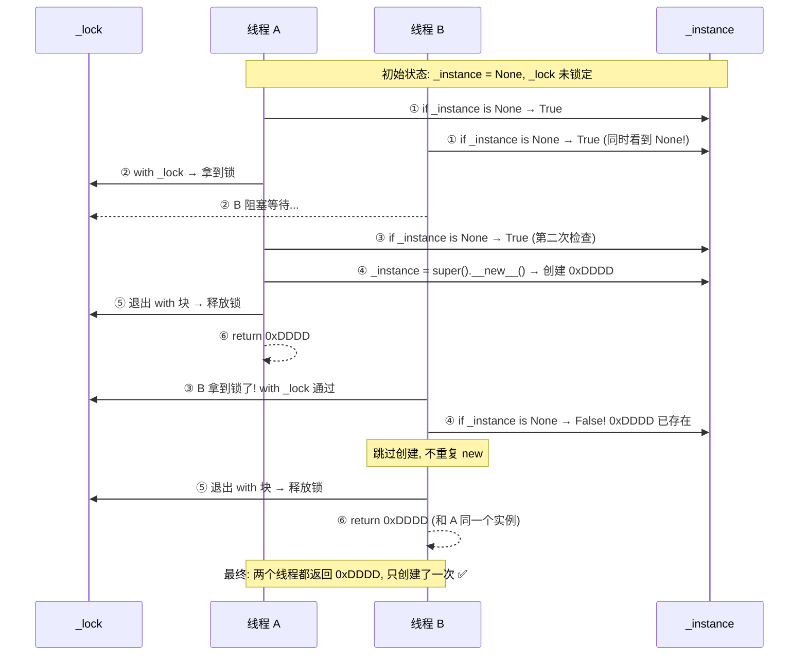

---

title: "单例模式Singleton"

created: "2025-07-12"

---

# 单例模式Singleton

## 一、单例模式（Singleton Pattern）
### 1.1 没单例会怎样？

```python

# 一天跑下来，同一个程序连了 50 次数据库——MySQL 直接挂了。

class Database:                          # 数据库连接类

    def __init__(self):                  # 每次创建实例都执行

        self.connection = self._connect()  # 建一个新连接

        print(f"新建连接：{id(self.connection)}")  # 打印连接对象的内存地址

    def _connect(self):                  # 建立数据库连接

        return "MySQL连接"               # 实际是 socket 连接，这里简化

db1 = Database()                         # 第一次调用 → 建连接 ①

db2 = Database()                         # 第二次调用 → 又建连接 ②

db3 = Database()                         # 第三次调用 → 再建连接 ③

# 三个不同的连接，数据库连接池被打满，后面的请求全挂

```

> **执行流程（逐行追踪）**：

>



> **问题**：有些资源天生就该"全局只搞一份"——数据库连接池、日志器、配置管理器、线程池。每次 new 一个就是在浪费 + 制造不一致。

### 1.2 单例解决什么

```text

单例 = 不管调多少次 类()，永远返回同一个实例。

```

**生活比喻**：公司打卡机。全公司就一台——你早上过去说"给我个打卡机"，行政不会买台新的，直接把墙上那台指给你。单例就是那台唯一的打卡机。

### 1.3 Python 实现单例的四种写法
#### 写法一：`__new__` 控制（最经典，手写这个）

> **前置概念：`cls` 是什么？**

先回忆 Python 普通方法的 `self`——你应该已经很熟了：

```python

class Dog:

    def bark(self):          # ① self = 调 bark 的那个实例

        print(self.name)     #    dog.bark() → self = dog，所以 self.name = dog.name

d = Dog()

d.bark()                     # ② Python 自动把 d 传给 self

```

`cls` 和 `self` 是同一类东西——都是 Python 自动传入的"调用者"。区别在于：

```python

class Dog:

    @classmethod

    def make_puppy(cls):     # ① cls = Dog 这个类本身（不是实例！）

        return cls()         # ② cls() 等价于 Dog()，创建新实例

Dog.make_puppy()             # ③ Python 自动把 Dog 这个类传给 cls

```

**对比表**：

| | `self` | `cls` |
| :--- | :--- | :--- |
| 指向谁 | **实例对象**（那条具体的狗） | **类本身**（Dog 这个 blueprint） |
| 用在哪 | 普通方法 `def foo(self)` | 类方法 `def foo(cls)`、`__new__(cls)` |
| 谁传的 | Python 自动把实例传入 | Python 自动把类传入 |
| 比喻 | 身份证（指向具体的人） | 户口本（指向整个家族） |

> **在单例里**：`def __new__(cls)` 的 `cls` = `Singleton` 这个类本身。所以 `cls._instance` 等价于 `Singleton._instance`（通过类名访问类变量），`super().__new__(cls)` 等价于 `object.__new__(Singleton)`——"用 Singleton 这个类去分配内存"。

```python

class Singleton:

    _instance = None                     # ① 类变量，存唯一的实例（一开始是空的）

    def __new__(cls):                    # ② cls = Singleton 类本身，Python 自动传入

                                         #    __new__ 在 __init__ 之前执行，控制"创不创建"

        if cls._instance is None:        # ③ 还没创建过实例 → 创建

            cls._instance = super().__new__(cls)  # ④ 调父类 object.__new__ 真正分配内存

        return cls._instance             # ⑤ 不管走没走创建，都返回那唯一的实例

# 验证：

s1 = Singleton()                         # 第一次调：_instance 是 None → 创建

s2 = Singleton()                         # 第二次调：_instance 已经有了 → 直接返回

print(s1 is s2)                          # True（两个变量指向同一个对象）

print(id(s1), id(s2))                    # 两个 id 完全一样

```

> **执行流程（逐行追踪）**：

>



> **`__new__` vs `__init__`**：`__new__` 负责**分配内存、返回实例**（生不生）；`__init__` 负责**初始化属性**（打扮）。单例要在 `__new__` 里拦截——还没生出来就能决定"不生新的"。

#### 写法二：装饰器（最 Pythonic）

```python

def singleton(cls):                      # ① 接收一个类作为参数

    _instances = {}                      # ② 闭包字典：{类: 类的唯一实例}

    def get_instance(*args, **kwargs):   # ③ 这个函数替代原来的 类()

        if cls not in _instances:        # ④ 这个类还没创建过实例

            _instances[cls] = cls(*args, **kwargs)  # ⑤ 创建并存入字典

        return _instances[cls]           # ⑥ 返回字典里那个唯一的实例

    return get_instance                  # ⑦ 返回包装后的函数（替代原类）

@singleton                               # ⑧ 一行装饰器，Singleton2 就变成单例了

class Singleton2:

    def __init__(self, value):           # 初始化方法

        self.value = value               # 设置属性值

s1 = Singleton2("甲")                    # 第一次：创建实例，value = "甲"

s2 = Singleton2("乙")                    # 第二次：返回已有实例，value 还是 "甲"

print(s1 is s2)                          # True

print(s1.value, s2.value)               # 甲 甲（第二次的 "乙" 被忽略了）

```

> **执行流程（逐行追踪）**：

>



> **注意**：装饰器版第二次传参不会更新 `__init__`——因为实例已经存在，`__init__` 不会重新执行。这是常见坑（见易错点）。

#### 写法三：模块天然单例（最简单，实际项目最常用）

```python

# Python 的模块只加载一次——天然就是单例！不需要任何套路。

class ConfigManager:                     # 配置管理器

    def __init__(self):                  # 初始化

        self.config = {}                 # 配置字典

    def load(self, path):                # 加载配置文件

        self.config["path"] = path       # 保存配置路径

config_manager = ConfigManager()         # 模块级实例化一行，整个项目共享这一个

# 别的文件 import config_manager → 永远是同一个对象

```

> **执行流程（模块加载时）**：

>



```python

# 文件：app.py

from config_manager import config_manager  # ① 导入

config_manager.load("/etc/app.conf")       # ② 加载配置

print(id(config_manager))                   # ③ 打印内存地址

# 文件：another.py

from config_manager import config_manager  # ④ 另一个文件导入

print(id(config_manager))                   # ⑤ 和 app.py 里是同一个地址！

# Python 的模块缓存机制——config_manager.py 只执行一次，import 只拿缓存

```

> **执行流程（跨文件追踪）**：

>



#### 写法四：线程安全的单例（进阶亮点，提到即可）

```python

import threading                          # 导入线程模块

class ThreadSafeSingleton:

    _instance = None                      # 存唯一实例

    _lock = threading.Lock()              # 线程锁——一次只允许一个线程执行被锁的代码

    def __new__(cls):

        if cls._instance is None:         # ① 第一次检查（不加锁，性能优化——大多数时候不为空，直接返回）

            with cls._lock:               # ② 加锁——同一时刻只有一个线程能进来

                if cls._instance is None:  # ③ 第二次检查（双重检查——防两个线程同时过了①）

                    cls._instance = super().__new__(cls)  # ④ 安全创建

        return cls._instance              # ⑤ 返回唯一实例

# 进去后还要确认里面没人（第二次检查）→ 双重检查防止两个人同时以为"没人"挤进去。

```

> **执行流程（模拟两个线程同时调 Singleton）**：

>



>

 如果只有一次检查（没有步骤③）：两个线程都通过步骤① → 各创建各的 → 两个实例 ❌

### 1.4 单例的适用范围（别滥用）

| ✅ 适合用 | ❌ 不适合用 |
| :--- | :--- |
| 数据库连接池（一个池管所有连接） | 用户信息（每个用户都不一样） |
| 日志器（全项目一个日志输出口） | 请求上下文（每个请求独立） |
| 全局配置（一处加载全局读） | 业务模型（User、Order 需要多个实例） |
| 线程池/进程池 | 任何"可能未来要第二个"的东西 |

> **口诀**：单例管的是"基础设施"，不管"业务数据"。管理"池子"用单例，管理"池子里的鱼"别用。

---

## 速记卡（面试闪卡）

**Q1：一句话讲清「单例模式Singleton」到底是什么？**

A：单例模式保证一个类无论调多少次都只返回同一个实例，像全公司唯一那台打卡机，专管连接池日志器等基础设施。

**Q2：为什么需要单例（motivation） —— 怎么理解？**

A：类比：没单例就像每喊一次"给我打卡机"行政就买台新的——数据库连接类每 new 一次建一条连接，50 次调用打满连接池（Too many connections）。单例（Singleton）让全公司共用那唯一一台。（One shared）

**Q3：__new__ 手写单例（control creation） —— 怎么理解？**

A：类比：Python 里 __new__ 负责"生不生"、__init__ 负责"打扮"。在 __new__ 里用类变量 _instance 拦一道：第一次才 super().__new__ 分配内存，之后统统返回同一个对象——还没生出来就决定不生新的。（Intercept birth）

**Q4：装饰器与模块单例（decorator & module） —— 怎么理解？**

A：类比：装饰器版像给类套个字典 clerk：第一次来造一个存进去，之后直接发缓存那个（注意第二次传参会被忽略）。最简单的是模块天然单例——Python 模块只加载一次，import 永远拿 sys.modules 里同一个实例。（Module = singleton）

**Q5：线程安全单例（double-checked locking） —— 怎么理解？**

A：类比：多线程同时来要实例，可能各建各的。线程安全版加把锁再做"双重检查"：先无锁看一眼（性能），进了锁再确认一次（防两人同时以为没人），像厕所门锁了还要推门确认里面没人再进。（Lock twice）

**Q6：核心速记主线有哪些？**

- 单例保证全局唯一实例，适合连接池/日志器/配置/线程池等基础设施

- __new__ 控制创建、类变量 _instance 缓存唯一实例

- 装饰器用闭包字典缓存；模块天然单例（只加载一次）最常用

- 线程安全用 Lock + 双重检查（double-checked locking）

- 别滥用：用户信息、请求上下文等业务数据不该单例

**口诀**

A：单例只生一个，全局共用一台；

__new__ 拦创建，_instance 缓存；

装饰器或模块，线程加锁双检；

管池子不管鱼，业务数据别来。

## 相关链接

- 📋 目录：[[00-设计模式]]

- 📚 学习清单：[[八股文学习路线图]]

