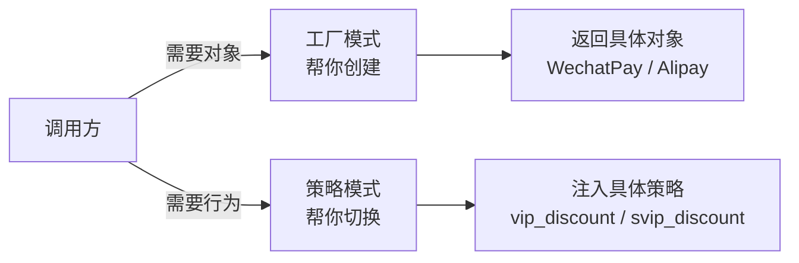

---

title: "工厂模式与策略模式对比"

created: "2025-07-12"

tags:

  - 八股文

  - 设计模式

---

# 工厂模式与策略模式对比

## 一、工厂模式与策略模式对比
### 1.1 工厂模式：没工厂会怎样？

```python

# 场景：支付系统，支持微信支付和支付宝。没工厂模式时：

class WechatPay:                         # 微信支付类

    def pay(self, amount):               # 支付方法

        print(f"微信支付 {amount} 元")    # 调用微信 API

class Alipay:                            # 支付宝类

    def pay(self, amount):               # 支付方法

        print(f"支付宝支付 {amount} 元")  # 调用支付宝 API

# 每次要用支付，调用方得自己判断 new 哪个：

method = "wechat"                        # 假设从请求里拿到支付方式

if method == "wechat":                   # ① 调用方要写 if-else 判断

    payer = WechatPay()                  # ② 调用方自己 new

elif method == "alipay":                 # ③ 每次加新支付方式

    payer = Alipay()                     # ④ 这里要加一个 elif

elif method == "unionpay":               # ⑤ 假设又加了银联

    payer = UnionPay()                   # ⑥ if-else 越来越长……

payer.pay(100)                           # ⑦ 终于可以支付了

# 加一种新支付方式 → 所有调用支付的地方都要改 if-else。

```

**执行流程（if-else 版本的逐步追踪）**：

```text

第1步：method = "wechat" → 字符串赋值，假设来自 HTTP 请求参数 ?method=wechat

第2步：if method == "wechat": → True

         → payer = WechatPay() → 调 WechatPay.__init__ → 创建微信支付实例

         → payer 指向这个实例

第3步：跳过后面的 elif（已经匹配到第一个）

第4步：payer.pay(100) → 调 WechatPay.pay → 输出 "微信支付 100 元"

—— 看起来还行？现在加银联 ——

第5步：需要加 elif method == "unionpay": → payer = UnionPay()

         → 问题：每加一种支付方式，这里的 if-elif 就要加一行

         → 如果项目里有 10 个地方都这样判断支付方式 → 改 10 处

         → 漏改一处 → 银联支付在那个页面报错 "不支持的支付方式"

```

### 1.2 工厂模式：简单工厂（最常用，手写这个）

```python

# 简单工厂 = 一个函数/一个类，根据参数创建不同对象

class WechatPay:                         # 微信支付类

    def pay(self, amount):               # 支付方法

        print(f"微信支付 {amount} 元")    # 实现微信接口

class Alipay:                            # 支付宝类

    def pay(self, amount):               # 支付方法

        print(f"支付宝支付 {amount} 元")  # 实现支付宝接口

class PaymentFactory:                    # 支付工厂——专门负责创建支付对象

    @staticmethod                        # 静态方法：不用建工厂实例就能调

    def create_payment(method: str):     # 入参：支付方式字符串

        if method == "wechat":           # ① 要微信 → 创建微信支付

            return WechatPay()           # ② 返回微信支付实例

        elif method == "alipay":         # ③ 要支付宝 → 创建支付宝

            return Alipay()              # ④ 返回支付宝实例

        else:                            # ⑤ 不支持的类型

            raise ValueError(f"不支持的支付方式: {method}")  # ⑥ 抛异常

# 调用方代码——多干净：

payer = PaymentFactory.create_payment("wechat")  # 一步拿到支付对象，不用管怎么 new 的

payer.pay(100)                           # 支付 100 元

# 加新的支付方式：只改工厂函数，调用方一行不动！

```

**执行流程（简单工厂逐行追踪）**：

```text

第1步：Python 执行 class WechatPay: → 定义微信支付类

第2步：Python 执行 class Alipay: → 定义支付宝类

第3步：Python 执行 class PaymentFactory: → 定义工厂类

         → @staticmethod 标记 create_payment 为静态方法（不需要 self）

第4步：payer = PaymentFactory.create_payment("wechat")

         → 直接调 PaymentFactory.create_payment("wechat")

           → method = "wechat"

           → if method == "wechat": → True

           → return WechatPay() → 创建 WechatPay 实例（假设 0xEEEE）

         → payer = 0xEEEE

第5步：payer.pay(100)

         → Python 查找 0xEEEE.pay → 找到 WechatPay.pay

         → 调 pay(0xEEEE, 100) → self = 0xEEEE, amount = 100

         → print("微信支付 100 元")

—— 加新支付方式流程 ——

第6步：写 class UnionPay: def pay(self, amount): ...（新类，不改已有代码）

第7步：在 PaymentFactory.create_payment 里加 elif method == "unionpay": return UnionPay()

         → 只改一处！调用方 payer.pay(100) 不需要改

         → 因为调用方只依赖工厂返回的对象的 .pay() 方法，不关心具体类名

```

### 1.3 工厂模式：工厂方法（进阶亮点）

> **简单工厂**：一个工厂类根据 if-else 创建不同产品。

> **工厂方法**：一个抽象工厂类定义"创建产品"的接口，具体创建什么由**子类**决定。

```python

from abc import ABC, abstractmethod      # ABC = 抽象基类（Abstract Base Class）

# ① 定义产品接口——所有支付方式必须实现 pay 方法

class PaymentProcessor(ABC):             # 抽象产品：约束所有支付类必须有 pay

    @abstractmethod                      # 抽象方法——子类必须实现，不然报错

    def pay(self, amount):              # 支付方法签名

        pass                             # 抽象方法不写实现

# ② 具体产品——每种支付方式各自实现

class WechatPay(PaymentProcessor):       # 继承抽象产品

    def pay(self, amount):               # 实现支付（必须写，不然报错）

        print(f"微信支付 {amount} 元")

class Alipay(PaymentProcessor):          # 另一个具体产品

    def pay(self, amount):               # 实现支付

        print(f"支付宝支付 {amount} 元")

# ③ 定义工厂接口——所有工厂必须实现 create 方法

class PaymentFactory(ABC):               # 抽象工厂

    @abstractmethod

    def create_payment(self) -> PaymentProcessor:  # 返回一个支付处理器

        pass                             # 子工厂决定具体返回什么

# ④ 具体工厂——每个工厂只负责创建一种支付方式

class WechatFactory(PaymentFactory):     # 微信工厂

    def create_payment(self) -> PaymentProcessor:  # 实现创建方法

        return WechatPay()               # 只创建微信支付

class AlipayFactory(PaymentFactory):     # 支付宝工厂

    def create_payment(self) -> PaymentProcessor:  # 实现创建方法

        return Alipay()                  # 只创建支付宝

# 使用：

factory = WechatFactory()                # 选微信工厂

payer = factory.create_payment()         # 工厂帮你创建支付对象（调用方不知道创建细节）

payer.pay(100)                           # 微信支付 100 元

# 要加银联支付？写一个 UnionFactory + UnionPay，不改任何已有代码（开闭原则）

```

**执行流程（工厂方法逐行追踪）**：

```text

第1步：Python 执行 class PaymentProcessor(ABC): → 创建抽象产品类

         → @abstractmethod 标记 pay → 子类不实现就报 TypeError

第2步：Python 执行 class WechatPay(PaymentProcessor): → 具体产品类

         → def pay(self, amount): 实现 → 满足抽象方法要求，通过检查

第3步：Python 执行 class Alipay(PaymentProcessor): → 同上

第4步：Python 执行 class PaymentFactory(ABC): → 创建抽象工厂类

         → @abstractmethod 标记 create_payment

第5步：Python 执行 class WechatFactory(PaymentFactory): → 具体工厂类

         → def create_payment(self): return WechatPay()

         → 只负责创建微信支付，单一职责

第6步：factory = WechatFactory() → 创建微信工厂实例（0xFFFF）

第7步：payer = factory.create_payment()

         → Python 调 WechatFactory.create_payment(0xFFFF)

         → return WechatPay() → 创建 WechatPay 实例（0xGGGG）

         → payer = 0xGGGG

第8步：payer.pay(100)

         → Python 查找 0xGGGG.pay → WechatPay.pay

         → print("微信支付 100 元")

—— 和简单工厂的关键区别 ——

简单工厂：PaymentFactory.create_payment("wechat") → 工厂内部 if-else 判断

工厂方法：WechatFactory().create_payment() → 子类决定，连 if-else 都省了

扩展性：加银联 → 简单工厂要改 create_payment 的 if-else（改已有代码）

                 → 工厂方法新增 UnionFactory + UnionPay 两个新文件（不改已有代码）

```

| | 简单工厂 | 工厂方法 |
| :--- | :--- | :--- |
| 产品类型 | 固定 2-3 种 | 会频繁新增 |
| 代码量 | 很少 | 多（每个产品配一个工厂） |
| 扩展性 | 改工厂的 if-else（违反开闭原则） | 新增子类（不碰已有代码） |
|  | 手写简单工厂最常用 | 说出工厂方法概念即可 |
| 实际项目 | 90% 的情况简单工厂够了 | 插件系统、框架扩展点 |

> **原则**：先简单工厂。等 if-else 超过 5 个、或者每次加产品都要改工厂时，再升级工厂方法。

### 1.4 工厂模式的本质

```text

工厂模式 = 把"创建对象的代码"和"使用对象的代码"拆开。

没工厂：调用方自己 new → 调用方依赖所有具体类 → 加新类要改调用方

有工厂：调用方只依赖工厂 → 工厂依赖具体类 → 加新类只改工厂

```

> 类比 Python 里你早就见过的工厂：`open("a.txt")` 就是工厂函数——你传"文件名"，它返回文件对象。你不用管文件在硬盘哪个扇区、怎么分配缓冲区。一切 API/库函数本质上都是"工厂"——封装创建细节，给你一个能用的对象。

---

### 1.5 策略模式：没策略会怎样？

```python

# 场景：电商促销——普通用户不打折、VIP 打 8 折、超级 VIP 打 6 折

def calculate_price(user_type, original_price):  # 计算最终价格

    if user_type == "normal":                    # ① 普通用户

        return original_price                    # ② 原价

    elif user_type == "vip":                     # ③ VIP 用户

        return original_price * 0.8              # ④ 8 折

    elif user_type == "svip":                    # ⑤ 超级 VIP

        return original_price * 0.6              # ⑥ 6 折

    elif user_type == "new_user":                # ⑦ 新增：新用户首单 7 折

        return original_price * 0.7              # ⑧ 每次加策略都要改这个函数

    # 每加一种用户类型 → if-elif 越来越长 → 这个函数最后变成百行怪兽

# ③ 违反"开闭原则"——对扩展开放（可以加策略），对修改也开放（要改原函数）

```

**执行流程（if-elif 版本逐步追踪）**：

```text

第1步：calculate_price("vip", 100)

         → user_type = "vip", original_price = 100

         → if user_type == "normal" → False，跳过

         → elif user_type == "vip" → True！进入

         → return 100 * 0.8 → 返回 80

第2步：calculate_price("svip", 100)

         → 前两个条件 False → elif user_type == "svip" → True → 返回 60

—— 加新用户类型 new_user ——

第3步：需要在函数体里加 elif user_type == "new_user": return price * 0.7

         → 改了 calculate_price 函数本身

         → 如果改的时候手滑删了 vip 那行的 * 0.8 → VIP 变成原价 → 线上事故

         → 每加一个类型就动一次"已经在线上稳定运行"的函数 → 风险累积

第4步：如果另一个文件也有类似的折扣计算 → 两处都要加 → 漏一处就行为不一致

```

### 1.6 策略模式——函数版（Python 一等公民，极简版）

> Python 里实现策略模式比 Java 简单一个数量级——因为 **Python 函数可以直接当参数传**。不需要定义接口、不需要策略类，一个函数就是一个策略。

```python

# === 定义策略：每个策略就是一个普通函数 ===

def normal_discount(price):              # ① 普通用户策略：不打折

    return price                         #    原价返回

def vip_discount(price):                 # ② VIP 策略：8 折

    return price * 0.8                   #    打八折

def svip_discount(price):                # ③ 超级 VIP 策略：6 折

    return price * 0.6                   #    打六折

# === 上下文：使用策略的地方 ===

def calculate_price(discount_strategy, original_price):  # ① 策略函数作为参数传入

    return discount_strategy(original_price)              # ② 调策略函数，不关心具体是哪个

# === 使用 ===

price = calculate_price(vip_discount, 100)   # 传入 vip 策略 → 80

price = calculate_price(svip_discount, 100)  # 换成 svip 策略 → 60

# 加新策略？再写一个函数，传进去就行——不改 calculate_price 一行代码

```

**执行流程（函数版策略逐行追踪）**：

```text

第1步：Python 执行 def normal_discount(price): → 函数对象创建，存入全局命名空间

         → normal_discount 现在是一个可调用的函数对象（类似一个变量）

第2步：同样，vip_discount 和 svip_discount 函数对象创建

第3步：Python 执行 def calculate_price(discount_strategy, original_price):

         → 这个函数接收两个参数：函数对象 + 数字

         → 函数体内：discount_strategy(original_price) → 把第二个参数传给第一个参数（函数）并调用

第4步：执行 price = calculate_price(vip_discount, 100)

         → discount_strategy = vip_discount（函数对象本身，不是调用结果）

         → original_price = 100

         → return vip_discount(100) → 进入 vip_discount 函数体

           → price = 100 → return 100 * 0.8 → 返回 80

         → price = 80

第5步：执行 price = calculate_price(svip_discount, 100)

         → 同上，但 discount_strategy = svip_discount → 返回 60

—— 加新策略 new_user ——

第6步：def new_user_discount(price): return price * 0.7 → 新函数，不碰 calculate_price

第7步：calculate_price(new_user_discount, 100) → 传入新函数即可

         → calculate_price 的代码一行没动 → 零风险

```

> 核心机制：Python 函数是"一等公民"——函数对象可以像 int、str 一样当参数传递。calculate_price 不知道也不关心传入的函数叫什么、怎么实现的，只负责"调用它"。

### 1.7 策略模式——类版（写这个，显得"正式"）

```python

from abc import ABC, abstractmethod      # 导入抽象基类

# ① 策略接口（Python 里非必须，但写出来是加分亮点）

class DiscountStrategy(ABC):             # 折扣策略抽象基类

    @abstractmethod

    def calculate(self, price):          # 抽象方法：计算折扣后价格

        pass

# ② 具体策略类

class NormalDiscount(DiscountStrategy):  # 普通用户策略

    def calculate(self, price):          # 实现：原价

        return price

class VipDiscount(DiscountStrategy):     # VIP 策略

    def calculate(self, price):          # 实现：8 折

        return price * 0.8

class SvipDiscount(DiscountStrategy):    # 超级 VIP 策略

    def calculate(self, price):          # 实现：6 折

        return price * 0.6

# ③ 上下文——持有策略并使用

class Order:                             # 订单类

    def __init__(self, discount_strategy: DiscountStrategy):  # 注入策略对象

        self.discount_strategy = discount_strategy            # 保存策略

    def get_price(self, original_price):                      # 计算最终价格

        return self.discount_strategy.calculate(original_price)  # 委托给策略对象计算

# 使用——策略可以运行时随意换

order = Order(NormalDiscount())          # 先用普通策略

print(order.get_price(100))              # 100

order.discount_strategy = VipDiscount()  # 换成 VIP 策略（运行时换！）

print(order.get_price(100))              # 80

# 不用改 Order 类一行代码，策略随便换

```

**执行流程（类的写法逐行追踪）**：

```text

第1步：Python 执行 class DiscountStrategy(ABC): → 抽象策略接口定义

         → @abstractmethod 标记 calculate，子类必须实现

第2步：class NormalDiscount(DiscountStrategy): → 定义原价策略

         → def calculate(self, price): return price → 实现抽象方法

第3步：class VipDiscount / SvipDiscount → 定义 8 折 / 6 折策略

第4步：class Order: → 定义订单类

         → __init__ 接收 discount_strategy 参数并保存到 self.discount_strategy

         → get_price 委托给策略对象计算

第5步：order = Order(NormalDiscount())

         → NormalDiscount() 先执行 → 创建策略实例（0xHHHH）

         → Order.__init__(order_实例, 0xHHHH) → self.discount_strategy = 0xHHHH

         → order 指向 Order 实例（0xJJJJ）

第6步：order.get_price(100)

         → self = 0xJJJJ, original_price = 100

         → self.discount_strategy = 0xHHHH（NormalDiscount 实例）

         → 调 0xHHHH.calculate(100) → NormalDiscount.calculate → return 100

         → 返回 100

第7步：order.discount_strategy = VipDiscount()

         → VipDiscount() 创建新策略实例（0xKKKK）

         → order.discount_strategy 从 0xHHHH 变为 0xKKKK（运行时切换！）

第8步：order.get_price(100)

         → 现在 self.discount_strategy = 0xKKKK（VipDiscount 实例）

         → 调 0xKKKK.calculate(100) → return 100 * 0.8 → 返回 80

         → Order 类的 get_price 代码一行没变，但行为从"原价"变成了"8 折"

```

> 关键：策略对象和上下文对象（Order）是"组合"关系，不是"继承"关系。策略随时可以换，Order 只依赖 DiscountStrategy 接口，不依赖具体策略类。

- 驾车策略（走高速）→ `CarStrategy`

- 公交策略（坐地铁）→ `BusStrategy`

- 步行策略（抄近路）→ `WalkStrategy`

同一个目的地（同样的输入），换一个策略就是另一条路线。**导航引擎（Order 类）不关心你选什么策略——它只调用 `strategy.calculate()`，具体怎么走是策略自己的事。**

### 1.8 策略模式 vs if-else（关键对比）

```python

# ❌ if-else 版：加策略 = 改主函数（违反开闭原则）

def calc_price(user_type, price):

    if user_type == "normal":

        return price

    elif user_type == "vip":

        return price * 0.8

    # 加新类型 → 改这里，可能改坏已有的

# ✅ 策略模式版：加策略 = 新增一个函数/类（主函数不动）

def calc_price(strategy, price):

    return strategy(price)               # 策略从外面传进来，主函数永不改

# 加新折扣 → 写一个新函数，传进来即可

```

**执行流程（两种写法的对比追踪）**：

```text

if-else 版加策略：

  ① 打开 calc_price 函数 → 在 elif 链末尾加 elif user_type == "new": return price * 0.7

  ② 改动了 calc_price 的源代码 → 所有依赖 calc_price 的调用方都受影响

  ③ 如果改错了（比如复制粘贴漏改打折比例）→ 所有调用方一起坏

策略模式版加策略：

  ① def new_strategy(price): return price * 0.7 → 新函数，独立文件/独立位置

  ② calc_price(new_strategy, 100) → 调用方传入新函数

  ③ calc_price 源代码不受影响 → 已有的 normal/vip 策略完全不受牵连

  ④ 单元测试：new_strategy 可以独立测试，不依赖 calc_price

```

| 场景 | 可变策略 | 具体例子 |
| :--- | :--- | :--- |
| 支付 | 微信/支付宝/银行卡 | 订单结算时选支付方式 |
| 折扣 | 满减/打折/立减/拼团 | 电商促销规则引擎 |
| 排序 | 价格/销量/评分/时间 | 商品列表排序切换 |
| 导出 | PDF/Excel/CSV | 报表导出格式切换 |
| 验证 | 手机号/邮箱/身份证 | 表单校验规则 |
| 压缩 | zip/gzip/brotli | HTTP 响应压缩 |

> 策略模式是**消除 if-else 链**的第一武器。当你发现代码里同一个位置有 3 个以上 `elif` 且还在增长 → 策略模式在召唤你。

---

### 1.9 工厂 vs 策略：何时用哪个？

> 两个模式都能消除 if-else，但解决的问题**根本不同**。常见追问："工厂模式和策略模式有什么区别？"

**一句话区分**：

- **工厂模式**解决的是"**创建谁**"——你关心拿到什么对象

- **策略模式**解决的是"**怎么做**"——你关心行为怎么切换



**类比**：

| 生活场景 | 工厂模式 | 策略模式 |
| :--- | :--- | :--- |
| 去餐厅 | 前台帮你"创建"一盘菜 → 你不用管厨房怎么炒 | 你选"辣度策略" → 微辣/中辣/变态辣，同一道菜换策略就换口味 |
| 出行 | 订票平台帮你"创建"一趟航班 → 你拿到票就行 | 你选"出行策略" → 飞机/高铁/自驾，目的地相同但方式不同 |
| 买电脑 | 苹果商店帮你"创建"一台 Mac → 你不用管供应链 | 你选"付款策略" → 全款/分期/花呗，同一台电脑付款方式不同 |

**核心差异对照表**：

| 维度 | 工厂模式 | 策略模式 |
| :--- | :--- | :--- |
| 解决什么 | **对象创建**的耦合 | **行为切换**的 if-else |
| 关注点 | 拿到什么（WHAT） | 怎么做（HOW） |
| 变化点 | 产品类型增多 | 算法/规则增多 |
| 调用方依赖 | 只依赖工厂接口 | 只依赖策略接口 |
| 扩展方式 | 新增产品类 + 注册到工厂 | 新增策略类/函数 |
| if-else 消除位置 | 创建对象的代码 | 执行逻辑的代码 |
| 典型场景 | 日志框架选 logger、DAO 选数据库 | 折扣规则、排序算法、压缩算法 |

**两者可以组合使用**：

```python

# ① 工厂：根据用户选择创建支付方式

payer = PaymentFactory.create_payment("wechat")  # 工厂帮你创建支付对象

# ② 策略：根据用户等级决定折扣

order = Order(VipDiscount())                     # 策略注入折扣算法

final_price = order.get_price(100)               # 先算折扣

payer.pay(final_price)                            # 再支付

```

> 工厂和策略就像餐厅的"厨房"和"菜单调料台"——厨房负责做出菜（创建对象），调料台负责调整口味（切换行为）。你不会因为想换辣度就让厨房重新炒一道菜，也不会因为换了菜品就改变辣度策略。两者独立变化，组合使用。

**速记口诀**：

> 工厂管**创建**，策略管**行为**。

> 工厂是"厨房出菜"，策略是"调料换味"。

> 两个都能消 if-else，但一个消在 `new` 前面，一个消在 `elif` 后面。

---

## 速记卡（面试闪卡）

**Q1：一句话讲清「工厂模式与策略模式对比」到底是什么？**

A：工厂模式管"创建什么对象"，策略模式管"行为怎么切换"——一个消在 new 前，一个消在 elif 后。

**Q2：一、工厂模式 —— 怎么理解？ —— 怎么理解？**

A：工厂像餐厅后厨——你点菜（传入参数）就拿到一盘做好的菜，不用管厨房怎么炒、哪个厨师做的。简单工厂用 if-else 返回对象；工厂方法让子类决定创建谁。核心：把"创建"和"使用"拆开（Creation pattern）。

**Q3：二、策略模式 —— 怎么理解？ —— 怎么理解？**

A：策略像导航的"路线偏好"——同一目的地，换经济/最快/最短就换一条路，导航（上下文）不用改代码。Python 里函数是一等公民，一个函数就是一个策略，直接当参数传进来计算价格。核心：消除 if-else 链（Behavior pattern）。

**Q4：三、工厂 vs 策略 本质区别 —— 怎么理解？ —— 怎么理解？**

A：一句话：工厂解决"拿到什么"（WHAT，对象是哪种），策略解决"怎么做"（HOW，行为怎么换）。两者都能消 if-else，但一个消在 new 前面，一个消在 elif 后面。两者可组合：工厂创建支付对象，策略决定折扣算法。

**Q5：四、组合与口诀 —— 怎么理解？ —— 怎么理解？**

A：厨房（工厂）出菜、调料台（策略）换味——不会因为想换辣度就重炒一道菜。记：工厂负责"造物"，策略负责"换招"；一个管在 new 之前，一个管在 elif 之后，分工明确不打架。

**Q6：核心速记主线有哪些？**

- 工厂模式：把"创建对象"从"使用对象"里拆出来

- 策略模式：用函数/类封装可替换的算法，消 if-else

- 工厂管 WHAT（拿什么对象），策略管 HOW（怎么行为）

- 两者可组合：工厂建对象 + 策略选行为

**口诀**

A：工厂造物不用恼，

策略换招真轻巧；

new 前把那对象造，

elif 之后行为调。

## 相关链接

- 📋 目录：[[00-设计模式]]

- 📚 学习清单：[[八股文学习路线图]]

- ⬆️ 上一篇：[[01-单例模式Singleton]]

- ⬇️ 下一篇：[[03-观察者模式发布订阅]]

