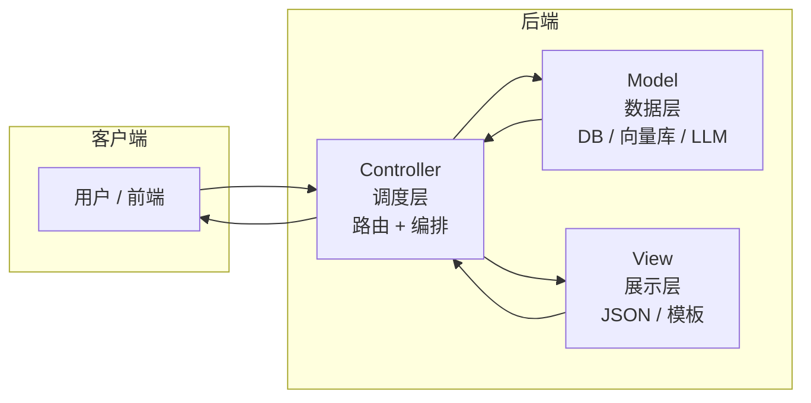

---

title: "MVC / MTV 架构"

created: "2025-07-12"

tags:

  - 八股文

  - 设计模式

---


# MVC / MTV 架构

## 一句话总结


> **MVC 就是把代码按职责切成三块——Model 管数据长啥样、View 管返回啥格式、Controller 管谁先谁后。不改数据格式时只动 Controller，不改逻辑时只动 View，互相不干扰。**


---


## 一、为什么需要分层——用你的项目讲


你写了一个 RAG 问答 API（FastAPI）。


**没分层的写法：**


```python

@app.post("/ask")

async def ask(question: str):

    # 1. 连数据库查历史记录

    conn = psycopg2.connect(...)

    cursor = conn.cursor()

    cursor.execute("SELECT ...")


    # 2. 构造 embedding 查向量库

    embedding = openai.embeddings.create(input=question)

    results = vector_db.search(embedding)


    # 3. 拼 prompt 调 LLM

    prompt = f"根据以下内容回答问题：{results}"

    answer = openai.chat.completions.create(...)


    # 4. 存结果到数据库

    cursor.execute("INSERT INTO ...")


    # 5. 返回

    return {"answer": answer}

```


全写在一个文件里。跑起来了。


半个月后需求变了：

- "把 embedding 模型从 OpenAI 换成 bge-m3（本地部署）。" → 你在文件里找 embedding 相关的代码。但数据库连接、prompt 拼接、LLM 调用全混在一起。改 embedding 时不小心碰了 LLM 调用的参数。LLM 吐出乱码了。

- "加一个聊天历史查询接口 GET /history。" → 你要复用数据库查询逻辑。但数据库操作和 LLM 调用写在一起。没法单独拿出来复用。只能再写一遍。


核心问题：不同职责的代码没分开。动一个地方，牵一发动全身。


---


## 二、MVC 三层怎么切





### Model（数据层）


数据库、向量库、外部 API——你的"数据源"都在这一层。


它只管三件事：

1. 数据结构长什么样（表、字段、类型）

2. 怎么查、怎么存、怎么删

3. 业务规则和约束（比如"email 必须唯一"、"问题不能为空"）


它不管的事：

- 不管数据最终返回 JSON 还是 HTML

- 不管请求是来自网页还是手机


用你项目对应的就三样东西：


**数据库模型 → SQLAlchemy Model**

```python

class Conversation(Base):

    id: int

    user_id: int

    question: str

    answer: str

    created_at: datetime

```


**Pydantic Schema（请求/响应的数据格式定义）**

```python

class AskRequest(BaseModel):

    question: str

    user_id: int


class AskResponse(BaseModel):

    answer: str

    sources: list[str]

```


**LangGraph 的 State（Agent 的状态定义）**

```python

class AgentState(TypedDict):

    question: str

    context: list[str]

    answer: str

    chat_history: list[dict]

```


Model 层的核心：数据怎么组织的，外界不关心。


### View（展示层）


数据怎么返回给调用方的——JSON 还是其他格式。


传统 MVC 里 View 是 HTML 模板（Jinja2）。你的项目里 View 就是 FastAPI 的 response_model：


```python

@app.post("/ask", response_model=AskResponse)

async def ask(...):

    ...

```


response_model 决定了：这个接口返回的 JSON 长什么样。你不需要手动 dict 一个个拼——Pydantic 帮你序列化了。


还可以加响应处理函数来统一格式：


```python

def success_response(data: Any) -> dict:

    return {"code": 0, "data": data, "message": "ok"}


def error_response(msg: str) -> dict:

    return {"code": -1, "data": None, "message": msg}

```


所有接口统一返回格式，改格式只改这两个函数。


View 层只管"长什么样"。不管"数据从哪来"（那是 Model 的事）。不管"先调 LLM 还是先查数据库"（那是 Controller 的事）。


### Controller（调度层）


它做的事就是"编排"——先把数据准备好，再决定怎么返回。


在 FastAPI 里，路由函数就是 Controller：


```python

@app.post("/ask")

async def ask_question(

    body: AskRequest,

    service: AgentService = Depends(get_agent_service)

):

    # ① 调 Model 层拿数据

    result = service.run_agent(body.question, body.user_id)


    # ② 通过 View 层返回

    return AskResponse(answer=result.answer, sources=result.sources)

```


Controller 只做"调度"——不自己查数据库、不自己调 LLM。具体操作委托给 Model 层（AgentService、Repository）。


---


## 三、Django MTV——改了个名字，活一样


Django 不叫 MVC，叫 MTV。因为 Django 觉得传统命名别扭。


| 传统 MVC | Django MTV |
| :--- | :--- |
| Model | Model（没变） |
| View（展示层） | Template（模板） |
| Controller（调度层） | View（请求处理函数） |


Django 的哲学："View 应该代表'你看到的东西'。那决定你看到啥的是 Template（HTML 模板），不是那个处理请求的函数。所以处理函数不该叫 View，它应该是 Controller。"


但 Django 偏不叫 Controller——就叫 View。理由：约定俗成，Django 的 views.py 从来都是写请求处理的地方。


**照葫芦画瓢：**

- 传统 MVC：数据库查数据 → 传给模板 → 模板渲染 → 返回

- Django MTV：models.py 查数据 → views.py 处理 → templates/ 渲染 → 返回


| 层面 | Django | 你的 FastAPI |
| :--- | :--- | :--- |
| **Model**（数据层） | models.py（SQLAlchemy） | models/db_models.py |
| **Controller**（调度层） | views.py（路由 + 调度） | routers/chat.py |
| **View**（展示层） | templates/（HTML 模板） | views/responses.py（Pydantic） |


实质一样：数据、展示、调度各管各的。换 DB 改 models.py，改页面改 templates/，加路由改 views.py。

---


## 四、MVC 放在你的 RAG 项目里是什么样


你写一个 LangGraph 多轮对话 Agent。


没分层 = 所有代码写在 main.py 里。


分层后大概是：


```text

project/

  models/              ← Model 层

    schemas.py         ← Pydantic 定义

    db_models.py       ← SQLAlchemy 表定义

    state.py           ← LangGraph AgentState

    repository.py      ← 数据库查询封装

    vector_store.py    ← 向量数据库操作

    llm_client.py      ← LLM / Embedding 调用封装


  services/            ← Controller 层（业务编排）

    agent_service.py   ← LangGraph 图构建和执行

    conversation.py    ← 会话管理编排


  routers/             ← Controller 层（路由入口）

    chat.py            ← POST /ask、GET /history


  views/               ← View 层

    responses.py       ← 统一响应格式

    formatters.py      ← 数据格式转换（向量结果→文本）


main.py                ← app = FastAPI()

```


**每层改动的影响范围：**

- 换 embedding 模型（bge-m3 → OpenAI）：只改 models/embedding_client.py，其他文件不用动

- 接口返回格式从 {answer, sources} 改成 {data, msg}：只改 views/responses.py

- 加一个"流式输出"（SSE）：新增一个 router，重用一个 service，Model 层完全不动

- RAG 逻辑改成 GraphRAG：只改 services/agent_service.py（图结构变了）


---


## 四、MVC 的变体——你在 FastAPI 里更该关心的


传统 MVC → 面向网页（Model → View = HTML）。你的 MVC → 面向 API（Model → View = JSON）。所以"View 层"在你的场景里更接近 response_model 和 Pydantic。


还有更细分的架构模式（你也可能被问到）：


**Repository Pattern：** 把"数据库怎么查"的细节从 Model 再抽一层。repository.py 里写 SQL 查询。service 层只管调用 repository 的方法。适合复杂查询的项目。


**Service Layer：** Controller（路由）只管接收请求和返回响应。业务逻辑写在 service 里。这样路由函数只有 3 行。测试时直接测 service，不需要启动 HTTP。


**对应到 MVC：**

- Controller = 路由函数（薄，只做调度）

- Service = 扩展的业务逻辑层

- Model = 数据操作

- View = 响应格式化


---


## 一句话讲清


> "MVC 是一种分层思想，不是固定框架。核心是把代码按职责分成三层：Model 管数据定义和存取，View 管展示格式，Controller 管调度编排。

>

> 我平时用 FastAPI 写 Agent 后端也是按这个思路切。models/ 放 SQLAlchemy 和 Pydantic，services/ 放 LangGraph 的业务编排，routers/ 只做路由分发，views/ 统一响应格式。

>

> 这个分层的好处是改一个维度不影响其他维度——换 LLM 模型不动路由逻辑，改接口返回格式不动业务代码。"


---


## 记忆口诀


> **MVC = Model 管数据长啥样、View 管返回啥格式、Controller 管先调谁。**

> **你的项目里：routers = Controller，services = 编排，model + client = Model，response_model = View。**

> **分层不是为了好看，是为了改 embedding 时不会碰坏 LLM 调用。**

> **被问到就说：分层思想，关注点分离，Rails/Django/Spring 只是它的具体实现。**


## 速记卡（面试闪卡）


**Q1：一句话讲清「MVC / MTV 架构」到底是什么？**

A：MVC 是按职责把代码切成三块——Model 管数据、View 管展示、Controller 管调度。


**Q2：一、为什么需要分层 —— 怎么理解？**

A：不分层时，数据库、prompt 拼接、LLM 调用全搅在一个文件里；换个 embedding 模型不小心碰坏 LLM 参数，吐出乱码。分层的好处是"改一个维度不影响其他维度"——换模型不动路由，改返回格式不动业务逻辑。


**Q3：二、MVC 三层怎么切 —— 怎么理解？**

A：Model 管"数据长啥样、怎么存取"（SQLAlchemy/Pydantic/状态定义）；View 管"返回啥格式"（response_model 或模板）；Controller 管"先调谁后调谁"（路由函数），自己不查库也不调 LLM，操作委托给 Model 层。


**Q4：三、Django MTV 只是改了名 —— 怎么理解？**

A：Django 觉得传统命名别扭，把展示层叫 Template、把调度函数叫 View（所以 Django 的 views.py 其实是 Controller）。实质一样：数据、展示、调度各管各的。换 DB 改 models.py，改页面改 templates/，加路由改 views.py。


**Q5：四、变体：Service / Repository —— 怎么理解？**

A：复杂项目再细分——Repository 把"怎么查数据库"从 Model 抽一层，Service 放业务逻辑让路由只剩 3 行。对应到 MVC：路由=薄 Controller，service=业务层，Model=数据操作，View=响应格式化。


**Q6：核心速记主线有哪些？**

- MVC 是分层思想不是固定框架

- Model 管数据、View 管展示、Controller 管调度

- Django MTV 只是改名，活一样

- Service / Repository 是更细的变体

- 好处：改 embedding 不会碰坏 LLM 调用


**口诀**

A：MVC 分层是种思想，

Model 数据 View 管模样；

Controller 管调度，改名也不慌，

换模型不动路由，改格式不沾脏。


## 相关链接


- 📋 目录：[[00-设计模式]]

- 📚 学习清单：[[八股文学习路线图]]

