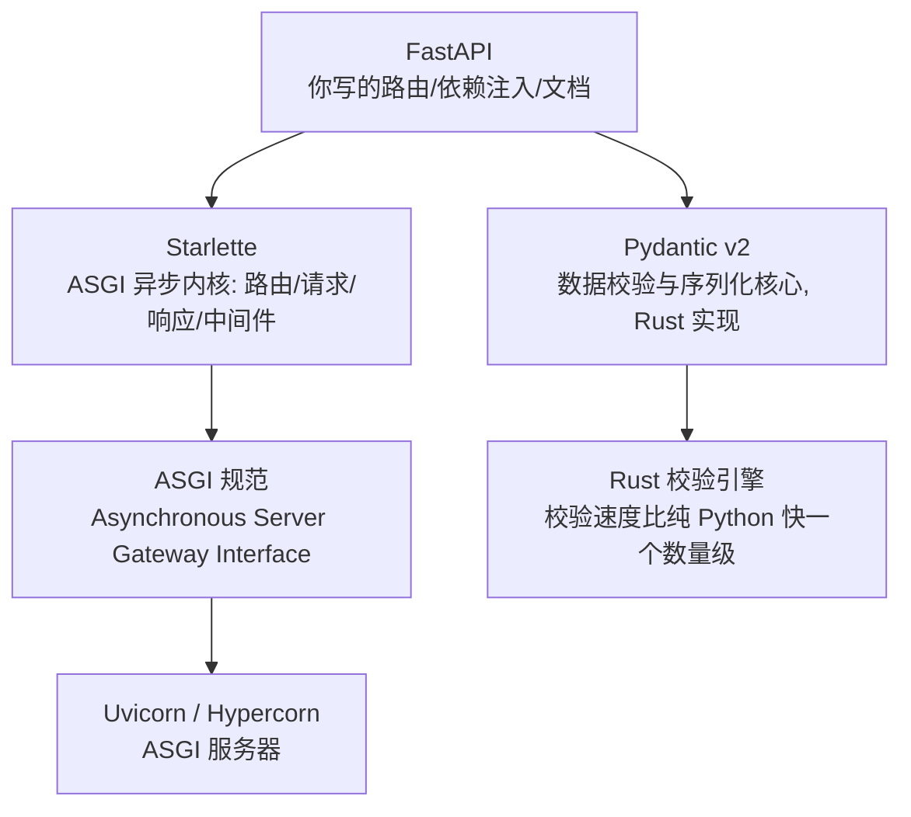
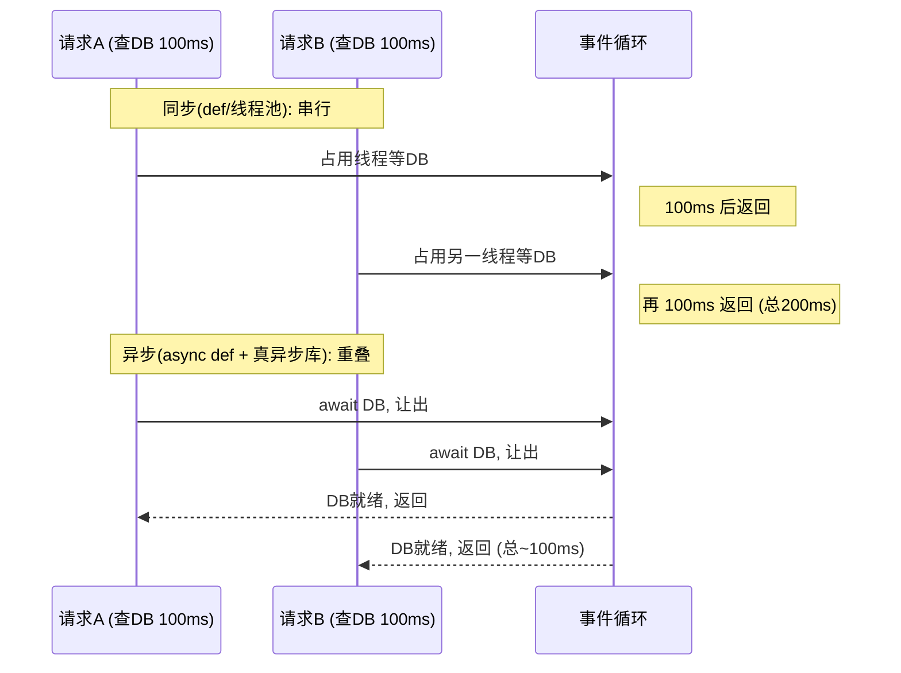

---

title: "FastAPI 为什么快？（Starlette + Pydantic + async）"

created: "2026-07-20"

tags:

  - 八股文

  - fastapi-web

---

# FastAPI 为什么快？（Starlette + Pydantic + async）

## 一句话总结

> **FastAPI 快，不是它自己写得快，而是它站在三个巨人的肩膀上：Starlette（ASGI 异步内核）+ Pydantic v2（Rust 写的校验核心）+ Python 类型注解（自动文档与校验）。但“快”有个前提——你别在 async 里干阻塞的事，否则事件循环一冻，全员陪跑。**

---

## 先讲个生活类比

把 Web 框架想象成一家**餐厅**：

- **WSGI 老餐厅（Flask/Django 同步）**：一个服务员（线程）只服务一桌，点完单就站在厨房门口干等菜好，期间啥也不干。来 100 桌就得雇 100 个服务员，成本高、并发低。

- **ASGI 新式餐厅（FastAPI）**：服务员点完单把单子递进去，转身去服务别的桌；等菜好了厨房喊一声，再回来端走。一个服务员能同时照看几十桌的“等待期”。这就是**异步（async）**的本质——在等待 IO 的时候去干别的事。

FastAPI 不是第一个 ASGI 框架，但它把“异步 + 数据校验 + 文档”这三件最容易拖慢开发的事，一次性焊死在了框架里。

## 技术栈：FastAPI 不是从零造的



> **ASGI**（Asynchronous Server Gateway Interface，异步服务器网关接口）是 WSGI 的继任者，允许一个进程内用单线程事件循环并发处理多个请求；**WSGI**（Web Server Gateway Interface）是老一代同步接口，一个请求占一个线程。

## 三大支柱逐个拆
### 1. Starlette 异步内核（并发的底座）

FastAPI 本身几乎不碰 HTTP 细节，全部交给 Starlette——一个轻量 ASGI 工具箱。每个 `async def` 路由在事件循环里跑：遇到 `await db.execute(...)` 或 `await httpx.get(...)` 就**主动让出控制权**，事件循环转去处理别的请求。于是“等待数据库/外部 API”的空闲时间被压缩成了并发能力。

### 2. Pydantic v2 的 Rust 核心（校验不拖后腿）

请求体进来要先校验。Pydantic v2 把校验/序列化核心用 **Rust** 重写了（`pydantic-core`），对一个 20 字段的 JSON，解析速度比 v1 快数倍，比 Django REST 手动校验快一个数量级。校验开销小到在高并发下几乎可以忽略。

### 3. 类型注解即文档即校验（开发效率的“快”）

你写 `def create_item(item: Item)` 时，Python 类型注解同时干了三件事：

- 自动生成 **JSON Schema**（数据格式描述）

- 自动生成 **OpenAPI** 规范 → 自带 `/docs`（Swagger UI）和 `/redoc`

- 自动做请求/响应校验，非法数据在进业务逻辑前就被挡掉

> **OpenAPI**（原名 Swagger）是一套描述 REST API 的标准；**JSON Schema** 是用来描述 JSON 数据结构的规范。FastAPI 靠类型注解自动产出这两者，文档永远和代码同步，不漂移。

## 同步 vs 异步：一张图看懂“为什么快”



## 基准对比（行业通用压测，单进程）

| 场景 | Flask（WSGI 同步） | FastAPI（ASGI 异步） | 提升 |

| :--- | :--- | :--- | :--- |

| 简单 JSON 接口 QPS | ~800 | ~3000 | ~275% |

| 带 DB 查询接口 QPS | ~100 | ~2000 | ~1900% |

| 最大并发连接 | ~1000 | ~10000+ | ~900% |

> 注意：这些数字来自社区基准，具体值随硬件/驱动而异，但**数量级关系**是稳的——瓶颈在“并发等待”时，异步收益最大。

## ⚠️ 最大的坑：async 里阻塞 = 白写

```python

@app.get("/bad")

async def bad():

    return requests.get(url).json()   # ❌ requests 是同步阻塞!

    # 整个事件循环被这一行冻住, 其他所有请求排队等它

@app.get("/good")

async def good():

    async with httpx.AsyncClient() as c:   # ✅ 异步客户端

        return (await c.get(url)).json()

```

**核心纪律**：`async def` 里只能 `await` 真正的异步库（`asyncpg`、`httpx.AsyncClient`、`httpx` 等）。如果你用的是只支持同步的库，反而应该写成普通 `def`——FastAPI 会自动把它丢进线程池跑，比在 async 里阻塞要安全得多。

> 想深入事件循环与 GIL，看 [[语言与框架/Python/八股/00-Python|Python 八股文]]。

## 延伸追问

**Q：异步是不是绕过了 GIL？**

A：没有完全绕过。GIL（Global Interpreter Lock，全局解释器锁）仍然限制“同一时刻只有一个线程在跑 Python 字节码”。但异步的并发来自**IO 等待期的让出**，这段时间本就不占 CPU，所以 GIL 不会卡住它。真正吃 CPU 的密集计算，异步帮不上忙，得靠多进程（`--workers`）或多线程。

**Q：FastAPI 比 Node/Go 快吗？**

A：Python 的异步性能在 Web 框架里属于第一梯队（TechEmpower 基准常年前列），但单看原始吞吐仍弱于 Go/Node 的成熟异步实现。FastAPI 的卖点是“Python 里开发效率和性能的最佳平衡 + AI 生态无敌”，不是绝对最快。

## 记忆口诀

> **Starlette 管异步，Pydantic 管校验，类型注解管文档。**

> **async 等 IO 时去干别的，def 干活时丢线程池。**

> **async 里写同步阻塞 = 全员罚站，最致命。**

> **WSGI 一线程一请求，ASGI 一循环管千请求。**

---

##

> ▶ 对应实操：[[01-FastAPI入门与环境搭建|01-FastAPI入门与环境搭建]]

## 速记卡（面试闪卡）

**Q1：一句话讲清「FastAPI 为什么快？（Starlette + Pydantic + async）」到底是什么？**

A：FastAPI 快在借力三件套：Starlette 异步内核扛并发、Pydantic v2 用 Rust 做校验、类型注解出文档校验；前提是不在 async 里阻塞。

**Q2：Starlette 异步内核 —— 怎么理解？**

A：FastAPI 不碰 HTTP 细节，全交给轻量 ASGI 工具箱 Starlette。每个 async def 路由在事件循环里跑，遇到 await db/http 就主动让出控制权，把"等 IO"的空闲压成并发。就像餐厅服务员点完单递厨房转身去管别的桌，一个服务员照看几十桌的等待期。WSGI 老框架是一线程一桌、干等。这叫 ASGI（异步网关接口）事件循环。

**Q3：Pydantic v2 校验核心 —— 怎么理解？**

A：请求体进来先校验。Pydantic v2 把校验/序列化核心用 Rust 重写（pydantic-core），20 字段 JSON 比 v1 快数倍、比手动校验快一个数量级，开销高并发下可忽略。这叫 Rust core（Rust 校验引擎）。再加类型注解"一鱼三吃"：自动生 JSON Schema、OpenAPI 文档（/docs）、请求校验，文档永和代码同步。

**Q4：async 里阻塞最致命 —— 怎么理解？**

A：async def 里若调同步阻塞库（如 requests.get），这一行冻住整个事件循环，所有请求排队等它——白写异步。纪律：async 只 await 真异步库（httpx.AsyncClient、asyncpg）；只能用同步库就写普通 def，FastAPI 自动丢线程池跑。就像一个人喊"暂停"全队罚站，比老老实实排队还惨。

**Q5：异步与 GIL —— 怎么理解？**

A：异步没完全绕过 GIL——全局锁仍限"同时只有一个线程跑字节码"。但并发来自 IO 等待期主动让出，这段本不占 CPU，GIL 卡不住。真正吃 CPU 的密集计算异步帮不上，得靠多进程（uvicorn --workers）。FastAPI 卖点是"Python 里开发效率与性能最佳平衡 + AI 生态"，非绝对最快。这叫 GIL（全局解释器锁）。

**Q6：核心速记主线有哪些？**

- Starlette：ASGI 异步内核，await 让出并发

- Pydantic v2：Rust 核心校验，类型注解出文档+校验

- 铁律：async 里禁同步阻塞，否则冻全局

- 异步未破 GIL：密集计算靠多进程

**口诀**

A：Starlette 管异步并发高，

Pydantic 校验 Rust 跑；

类型注解文档好，

async 阻塞全冻牢。

相关链接

- [[02-依赖注入Depends原理与生命周期|依赖注入 Depends]]

- [[03-Pydantic数据校验与v2新特性|Pydantic 校验]]

- [[05-def与async-def路由选择|def vs async 路由]]

- [[13-FastAPI性能优化-连接池与uvicorn-workers|性能优化]]

- [[语言与框架/Python/八股/00-Python|Python 八股文]]

- [[00-FastAPI-Web|FastAPI-Web 索引]]

## 相关链接

- [[笔记/语言与框架/FastAPI/八股/03-Pydantic数据校验与v2新特性|Pydantic 数据校验与 v2 新特性]]

- [[笔记/语言与框架/FastAPI/八股/05-def与async-def路由选择|def vs async def 路由选择]]

- [[笔记/语言与框架/FastAPI/八股/12-BackgroundTasks与Celery对比|BackgroundTasks vs Celery 对比]]

- [[笔记/语言与框架/FastAPI/八股/11-ORM关系映射与N+1查询解决|ORM 关系映射与 N+1 查询解决]]

- [[笔记/语言与框架/FastAPI/八股/04-中间件Middleware机制|中间件 Middleware 机制]]

