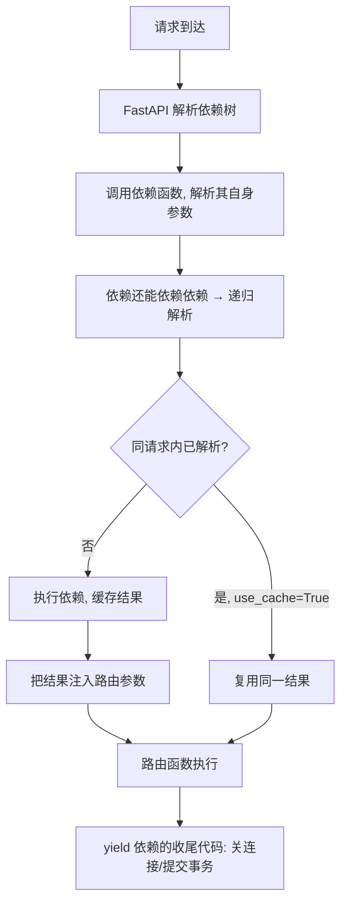

# 依赖注入 Depends 原理与生命周期

## 一句话总结

> **Depends 就是“我不关心依赖怎么造，你（FastAPI）帮我准备好塞进来”。它用函数参数声明依赖，框架在每次请求时自动解析、可嵌套、可缓存、可用 `yield` 做资源的‘开业+打烊’。结果：代码解耦、可测试、不重复。**

---

## 生活类比：高级餐厅的后厨协作

把 API 想成餐厅。`Depends` 不是服务员，而是**从点单到出餐的一整套协作流程**：

- **预处理（前）**：后厨备料——校验参数、建数据库连接（`yield` 之前）
- **出餐（中）**：把备好的料（db 会话、当前用户）交给厨师（路由函数）
- **后处理（后）**：收盘、记日志、关连接（`yield` 之后）

FastAPI 为每个请求**独立**地解析依赖，互不串味，天然线程安全。

## Depends 工作机制



**关键点**：
- 依赖可以是任何 callable：普通函数、`async def`、类（含 `__call__`）、类构造器。
- 子依赖会被**递归解析**，形成依赖链。
- 默认 `use_cache=True`：同一请求内多次用到同一依赖，只执行一次（如两个路由都要 `get_db`，拿到的是同一个 session）。

## 三种依赖形态

| 形态 | 写法 | 典型用途 |
| :--- | :--- | :--- |
| 共享逻辑函数 | `def common_params(q, skip, limit)` | 分页、公共查询参数 |
| 资源型（yield） | `def get_db(): ... yield db ... db.close()` | 数据库连接、事务 |
| 类依赖 | `class Pagination: def __init__(self, page, size)` | 分组参数、带状态 |

## yield 依赖 = 生命周期管理（重点）

```python
from typing import AsyncGenerator
from sqlalchemy.ext.asyncio import AsyncSession, async_sessionmaker

async def get_db(session_factory: async_sessionmaker[AsyncSession]) \
        -> AsyncGenerator[AsyncSession, None]:
    async with session_factory() as session:   # 预处理: 开连接
        yield session                            # 把 session 交给路由
        # 后处理: 路由返回后这里才继续 (提交/回滚/关闭由 async with 负责)

@app.get("/users/{user_id}")
async def get_user(user_id: int, db: AsyncSession = Depends(get_db)):
    ...
```

> ⚠️ **铁律**：`yield` 之后的代码在**路由返回响应之后**才执行（但响应发往客户端之前，默认 scope）。所以关闭连接、提交事务都放这里，但**别在 yield 后写业务逻辑**——那时请求早已处理完。

`Depends(..., scope="request")` 可让收尾延后到响应完全发送给客户端之后（适合写日志、 metrics）。

## 组合依赖：搭乐高式权限链

```python
def get_token(authorization: str = Header(None)) -> str:
    if not authorization or not authorization.startswith("Bearer "):
        raise HTTPException(401, "缺少 Authorization")
    return authorization.removeprefix("Bearer ")

def get_current_user(token: str = Depends(get_token)) -> dict:
    # 解码 JWT, 取用户
    ...

def get_admin_user(user: dict = Depends(get_current_user)) -> dict:
    if "admin" not in user.get("roles", []):
        raise HTTPException(403, "权限不足")
    return user

@app.get("/admin/dashboard")
async def dashboard(admin: dict = Depends(get_admin_user)):
    ...
```

一层套一层：`get_token → get_current_user → get_admin_user`。每层只管自己那点事，测试时可单独 mock 某一层。

## 与 Flask/Spring 对比

| 框架 | 注入方式 | 特点 |
| :--- | :--- | :--- |
| FastAPI | 方法参数注入 `Depends()` | 轻量、Pythonic、依赖即函数 |
| Spring | `@Autowired` 构造器注入 | 重、IoC 容器管理生命周期 |
| Flask | 通常手动 `g.xxx` 或上下文 | 无原生 DI，靠 `flask.g` 凑 |

## 易错点

1. **普通 `def` 依赖不能依赖 `async def` 依赖**：同步函数里不能 `await`，会报错。反过来可以。
2. **循环依赖**：A 依赖 B，B 又依赖 A → FastAPI 直接报错。设计上要避免。
3. **`use_cache=False`**：需要每次都重新执行时用，比如每次都要新鲜时间戳的依赖。
4. **`app.dependency_overrides`**：测试时把真实依赖换成假依赖（mock），是 FastAPI 可测试性的核心武器。

## 记忆口诀

> **Depends 不是调用，是声明——框架替你调用并注入。**
> **yield 前备料，yield 后收摊，中间交给路由。**
> **同请求同依赖只算一次（缓存），要新鲜就 use_cache=False。**
> **依赖能套依赖，搭出权限乐高链。**

---

## 
> ▶ 对应实操：[[02-路径参数与查询参数|02-路径参数与查询参数]]


> ▶ 对应实操：[[06-依赖注入|06-依赖注入]]

相关链接

- [[01-FastAPI为什么快-Starlette与Pydantic与async|FastAPI 为什么快]]
- [[06-JWT鉴权全链路|JWT 鉴权全链路]]
- SQLAlchemy 异步集成
- [[04-中间件Middleware机制|中间件机制]]
- [[语言与框架/Python/八股/00-Python|Python 八股文]]
- [[00-FastAPI-Web|FastAPI-Web 索引]]

## 速记卡（面试闪卡）

**Q1：一句话讲清「依赖注入 Depends 原理与生命周期」到底是什么？**
A：**Depends 就是“我不关心依赖怎么造，你（FastAPI）帮我准备好塞进来”。它用函数参数声明依赖，框架在每次请求时自动解析、可嵌套、可缓存、可用  做资源的‘开业+打烊’。结果：代码解耦、可测试、不重复。**
---

**Q2：一句话总结 —— 怎么理解？**
A：**Depends 就是“我不关心依赖怎么造，你（FastAPI）帮我准备好塞进来”。它用函数参数声明依赖，框架在每次请求时自动解析、可嵌套、可缓存、可用  做资源的‘开业+打烊’。结果：代码解耦、可测试、不重复。**
---

**Q3：生活类比：高级餐厅的后厨协作 —— 怎么理解？**
A：把 API 想成餐厅。 不是服务员，而是**从点单到出餐的一整套协作流程**：
**预处理（前）**：后厨备料——校验参数、建数据库连接（ 之前）
**出餐（中）**：把备好的料（db 会话、当前用户）交给厨师（路由函数）
**后处理（后）**：收盘、记日志、关连接（ 之后）
FastAPI 为每个请求**独立**地解析依赖，互不串味，天然线程安全。

**Q4：Depends 工作机制 —— 怎么理解？**
A：**关键点**：
依赖可以是任何 callable：普通函数、、类（含 ）、类构造器。
子依赖会被**递归解析**，形成依赖链。
默认 ：同一请求内多次用到同一依赖，只执行一次（如两个路由都要 ，拿到的是同一个 session）。

**Q5：三种依赖形态 —— 怎么理解？**
A：| 形态 | 写法 | 典型用途 |
| :--- | :--- | :--- |
| 共享逻辑函数 |  | 分页、公共查询参数 |
| 资源型（yield） |  | 数据库连接、事务 |
| 类依赖 |  | 分组参数、带状态 |

**Q6：核心速记主线有哪些？**
A：抓住这几根：一句话总结、生活类比：高级餐厅的后厨协作、Depends 工作机制、三种依赖形态、yield 依赖 = 生命周期管理（重点）、组合依赖：搭乐高式权限链。

