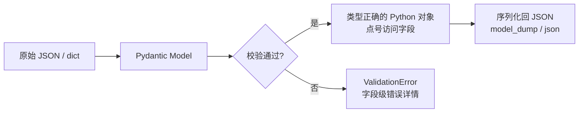

# Pydantic 数据校验与 v2 新特性

## 一句话总结

> **Pydantic 用 Python 类型注解把“进来的是不是合法数据”这件事自动化了：声明模型 → 自动校验 → 自动报详细错误 → 自动序列化出去。v2 把核心换成 Rust 写，快了一个数量级，并带来 `@field_validator`、`model_config`、`TypeAdapter` 等现代 API。**

---

## 生活类比：海关入境检查

请求体就像入境旅客。Pydantic 是**海关**：你提前贴出规则（模型字段+类型+约束），旅客一来就逐个核对——护照（类型）对不对、年龄（范围）合不合法、带没带违禁品（额外字段）。不合格当场遣返，并告诉你**哪本护照、哪个字段、为什么**不行。比你自己手写一堆 `if not isinstance(...)` 优雅一万倍。

## 核心三件事



1. **校验（Validation）**：把外部数据（JSON/query/form）按模型定义转成 Python 对象，类型不对就报错。
2. **错误报告**：报错不是一句“错了”，而是精确到 `body.items[2].price` 这种字段级信息。
3. **序列化（Serialization）**：`model_dump()` / `model_dump_json()` 把对象转回 dict/JSON，用于响应。

## 基础模型

```python
from pydantic import BaseModel, Field, EmailStr

class UserCreate(BaseModel):
    username: str = Field(..., min_length=3, max_length=20)
    age: int = Field(ge=0, le=150)
    email: EmailStr

# 非法输入直接抛 ValidationError
# UserCreate(username="a", age=-5, email="x") → 3 个字段错误一起报
```

> **BaseModel** 是 Pydantic 的模型基类；**Field** 用来给单个字段加约束（`ge`=greater or equal，`le`=less or equal 等）；**EmailStr** 是专用校验类型。

## v1 → v2 到底改了啥（重点）

| 维度 | v1 | v2 |
| :--- | :--- | :--- |
| 校验核心语言 | Python | **Rust**（`pydantic-core`），快数倍 |
| 配置类 | `class Config:` | `model_config = {...}`（dict） |
| 字段校验器 | `@validator` | **`@field_validator`**（推荐） |
| 对象级校验 | `@root_validator` | **`@model_validator`** |
| ORM 模式 | `orm_mode=True` | `from_attributes=True` |
| 允许任意类型 | `allow_population_by_field_name` | `populate_by_name` |
| JSON Schema 额外 | `Field(..., extra={...})` | `json_schema_extra={...}` |
| 字段别名属性 | `alias` 返回字段名 | 没设 alias 时返回 `None`（v1 返回字段名） |
| 约束改名 | `min_items` / `regex` | `min_length` / `pattern` |

## v2 亮点 API

### `@field_validator` 替代 `@validator`

```python
from pydantic import BaseModel, field_validator

class Item(BaseModel):
    name: str
    tags: list[str]

    @field_validator("name")
    @classmethod
    def name_must_be_capitalized(cls, v: str) -> str:
        if not v[0].isupper():
            raise ValueError("名字必须大写开头")
        return v

    # 列表里每个元素校验, 用 mode="after" + 注解在元素类型上
    @field_validator("tags")
    @classmethod
    def non_empty(cls, v: list[str]) -> list[str]:
        if not v:
            raise ValueError("tags 不能为空")
        return v
```

### `model_config` 与 `TypeAdapter`

```python
from pydantic import BaseModel, ConfigDict, TypeAdapter
from typing import Annotated

class User(BaseModel):
    model_config = ConfigDict(from_attributes=True)  # 替代 orm_mode
    name: str

# TypeAdapter: 给“非模型”的任意类型做校验/序列化
adapter = TypeAdapter(Annotated[list[int], Field(min_length=1)])
adapter.validate_python([1, 2, 3])   # OK
```

> **TypeAdapter** 是 v2 新增利器：给任意类型（包括 `list[str]`、联合类型）套上 Pydantic 的校验与 JSON Schema 能力，无需定义 BaseModel。

### `model_validator` 跨字段校验

```python
from pydantic import model_validator

class Range(BaseModel):
    start: int
    end: int
    @model_validator(mode="after")
    def check_order(self) -> "Range":
        if self.start > self.end:
            raise ValueError("start 不能大于 end")
        return self
```

## Rust 核心带来的性能

v2 的校验引擎用 Rust 写成，对复杂嵌套模型，校验速度比 v1 快数倍；在 FastAPI 这种“每个请求都校验”的场景下，这直接降低了 P99 延迟。FastAPI 从 0.100 起默认使用 Pydantic v2。

## 延伸追问

**Q：Pydantic 校验和手写 `if` 比，优势在哪？**
A：① 声明式、代码短；② 错误精确到字段，前端好处理；③ 自动出 JSON Schema → 驱动 OpenAPI 文档；④ 序列化/反序列化一体；⑤ 性能（v2 Rust）。

**Q：`model_dump()` vs `dict()`？**
A：v2 推荐 `model_dump()`；老 `dict()` 仍可用但属遗留。要出 JSON 字符串用 `model_dump_json()`。

**Q：敏感字段怎么不返回？**
A：用 `model_config = ConfigDict(...) ` 配 `exclude`，或在响应模型里只选要暴露的字段（FastAPI 的 `response_model`）。

## 记忆口诀

> **类型注解即规则，BaseModel 即模型。**
> **v1 的 validator → v2 的 field_validator；root_validator → model_validator。**
> **Config 类变 model_config，orm_mode 变 from_attributes。**
> **任意类型要校验，上 TypeAdapter。**
> **v2 换 Rust 核心，快到感觉不到校验。**

---

## 
> ▶ 对应实操：[[03-请求体与Pydantic|03-请求体与Pydantic]]


> ▶ 对应实操：[[09-Pydantic-v2进阶|09-Pydantic-v2进阶]]

相关链接

- [[01-FastAPI为什么快-Starlette与Pydantic与async|FastAPI 为什么快]]
- [[02-依赖注入Depends原理与生命周期|依赖注入 Depends]]
- [[06-JWT鉴权全链路|JWT 鉴权]]
- [[语言与框架/Python/八股/00-Python|Python 八股文]]
- [[00-FastAPI-Web|FastAPI-Web 索引]]

## 速记卡（面试闪卡）

**Q1：一句话讲清「Pydantic 数据校验与 v2 新特性」到底是什么？**
A：**Pydantic 用 Python 类型注解把“进来的是不是合法数据”这件事自动化了：声明模型 → 自动校验 → 自动报详细错误 → 自动序列化出去。v2 把核心换成 Rust 写，快了一个数量级，并带来 、、 等现代 API。**
---

**Q2：一句话总结 —— 怎么理解？**
A：**Pydantic 用 Python 类型注解把“进来的是不是合法数据”这件事自动化了：声明模型 → 自动校验 → 自动报详细错误 → 自动序列化出去。v2 把核心换成 Rust 写，快了一个数量级，并带来 、、 等现代 API。**
---

**Q3：生活类比：海关入境检查 —— 怎么理解？**
A：请求体就像入境旅客。Pydantic 是**海关**：你提前贴出规则（模型字段+类型+约束），旅客一来就逐个核对——护照（类型）对不对、年龄（范围）合不合法、带没带违禁品（额外字段）。不合格当场遣返，并告诉你**哪本护照、哪个字段、为什么**不行。比你自己手写一堆  优雅一万倍。

**Q4：核心三件事 —— 怎么理解？**
A：**校验（Validation）**：把外部数据（JSON/query/form）按模型定义转成 Python 对象，类型不对就报错。
**错误报告**：报错不是一句“错了”，而是精确到  这种字段级信息。
**序列化（Serialization）**： /  把对象转回 dict/JSON，用于响应。

**Q5：基础模型 —— 怎么理解？**
A：**BaseModel** 是 Pydantic 的模型基类；**Field** 用来给单个字段加约束（=greater or equal，=less or equal 等）；**EmailStr** 是专用校验类型。

**Q6：核心速记主线有哪些？**
A：抓住这几根：一句话总结、生活类比：海关入境检查、核心三件事、基础模型、v1 → v2 到底改了啥（重点）、v2 亮点 API。

