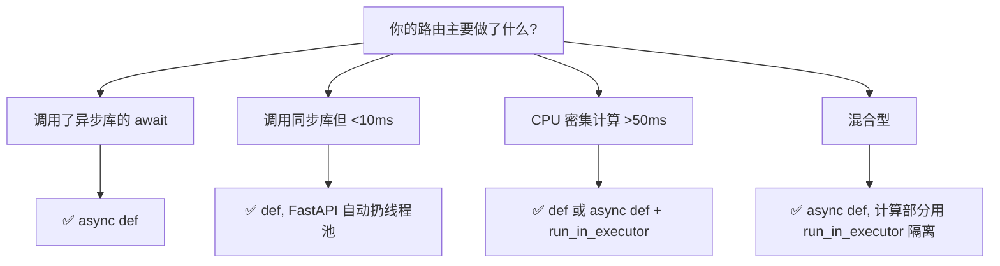

---

title: "def vs async def 路由选择"

created: "2026-07-20"

tags:

  - 八股文

  - fastapi-web

---

# def vs async def 路由选择

## 一句话总结

> **`def` = 同步（FastAPI 丢进线程池跑），`async def` = 异步（在事件循环里跑）。IO 密集型用 `async def`，CPU 密集型用 `def`；最致命的坑是：在 `async def` 里调同步阻塞 IO = 冻结整个事件循环，等于白写异步。**

---

## 核心：阻塞 vs 非阻塞


| 操作类型 | 例子 | 该用 |
| :--- | :--- | :--- |
| **IO 密集型** | 查数据库、调外部 API、读文件 | `async def` |
| **CPU 密集型** | 图像处理、PDF 生成、复杂计算 | `def`（或线程池） |
| **混合型** | 先查 DB 再处理数据再调 API | 看瓶颈在哪段 |

## FastAPI 里两者的真实行为
### `async def`

- FastAPI 直接调用，遇到 `await` 主动让出控制权

- **请求全程在一个事件循环线程里处理**

- 适合 IO 密集型

### `def`

- FastAPI 把函数丢进**线程池**（默认上限约 40）跑

- 主事件循环线程不被阻塞，其他异步请求照常

- 适合 CPU 密集型 + 同步库（不支持 async 时）

### 常见误区（⚠️必考）

```python

@app.get("/users")

async def get_users():

    users = db.query("SELECT * FROM users")  # ⚠️ 同步查询!

    # async def 里调了同步数据库 - 一样阻塞事件循环, 全员陪等

    return users

```

**`async def` 不保证异步**——只有里面所有 `await` 都是真正的异步库（asyncpg、httpx.AsyncClient）时才有收益。否则一个同步阻塞调用把整个事件循环冻住，所有并发请求排队。

## 选择决策树



> `run_in_executor` 可以把同步/CPU 密集代码“借”线程池跑，避免卡住事件循环：

> `await asyncio.get_running_loop().run_in_executor(None, cpu_heavy_func, arg)`

## 性能对比（量级参考）

| 场景 | `def` | `async def` |
| :--- | :--- | :--- |
| 纯 CPU 计算（1ms） | 🟢 最快 | 🟡 慢 ~3–5%（async 调度开销） |
| 异步 IO 等待（100ms） | 🟡 阻塞线程池 | 🟢 释放线程，全并发 |
| 100 并发异步等待 | ~300ms（线程池 40 上限） | ~100ms（全并发） |

## 原理深入：事件循环视角

`async def` 路由在事件循环里注册为一个协程。当协程 `await` 一个 IO 操作时，它“挂起”并把控制权交还事件循环，循环立刻去跑另一个就绪的协程。于是**等待时间被重叠**成并发。而 `def` 路由被塞进线程池，靠操作系统多线程实现并发——不依赖事件循环，但线程有创建/切换成本，且受 GIL 限制（CPU 密集时多线程并不能真并行）。

详见 [[语言与框架/Python/八股/00-Python|Python 八股文]]。

## 记忆口诀

> **async 等 IO 时干别的事，def 干活时不动。**

> **CPU 密集用 def，IO 密集用 async。**

> **async def 不加 await = 白写；async 里写同步阻塞 = 全员罚站。**

---

##

> ▶ 对应实操：[[05-错误处理与数据校验|05-错误处理与数据校验]]

> ▶ 对应实操：[[01-FastAPI入门与环境搭建|01-FastAPI入门与环境搭建]]

## 速记卡（面试闪卡）

**Q1：一句话讲清「def vs async def 路由选择」到底是什么？**

A：FastAPI 同步与异步路由的分工与坑。

**Q2：阻塞 vs 非阻塞：CPU 在空等还是真干 —— 怎么理解？**

A：像排队买奶茶：阻塞是你干站着刷手机等出餐（CPU 空等 IO）；非阻塞是你边等边帮朋友挑小料（CPU 真干活）。IO 密集（查库/调 API）用 async def，CPU 密集（算图）用 def。核心是 Event Loop（事件循环）让等待重叠成并发。

**Q3：async def 在事件循环，def 丢线程池 —— 怎么理解？**

A：像餐厅：async def 是同一个金牌服务员在台前轮流照顾各桌（一个 Event Loop 线程）；def 是把活甩给后厨一堆临时工（Thread Pool 线程池，默认约 40 个）。async def 不保证异步——里面只要调一次同步阻塞 IO，全员陪站、循环冻结。

**Q4：决策树：看瓶颈是等 IO 还是烧 CPU —— 怎么理解？**

A：像挂号分诊：调了异步 await→async def；同步库<10ms→def 自动扔线程池；CPU 密集>50ms→def 或 run_in_executor；混合型→async def 配 run_in_executor 隔离。一句话：瓶颈在等用 Async I/O（异步 IO），瓶颈在算用 def。

**Q5：事件循环：await 时挂起交还控制权 —— 怎么理解？**

A：像打麻将：async def 摸到要等别人出牌（await IO）就先喊「过，我先歇会」（挂起），让循环去跑另一桌；def 则靠多线程 Concurrency（并发）硬扛，但受 GIL 限制 CPU 密集不能真并行。等待时间被重叠，并发就出来了。

**Q6：核心速记主线有哪些？**

- async def 走事件循环协程

- def 丢线程池跑同步库

- 最坑：异步里写同步阻塞

- 决策看 IO/CPU 瓶颈

**口诀**

A：def 同步丢进线程池，async 循环里飞

IO 密集用 async，CPU 密集用 def

异步里写阻塞全员站，事件循环被冻碎

瓶颈看清再选型，并发性能不白费

相关链接

- [[01-FastAPI为什么快-Starlette与Pydantic与async|FastAPI 为什么快]]

- [[13-FastAPI性能优化-连接池与uvicorn-workers|性能优化]]

- SQLAlchemy 异步集成

- [[语言与框架/Python/八股/00-Python|Python 八股文]]

- [[00-FastAPI-Web|FastAPI-Web 索引]]

## 相关链接

- [[笔记/语言与框架/FastAPI/八股/12-BackgroundTasks与Celery对比|BackgroundTasks vs Celery 对比]]

- [[笔记/语言与框架/FastAPI/八股/10-SQLAlchemy2.0异步集成|SQLAlchemy 2.0 异步集成]]

- [[笔记/语言与框架/FastAPI/八股/01-FastAPI为什么快-Starlette与Pydantic与async|FastAPI 为什么快？（Starlette + Pydantic + async）]]

- [[笔记/语言与框架/FastAPI/八股/07-SSE流式响应StreamingResponse|SSE 流式响应 StreamingResponse]]

- [[笔记/语言与框架/FastAPI/八股/08-CORS跨域配置|CORS 跨域配置]]

