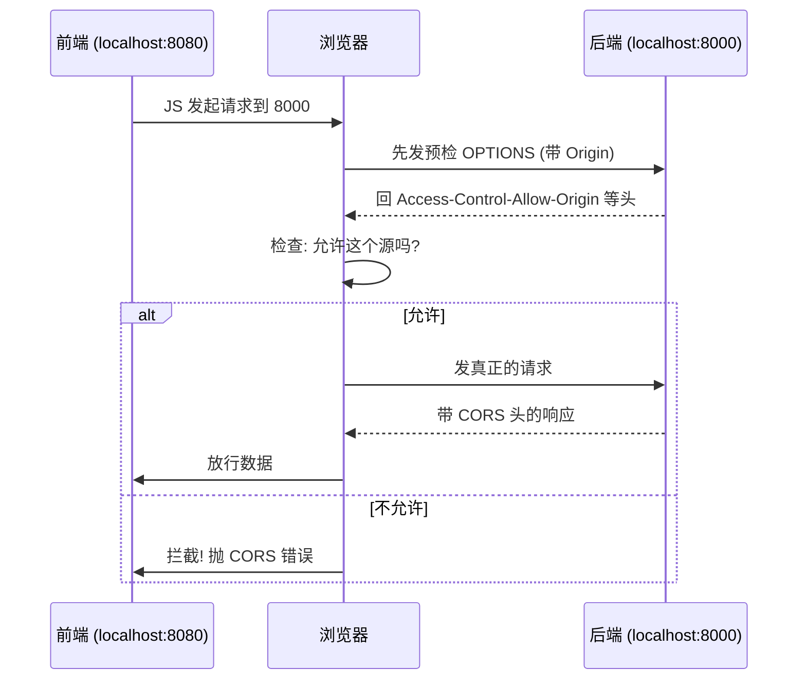

---

title: "CORS 跨域配置"

created: "2026-07-20"

tags:

  - 八股文

  - fastapi-web

---


# CORS 跨域配置

## 一句话总结


> **CORS（Cross-Origin Resource Sharing，跨域资源共享）是浏览器的“门禁规则”：当前端 JS 想访问“另一个源”的后端时，浏览器先替后端问一句“你允许这个源吗？”。FastAPI 用 `CORSMiddleware` 回这张放行条（响应头 `Access-Control-Allow-Origin` 等），否则浏览器直接拦掉响应。**


---


## 先搞清“源”是什么


**源（Origin）= 协议 + 域名 + 端口**。三者任一不同就是跨域：


```text

http://localhost:8080   vs   http://localhost:8000

  协议 http = http, 域名 localhost = localhost, 但端口 8080 ≠ 8000 → 跨域!

```


哪怕都在 localhost，端口不同也算不同源。详见 [[计算机基础/计算机网络/00-计算机网络|计算机网络 八股文]]。


## 浏览器怎么处理跨域请求





## 两种请求


| 类型 | 条件 | 浏览器行为 |
| :--- | :--- | :--- |
| **简单请求** | GET/POST/HEAD + 安全头（无自定义授权头） | 直接发，响应带 CORS 头即可 |
| **预检请求（preflight）** | 带 `Authorization`、自定义头、非简单方法 | 先发 `OPTIONS` 问权限，过了才发真请求 |


> 只要你用 `Authorization: Bearer <token>`（JWT 鉴权几乎必用），就触发**预检**。FastAPI 的 `CORSMiddleware` 会自动应答 OPTIONS 预检。


## FastAPI 配置（标准写法）


```python

from fastapi import FastAPI

from fastapi.middleware.cors import CORSMiddleware


app = FastAPI()


origins = [

    "http://localhost:5173",   # 前端 dev server

    "https://myapp.com",       # 生产域名

]


app.add_middleware(

    CORSMiddleware,

    allow_origins=origins,        # 放行哪些源

    allow_credentials=True,       # 允许带 cookie / Authorization

    allow_methods=["*"],          # 放行所有 HTTP 方法

    allow_headers=["*"],          # 放行所有请求头

)

```


## 参数速查


| 参数 | 作用 | 注意 |
| :--- | :--- | :--- |
| `allow_origins` | 放行的源列表 | `["*"]` 允许全部，但**不能**和 credentials 同用 |
| `allow_origin_regex` | 正则匹配源 | `'https://.*\.example\.org'` |
| `allow_methods` | 放行方法 | 默认 `['GET']`；`['*']` 全放 |
| `allow_headers` | 放行请求头 | `['*']` 全放 |
| `allow_credentials` | 允许凭证 | 为 `True` 时 origins 必须**明确列出**，不能用 `*` |
| `expose_headers` | 暴露给浏览器的响应头 | 自定义 `X-` 头要在这声明 |
| `max_age` | 预检结果缓存秒数 | 默认 600 |


## ⚠️ 两个致命错误


1. **`allow_origins=["*"]` + `allow_credentials=True`** → FastAPI 启动直接 `ValueError`。规范禁止“任意源 + 带凭证”，否则任意恶意网站都能冒用登录用户发请求。生产环境必须显式列出源。

2. **开发硬编码 `localhost:8000`** → 上线就废。生产从环境变量读 `CORS_ORIGINS`。


```python

# 生产推荐: 从环境变量读

import os

origins = os.getenv("CORS_ORIGINS", "").split(",") if os.getenv("CORS_ORIGINS") else []

```


## 开发 vs 生产：CORS vs 代理


| 场景 | 方案 |
| :--- | :--- |
| 本地开发 | Vite/Webpack 代理（浏览器只看到一个源，免 CORS） |
| 生产部署 | `CORSMiddleware`（必须） |
| 移动端/Postman | `CORSMiddleware`（无法用代理） |


> CORS 是**浏览器**的安全机制，服务端到服务端（如 Vite 代理转发）不受它约束。


## 延伸追问


**Q：CORS 是后端限制还是前端限制？**

A：是**浏览器**的限制。服务端收到跨域请求照样能处理，只是浏览器看到响应没有正确的 CORS 头就**不把数据交给 JS**。用 curl/Postman 测跨域接口通常“正常”，因为那些不是浏览器。


**Q：为什么 JWT 几乎必然触发预检？**

A：因为 JWT 放 `Authorization` 头，属于“非简单请求头”，浏览器必须预检。


## 记忆口诀


> **CORS 是浏览器门禁，后端回放行条(Allow-Origin)。**

> **源=协议+域名+端口，一个不同就跨域。**

> **带 Authorization → 触发预检 OPTIONS。**

> **生产别用 * + credentials，显式列源保平安。**


---


##

> ▶ 对应实操：[[08-后台任务与CORS|08-后台任务与CORS]]


## 速记卡（面试闪卡）


**Q1：一句话讲清「CORS 跨域配置」到底是什么？**

A：CORS 跨域配置指在后端（如 FastAPI）设置放行规则，让浏览器允许前端跨源访问资源的安全机制。


**Q2：一句话总结 —— 怎么理解？**

A：像后端回门禁放行条：CORS 是浏览器规则，前端 JS 访问另一源时，浏览器先问“你允许这源吗”，后端用响应头 Access-Control-Allow-Origin 等答复，否则浏览器拦掉响应。CORS（跨域资源共享）。


**Q3：先搞清“源”是什么 —— 怎么理解？**

A：像同一小区同栋同单元：源 = 协议+域名+端口，任一不同即跨域，即便同 localhost 端口不同也算。浏览器拿请求 Origin 比对服务器 Allow-Origin，对不上就拒。Origin（源）。


**Q4：浏览器怎么处理跨域请求 —— 怎么理解？**

A：像门禁员把关：简单请求（GET/POST/HEAD+无自定义授权头）直接发、响应带 CORS 头即过；带 Authorization 等触发预检，先发 OPTIONS 问权限、过了才发真请求。FastAPI 的 CORSMiddleware 自动应答预检。Preflight（预检）。


**Q5：两种请求 —— 怎么理解？**

A：像免检与报关两通道：简单请求条件为安全方法+安全头，直接放行；预检请求带 Authorization、自定义头或非简单方法，先 OPTIONS 探路。JWT 几乎必触发预检，因放 Authorization 头。Simple vs Preflight（简单与预检请求）。


**Q6：核心速记主线有哪些？**

- 一句话：CORS 是浏览器门禁，后端回 Allow-Origin 放行条

- 源：协议+域名+端口，任一不同即跨域

- 处理：简单请求直发，带授权触发 OPTIONS 预检

- 两致命错：*+credentials 报错、硬编码 localhost


**口诀**

A：CORS 是浏览器门禁，后端回放行条 Allow-Origin

源=协议+域名+端口，一个不同就跨域

带 Authorization 触发预检 OPTIONS，中间件自动应

生产别用 * + credentials，显式列源保平安


相关链接


- [[04-中间件Middleware机制|中间件]]

- [[06-JWT鉴权全链路|JWT 鉴权]]

- [[02-依赖注入Depends原理与生命周期|依赖注入 Depends]]

- [[计算机基础/计算机网络/00-计算机网络|计算机网络 八股文]]

- [[00-FastAPI-Web|FastAPI-Web 索引]]

## 相关链接


- [[笔记/语言与框架/FastAPI/八股/12-BackgroundTasks与Celery对比|BackgroundTasks vs Celery 对比]]

- [[笔记/语言与框架/FastAPI/八股/07-SSE流式响应StreamingResponse|SSE 流式响应 StreamingResponse]]

- [[笔记/语言与框架/FastAPI/八股/04-中间件Middleware机制|中间件 Middleware 机制]]

- [[笔记/语言与框架/FastAPI/八股/11-ORM关系映射与N+1查询解决|ORM 关系映射与 N+1 查询解决]]

- [[笔记/语言与框架/FastAPI/八股/09-全局异常处理|全局异常处理 @app.exception_handler]]

