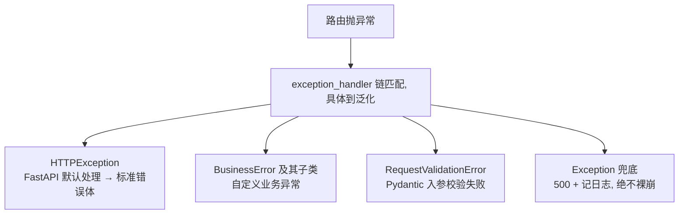

---

title: "全局异常处理 @app.exception_handler"

created: "2026-07-20"

tags:

  - 八股文

  - fastapi-web

---


# 全局异常处理 @app.exception_handler

## 一句话总结


> **不想在每个路由写 try-except，就挂全局异常处理器——不管哪条路由崩了，统一格式化、记日志、返回优雅的错误。分层处理：HTTPException 走默认、业务异常走自定义、校验错误走 Pydantic、兜底 500 记日志。**


---


## 生活类比：大楼的统一应急出口


每个房间（路由）都可能着火（抛异常）。你不会在每个房间装独立逃生通道，而是建**统一的消防通道 + 警报中心**：无论哪间房出事，人都从统一出口疏散，警报中心记录火情。全局异常处理器就是这套应急系统。


## 基础用法


```python

from fastapi import FastAPI, Request

from fastapi.responses import JSONResponse


app = FastAPI()


class BusinessError(Exception):

    def __init__(self, code: int, message: str):

        self.code = code

        self.message = message


@app.exception_handler(BusinessError)

async def business_error_handler(request: Request, exc: BusinessError):

    return JSONResponse(

        status_code=exc.code,

        content={"code": exc.code, "message": exc.message, "success": False},

    )


@app.exception_handler(Exception)

async def global_error_handler(request: Request, exc: Exception):

    logger.error(f"Unhandled error: {exc}", exc_info=True)   # 记日志

    return JSONResponse(

        status_code=500,

        content={"code": 500, "message": "服务器内部错误", "success": False},

    )

```


## 分层异常体系（推荐）





```python

class BusinessError(Exception): ...

class NotFoundError(BusinessError): ...

class AuthError(BusinessError): ...


@app.get("/users/{id}")

async def get_user(id: int):

    user = await db.get(User, id)

    if not user:

        raise NotFoundError(code=404, message="用户不存在")   # 路由里只管抛

    return user

```


> 路由只负责“抛”，不负责“怎么回”。统一在 handler 里决定 HTTP 状态码、错误体格式、是否记日志。


## 自定义 422（Pydantic 校验错误）


FastAPI 默认把校验失败返回 422 + 字段级错误。想统一成自己的格式：


```python

from fastapi.exceptions import RequestValidationError


@app.exception_handler(RequestValidationError)

async def validation_handler(request: Request, exc: RequestValidationError):

    return JSONResponse(

        status_code=422,

        content={"code": 422, "message": "参数校验失败", "detail": exc.errors()},

    )

```


## 进阶替代：自定义异常基类 + 注册


更优雅的做法是定义一个 `AppException` 基类，所有业务异常继承它，并统一一个 handler 根据异常的 `code`/`message` 返回——避免每个异常写一个 handler。


## 与中间件、依赖的生命周期顺序


异常发生后的处理顺序：**依赖的 yield 收尾 → 后台任务 → 中间件后处理 → 全局异常处理器**。所以异常处理器拿到的响应会再过一遍中间件的后处理。


## 延伸追问


**Q：全局 500 handler 会不会吞掉原始错误？**

A：会“对客户端吞掉细节”（避免泄露堆栈），但**必须**在 handler 里 `logger.error(..., exc_info=True)` 把原始堆栈记到服务端日志，否则排错时无据可查。


**Q：`HTTPException` 和业务异常谁先匹配？**

A：FastAPI 按“最具体”的 handler 匹配。你注册了 `BusinessError` 的 handler，就走它；没注册的具体异常，往上找父类 handler，最后落到 `Exception` 兜底。


## 记忆口诀


> **路由只管抛，handler 管怎么回。**

> **HTTPException 默认管，BusinessError 自定义管，Exception 兜底记日志。**

> **校验失败是 RequestValidationError，统一成你的 422。**

> **兜底 500 必须记日志，别让客户端看到堆栈。**


---


##

> ▶ 对应实操：[[09-Pydantic-v2进阶|09-Pydantic-v2进阶]]


> ▶ 对应实操：[[05-错误处理与数据校验|05-错误处理与数据校验]]


## 速记卡（面试闪卡）


**Q1：一句话讲清「全局异常处理 @app.exception_handler」到底是什么？**

A：全局异常处理器（@app.exception_handler）统一拦截各路由抛出的异常，格式化返回并记日志，避免每处写 try-except。


**Q2：一句话总结 —— 怎么理解？**

A：像大楼统一应急系统：全局异常处理（Global Exception Handler）让你不用每个路由写 try-except，哪条路由崩了都统一格式化、记日志、返回优雅错误。


**Q3：生活类比：大楼的统一应急出口 —— 怎么理解？**

A：像统一消防通道：每个房间（路由）都可能着火（抛异常），与其每间房装独立逃生通道，不如建统一出口加警报中心（全局处理器），无论哪间出事都从统一出口疏散并记录。


**Q4：基础用法 —— 怎么理解？**

A：像给不同类型火灾配不同灭火器：用 @app.exception_handler(BusinessError) 自定义业务异常返回 JSON，@app.exception_handler(Exception) 兜底 500 并 logger.error 记堆栈。


**Q5：分层异常体系（推荐） —— 怎么理解？**

A：像分诊台按伤情分级：HTTPException（默认处理）、BusinessError（自定义业务）、RequestValidationError（Pydantic 校验）、Exception（兜底 500），路由只管抛、handler 管怎么回。


**Q6：核心速记主线有哪些？**

- 全局异常处理器统一拦截路由异常，路由只管抛、handler 决定状态码与错误体是否记日志

- 分层：HTTPException 默认管、BusinessError 自定义管、RequestValidationError 统一 422、Exception 兜底 500

- 兜底 500 必须 logger.error(exc_info=True) 记原始堆栈，别把细节泄露给客户端

- 处理顺序：依赖 yield 收尾，后台任务，中间件后处理，最后才到全局异常处理器


**口诀**

A：路由只管抛，handler 管回

HTTP 默认业务自定义，422 校验要归位

兜底 500 必记日志，堆栈别给客户端看

依赖中间件先后序，统一出口心不慌


相关链接


- [[02-依赖注入Depends原理与生命周期|依赖注入 Depends]]

- [[04-中间件Middleware机制|中间件]]

- [[03-Pydantic数据校验与v2新特性|Pydantic 校验]]

- [[06-JWT鉴权全链路|JWT 鉴权]]

- [[语言与框架/Python/八股/00-Python|Python 八股文]]

- [[00-FastAPI-Web|FastAPI-Web 索引]]

## 相关链接


- [[笔记/语言与框架/FastAPI/八股/12-BackgroundTasks与Celery对比|BackgroundTasks vs Celery 对比]]

- [[笔记/语言与框架/FastAPI/八股/04-中间件Middleware机制|中间件 Middleware 机制]]

- [[笔记/语言与框架/FastAPI/八股/03-Pydantic数据校验与v2新特性|Pydantic 数据校验与 v2 新特性]]

- [[笔记/语言与框架/FastAPI/八股/02-依赖注入Depends原理与生命周期|依赖注入 Depends 原理与生命周期]]

- [[笔记/语言与框架/FastAPI/八股/07-SSE流式响应StreamingResponse|SSE 流式响应 StreamingResponse]]

