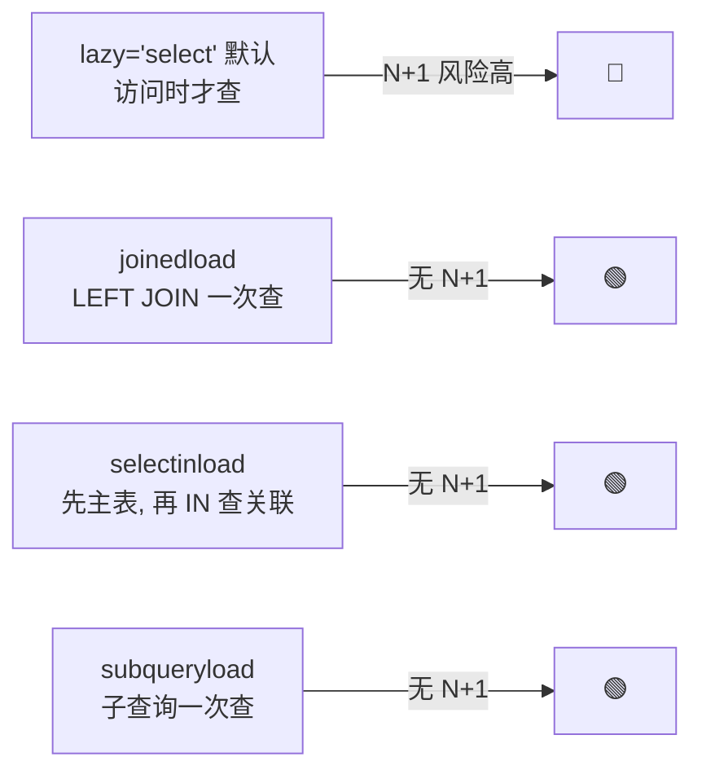

---

title: "ORM 关系映射与 N+1 查询解决"

created: "2026-07-20"

tags:

  - 八股文

  - fastapi-web

---


# ORM 关系映射与 N+1 查询解决

## 一句话总结


> **ORM 关系映射 = 告诉 ORM 表和表怎么连（一对一/一对多/多对多）。N+1 = 先查 1 次拿 N 条主记录，再每条访问关联时偷偷多查 1 次，共 N+1 次 SQL。解法是 eager loading（提前加载）：`selectinload` / `joinedload`。**


---


## 生活类比：快递拆包


你买了 N 个包裹（主表 N 条），每个包裹里有一张发票（关联表）。**懒加载（Lazy）**就像：你拆第 1 个包裹才发现要发票，跑去档案室查一次；拆第 2 个又跑一次……拆 N 个跑 N 次，加上最开始拿包裹清单的 1 次 = **N+1 趟**。**Eager loading（急加载）**则是：拿包裹清单时，一次性把 N 张发票也全取回来，一趟搞定。


## 三种关系映射


| 关系 | 代码关键 | 类比 |

| :--- | :--- | :--- |

| 一对一 | `uselist=False` / `relationship("Profile", uselist=False)` | 一个人一个身份证 |

| 一对多 | `relationship("Post")` 返回集合 | 一个人多篇文章 |

| 多对多 | `secondary=association_table` 中间表 | 文章和标签 |


```python

class User(Base):

    __tablename__ = "users"

    id = mapped_column(Integer, primary_key=True)

    posts = relationship("Post", back_populates="author")   # 一对多


class Post(Base):

    __tablename__ = "posts"

    id = mapped_column(Integer, primary_key=True)

    author_id = mapped_column(ForeignKey("users.id"))

    author = relationship("User", back_populates="posts")   # 多对一

```


## N+1 问题（经典性能坑）


```python

posts = (await session.execute(select(Post))).scalars().all()  # 1 条 SQL

for post in posts:

    print(post.author.name)   # 每条触发 1 条 SQL 查 author → N 条

```


**1 + N 次查询**，而且代码里看不到那些多余的 SQL——它们藏在属性访问背后。数据量大时直接拖垮接口。


## 四种加载策略对比





| 方案 | 行为 | N+1 风险 |

| :--- | :--- | :--- |

| `lazy="select"`（默认） | 访问关联时才查 | 🔴 最高 |

| `joinedload` | LEFT JOIN 一次性查出 | 🟢 无（一对多需小心分页重复行） |

| **`selectinload`**（推荐） | 先查主表，再用 `IN` 查关联 | 🟢 无 |

| `subqueryload` | 用子查询一次查出 | 🟢 无 |


### selectinload（首选，最稳）


```python

from sqlalchemy.orm import selectinload


stmt = select(Post).options(selectinload(Post.author))

posts = (await session.execute(stmt)).scalars().all()

#      SELECT * FROM users WHERE id IN (1,2,3,...);   ← 只多 1 条

```


### joinedload


```python

from sqlalchemy.orm import joinedload

stmt = select(Post).options(joinedload(Post.author))

# SQL: SELECT * FROM posts LEFT JOIN users ON ...

```


> **选型经验**：多对一/一对一用 `joinedload`（JOIN 高效）；一对多/多对多用 `selectinload`（IN 查询比 JOIN 更稳，避免一对多分页时行膨胀）。


## 为什么异步下更要小心


在 `AsyncSession` 里，懒加载访问关联会尝试发 SQL，但异步上下文没有“隐式事件循环执行”机制，常常直接报错。所以异步项目里**默认就该用 eager loading**，别依赖 lazy。


## 延伸追问


**Q：怎么发现 N+1？**

A：开 SQLAlchemy 的 `echo=True` 或配 `logging`，看日志里 SELECT 条数；或用 `sqlalchemy.profiler` 统计。看到“1 条主查询 + 一堆相同结构的小查询”就是典型 N+1。


**Q：joinedload 一对多分页为什么有坑？**

A：LEFT JOIN 后一行主记录会因多个关联行而重复，用 `LIMIT` 分页会算错。此时用 `selectinload` 或先分页再加载关联更安全。


## 记忆口诀


> **一对一/一对多用 relationship 声明；多对多靠 secondary 中间表。**

> **N+1：1 查主 + N 查关联，藏在属性访问里最阴。**

> **多对一/一对一 joinedload，一对多/多对多 selectinload。**

> **异步项目默认 eager，别等 lazy 报错才改。**


---


##

> ▶ 对应实操：[[11-异步SQLAlchemy与连接池|11-异步SQLAlchemy与连接池]]


> ▶ 对应实操：[[06-SQLAlchemy与ORM实战|06-SQLAlchemy与ORM实战]]


## 速记卡（面试闪卡）


**Q1：一句话讲清「ORM 关系映射与 N+1 查询解决」到底是什么？**

A：ORM 用 relationship 声明表间关系；N+1 是懒加载导致 1 次主查 + N 次关联查，用 eager loading 解决。


**Q2：生活类比：快递拆包 —— 怎么理解？**

A：像"拆 N 个包裹找发票"：懒加载（Lazy）拆第 1 个才发现要发票，跑档案室查一次，拆 N 个跑 N 次 + 拿清单 1 次 = N+1 趟；急加载（eager loading）拿清单时一次性把 N 张发票全取回，一趟搞定。差别就在"要不要来回跑"。


**Q3：三种关系映射 —— 怎么理解？**

A：像"建档案索引"：一对一（一个人一个身份证）用 uselist=False；一对多（一个人多篇文章）relationship 返回集合；多对多（文章和标签）靠 secondary 中间表。你写 Python 对象，ORM 自动生成 JOIN SQL，不用手写。


**Q4：N+1 问题（经典性能坑） —— 怎么理解？**

A：代码中 for post in posts: print(post.author.name) 每条触发一条查 author 的 SQL，但 SQL 藏在属性访问背后，日志里才看得到。数据量大直接拖垮接口，还不易察觉——这就是 N+1 最阴险的地方。


**Q5：四种加载策略对比 —— 怎么理解？**

A：像"四种取货方式"：lazy（默认，访问才查，N+1 最高危）；joinedload（LEFT JOIN 一次查，但一对多分页会行膨胀）；selectinload（推荐，先主表再用 IN 查关联，最稳）；subqueryload（子查询一次查）。异步项目默认就该 eager，别依赖 lazy。


**Q6：核心速记主线有哪些？**

- ORM 三种关系：一对一/一对多/多对多 + secondary

- N+1 = 1 次主查 + N 次关联查，藏在属性访问里

- 四策略：lazy / joinedload / selectinload / subqueryload

- 推荐 selectinload，异步项目默认 eager loading


**口诀**

A：一对一多对多，relationship 来牵线；

多对多靠中间表，secondary 搭桥梁。

N+1 拆包跑断腿，1 查主来 N 查联；

joinedload 一对多慎分页，selectinload 最稳当。


相关链接


- SQLAlchemy 异步集成

- [[02-依赖注入Depends原理与生命周期|依赖注入 Depends]]

- [[语言与框架/MySQL/八股/00-MySQL|MySQL 八股文]]

- [[00-FastAPI-Web|FastAPI-Web 索引]]

## 相关链接


- [[笔记/语言与框架/FastAPI/八股/12-BackgroundTasks与Celery对比|BackgroundTasks vs Celery 对比]]

- [[笔记/语言与框架/FastAPI/八股/04-中间件Middleware机制|中间件 Middleware 机制]]

- [[笔记/语言与框架/FastAPI/八股/03-Pydantic数据校验与v2新特性|Pydantic 数据校验与 v2 新特性]]

- [[笔记/语言与框架/FastAPI/八股/07-SSE流式响应StreamingResponse|SSE 流式响应 StreamingResponse]]

- [[笔记/语言与框架/FastAPI/八股/09-全局异常处理|全局异常处理 @app.exception_handler]]

