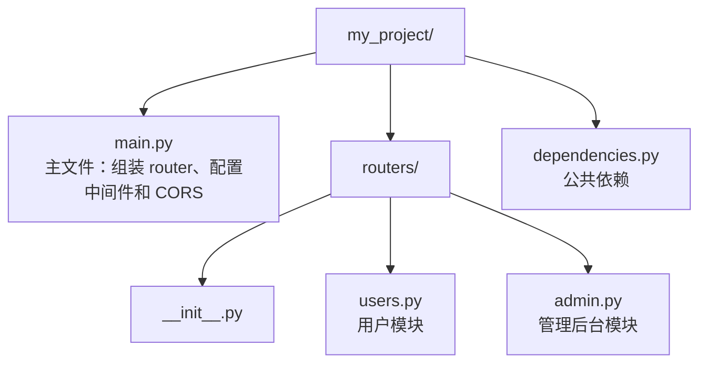

# 后台任务与CORS

> 写给初学者：每个概念都从"为什么需要它"开始讲，配合通俗比喻和完整可运行代码。

---

## 一、后台任务（BackgroundTasks）

### 1.1 为什么需要后台任务？

有些操作耗时但不需要等结果，比如：
- 发送注册确认邮件
- 写操作日志
- 生成报表

如果同步等待这些操作完成，用户就要多等几秒。**后台任务让这些操作在响应返回之后再执行。**

### 1.2 基本用法

```python
from fastapi import FastAPI, BackgroundTasks

app = FastAPI()

# 后台任务函数：普通函数就行，不需要 async def
def send_email(email: str, message: str):
    """模拟发送邮件（耗时操作）"""
    import time
    time.sleep(2)  # 模拟发邮件耗时 2 秒
    print(f"邮件已发送到 {email}: {message}")

def write_log(action: str):
    """写操作日志——追加写入文件"""
    with open("log.txt", "a") as f:
        f.write(f"操作: {action}\n")

@app.post("/register")
async def register(
    username: str,
    email: str,
    background_tasks: BackgroundTasks            # FastAPI 自动注入
):
    # add_task 的用法：add_task(函数名, 参数1, 参数2, ...)
    # ⚠️ 传的是函数名 send_email，不是 send_email()！不要加括号！
    background_tasks.add_task(send_email, email, f"欢迎 {username} 注册！")
    background_tasks.add_task(write_log, f"新用户注册: {username}")

    # 这行会立即执行，不用等上面两个任务完成
    return {"msg": "注册成功，确认邮件稍后发送"}
```

**执行流程**：
1. 用户请求 `/register`
2. 接口函数立即返回 `{"msg": "注册成功..."}`
3. 用户收到响应后，FastAPI 在后台执行 `send_email` 和 `write_log`

**通俗比喻**：你去餐厅点菜，服务员说"菜马上来"（返回响应），厨师在后台做菜（后台任务）。你不用站在厨房门口等。

**后台任务 vs 同步等待的区别**：

```python
# ❌ 同步写法：用户要等邮件发完才能收到响应（2 秒）
@app.post("/register-sync")
async def register_sync(email: str):
    send_email(email, "欢迎注册！")  # 直接调用，同步执行
    return {"msg": "注册成功"}       # 2 秒后才返回

# ✅ 后台写法：用户立即收到响应（0.01 秒）
@app.post("/register-async")
async def register_async(email: str, background_tasks: BackgroundTasks):
    background_tasks.add_task(send_email, email, "欢迎注册！")
    return {"msg": "注册成功，确认邮件稍后发送"}
```

### 1.3 后台任务 + 依赖注入

```python
async def get_user_and_log(
    background_tasks: BackgroundTasks,
    user_id: int
):
    """依赖函数：查询用户 + 记录查询日志"""
    user = {"id": user_id, "name": "张三"}
    background_tasks.add_task(write_log, f"查询用户: {user_id}")
    return user

@app.get("/users/{user_id}")
async def get_user(user: dict = Depends(get_user_and_log)):
    return user
```

---

## 二、跨域（CORS）

### 2.1 什么是 CORS？

**"域"是什么？** `协议 + 域名 + 端口` 三者合起来叫一个"域"。

```text
http://localhost:3000
↑       ↑           ↑
协议    域名        端口
```

两个 URL，只要**任何一个**不同，就是"跨域"：

| 前端 | 后端 | 跨域？ | 原因 |
|------|------|--------|------|
| `http://localhost:3000` | `http://localhost:8000` | ✅ | 端口不同 |
| `http://localhost:3000` | `https://localhost:3000` | ✅ | 协议不同 |
| `http://localhost:3000` | `http://api.example.com` | ✅ | 域名不同 |
| `http://localhost:3000` | `http://localhost:3000` | ❌ | 完全相同 |

**为什么会拦截？** 这是浏览器的**同源策略**——JavaScript 只能请求和当前页面同源的地址，防止恶意网站偷你的数据。

**通俗比喻**：你家小区门禁——只有本小区住户（同源）能进，外人（跨域）被拦在门口。CORS 就是你告诉门禁："这个快递员（前端）是我叫的，让他进来。"

**注意**：CORS 是**浏览器**的限制。你用 curl、Postman 或 Python requests 请求，不会有这个问题。

### 2.2 基本用法

```python
from fastapi import FastAPI
from fastapi.middleware.cors import CORSMiddleware

app = FastAPI()

# 配置 CORS：告诉浏览器"允许哪些前端地址访问我的 API"
app.add_middleware(
    CORSMiddleware,
    allow_origins=[                                  # 允许的前端地址列表
        "http://localhost:3000",                     # 本地开发的前端
        "https://yourdomain.com"                     # 线上生产的前端域名
    ],
    allow_credentials=True,   # 允许前端携带 Cookie
    allow_methods=["*"],      # 允许所有 HTTP 方法
    allow_headers=["*"],      # 允许所有请求头
)
```

### 2.3 开发环境 vs 生产环境

```python
# ========== 开发环境：允许所有来源 ==========
app.add_middleware(
    CORSMiddleware,
    allow_origins=["*"],  # ⚠️ "*" 表示"所有网站"，仅限开发！
    allow_methods=["*"],
    allow_headers=["*"],
)

# ========== 生产环境：只允许你的前端域名 ==========
app.add_middleware(
    CORSMiddleware,
    allow_origins=["https://yourdomain.com"],           # 只允许你的前端域名
    allow_methods=["GET", "POST", "PUT", "DELETE"],     # 只开放用到的方法
    allow_headers=["Authorization", "Content-Type"],    # 只开放需要的请求头
)
```

**为什么生产环境不能用 `*`？** 因为 `*` 表示"任何网站都能请求你的 API"。如果有人做了一个钓鱼网站，用户的浏览器会自动带上 Cookie，钓鱼网站就能冒充用户调用你的 API——这就是 CSRF 攻击。

---

## 三、综合实战

### 3.1 完整项目结构



### 3.2 main.py —— 主文件（组装一切）

```python
# main.py —— 主文件：创建 app，注册 router，配置中间件和 CORS

from fastapi import FastAPI, Request
from fastapi.middleware.cors import CORSMiddleware
import time
import logging

from routers.users import router as users_router
from routers.admin import router as admin_router

logging.basicConfig(level=logging.INFO)
logger = logging.getLogger(__name__)

app = FastAPI(title="用户管理系统")

# ==================== CORS 配置（必须在路由之前） ====================
app.add_middleware(
    CORSMiddleware,
    allow_origins=["http://localhost:3000"],
    allow_credentials=True,
    allow_methods=["*"],
    allow_headers=["*"],
)

# ==================== 中间件：请求日志 + 计时 ====================
@app.middleware("http")
async def log_and_timer(request: Request, call_next):
    start = time.time()
    logger.info(f"→ {request.method} {request.url.path}")
    response = await call_next(request)
    duration = round(time.time() - start, 4)
    response.headers["X-Process-Time"] = str(duration)
    logger.info(f"← {request.method} {request.url.path} [{response.status_code}] {duration}s")
    return response

# ==================== 注册 router ====================
app.include_router(users_router, prefix="/users")
app.include_router(admin_router)

# ==================== 公开接口 ====================
@app.get("/health")
async def health():
    return {"status": "ok"}
```

### 3.3 常见踩坑

#### 踩坑 1：CORS 配置放错位置

```python
# ❌ 错误：CORS 中间件必须在路由之前添加
@app.get("/users")
async def get_users():
    return {"msg": "ok"}

app.add_middleware(CORSMiddleware, allow_origins=["*"])  # 不生效！

# ✅ 正确：在创建 app 之后立即添加
app = FastAPI()
app.add_middleware(CORSMiddleware, allow_origins=["*"])
```

#### 踩坑 2：`allow_origins=["*"]` + `allow_credentials=True`

```python
# ❌ 错误：浏览器不允许这种组合
app.add_middleware(
    CORSMiddleware,
    allow_origins=["*"],
    allow_credentials=True,  # ⚠️ 不能和 allow_origins=["*"] 同时用！
)
```

**解决办法**：要么把 `*` 改成具体的前端域名，要么把 `allow_credentials` 改成 `False`。

#### 踩坑 3：后台任务里访问已关闭的资源

```python
# ❌ 错误：数据库连接在接口返回后就关了，后台任务用不了
@app.get("/users")
async def get_users(background_tasks: BackgroundTasks):
    db = get_db()
    background_tasks.add_task(process_data, db)  # db 可能已关闭！
    return {"msg": "ok"}

# ✅ 正确：后台任务自己获取资源
def process_data_in_background(user_id: int):
    db = get_db()  # 任务内部创建新连接
    # ... 处理数据
```

---

## 速查表

| 概念 | 一句话解释 | 关键代码 |
|------|---------|---------|
| `BackgroundTasks` | 响应返回后再执行的任务 | `background_tasks.add_task(func, arg)` |
| `CORSMiddleware` | 允许跨域请求 | `app.add_middleware(CORSMiddleware, ...)` |
| `allow_origins` | 允许哪些前端域名访问 | `["https://yourdomain.com"]` |
| `allow_credentials` | 允许前端携带 Cookie | `True` / `False` |

---

## 
> ▶ 对应原理：[[08-CORS跨域配置|08-CORS跨域配置]]


> ▶ 对应原理：[[12-BackgroundTasks与Celery对比|12-BackgroundTasks与Celery对比]]

相关链接

- 上一篇：[[07-中间件]]
- 下一篇：[[00-FastAPI]]
- 项目实践：[[项目实战/ai-resume笔记/01_技术研读/01_架构概览|ai-resume: 架构概览]]
- 项目实践：[[项目实战/cr-agent笔记/01-技术研读/05-API与CLI接口契约|cr-agent: API与CLI接口契约]]

---
→ [[技术学习清单#工程化篇]]

## 速记卡（面试闪卡）

**Q1：一句话讲清「后台任务与CORS」到底是什么？**
A：有些操作耗时但不需要等结果，比如：
发送注册确认邮件
写操作日志
生成报表
如果同步等待这些操作完成，用户就要多等几秒。**后台任务让这些操作在响应返回之后再执行。**
**执行流程**：
用户请求 
接口函数立即返回 
用户收到响应后，FastAPI 在后台执行  和 
**通俗比喻**：你去餐厅点菜，服务员说"菜马上来"（返回响应），厨师在后台做菜（后台任务）。你不用站在厨房门口等。

**Q2：一、后台任务（BackgroundTasks） —— 怎么理解？**
A：有些操作耗时但不需要等结果，比如：
发送注册确认邮件
写操作日志
生成报表
如果同步等待这些操作完成，用户就要多等几秒。**后台任务让这些操作在响应返回之后再执行。**
**执行流程**：
用户请求 
接口函数立即返回 
用户收到响应后，FastAPI 在后台执行  和 
**通俗比喻**：你去餐厅点菜，服务员说"菜马上来"（返回响应），厨师在后台做菜（后台任务）。你不用站在厨房门口等。
**后台任务 vs 同步等待的区别**：
---

**Q3：二、跨域（CORS） —— 怎么理解？**
A：**"域"是什么？**  三者合起来叫一个"域"。
两个 URL，只要**任何一个**不同，就是"跨域"：
| 前端 | 后端 | 跨域？ | 原因 |
|------|------|--------|------|
|  |  | ✅ | 端口不同 |
|  |  | ✅ | 协议不同 |
|  |  | ✅ | 域名不同 |
|  |  | ❌ | 完全相同 |

**Q4：三、综合实战 —— 怎么理解？**
A：**解决办法**：要么把  改成具体的前端域名，要么把  改成 。
---

**Q5：速查表 —— 怎么理解？**
A：| 概念 | 一句话解释 | 关键代码 |
|------|---------|---------|
|  | 响应返回后再执行的任务 |  |
|  | 允许跨域请求 |  |
|  | 允许哪些前端域名访问 |  |
|  | 允许前端携带 Cookie |  /  |
---

**Q6：核心速记主线有哪些？**
A：抓住这几根：一、后台任务（BackgroundTasks）、二、跨域（CORS）、三、综合实战、速查表、。

