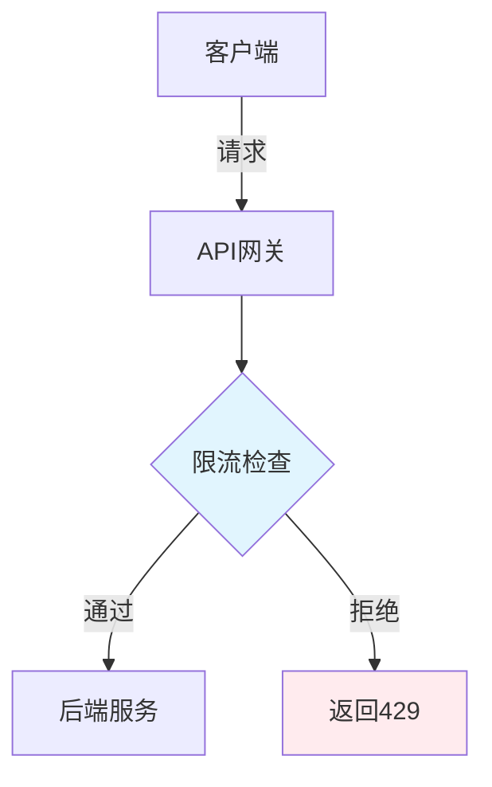

---

title: "Rate Limiting：slowapi 四档限流配置"

tags:

  - python

  - 技术学习

  - 学习笔记

created: "2026-07-21"

---

# Rate Limiting：slowapi 四档限流配置

> **一句话**：Rate Limiting（限流）是限制客户端请求速率的机制，防止API被滥用。`slowapi` 是 FastAPI 的限流库，支持多种限流策略。在AI应用中，常用于保护LLM API、用户登录等敏感接口。

## 1. 为什么需要限流？
### 1.1 常见场景



**需要限流的场景**：

1. **防止DDoS攻击**：限制恶意请求

2. **保护后端服务**：避免过载

3. **公平使用**：防止个别用户占用过多资源

4. **成本控制**：LLM API按调用次数收费

### 1.2 限流策略

| 策略 | 说明 | 适用场景 |
|------|------|----------|
| 固定窗口 | 固定时间窗口内限制请求数 | 简单API |
| 滑动窗口 | 滑动时间窗口内限制请求数 | 更精确 |
| 令牌桶 | 以固定速率放入令牌 | 允许突发 |
| 漏桶 | 以固定速率处理请求 | 平滑流量 |

## 2. slowapi 基础
### 2.1 安装

```bash

pip install slowapi

```

### 2.2 基础用法

```python

from fastapi import FastAPI, Request

from slowapi import Limiter, _rate_limit_exceeded_handler

from slowapi.util import get_remote_address

from slowapi.errors import RateLimitExceeded

# 创建限流器

limiter = Limiter(

    key_func=get_remote_address,  # 使用客户端IP作为key

    default_limits=["200/minute"],  # 默认限制

    storage_uri="memory://",  # 存储后端

)

app = FastAPI()

app.state.limiter = limiter

app.add_exception_handler(RateLimitExceeded, _rate_limit_exceeded_handler)

@app.get("/")

@limiter.limit("10/minute")  # 每分钟10次

async def root(request: Request):

    return {"message": "Hello World"}

@app.get("/api/data")

@limiter.limit("5/minute")  # 每分钟5次

async def get_data(request: Request):

    return {"data": "value"}

```

## 3. 四档限流配置
### 3.1 设计思路

```python

# 四档限流配置

RATE_LIMITS = {

    "default": "200/minute",      # 默认：200次/分钟

    "login": "5/minute",          # 登录：5次/分钟

    "register": "3/minute",       # 注册：3次/分钟

    "ask": "10/minute",           # AI问答：10次/分钟

}

```

### 3.2 实现

```python

from fastapi import FastAPI, Request

from slowapi import Limiter, _rate_limit_exceeded_handler

from slowapi.util import get_remote_address

from slowapi.errors import RateLimitExceeded

app = FastAPI()

# 创建限流器

limiter = Limiter(

    key_func=get_remote_address,

    default_limits=["200/minute"],

    storage_uri="memory://",

)

app.state.limiter = limiter

app.add_exception_handler(RateLimitExceeded, _rate_limit_exceeded_handler)

# 四档限流装饰器

def rate_limit_default():

    return limiter.limit("200/minute")

def rate_limit_login():

    return limiter.limit("5/minute")

def rate_limit_register():

    return limiter.limit("3/minute")

def rate_limit_ask():

    return limiter.limit("10/minute")

# 使用

@app.get("/")

@rate_limit_default()

async def root(request: Request):

    return {"message": "Hello World"}

@app.post("/login")

@rate_limit_login()

async def login(request: Request, username: str, password: str):

    # 登录逻辑

    return {"token": "xxx"}

@app.post("/register")

@rate_limit_register()

async def register(request: Request, username: str, email: str):

    # 注册逻辑

    return {"message": "注册成功"}

@app.post("/ask")

@rate_limit_ask()

async def ask_ai(request: Request, question: str):

    # AI问答逻辑

    return {"answer": "AI回答"}

```

## 4. 高级配置
### 4.1 基于用户的限流

```python

from fastapi import FastAPI, Request, Depends

from slowapi import Limiter

from slowapi.util import get_remote_address

def get_user_id(request: Request):

    """获取用户ID作为限流key"""

    # 从JWT token或session中获取用户ID

    user_id = request.state.user_id if hasattr(request.state, 'user_id') else None

    return user_id or get_remote_address(request)

limiter = Limiter(key_func=get_user_id)

@app.get("/api/user/data")

@limiter.limit("100/minute")  # 每用户100次/分钟

async def get_user_data(request: Request):

    return {"data": "value"}

```

### 4.2 多维度限流

```python

from slowapi import Limiter

# 多维度限流

@app.post("/api/ask")

@limiter.limit("10/minute")  # 每分钟10次

@limiter.limit("100/hour")   # 每小时100次

async def ask_ai(request: Request):

    return {"answer": "AI回答"}

```

### 4.3 动态限流

```python

from fastapi import FastAPI, Request

from slowapi import Limiter

app = FastAPI()

limiter = Limiter(key_func=get_remote_address)

def dynamic_limit(user_type: str):

    """根据用户类型动态限流"""

    limits = {

        "free": "10/minute",

        "pro": "100/minute",

        "enterprise": "1000/minute",

    }

    return limiter.limit(limits.get(user_type, "10/minute"))

@app.post("/api/ask")

@dynamic_limit("free")  # 默认免费用户限制

async def ask_ai(request: Request):

    return {"answer": "AI回答"}

```

## 5. 存储后端
### 5.1 内存存储

```python

limiter = Limiter(

    storage_uri="memory://",  # 内存存储，重启丢失

)

```

### 5.2 Redis存储

```python

limiter = Limiter(

    storage_uri="redis://localhost:6379",  # Redis存储

    storage_options={"socket_connect_timeout": 30},

)

```

### 5.3 动态存储

```python

import os

storage_uri = os.getenv("RATE_LIMIT_STORAGE", "memory://")

limiter = Limiter(storage_uri=storage_uri)

```

## 6. 错误处理
### 6.1 自定义错误响应

```python

from fastapi import FastAPI, Request

from fastapi.responses import JSONResponse

from slowapi import Limiter, _rate_limit_exceeded_handler

from slowapi.errors import RateLimitExceeded

app = FastAPI()

def custom_rate_limit_handler(request: Request, exc: RateLimitExceeded):

    """自定义限流错误处理"""

    return JSONResponse(

        status_code=429,

        content={

            "error": "请求过于频繁",

            "message": f"请在{exc.detail}后重试",

            "retry_after": exc.detail

        }

    )

app.add_exception_handler(RateLimitExceeded, custom_rate_limit_handler)

```

### 6.2 日志记录

```python

import logging

from slowapi import Limiter

logger = logging.getLogger("rate_limit")

class LoggingLimiter(Limiter):

    def _check_rate_limit(self, request, key, limit):

        """检查限流并记录日志"""

        try:

            return super()._check_rate_limit(request, key, limit)

        except RateLimitExceeded as e:

            logger.warning(f"Rate limit exceeded: {key} - {limit}")

            raise

```

## 7. AI应用中的限流
### 7.1 LLM API限流

```python

@app.post("/api/llm/chat")

@limiter.limit("10/minute")  # 每用户10次/分钟

async def chat_with_llm(request: Request, prompt: str):

    """LLM聊天接口"""

    # 调用LLM API

    response = await call_llm_api(prompt)

    return {"response": response}

@app.post("/api/llm/embedding")

@limiter.limit("100/minute")  # 每用户100次/分钟

async def get_embedding(request: Request, text: str):

    """获取文本embedding"""

    embedding = await call_embedding_api(text)

    return {"embedding": embedding}

```

### 7.2 RAG检索限流

```python

@app.post("/api/rag/query")

@limiter.limit("20/minute")  # 每用户20次/分钟

async def rag_query(request: Request, query: str):

    """RAG检索接口"""

    # 检索相关文档

    docs = await retrieve_documents(query)

    # 生成回答

    answer = await generate_answer(query, docs)

    return {"answer": answer, "sources": docs}

```

## 8. 常见坑点
### 1. 忘记导入Request

```python

# 错误：缺少request参数

@app.get("/")

@limiter.limit("10/minute")

async def root():  # ❌ 缺少request参数

    return {"message": "Hello"}

# 正确

@app.get("/")

@limiter.limit("10/minute")

async def root(request: Request):  # ✅

    return {"message": "Hello"}

```

### 2. 限流key不当

```python

# 问题：使用IP限流，但用户可能共享IP

limiter = Limiter(key_func=get_remote_address)

# 解决：使用用户ID限流

def get_user_id(request: Request):

    return request.state.user_id

limiter = Limiter(key_func=get_user_id)

```

### 3. 限流过于严格

```python

# 问题：限流太严导致正常用户无法使用

@app.post("/api/ask")

@limiter.limit("1/minute")  # 太严格

async def ask_ai(request: Request):

    return {"answer": "AI回答"}

# 解决：根据实际需求调整

@app.post("/api/ask")

@limiter.limit("10/minute")  # 合理限制

async def ask_ai(request: Request):

    return {"answer": "AI回答"}

```

## 核心要点

```python

from fastapi import FastAPI, Request

from slowapi import Limiter, _rate_limit_exceeded_handler

from slowapi.util import get_remote_address

from slowapi.errors import RateLimitExceeded

# 创建限流器

limiter = Limiter(

    key_func=get_remote_address,

    default_limits=["200/minute"],

    storage_uri="memory://",

)

app = FastAPI()

app.state.limiter = limiter

app.add_exception_handler(RateLimitExceeded, _rate_limit_exceeded_handler)

# 四档限流

@app.post("/login")

@limiter.limit("5/minute")

async def login(request: Request):

    return {"token": "xxx"}

@app.post("/register")

@limiter.limit("3/minute")

async def register(request: Request):

    return {"message": "注册成功"}

@app.post("/ask")

@limiter.limit("10/minute")

async def ask_ai(request: Request):

    return {"answer": "AI回答"}

```

## 速记卡（面试闪卡）

**Q1：一句话讲清「Rate Limiting：slowapi 四档限流配置」到底是什么？**

A：用 slowapi 给 FastAPI 接口做请求限速。

**Q2：为什么限流：防刷爆、护后端、控成本 —— 怎么理解？**

A：像小区门禁限流：不拦的话黄牛一晚刷爆（防 DDoS）、电梯被挤瘫（护后端）、物业费超支（控成本，尤其 LLM 按次收费）。本质是 Rate Limiting（限流），保护 API 不被滥用。

**Q3：四档限流：默认/登录/注册/AI问答 —— 怎么理解？**

A：像餐厅发不同颜色的等位号牌：默认 200/分、登录 5/分、注册 3/分、AI 问答 10/分，用 `@limiter.limit("5/minute")` 装饰路由。本质是 Rate Limiter（限流器）按 key（客户端 IP）计数，超了返回 429。

**Q4：进阶：按用户/多维度/动态限流 —— 怎么理解？**

A：像 VIP 通道：免费用户 10/分、Pro 100/分、企业 1000/分（Dynamic Rate Limit 动态限流）；还能叠加 `@limiter.limit("10/minute")` 和 `"100/hour"` 做多维度。key 用 user_id 比 IP 更准，避免共享 IP 误伤。

**Q5：存储与兜底：内存/Redis，超限返 429 —— 怎么理解？**

A：像计数本放哪：小项目放内存（memory://，重启丢）、大项目放 Redis（redis://，跨进程共享）。超限时 slowapi 抛 RateLimitExceeded，配 Exception Handler 返回 429 和 retry_after，告诉用户「N 秒后再来」。

**Q6：核心速记主线有哪些？**

- 限流防滥用护后端控成本

- 四档用 @limiter.limit 装饰

- key 用 user_id 比 IP 准

- 大项目用 Redis 存计数

**口诀**

A：限流像门禁发卡牌，四档限速分快慢

登录注册卡最严，AI 问答也设限

key 用用户别用 IP，共享 IP 会误伤

大项目上 Redis，超限返 429

## 相关链接

- 📋 目录：[[00-FastAPI]]

- 📚 学习清单： Web

- 🔗 [[05-错误处理与数据校验|错误处理与数据校验]]

- 🔗 [[08-后台任务与CORS|后台任务与CORS]]

- 🔗 [[04-FastAPI+JWT全链路实现|JWT鉴权]]

