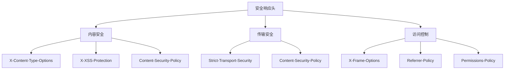

---

title: "安全响应头中间件：X-Content-Type-Options / X-Frame-Options / X-XSS-Protection"

tags:

  - python

  - 技术学习

  - 学习笔记

created: "2026-07-21"

---

# 安全响应头中间件：X-Content-Type-Options / X-Frame-Options / X-XSS-Protection

> **一句话**：安全响应头是 HTTP 响应头，用于增强 Web 应用的安全性，防止常见攻击如点击劫持、MIME 类型嗅探、XSS 等。在 FastAPI 中，可以通过中间件添加这些响应头。

## 1. 常见安全响应头
### 1.1 响应头分类



### 1.2 重要性

| 响应头 | 防护攻击 | 重要性 |

|--------|----------|--------|

| X-Content-Type-Options | MIME 类型嗅探 | 高 |

| X-Frame-Options | 点击劫持 | 高 |

| X-XSS-Protection | XSS 攻击 | 中 |

| Strict-Transport-Security | 中间人攻击 | 高 |

| Content-Security-Policy | XSS、数据注入 | 高 |

## 2. X-Content-Type-Options
### 2.1 作用

防止浏览器 MIME 类型嗅探，强制按照 Content-Type 响应头解析内容。

```python

# 浏览器严格按照 Content-Type 解析

```

### 2.2 实现

```python

from fastapi import FastAPI, Request, Response

app = FastAPI()

@app.middleware("http")

async def add_security_headers(request: Request, call_next):

    response = await call_next(request)

    # X-Content-Type-Options

    response.headers["X-Content-Type-Options"] = "nosniff"

    return response

```

## 3. X-Frame-Options
### 3.1 作用

防止网页被嵌入到 iframe 中，防止点击劫持攻击。

```python

# X-Frame-Options 防止这种攻击

```

### 3.2 取值

| 值 | 说明 |

|----|------|

| DENY | 完全禁止嵌入 |

| SAMEORIGIN | 允许同源嵌入 |

| ALLOW-FROM uri | 允许指定来源嵌入 |

### 3.3 实现

```python

@app.middleware("http")

async def add_security_headers(request: Request, call_next):

    response = await call_next(request)

    # X-Frame-Options

    response.headers["X-Frame-Options"] = "DENY"

    # 或

    # response.headers["X-Frame-Options"] = "SAMEORIGIN"

    return response

```

## 4. X-XSS-Protection
### 4.1 作用

启用浏览器的 XSS 过滤器，防止反射型 XSS 攻击。

```python

# 但为了兼容旧浏览器，仍建议添加

```

### 4.2 取值

| 值 | 说明 |

|----|------|

| 0 | 禁用过滤器 |

| 1 | 启用过滤器（默认） |

| 1; mode=block | 启用过滤器，阻止页面渲染 |

### 4.3 实现

```python

@app.middleware("http")

async def add_security_headers(request: Request, call_next):

    response = await call_next(request)

    # X-XSS-Protection

    response.headers["X-XSS-Protection"] = "1; mode=block"

    return response

```

## 5. Strict-Transport-Security (HSTS)
### 5.1 作用

强制浏览器使用 HTTPS，防止降级攻击。

```python

# 3. 预加载列表（可选）

```

### 5.2 实现

```python

@app.middleware("http")

async def add_security_headers(request: Request, call_next):

    response = await call_next(request)

    # Strict-Transport-Security

    response.headers["Strict-Transport-Security"] = "max-age=31536000; includeSubDomains"

    return response

```

## 6. Content-Security-Policy (CSP)
### 6.1 作用

防止 XSS 和数据注入攻击，限制资源加载来源。

```python

# 3. 禁止 eval()

```

### 6.2 常见指令

| 指令 | 说明 |

|------|------|

| default-src | 默认资源来源 |

| script-src | 脚本来源 |

| style-src | 样式来源 |

| img-src | 图片来源 |

| connect-src | AJAX/WebSocket 来源 |

### 6.3 实现

```python

@app.middleware("http")

async def add_security_headers(request: Request, call_next):

    response = await call_next(request)

    # Content-Security-Policy

    csp = (

        "default-src 'self'; "

        "script-src 'self' 'unsafe-inline' 'unsafe-eval'; "

        "style-src 'self' 'unsafe-inline'; "

        "img-src 'self' data: https:; "

        "font-src 'self' data:; "

        "connect-src 'self' https://api.example.com;"

    )

    response.headers["Content-Security-Policy"] = csp

    return response

```

## 7. 完整中间件实现
### 7.1 基础版本

```python

from fastapi import FastAPI, Request

from starlette.middleware.base import BaseHTTPMiddleware

app = FastAPI()

class SecurityHeadersMiddleware(BaseHTTPMiddleware):

    async def dispatch(self, request: Request, call_next):

        response = await call_next(request)

        # 安全响应头

        security_headers = {

            "X-Content-Type-Options": "nosniff",

            "X-Frame-Options": "DENY",

            "X-XSS-Protection": "1; mode=block",

            "Strict-Transport-Security": "max-age=31536000; includeSubDomains",

            "Referrer-Policy": "strict-origin-when-cross-origin",

            "Permissions-Policy": "camera=(), microphone=(), geolocation=()",

        }

        for header, value in security_headers.items():

            response.headers[header] = value

        return response

app.add_middleware(SecurityHeadersMiddleware)

```

### 7.2 高级版本（可配置）

```python

from fastapi import FastAPI, Request

from starlette.middleware.base import BaseHTTPMiddleware

from typing import Dict, Optional

class SecurityHeadersMiddleware(BaseHTTPMiddleware):

    def __init__(

        self,

        app,

        headers: Optional[Dict[str, str]] = None,

        csp: Optional[str] = None,

    ):

        super().__init__(app)

        self.headers = headers or {

            "X-Content-Type-Options": "nosniff",

            "X-Frame-Options": "DENY",

            "X-XSS-Protection": "1; mode=block",

            "Strict-Transport-Security": "max-age=31536000; includeSubDomains",

            "Referrer-Policy": "strict-origin-when-cross-origin",

        }

        self.csp = csp

    async def dispatch(self, request: Request, call_next):

        response = await call_next(request)

        # 添加默认安全头

        for header, value in self.headers.items():

            response.headers[header] = value

        # 添加CSP

        if self.csp:

            response.headers["Content-Security-Policy"] = self.csp

        return response

# 使用

app = FastAPI()

csp = (

    "default-src 'self'; "

    "script-src 'self' 'unsafe-inline'; "

    "style-src 'self' 'unsafe-inline'; "

)

app.add_middleware(

    SecurityHeadersMiddleware,

    csp=csp

)

```

## 8. AI应用中的安全头
### 8.1 API 安全头

```python

@app.middleware("http")

async def add_api_security_headers(request: Request, call_next):

    response = await call_next(request)

    # API特定安全头

    response.headers["X-Content-Type-Options"] = "nosniff"

    response.headers["Cache-Control"] = "no-store, no-cache, must-revalidate"

    response.headers["Pragma"] = "no-cache"

    # CORS相关

    response.headers["Access-Control-Allow-Origin"] = "*"

    response.headers["Access-Control-Allow-Methods"] = "GET, POST, PUT, DELETE"

    response.headers["Access-Control-Allow-Headers"] = "Content-Type, Authorization"

    return response

```

### 8.2 LLM API 安全头

```python

@app.post("/api/llm/chat")

async def chat_with_llm(request: Request):

    response = await call_llm_api(request)

    # LLM响应安全头

    response.headers["X-Content-Type-Options"] = "nosniff"

    response.headers["Content-Security-Policy"] = "default-src 'none'"

    response.headers["Cache-Control"] = "no-store"

    return response

```

## 9. 常见坑点
### 1. 过度限制

```python

# 问题：CSP太严格导致正常功能无法使用

csp = "default-src 'none'"  # 太严格

# 解决：根据实际需求调整

csp = "default-src 'self'; script-src 'self' 'unsafe-inline'"

```

### 2. 忘记测试

```python

# 解决：在开发环境测试每个安全头的影响

```

### 3. 兼容性问题

```python

# 解决：使用渐进增强策略

if request.headers.get("user-agent", "").startswith("Mozilla/5.0"):

    # 为旧浏览器添加兼容头

    response.headers["X-XSS-Protection"] = "1; mode=block"

```

## 核心要点

```python

from fastapi import FastAPI, Request

from starlette.middleware.base import BaseHTTPMiddleware

class SecurityHeadersMiddleware(BaseHTTPMiddleware):

    async def dispatch(self, request: Request, call_next):

        response = await call_next(request)

        response.headers["X-Content-Type-Options"] = "nosniff"

        response.headers["X-Frame-Options"] = "DENY"

        response.headers["X-XSS-Protection"] = "1; mode=block"

        response.headers["Strict-Transport-Security"] = "max-age=31536000; includeSubDomains"

        response.headers["Content-Security-Policy"] = "default-src 'self'"

        return response

app = FastAPI()

app.add_middleware(SecurityHeadersMiddleware)

```

## 速记卡（面试闪卡）

**Q1：一句话讲清「安全响应头中间件：X-Content-Type-Options / X-Frame-Options / X-XSS-Protection」到底是什么？**

A：安全响应头是加在 HTTP 响应上的字段，用于防点击劫持、MIME 嗅探、XSS 等攻击，FastAPI 可用中间件统一添加。

**Q2：1. 常见安全响应头 —— 怎么理解？**

A：常见安全头分三类：内容安全（X-Content-Type-Options、X-XSS-Protection、CSP）、传输安全（HSTS）、访问控制（X-Frame-Options、Referrer-Policy、Permissions-Policy）。重要性：X-Content-Type-Options 防 MIME 嗅探（高）、X-Frame-Options 防点击劫持（高）、X-XSS-Protection 防 XSS（中）、Strict-Transport-Security 防中间人（高）。

**Q3：2. X-Content-Type-Options —— 怎么理解？**

A：X-Content-Type-Options: nosniff 强制浏览器按 Content-Type 解析，禁止 MIME 类型嗅探（英文 MIME Sniffing）——否则一张 image/png 可能被当可执行脚本跑。FastAPI 里在中间件 `response.headers["X-Content-Type-Options"]="nosniff"` 即可，几乎零成本却堵住一大类攻击。

**Q4：3. X-Frame-Options —— 怎么理解？**

A：X-Frame-Options 防网页被嵌进透明 iframe 搞点击劫持（英文 Clickjacking，你以为在点自己网站、实际在操作攻击者界面）。取值：DENY 完全禁止嵌入、SAMEORIGIN 允许同源、ALLOW-FROM uri 允许指定来源。现代项目更推荐用 CSP 的 frame-ancestors 替代。

**Q5：6. Content-Security-Policy (CSP) —— 怎么理解？**

A：CSP（Content-Security-Policy）防 XSS 和数据注入，限制资源加载来源：default-src、script-src、style-src、img-src、connect-src 等。场景：禁止内联脚本、禁止 eval、只允许自家域名资源。最严格 `default-src 'none'` 会误伤正常功能，要按实际需求放宽。可配置中间件统一下发。

**Q6：核心速记主线有哪些？**

- 安全头分内容/传输/访问三类，中间件统一添加

- X-Content-Type-Options: nosniff 防 MIME 嗅探

- X-Frame-Options 防点击劫持（DENY/SAMEORIGIN）

- CSP 控资源来源防 XSS；XSS-Protection 已弃用，用 CSP 替代

**口诀**

A：安全响应头中间件，三类防护一锅端；

nosniff 防嗅探，frame 防劫持嵌；

CSP 锁资源，XSS 无处钻；

HSTS 强制 HTTPS，中间人难偷看。

## 相关链接

- 📋 目录：[[00-FastAPI]]

- 📚 学习清单： Web

- 🔗 [[07-中间件|中间件机制]]

- 🔗 [[05-错误处理与数据校验|错误处理与数据校验]]

- 🔗 [[08-后台任务与CORS|后台任务与CORS]]

