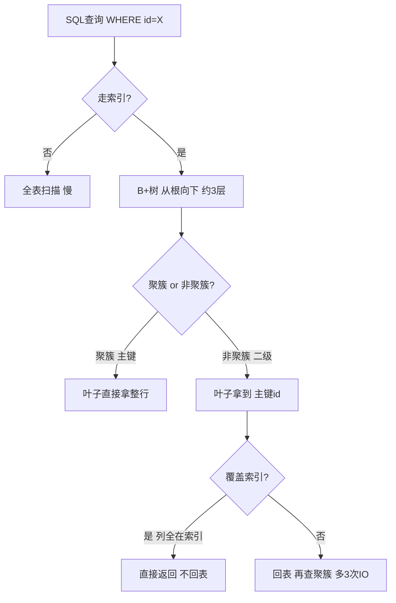

---

title: "MySQL 索引原理 · B+树 · 聚簇与非聚簇"

created: "2026-07-12"

tags:

  - 八股文

  - mysql

---

# MySQL 索引原理 · B+树 · 聚簇与非聚簇

---

## 一、索引本质与全表扫描代价

> 索引 = 给数据额外建一个"目录"，排好序，查起来飞快。

- 索引的本质：花一点额外存储空间，建一个排序好的"目录"，让查找从"翻遍全部"变成"翻几下目录 + 直接定位"

- 也是"空间换时间"——多占一些硬盘空间存目录，换取查找速度

- **全表扫描的代价**：100万行数据，最坏要翻100万次磁盘读取；而磁盘读一次约0.01秒，比内存慢几千倍

- 数据库的一切优化，最终都是为了**少读硬盘**

索引的代价：

- 占硬盘空间

- 拖慢增删改（每次写操作都要同步更新索引）

- 不能乱建（建了不用的索引白占空间还拖慢写入）

---

## 二、数据结构演进
### 2.1 排好序的列表（二分查找）

- 查找快（二分，logN次），但插入要搬动后面所有数据，不可接受

### 2.2 哈希表

- 精确查找一步到位，但完全没顺序

- 范围查找（WHERE id > 20 AND id < 30）要逐个算哈希，不如全表扫描

- MySQL Memory引擎有哈希索引，但只做辅助

### 2.3 二叉搜索树

- 支持范围查找，查找次数 log2N

- **致命问题**：自增主键插入导致退化成链表，查找退化为O(N)

### 2.4 平衡二叉树（AVL/红黑树）

- 解决了退化问题，但每个节点只有2个子节点

- 1000万数据高度约24层，每层一次磁盘读取 = 0.24秒，不可接受

### 2.5 B树（多叉平衡树）

- 每个节点存多个key、分多个叉，高度降到4~6层

- 问题：非叶子节点也存完整数据，节点臃肿；范围查找需要跳来跳去

### 2.6 B+树 — MySQL的最终选择

- **关键改变**：非叶子节点只存key不存数据，所有数据放在叶子节点

- 叶子节点用双向链表串联

- 优势：树更矮（3层）、查询性能稳定（都走到叶子）、范围查询顺着链表走

---

## 三、B+树在InnoDB中的具体结构
### 3.1 基本参数

- InnoDB一页 = 16KB（每次读写的最小单位）

- 一个目录项 = 主键值(8字节) + 指针(6字节) = 14字节

- 一页能装约 **1170个目录项**

### 3.2 三层B+树的容量

```text

第1层（根节点）：1170个目录项

第2层：1170 × 1170 ≈ 137万个目录项

第3层（叶子）：137万页 × 16行/页 ≈ 2190万行数据

```

- **结论**：2000万行数据，通过B+树只需读3次硬盘就能找到任意一行

### 3.3 叶子链表的作用

- 范围查询（WHERE id BETWEEN 100 AND 200）：定位到100所在叶子页后，顺着链表往后读即可，不用反复回到根节点

---

## 四、聚簇索引 vs 非聚簇索引
### 4.1 聚簇索引（主键索引）

- 比喻：书的正文，数据按索引顺序物理存放

- 叶子节点存**完整行数据**

- 每张表**有且只有一个**聚簇索引

- 有主键 → 主键就是聚簇索引；没主键 → 找第一个唯一非空列；都没有 → 生成隐藏row_id

### 4.2 非聚簇索引（二级索引）

- 比喻：书后面的关键词附录

- 叶子节点存的是**(索引列值, 主键id)**，不是完整行

- 可以有多个

### 4.3 回表

- 走非聚簇索引拿到主键后，再去聚簇索引查完整行数据

- 原本3次磁盘读取，回表意味着再读3次，总共6次

- **EXPLAIN中Extra: NULL 表示发生了回表**

### 4.4 覆盖索引

- 查询需要的列恰好全部在索引里，不需要回表

- 例如：`SELECT id, name FROM user WHERE name = 'Zhang'` — name索引叶子有(id, name)，直接返回

- **EXPLAIN中Extra: Using index 表示覆盖索引**

| | 聚簇索引 | 非聚簇索引 |
| :--- | :--- | :--- |
| 每表几个 | 只有1个 | 可多个 |
| 叶子存什么 | 整行数据 | 主键值 |
| 查完整行 | 直接拿到 | 需要回表（除非覆盖索引） |

---

## 五、联合索引与最左前缀
### 5.1 联合索引的排序规则

- 先按第一列排序，第一列相同的再按第二列排序

- 例如 (name, age)：先按name排，name相同的按age排

### 5.2 最左前缀原则

| WHERE条件 | 走索引？ | 原因 |
| :--- | :---: | :--- |
| `WHERE name = '张三'` | ✅ | 匹配最左列 |
| `WHERE name = '张三' AND age = 25` | ✅ | 连续匹配 |
| `WHERE name = '张三' AND age = 25 AND city = '北京'` | ✅ | 全部连续 |
| `WHERE age = 25` | ❌ | 跳过了最左列name |
| `WHERE name = '张三' AND city = '北京'` | ⚠️ 部分 | name走了，city没走（age断了） |

- **记忆口诀**：联合索引像楼梯，必须从第一级开始踩，中间不能跳级

---

## 六、索引失效场景

| 场景 | 示例 | 原因 |
| :--- | :--- | :--- |
| 左模糊 | `LIKE '%张'` | 索引不知道从哪开始找 |
| 索引列套函数 | `WHERE YEAR(birthday) = 2000` | MySQL不知道函数结果是什么 |
| 索引列做运算 | `WHERE id + 1 = 10` | 索引列参与了运算 |
| 隐式类型转换 | `phone = 13800138000`（varchar列） | MySQL偷偷转了类型 |
| OR有非索引列 | `WHERE a=1 OR b=2`（b没索引） | OR导致扫全表 |
| 不等于 | `WHERE status != 1` | 不等于通常不走索引 |
| 跳过最左列 | 联合索引(a,b)查`WHERE b=1` | 最左列a没出现 |

---

## 七、自增主键优势

- B+树叶子按主键顺序排列

- **自增主键**：新数据都在最后一页追加，直接追加即可

- **UUID主键**（无规律）：新数据可能要插到中间，导致页分裂（数据搬迁、磁盘随机写）

- 自增主键避免页分裂，写入性能最好

---

## 八、速答

| 问题 | 一句话答案 |
| :--- | :--- |
| 索引是什么？ | 排序好的"目录"，让数据库不用全表扫描 |
| 为什么是B+树？ | 矮（3层）+ 胖（每节点多key）+ 链表（范围查询快） |
| 聚簇 vs 非聚簇？ | 聚簇=正文（完整数据，每表1个），非聚簇=附录（存主键，可多个） |
| 什么是回表？ | 走非聚簇索引拿主键后，再去聚簇索引查完整行 |
| 怎么避免回表？ | 覆盖索引——让查询列全部在索引里 |
| 最左前缀原则？ | 联合索引(A,B,C)必须从A开始连续匹配，跳过A直接失效 |
| 为什么自增主键？ | 避免页分裂，写入性能最好 |

## 九、一图流（Mermaid）



##

> ▶ 对应实操：[[01-数据库基础与安装|01-数据库基础与安装]]

## 速记卡（面试闪卡）

**Q1：一句话讲清「MySQL 索引原理 · B+树 · 聚簇与非聚簇」到底是什么？**

A：MySQL 用 B+树建有序目录加速查询，聚簇索引叶子存整行、非聚簇存主键，避免回表可用覆盖索引。

**Q2：一、索引本质与全表扫描代价 —— 怎么理解？**

A：像给书加目录：索引是排序好的额外结构，用空间换时间，把翻遍全表变成翻目录+定位。代价是占硬盘、拖慢增删改。全表扫描 100 万行最坏读 100 万次磁盘，比内存慢几千倍。Index（索引）。

**Q3：二、数据结构演进 —— 怎么理解？**

A：像挑书架结构：哈希只支持精确查、不支持范围；二叉树每节点 2 叉，千万数据高约 24 层太慢；B 树非叶也存数据臃肿；B+树非叶只存 key、叶子双向链表串起，又矮又好查范围。B+ Tree（B+树）。

**Q4：三、B+树在InnoDB中的具体结构 —— 怎么理解？**

A：像三层楼仓库：InnoDB 一页 16KB，目录项 14 字节，一页约装 1170 个；三层 B+树约装 2190 万行，找任意行只需读 3 次硬盘。叶子链表让范围查询顺着读、不回根。Clustered B+Tree（聚簇 B+树）。

**Q5：四、聚簇索引 vs 非聚簇索引 —— 怎么理解？**

A：像书的正文与附录：聚簇索引=正文，叶子存完整行，每表仅 1 个（默认主键）；非聚簇=附录，叶子存（索引列值, 主键 id），可有多个。走非聚簇拿到主键再去聚簇查整行叫回表。Clustered / Secondary Index（聚簇/二级索引）。

**Q6：核心速记主线有哪些？**

- 本质：索引是排序目录，空间换时间，少读硬盘

- 演进：哈希/二叉树不行，B+树矮+胖+链表最优

- 结构：三层 B+树约 2000 万行，查一行仅 3 次 IO

- 聚簇非聚簇：正文存整行，附录存主键，回表多 IO

**口诀**

A：索引是排序好目录，空间换时间少读盘

哈希二叉树都不行，B+ 树矮胖链表连

聚簇是正文整行存，非聚簇附录主键填

回表多 IO，覆盖索引免回头

相关链接

- 📋 目录：[[00-MySQL]]

- 📚 学习清单：[[八股文学习路线图]]

- 🔗 [[计算机基础/操作系统/13-IO模型四种|IO模型与磁盘读写]] — B+树设计核心就是减少磁盘IO

- 🔗 [[语言与框架/Redis/八股/02-ZSet跳表原理|Redis ZSet跳表]] — B+树 vs 跳表：两种有序数据结构的设计对比

- 🔗 [[语言与框架/MySQL/八股/06-B+树数据结构演进|B+树数据结构演进]] — 从二叉树到B+树的演进路径

## 相关链接

- [[笔记/语言与框架/MySQL/八股/02-聚簇索引与非聚簇索引|聚簇索引与非聚簇索引]]

- [[笔记/语言与框架/MySQL/八股/06-B+树数据结构演进|B+树数据结构演进]]

- [[笔记/语言与框架/MySQL/八股/07-B+树在MySQL里的样子|B+树在MySQL里的样子]]

- [[笔记/语言与框架/MySQL/八股/03-联合索引与最左前缀|联合索引与最左前缀]]

- [[笔记/语言与框架/MySQL/八股/09-索引下推ICP|索引下推 ICP（MySQL 5.6+）]]

