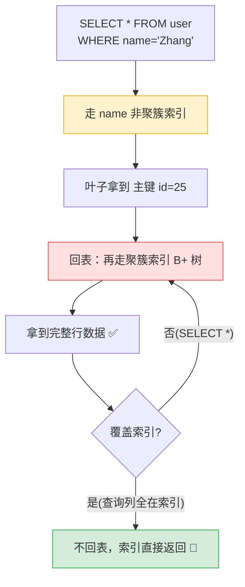

---

title: "聚簇索引与非聚簇索引"

created: "2025-07-12"

tags:

  - 八股文

  - mysql

---


# 聚簇索引与非聚簇索引

## 一、聚簇索引 vs 非聚簇索引（最重要的一节）


这块如果只看定义会很晕。我们用**书的比喻**来理解。


### 1.1 一本书有两种找内容的方式


**方式一：看正文的页码顺序**


> 书的正文本就是按页码顺序排好的：第 1 页、第 2 页...内容就是按这个顺序印在纸上。你想看第 52 页讲了什么，直接翻到 52 页就行。


**这就叫"聚簇索引"**——数据本身按索引顺序物理存放，索引的叶子节点里装的就是**完整内容**。


**方式二：看最后的索引附录**


> 很多技术书最后有一个"关键词索引"：按字母顺序列出关键词，每个关键词后面写着"详见第 XX 页"。你想查"B+树"这个关键词，先翻附录找到 B+树 → 看到"详见第 52 页"→ 再翻到第 52 页看正文。


**这就叫"非聚簇索引"**——索引的叶子节点里装的不是完整内容，而是**指向正文的"页码"（主键）**，你需要再翻一次正文才能看到全部内容。


---


### 1.2 聚簇索引：主键索引就是书的正文本


```text

假设主键是 id：


        [10 | 20]               ← 非叶子：只有 id

       /    |    \

 [3,整行数据]→[15,整行数据]→[25,整行数据]   ← 叶子：存了这行的全部内容

  ↑                                       （id, name, age, city...全在）

  叶子直接存完整行

```


**关键事实**：

- InnoDB 每张表**一定有且只有一个**聚簇索引

- 你指定了主键 → 主键就是聚簇索引

- 没指定主键 → MySQL 找第一个唯一非空列

- 都没有 → MySQL 自动生成一个隐藏的 row_id 做聚簇索引


> 为什么只能有一个？因为数据的**物理存放顺序**只能有一种——你不能同时让一本书的正文既按页码排又按字母排。


---


### 1.3 非聚簇索引：自己建的索引就是书的附录


假设你在 `name` 列上建了索引：


```sql

CREATE INDEX idx_name ON user (name);

```


```text

name 索引（非聚簇索引）：


        ['Li' | 'Wang']         ← 非叶子：只有 name

       /        |        \

['Chen',id=15]→['Li',id=5]→['Zhang',id=25]  ← 叶子：存 (name, 主键id)

                                                不是完整行数据！

```


**注意**：叶子节点存的是 `(name的值, 主键id)`，只有这两样，没有完整数据。


---


### 1.4 回表——最关键的概念


**什么是回表？**


```text

执行：SELECT * FROM user WHERE name = 'Zhang';


步骤1：走 name 索引（非聚簇索引）

      找到 'Zhang' 对应的叶子 → 拿到主键 id=25


步骤2：拿着 id=25，回到聚簇索引（主键索引）的 B+ 树

      再查一次 → 拿到完整行数据


↑ 这第二步就叫"回表"

```


**用书的比喻**：


> 你想查"B+树"的完整内容 →

> 先翻附录（非聚簇索引），看到"B+树 → 第52页" →

> 再翻到正文第52页（聚簇索引）看完整内容。

>

> 翻两次 = 回表。很自然吧？


**回表的问题**：本来查一次索引是 3 次硬盘读取，回表意味着要再读 3 次——总共 6 次。如果能省掉回表，性能翻倍。


---


### 1.5 覆盖索引——不回表的方法


```sql

-- 这个查询需要回表

SELECT * FROM user WHERE name = 'Zhang';

-- 因为 SELECT * 需要所有列，而 name 索引里只有 (name, id)

-- 必须回聚簇索引取整行


-- 这个查询不需要回表

SELECT id, name FROM user WHERE name = 'Zhang';

-- 因为只需要 id 和 name，这两个都在 name 索引的叶子里

-- 索引直接返回，不用回表

```


> **覆盖索引**不是说建了一种特殊的索引，而是说**某次查询需要的列，恰好全部在索引里了**，就像你要查的东西在附录里已经写全了，不需要再翻正文。


EXPLAIN 验证：


```text

Extra: Using index   ← 覆盖索引，没回表（好）

Extra: NULL          ← 回表了

```


---


### 1.6 一张表总结聚簇 vs 非聚簇


| | 聚簇索引（主键索引） | 非聚簇索引（你自己建的） |
| :--- | :--- | :--- |
| **比喻** | 书的正文 | 书后面的关键词附录 |
| **每表能有几个** | **只有 1 个** | 可以有多个 |
| **叶子存什么** | **整行数据** | **主键值**（只是"页码"） |
| **查完整行** | 直接拿到 | 需要回表（除非覆盖索引） |
| **谁创建的** | 主键自动就是 | 你手动 `CREATE INDEX` |


---


##

> ▶ 对应实操：[[02-CRUD操作与数据类型|02-CRUD操作与数据类型]]


## 二、一图流（Mermaid）





## 速记卡（面试闪卡）


**Q1：一句话讲清「聚簇索引与非聚簇索引」到底是什么？**

A：聚簇索引的叶子节点存整行数据，非聚簇索引的叶子只存主键值，查整行时需回表。


**Q2：四、聚簇索引 vs 非聚簇索引（最重要的一节） —— 怎么理解？**

A：像书的正文 vs 书后附录：聚簇索引（Clustered Index）是书的正文，数据按索引顺序物理存放、叶子存整行；非聚簇索引（Non-clustered Index）是附录，叶子只存主键这个"页码"。


**Q3：聚簇索引：主键索引就是书的正文本 —— 怎么理解？**

A：像一本书只能按一种顺序印：InnoDB 每张表有且只有一个聚簇索引，默认是主键；没主键找第一个唯一非空列，都没有则自动生成隐藏 row_id。


**Q4：非聚簇索引：自己建的索引就是书的附录 —— 怎么理解？**

A：像附录只写页码：非聚簇索引（二级索引）的叶子存 (索引列值, 主键 id)，不是完整行。CREATE INDEX 建的索引都属此类，一张表可以有多个。


**Q5：回表与覆盖索引 —— 怎么理解？**

A：像附录翻完还要翻正文：非聚簇索引查到主键后，得再走聚簇索引拿整行，这步叫回表（Bookmark Lookup）。若查询列全在索引里（覆盖索引 Covering Index）就不用回表，性能翻倍。


**Q6：核心速记主线有哪些？**

- 聚簇索引叶子存整行数据，每张表只能有 1 个（物理顺序唯一），默认是主键

- 非聚簇索引叶子只存主键值，一张表可有多个，查整行需回表

- 回表：非聚簇索引拿到主键后，再查聚簇索引取完整行，多一次 IO

- 覆盖索引：查询列恰好都在索引里，无需回表；EXPLAIN 看到 Using index 即为覆盖


**口诀**

A：聚簇是正文，整行叶里装

非聚簇是附录，只存主键当页码

附录翻完翻正文，回表多跑一趟

索引写全不用翻，覆盖索引快如光


相关链接


- 📋 目录：[[00-MySQL]]

- 📚 学习清单：[[八股文学习路线图]]

- 🔗 [[语言与框架/MySQL/八股/05-覆盖索引与避免回表|覆盖索引与避免回表]] — 回表是非聚簇索引的固有问题

- 🔗 [[语言与框架/MySQL/八股/15-自增主键推荐原因|自增主键推荐原因]] — 聚簇索引选择自增主键的原因

## 相关链接


- [[笔记/语言与框架/MySQL/八股/01-MySQL索引B+树与聚簇非聚簇|MySQL 索引原理 · B+树 · 聚簇与非聚簇]]

- [[笔记/语言与框架/MySQL/八股/03-联合索引与最左前缀|联合索引与最左前缀]]

- [[笔记/语言与框架/MySQL/八股/09-索引下推ICP|索引下推 ICP（MySQL 5.6+）]]

- [[笔记/语言与框架/MySQL/八股/10-建索引实战原则|建索引实战原则]]

- [[笔记/语言与框架/MySQL/八股/05-覆盖索引与避免回表|覆盖索引：如何避免回表]]

