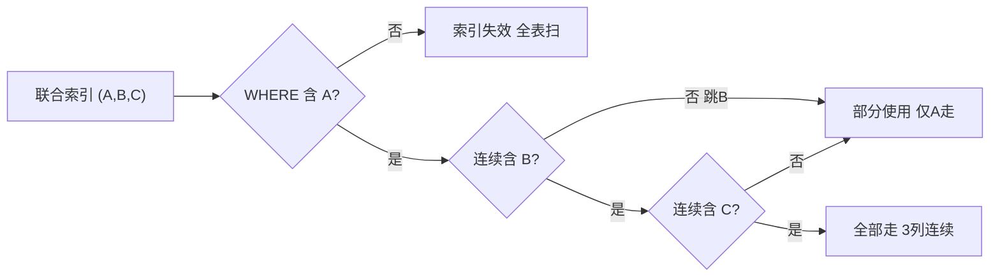

# 联合索引与最左前缀
## 五、联合索引——多列一起建索引

### 5.1 什么时候需要联合索引？

比如你经常这样查：

```sql
SELECT * FROM user WHERE name = '张三' AND age = 25;
```

你可以分别在 `name` 和 `age` 上各建一个索引，但 MySQL 一次查询通常只能用**一个**索引。更高效的做法是把两列建成一个**联合索引**：

```sql
CREATE INDEX idx_name_age ON user (name, age);
```

### 5.2 联合索引内部怎么排序的？

```text
联合索引 (name, age) 的排序规则：
  先按 name 排序 → name 相同的，按 age 排序

就像 Excel 里先按"姓名"排序，姓名一样的再按"年龄"排序：

  (name='李四', age=20)
  (name='张三', age=21)
  (name='张三', age=25)   ← 张三有两个，按 age 从小到大
  (name='张三', age=30)
  (name='赵六', age=22)
```

**B+树里长这样**（按 (name, age) 的组合值排序）：

```text
         [('张三',25) | ('张三',30)]
        /            |             \
[('李四',20)] → [('张三',21)] → [('赵六',22)]
```

### 5.3 最左前缀原则——联合索引最重要的规则

**规则**：联合索引 `(A, B, C)` 是从 A 开始排序的。你查的时候**必须从最左边开始连续匹配**，跳过最左边的列，索引直接失效。

| 你的 WHERE 条件 | 走索引吗 | 为什么 |
| :--- | :---: | :--- |
| `WHERE name = '张三'` | ✅ 走 | 匹配最左列 name |
| `WHERE name = '张三' AND age = 25` | ✅ 走 | 连续匹配 name + age |
| `WHERE name = '张三' AND age = 25 AND city = '北京'` | ✅ 走 | 全部连续 |
| `WHERE age = 25` | ❌ 不走 | 跳过了最左列 name |
| `WHERE name = '张三' AND city = '北京'` | ⚠️ 部分 | name 走了索引，city 没走（age 断了） |

**生活类比——商场楼层导航**：

> 联合索引 (楼层, 区域, 店铺号)：
> - "去3楼" → 直接去 ✅
> - "去3楼B区" → 先去3楼，再找B区，有序 ✅
> - "去B区" → 1楼、2楼、3楼都有B区，不知道去哪 ❌
> - "去3楼，007号店" → 找到3楼了，但没告诉你哪个区，007在好几个区都有 ⚠️

> **记忆口诀**：联合索引像楼梯，必须从第一级开始踩，中间不能跳级。

### 5.4 索引下推（了解即可）

MySQL 5.6 之后的一个优化：能在索引里过滤的条件，就**先在索引里过滤掉**，减少回表次数。

```text
SELECT * FROM user WHERE name LIKE '张%' AND age = 25;

没有索引下推：
  1. 从 name 索引找出所有姓张的人 → 100条
  2. 100条全部回表取完整数据 → 100次回表
  3. 在完整数据里筛 age=25

有索引下推：
  1. 从 name 索引找出所有姓张的人
  2. 在索引里直接筛 age=25（因为联合索引里也有 age）
  3. 只剩 3 条需要回表 → 只回表3次
```

---


## 六、一图流（Mermaid）



## 七、速记卡（面试闪卡）

**Q1：什么叫联合索引？为什么不用两个单列索引？**  
A：把多列合成一个索引，如 `(name, age)`。MySQL 一次查询通常只用**一个**索引，多列常一起查时，联合索引比分别建两个单列索引更高效，还能顺带用上索引下推。

**Q2：最左前缀原则到底是什么？**  
A：联合索引 `(A,B,C)` 按 A→B→C 顺序排序，查询必须从最左列开始**连续匹配**。跳过最左列（只用 B/C）索引直接失效；中间断（用了 A、C 但没 B）则只有 A 走索引，C 失效。

**Q3：为什么 `WHERE age = 25` 用不了 `(name, age)` 索引？**  
A：索引是先按 name 排序的，没有 name 就定位不到任何有序范围，引擎只能全表扫描。生活类比：商场按"楼层→区域→店号"导航，"去 B 区"在每层都有，不知道去哪。

**Q4：索引下推（ICP）是什么，解决什么问题？**  
A：MySQL 5.6+ 的优化。能在索引里先过滤的条件（如联合索引里的 age），先在索引层筛掉，减少回表次数。例如 `name LIKE '张%' AND age=25`，有 ICP 时先在索引里筛 age，只回表少数几条。

> 🔑 口诀：楼梯原则——从 A 踩起，断一级就掉队。

---

## 
> ▶ 对应实操：[[03-条件查询与排序分页|03-条件查询与排序分页]]

相关链接

- 📋 目录：[[00-MySQL]]
- 📚 学习清单：[[八股文学习清单]]

