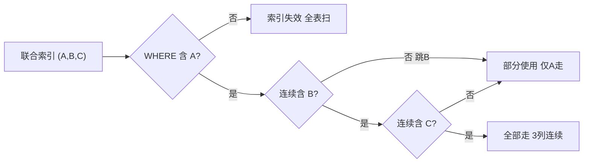

---

title: "联合索引与最左前缀"

created: "2025-07-12"

tags:

  - 八股文

  - mysql

---

# 联合索引与最左前缀

## 五、联合索引——多列一起建索引
### 5.1 什么时候需要联合索引？

比如你经常这样查：

```sql

SELECT * FROM user WHERE name = '张三' AND age = 25;

```

你可以分别在 `name` 和 `age` 上各建一个索引，但 MySQL 一次查询通常只能用**一个**索引。更高效的做法是把两列建成一个**联合索引**：

```sql

CREATE INDEX idx_name_age ON user (name, age);

```

### 5.2 联合索引内部怎么排序的？

```text

联合索引 (name, age) 的排序规则：

  先按 name 排序 → name 相同的，按 age 排序

就像 Excel 里先按"姓名"排序，姓名一样的再按"年龄"排序：

  (name='李四', age=20)

  (name='张三', age=21)

  (name='张三', age=25)   ← 张三有两个，按 age 从小到大

  (name='张三', age=30)

  (name='赵六', age=22)

```

**B+树里长这样**（按 (name, age) 的组合值排序）：

```text

         [('张三',25) | ('张三',30)]

        /            |             \

[('李四',20)] → [('张三',21)] → [('赵六',22)]

```

### 5.3 最左前缀原则——联合索引最重要的规则

**规则**：联合索引 `(A, B, C)` 是从 A 开始排序的。你查的时候**必须从最左边开始连续匹配**，跳过最左边的列，索引直接失效。

| 你的 WHERE 条件 | 走索引吗 | 为什么 |

| :--- | :---: | :--- |

| `WHERE name = '张三'` | ✅ 走 | 匹配最左列 name |

| `WHERE name = '张三' AND age = 25` | ✅ 走 | 连续匹配 name + age |

| `WHERE name = '张三' AND age = 25 AND city = '北京'` | ✅ 走 | 全部连续 |

| `WHERE age = 25` | ❌ 不走 | 跳过了最左列 name |

| `WHERE name = '张三' AND city = '北京'` | ⚠️ 部分 | name 走了索引，city 没走（age 断了） |

**生活类比——商场楼层导航**：

> 联合索引 (楼层, 区域, 店铺号)：

> - "去3楼" → 直接去 ✅

> - "去3楼B区" → 先去3楼，再找B区，有序 ✅

> - "去B区" → 1楼、2楼、3楼都有B区，不知道去哪 ❌

> - "去3楼，007号店" → 找到3楼了，但没告诉你哪个区，007在好几个区都有 ⚠️

> **记忆口诀**：联合索引像楼梯，必须从第一级开始踩，中间不能跳级。

### 5.4 索引下推（了解即可）

MySQL 5.6 之后的一个优化：能在索引里过滤的条件，就**先在索引里过滤掉**，减少回表次数。

```text

SELECT * FROM user WHERE name LIKE '张%' AND age = 25;

没有索引下推：

  1. 从 name 索引找出所有姓张的人 → 100条

  2. 100条全部回表取完整数据 → 100次回表

  3. 在完整数据里筛 age=25

有索引下推：

  1. 从 name 索引找出所有姓张的人

  2. 在索引里直接筛 age=25（因为联合索引里也有 age）

  3. 只剩 3 条需要回表 → 只回表3次

```

---

## 六、一图流（Mermaid）



##

> ▶ 对应实操：[[03-条件查询与排序分页|03-条件查询与排序分页]]

## 速记卡（面试闪卡）

**Q1：一句话讲清「联合索引与最左前缀」到底是什么？**

A：联合索引是把多列合成一个 B+树索引，查询必须从最左列连续匹配才生效。

**Q2：5.1 什么时候需要联合索引？ —— 怎么理解？**

A：联合索引像"组合钥匙串"：name+age 一起建，比分别挂两把钥匙更省事，还能顺手用索引下推（composite index 复合索引）。

**Q3：5.3 最左前缀原则——联合索引最重要的规则 —— 怎么理解？**

A：最左前缀像楼梯：必须从 (A,B,C) 第一级踩起，跳级就失效；中间断只走前面几级（leftmost prefix 最左前缀）。

**Q4：5.4 索引下推（了解即可） —— 怎么理解？**

A：索引下推像"在门口先筛一遍"：能在索引里先过滤 age，少回表几次（Index Condition Pushdown 索引条件下推）。

**Q5：最左前缀面试速记：楼梯原则 —— 怎么理解？**

A：面试记一句：联合索引像楼梯，从第一级踩起不能跳；跳过最左列全失效，中间断只走前面（B+tree B+树索引）。

**Q6：核心速记主线有哪些？**

- 联合索引把多列合成一个索引，比两个单列索引更高效

- 最左前缀：必须从最左列连续匹配，跳过最左列直接失效

- 中间断（用了 A、C 没 B）只有 A 走索引，C 失效

- 索引下推 ICP：在索引层先过滤，减少回表次数

**口诀**

A：联合索引组合键，name age 一起建；

最左前缀像楼梯，第一级起不能跳；

跳过最左全失效，中间断只走前面；

索引下推门口筛，少回表来少往返。

相关链接

- 📋 目录：[[00-MySQL]]

- 📚 学习清单：[[八股文学习路线图]]

## 相关链接

- [[笔记/语言与框架/MySQL/八股/02-聚簇索引与非聚簇索引|聚簇索引与非聚簇索引]]

- [[笔记/语言与框架/MySQL/八股/10-建索引实战原则|建索引实战原则]]

- [[笔记/语言与框架/MySQL/八股/09-索引下推ICP|索引下推 ICP（MySQL 5.6+）]]

- [[笔记/语言与框架/MySQL/八股/01-MySQL索引B+树与聚簇非聚簇|MySQL 索引原理 · B+树 · 聚簇与非聚簇]]

- [[笔记/语言与框架/MySQL/八股/08-索引为什么这么快|索引为什么这么快]]

