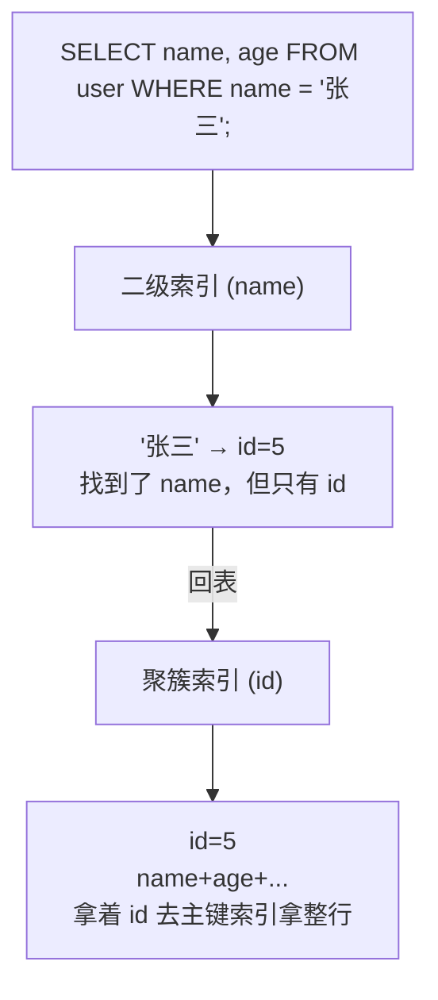
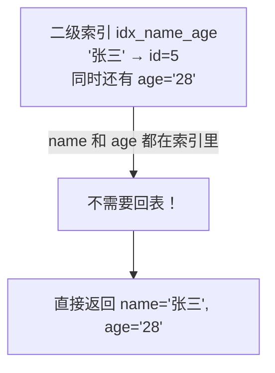

# 覆盖索引：如何避免回表

## 一句话总结

> **回表 = 索引里找到了 id，还得去数据页拿整行。覆盖索引 = 索引里已经把你要的数据全包了，不用再跑一趟数据页。少一次磁盘 IO，快一倍。**

---

## 🌰 理解回表

InnoDB 的索引结构决定了这件事：

- **聚簇索引（主键）**：叶子节点存的是整行数据
- **二级索引**：叶子节点存的是主键值（不是整行数据）

所以当你通过二级索引查数据时，流程是这样的：



**回表 = 两次 B+ 树搜索。第一次在二级索引找到 id，第二次在聚簇索引拿整行数据。**

一次查询两次 IO。如果查 100 行 → 二级索引搜 100 次 + 回表 100 次 = 200 次 IO。

---

## 覆盖索引怎么省掉回表？

**覆盖索引 = 你要查的所有列，都包含在同一个二级索引里。**

```sql
-- 索引：INDEX idx_name_age (name, age)

-- 这个查询不用回表
SELECT name, age FROM user WHERE name = '张三';
```

为什么？



**索引的叶子节点已经包含了 name 和 age，不需要再去聚簇索引拿。**

### 对比

```sql
-- 索引：INDEX idx_name (name)

-- ❌ 必须回表
SELECT name, age FROM user WHERE name = '张三';
-- idx_name 里只有 name 和 id，没有 age
-- 必须回表拿 age

-- 索引：INDEX idx_name_age (name, age)

-- ✅ 不需要回表（覆盖索引）
SELECT name, age FROM user WHERE name = '张三';
-- idx_name_age 里 name 和 age 都有

-- 但如果多查了一个不在索引里的字段：
-- ❌ 必须回表
SELECT name, age, email FROM user WHERE name = '张三';
-- email 不在 idx_name_age 里，仍然要回表
```

---

## 覆盖索引的实际收益

| 场景 | 没有覆盖索引 | 有覆盖索引 |
| ------ | ------------- | ----------- |
| 单行查询 | 2 次 B+ 树搜索 | 1 次 B+ 树搜索 |
| 100 行范围查询 | 二级索引 100 次 + 回表 100 次 = 200 次 IO | 只有二级索引 100 次 IO |
| 大数据量分页 | 每页都要回表，越翻越慢 | 不回表，翻页稳定 |

**体现在 EXPLAIN 里：**

```sql
-- ❌ 需要回表
EXPLAIN SELECT name, age FROM user WHERE name = '张三';
-- Extra: Using index condition

-- ✅ 覆盖索引，不回表
EXPLAIN SELECT name, age FROM user WHERE name = '张三';
-- Extra: Using index          ← 这个就是"覆盖索引"的标志
```

**EXPLAIN 的 Extra 列里出现 "Using index"（不是 "Using index condition"）就意味着这次查询走了覆盖索引，没有回表。**

---

## 设计覆盖索引的策略

### 核心思路：把高频查询的列"塞进"索引里

```text
场景：你的页面经常查 user 表的 name、age、city 三列
      条件总是 WHERE name = ?

方案：
  INDEX idx_name_age_city (name, age, city)
  
  这个索引覆盖了 name + age + city 的查询
  所有查这三个字段的场景都不回表
```

### 但别盲目加列

```sql
-- 你有个覆盖索引
INDEX idx_name_age (name, age)

-- 可以覆盖这个查询
SELECT name, age FROM user WHERE name = '张三';

-- 不能覆盖这个（email 不在索引里）
SELECT name, age, email FROM user WHERE name = '张三';
```

**问题：要不要把 email 也加进索引？**

```text
加进去的好处：
  → 覆盖索引，不回表
  → 查询快

加进去的代价：
  → 索引变大（VARCHAR(255) 很占空间）
  → 写入变慢（每次插入/更新都要维护更大的索引）
  → 索引本身也要排序维护

决策：
  高频查询 + email 列不大 → 加进去
  低频查询 + email 列很大 → 别加，让它回表
```

### 联合索引中把"查的列"放在"条件列"后面

```sql
-- 你经常查：WHERE name = ? 要返回 age 和 city
-- ✅ 正确设计
INDEX idx_name_age_city (name, age, city)
-- name 用于 WHERE 条件（最左前缀）
-- age, city 用于覆盖（不回表取）

-- ❌ 错误设计（对覆盖没帮助）
INDEX idx_age_city_name (age, city, name)
-- name 在最右边，WHERE name=? 用不了这个索引（最左前缀）
-- 覆盖索引的前提是先用上这个索引
```

**覆盖索引的前提是：这个索引本身先被查询用上了（走最左前缀）。用不上就别谈覆盖。**

---

## 常考：COUNT(*) 优化

```sql
-- 表很大，1000 万行
-- 没有索引时 COUNT(*) 要走聚簇索引全表扫描

-- 建一个小索引（哪怕只包含一列）
INDEX idx_id (id)

-- 现在 COUNT(*) 走 idx_id
-- 因为 idx_id 比聚簇索引小得多（只有 id，没有整行数据）
-- MySQL 选最小的索引来 COUNT
```

**这是覆盖索引思想的逆向应用：不需要覆盖所有列，只需要索引比聚簇索引小，COUNT 就会优先用这个索引。**

---

## 覆盖索引 vs 索引下推

容易混淆，常放一起问。

| 对比项 | 覆盖索引（Using index） | 索引下推 ICP（Using index condition） |
| -------- | ----------------------- | ------------------------------------- |
| **做了什么** | 不回表，直接在索引里拿数据 | 仍然回表，但在回表前先用索引里的其他列过滤掉无效数据 |
| **回表了吗** | ❌ 不回 | ✅ 回表，但回表的次数少了 |
| **场景** | 查询列全在索引里 | 条件列不全在索引里，但部分条件可以在索引层面过滤 |
| **Extra** | `Using index` | `Using index condition` |

### 🌰 对比

```sql
-- 索引：INDEX (name, age)

-- 覆盖索引
SELECT name, age FROM user WHERE name = '张三';
-- Extra: Using index
-- name 和 age 都在索引里 → 不回表

-- 索引下推
SELECT * FROM user WHERE name = '张三' AND age > 25;
-- Extra: Using index condition
-- 先通过 name 找到一批 id（二级索引）
-- 在回表之前，先用 age > 25 过滤掉一部分（下推）
-- 剩下的再回表拿全部数据
-- 回表次数减少了，但仍然要回表
```

---

## 记忆口诀

> **回表 = 二级索引找到 id → 再去主键拿整行，两次 IO。**
> **覆盖索引 = 你要的列索引里全有，一次 IO 搞定。**
> **EXPLAIN 看 Extra：Using index = 覆盖，等于没回表。**
> **不是列越多越好——索引大了写入慢。高频查询的列加进去，大字段让它回表。**


## 
> ▶ 对应实操：[[05-聚合函数与分组GROUP_BY|05-聚合函数与分组GROUP_BY]]

相关链接

- 📋 目录：[[00-MySQL]]
- 📚 学习清单：[[八股文学习清单]]

## 速记卡（面试闪卡）

**Q1：一句话讲清「覆盖索引：如何避免回表」到底是什么？**
A：**回表 = 索引里找到了 id，还得去数据页拿整行。覆盖索引 = 索引里已经把你要的数据全包了，不用再跑一趟数据页。少一次磁盘 IO，快一倍。**
---

**Q2：一句话总结 —— 怎么理解？**
A：**回表 = 索引里找到了 id，还得去数据页拿整行。覆盖索引 = 索引里已经把你要的数据全包了，不用再跑一趟数据页。少一次磁盘 IO，快一倍。**
---

**Q3：🌰 理解回表 —— 怎么理解？**
A：InnoDB 的索引结构决定了这件事：
**聚簇索引（主键）**：叶子节点存的是整行数据
**二级索引**：叶子节点存的是主键值（不是整行数据）
所以当你通过二级索引查数据时，流程是这样的：
**回表 = 两次 B+ 树搜索。第一次在二级索引找到 id，第二次在聚簇索引拿整行数据。**
一次查询两次 IO。如果查 100 行 → 二级索引搜 100 次 + 回表 100 次 = 200 次 IO。
---

**Q4：覆盖索引怎么省掉回表？ —— 怎么理解？**
A：**覆盖索引 = 你要查的所有列，都包含在同一个二级索引里。**
为什么？
**索引的叶子节点已经包含了 name 和 age，不需要再去聚簇索引拿。**
---

**Q5：覆盖索引的实际收益 —— 怎么理解？**
A：| 场景 | 没有覆盖索引 | 有覆盖索引 |
| ------ | ------------- | ----------- |
| 单行查询 | 2 次 B+ 树搜索 | 1 次 B+ 树搜索 |
| 100 行范围查询 | 二级索引 100 次 + 回表 100 次 = 200 次 IO | 只有二级索引 100 次 IO |
| 大数据量分页 | 每页都要回表，越翻越慢 | 不回表，翻页稳定 |

**Q6：核心速记主线有哪些？**
A：抓住这几根：一句话总结、🌰 理解回表、覆盖索引怎么省掉回表？、覆盖索引的实际收益、设计覆盖索引的策略、常考：COUNT(*) 优化。

