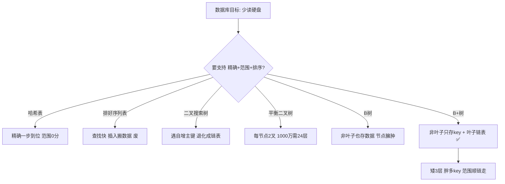

# B+树数据结构演进
## 二、什么样的"目录"结构最好？（数据结构演进）

> 目录可以有多种编排方式。MySQL 需要目录同时支持三种操作：
> - **精确找**：`WHERE id = 4`
> - **范围找**：`WHERE id > 2 AND id < 5`
> - **排序**：`ORDER BY id`
> 
> 下面我们一个个看，每种方式行不行。

### 先理解一个关键事实：硬盘很慢

```text
CPU 干活     — 0.0000004 秒（你眨一下眼睛的时间里，CPU 已经干了几百万件事）
内存读写     — 0.0000001 秒（也很快）
硬盘读写     — 0.01 秒（比内存慢几千倍！）

硬盘读一次 ≈ CPU 干 2500万件事的时间
```

> **记住这条**：数据库的一切优化，最终都是为了**少读硬盘**。目录结构越"矮"（查一次翻的层数越少），读硬盘次数越少，速度越快。

---

### 2.1 方案一：像字典目录一样——排好序的列表

最直觉的想法：把 `id` 从小到大排好序存起来，找的时候对半翻。

```text
排好序的 id 列表：
[1] [2] [3] [4] [5]

找 id=4：
  看正中间 [3]：4 > 3，所以一定在右半边
  右半边 [4] [5]，看中间 [4]：找到了！

5 个数据只翻了 2 次。这种"每次对半翻"的方法叫二分查找。
```

**优点**：支持精确找、范围找、排序。看着很完美？

**致命问题**：新增数据怎么办？

```text
原来：[1] [2] [3] [4] [5]
插入 id=2.5 → 要把 3、4、5 全部往后挪一位
[1] [2] [2.5] [3] [4] [5]
```

每插入一条数据，可能要搬动几百万条数据，这在硬盘上是灾难。

> **结论**：排好序的列表，查找快但插入慢到不可接受。数据库要频繁增删改，这条路走不通。

---

### 2.2 方案二：哈希表——像地铁存包柜

**生活场景**：地铁站有一排存包柜。你把包存进去，机器吐一张小票，上面写着"42号柜"。回来时凭小票上的号码，直接去 42 号柜取包——不管地铁站有 100 个还是 10000 个柜子，都是**一步到位**。

哈希表就是这个原理：

```text
数据存入时：
  id=4 → 经过一个计算（叫哈希函数）→ 得到数字 2 → 存在 2 号位置

查找时：
  WHERE id=4 → 同样的计算 → 得到 2 → 直接去 2 号位置拿数据
```

**优点**：精确查找极快，不管多少数据，一步到位。

**致命问题**：完全没有顺序！

```text
id=20 算出来存在 5 号位
id=21 算出来存在 19837 号位
id=22 算出来存在 3 号位

所以 WHERE id > 20 AND id < 30：
  需要把 20,21,22...29 全部单独算一遍哈希值
  去 10 个完全不挨着的位置分别取数据
  还不如全表扫一遍
```

> **结论**：哈希只适合"精确找某个值"，数据库大量操作是"查某个范围"（比如查最近7天的订单、查年龄在 20~30 的用户），哈希直接报废。

MySQL 里确实有哈希索引（Memory 引擎），但只做辅助，主力索引不用它。

---

### 2.3 方案三：二叉搜索树——像"猜数字"游戏

**生活场景**：你心里想一个 1~100 的数字，让朋友猜。朋友每猜一个数，你告诉他是"大了"还是"小了"。朋友最优的策略是每次猜中间——第一猜 50（把范围缩小一半），第二猜 25 或 75（再缩一半），最多 7 次必定猜中。

二叉搜索树就是按这个思路组织的：

```text
          4              ← 根节点
         / \
        2   6            ← 比4小的在左边，比4大的在右边
       / \ / \
      1  3 5  7          ← 叶子节点

规则：每个节点的左边全是比它小的，右边全是比它大的

找 7：从根开始，4→6→7，3步
找 1：从根开始，4→2→1，3步
```

**优点**：支持范围查找（从小到大依次遍历即可），而且查找次数是 log₂N（意思是不管有多少数据，每次翻一番就能定位）。

**致命问题**：如果数据是**从小到大按顺序插入**的，树会变成一根斜线：

```text
插入 1, 2, 3, 4, 5, 6, 7 之后：

    1
     \
      2
       \
        3
         \
          4
           \
            5
             \
              6
               \
                7

找 7：1→2→3→4→5→6→7，翻了 7 次
数据变成了一条链表
```

数据库的主键通常就是**自增的**：1, 2, 3, 4, 5... 按顺序插入，二叉搜索树**必然退化成链表**，查一条要翻遍全部数据。

> **结论**：二叉搜索树"理想很丰满，现实很骨感"——教科书上完美，但一遇到自增主键就直接崩溃。

---

### 2.4 方案四：平衡二叉树——像"自动修复的积木塔"

二叉搜索树的问题是"会长歪"。那就让它**自己旋转调整**，保持平衡。

```text
插入 1,2,3 后，不平衡时自动旋转：

插入前：    插入后旋转：
  2            2
 / \          / \
1   3        1   3
(平衡)      (平衡，不用转)

但如果连续插入小值导致歪了，树会自动"转"回来
```

两种最常见的平衡二叉树：

- **AVL 树**：非常严格地保持平衡（左右高度差不超过 1），但每次插入可能要转很多次，写入很慢
- **红黑树**：不太严格地保持平衡（允许左右差 2 倍以内），每次最多转 3 次，写入快很多

Java 的 HashMap 就用红黑树，效果很好。

**但它们在数据库里都不行，为什么？**

```text
关键数字：

数据量          二叉树的高度（最多要翻多少层）
1千条             约 10 层
1万条             约 14 层
10万条            约 17 层
100万条           约 20 层
1000万条          约 24 层
1亿条             约 27 层

每一层 = 硬盘读一次
硬盘读一次 ≈ 0.01秒

1000万条数据查一行：24 × 0.01 = 0.24 秒
一秒只能查 4 条 —— 完全不可接受
```

> **根本原因**：二叉树不管怎么平衡，**每个节点都只有 2 个子节点**。就像一棵只有两个分叉的树，数据多了必定长很高。高度就是查一次要翻硬盘的次数。

**那怎么让树变矮？**

```text
二叉树：每个节点 1 个数据，分 2 个叉
多叉树：每个节点存 1000 个数据，分 1001 个叉

1000万条数据：
  二叉树高度：log₂(10,000,000) ≈ 24 层
  多叉树高度：log₁₀₀₀(10,000,000) ≈ 3 层

从 24 层降到 3 层！查一次从读 24 次硬盘变成读 3 次！
```

**思路一句话**：让每个节点多存一些数据、多分几个叉，树就立刻变矮变胖。

---

### 2.5 方案五：B树——多叉树登场

B树就是"多叉的平衡树"。每个节点存多个数据、分多个叉：

```text
一棵 3 阶 B树（每个节点最多存 2 个数据，分 3 个叉）：

              [10 | 20]                    ← 根节点存了 2 个 key + 完整数据行
             /    |    \
            /     |     \
    [3|8]       [15|18]      [25|30]       ← 每个节点都存 key + 完整数据行
  (含整行数据)  (含整行数据)   (含整行数据)

规则：
  - 比 10 小的数据 → 走左边
  - 在 10 和 20 之间 → 走中间
  - 比 20 大的 → 走右边
```

B树已经解决了二叉树太高的问题——1000 万数据只要约 4~6 层。很多数据库就用它（比如 MongoDB）。

**但 MySQL 为什么没用 B树？**

B树有两个不够好的地方：

| 问题 | 解释 |
| :--- | :--- |
| **非叶子节点也存完整数据** | 一行数据可能 1KB，一个节点（16KB）只能放 16 个 key。如果把数据从非叶子节点去掉、只放 key，同样大小的节点能放 1170 个 key，树就还能更矮 |
| **查不同数据的快慢不一样** | 有的数据刚好在根节点（查 1 次），有的在叶子（查 4 次），性能忽快忽慢 |
| **范围查找麻烦** | `WHERE id BETWEEN 5 AND 25` 需要在树里跳上跳下，每一步都要读硬盘 |

---

### 2.6 方案六：B+树——MySQL的最终答案

B+树做了一个关键改变：**非叶子节点只存 key（索引），不存数据；所有数据都放在叶子节点。**

```text
同一组数据，用 B+树存储：

              [10 | 20]                  ← 非叶子节点：只有 key，没有数据
             /    |    \                   轻盈！能存很多 key
            /     |     \
     [3→8]  →  [15→18]  →  [25→30]      ← 所有数据都在叶子节点
     ↑           ↑           ↑             ← 叶子之间用双向链表连起来
     ← 双向链表 →  ← 双向链表 →  ← 双向链表 →

关键变化：
1. 上面的节点只存 key → 非常"苗条" → 一个节点能装超多 key → 树更矮
2. 所有数据都在最底层（叶子）→ 不管查什么，都要走到叶子 → 查询快慢一致
3. 所有叶子用链表串起来 → 范围查询顺着走就行，不用跳来跳去
```

**用最小例子走一遍查找过程：**

```text
找 id=15：
  第1步：读根节点 [10|20]，15 在 10 和 20 之间 → 走中间的叉
  第2步：读中间节点 [15|18]，找到 15 → 走最左的叉
  第3步：读叶子节点，拿到完整数据

找 id=25：
  第1步：读根节点 [10|20]，25 > 20 → 走右边的叉
  第2步：读右边节点 [25|30]，找到 25 → 走最左的叉
  第3步：读叶子节点，拿到完整数据

✅ 不管查什么 id，都是 3 步（3 次硬盘读取），非常稳定
```

**范围查询：B+树的杀手锏**

```text
WHERE id BETWEEN 5 AND 25：

  第1~3步：和上面一样，定位到 id=5 所在的叶子节点
  第4步：id=5 之后呢？不用回到根重新搜！
         叶子之间有双向链表，顺着直接往后读：
         
         [3→5→8] → [15→18] → [25→30]
              ↑                    ↑
           从5开始              读到25结束
         
         一路上读到的数据：5, 8, 15, 18, 25
         全部是沿着链表顺序读，速度极快
```

---

### 2.7 完整对比：从哈希到 B+树

```text
每种方案的结局：

哈希    —— 精确查找 100分，范围查找 0分              ❌ 数据库要范围查询
排好序列表 —— 查找100分，但插入一条要搬几百万条数据      ❌ 数据库要频繁写入
二叉搜索树 —— 支持范围和插入，但自增主键让它退化成链表    ❌ 数据库主键就是自增的
平衡二叉树 —— 解决了退化，但树太高（1000万条24层）      ❌ 硬盘读24次太慢
B树      —— 多叉树，降到4~6层，但非叶子存数据太臃肿     ⚠️ 还能优化
B+树     —— 非叶子只存key，降到3层 + 叶子链表范围飞起   ✅ 完美
```

| 结构 | 精确查找 | 范围查找 | 1000万数据的层数 | 硬盘读取次数 | 谁在用 |
| :--- | :---: | :---: | :---: | :---: | :--- |
| 哈希 | ✅ 一步到位 | ❌ 不支持 | — | 1次 | Redis、MySQL Memory引擎 |
| 平衡二叉树 | ✅ | ✅ | ~24层 ❌ | 24次 | 无（Java HashMap内部用） |
| B树 | ✅ | ⚠️ 要跳来跳去 | ~4~6层 | 1~6次不等 | MongoDB |
| **B+树** | **✅** | **✅ 链表遍历** | **~3层** ✅ | **稳定3次** | **MySQL InnoDB** |

> **一句话记住 B+树**：矮（层数少）+ 胖（每个节点存很多 key）+ 有链表（范围查询顺着走）= 数据库索引的终极选择。

---


## 三、一图流（Mermaid）



## 四、速记卡（面试闪卡）

**Q1：为什么数据库最终选 B+树而不是 B树？**  
A：B+树三个关键改变——非叶子节点只存 key（不存数据）→ 节点更"苗条"、树更矮；所有数据都在叶子节点 → 不管查什么都要走到叶子，查询快慢一致；叶子用双向链表串联 → 范围查询顺着链表走，不用跳来跳去。

**Q2：三层 B+树大约能存多少行数据？**  
A：InnoDB 一页 16KB，一个目录项约 14 字节，一页约装 1170 个目录项。三层 ≈ 1170 × 1170 × 每页行数 ≈ 2000 万行，查任意一行只需读 3 次硬盘。

**Q3：哈希表为什么不适合做数据库主索引？**  
A：哈希只支持精确查找、完全没顺序，范围查询（如 `id > 20 AND id < 30`）要把每个值单独算哈希去不相邻的位置取，还不如全表扫。MySQL 的 Memory 引擎有哈希索引但只做辅助。

**Q4：二叉树在数据库里为什么不行？**  
A：不管怎么平衡，每个节点只有 2 个子节点，数据多了树必然高（1000 万条约 24 层），每层一次硬盘读取 → 0.24 秒/条，完全不可接受。解决办法是让节点多存数据、多分叉（多叉树），高度从 24 降到 3。

> 🔑 口诀：矮 + 胖 + 链表 = B+树三件套；少读硬盘是数据库优化的终极目标。

---

## 
> ▶ 对应实操：[[06-SQLAlchemy与ORM实战|06-SQLAlchemy与ORM实战]]

相关链接

- 📋 目录：[[00-MySQL]]
- 📚 学习清单：[[八股文学习清单]]
- 🔗 [[语言与框架/MySQL/八股/01-MySQL索引B+树与聚簇非聚簇|索引B+树与聚簇非聚簇]] — B+树在MySQL中的具体应用
- 🔗 [[语言与框架/Redis/八股/02-ZSet跳表原理|ZSet跳表原理]] — 有序数据结构的设计哲学对比

