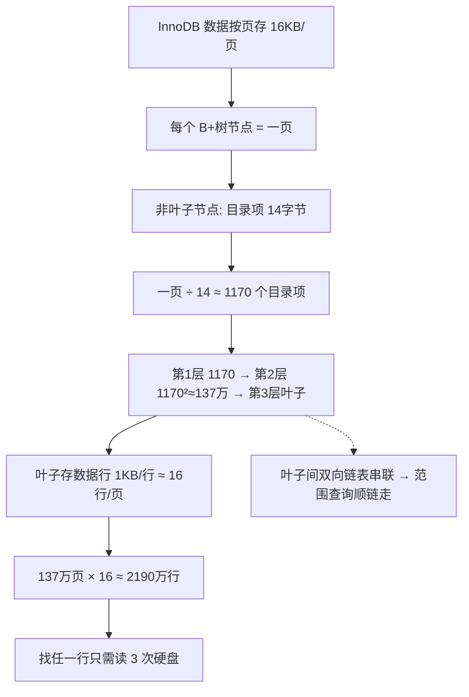

---

title: "B+树在MySQL里的样子"

created: "2025-07-12"

tags:

  - 八股文

  - mysql

---

# B+树在MySQL里的样子

## 一、B+树在 MySQL 里到底长什么样？
### 1.1 InnoDB 的一页有多大？

MySQL（InnoDB 引擎）把数据存在硬盘上时，不是一条一条存的，而是一页一页存的。

> **一页 = 16KB**。就像一本书的一页纸，16KB 是 InnoDB 每次读写的最小单位。读硬盘时要么读一整页，要么不读。

B+树的**每个节点就是硬盘上的一页**（16KB）。

### 1.2 一页能装多少个"目录项"？

假设我们用 `bigint`（8字节）做主键，每个"目录项"需要：

```text

一个目录项 = 主键值(8字节) + 指向子节点的指针(6字节) = 14字节

```

那一个非叶子节点（16KB 的一页）能装多少个目录项？

```text

16KB ÷ 14字节 = 16384 ÷ 14 ≈ 1170 个

```

**一个非叶子节点就能指出 1170 个方向！**

### 1.3 三层 B+树能装多少数据？

```text

第1层（根节点，1页）：

  存 1170 个目录项，指向 1170 个第2层节点

第2层（1170 个节点，1170页）：

  每个节点又存 1170 个目录项

  共 1170 × 1170 ≈ 137万个目录项

  指向 137万个叶子节点

第3层（叶子节点，137万页）：

  每个叶子节点存的是真正的数据行

  假设一行数据约 1KB，一页（16KB）能存约 16 行

  137万页 × 16行 ≈ 2190万行数据

```

> **这意味着**：一张有 2000 万行数据的表，通过 B+树索引，**只需要读 3 次硬盘就能找到任意一行**。没有索引的话，平均要读 1000 万行。

### 1.4 叶子节点的链表有什么用？

```text

[叶子页1] ←→ [叶子页2] ←→ [叶子页3] ←→ [叶子页4] ←→ ...

每页内部存着按顺序排好的数据，

页和页之间用"上一页""下一页"指针串联。

```

这就是为什么 `WHERE id BETWEEN 100 AND 200` 这么快——找到 100 所在的叶子页，然后顺着链表往后读就行，不用反复从根节点重新搜索。

---

## 二、一图流（Mermaid）



##

> ▶ 对应实操：[[07-窗口函数实操|07-窗口函数实操]]

## 速记卡（面试闪卡）

**Q1：一句话讲清「B+树在MySQL里的样子」到底是什么？**

A：InnoDB 把数据按 16KB 一页存，B+树每个节点就是一页，三层树就能用三次读盘找到两千万行里的任意一行。

**Q2：一页 16KB 意味着什么？ —— 怎么理解？**

A：像书按页翻、不能撕半页——InnoDB 每次读写最小单位就是一页 16KB（page），B+树的每个节点正好是一页，读盘要么读整页要么不读，不能只读半个节点。

**Q3：一个非叶子节点为啥能分约 1170 个叉？ —— 怎么理解？**

A：像一页名片能印多少联系人——目录项 = 主键 8 字节 + 指针 6 字节 = 14 字节，16KB÷14 ≈ 1170 个目录项，所以一个节点能指向下一层约 1170 个节点。

**Q4：三层 B+树为啥能装约两千万行？ —— 怎么理解？**

A：像三层楼每层分 1170 个房间——第 1 层 1170 个指到第 2 层，第 2 层共 1170²≈137 万个指到第 3 层叶子；每行约 1KB、一页约 16 行，137 万页×16 ≈ 2190 万行，找任一行只读 3 次盘。

**Q5：叶子节点的双向链表有啥用？ —— 怎么理解？**

A：像超市货架用绳子串起来——叶子页之间用前后指针串联，范围查询（如 BETWEEN 100 AND 200）定位起点后顺着链表往后读就行，不用每次从根节点重新搜，范围查询因此飞快。

**Q6：核心速记主线有哪些？**

- 一页 = 16KB，是 InnoDB 读写最小单位，B+树节点即一页

- 目录项 14 字节，一页约 1170 个目录项，一个节点分 1170 叉

- 三层树 1170³ 量级，约两千万行，找任一行只读 3 次盘

- 叶子间双向链表串联，范围查询顺链走、不用回根重搜

**口诀**

A：一页十六K是最小，节点就是它一页。

目录十四B算清，一千一百七叉分。

三层树装两千万，三读盘找任意行。

叶子链表串成串，范围查询顺藤摸。

相关链接

- 📋 目录：[[00-MySQL]]

- 📚 学习清单：[[八股文学习路线图]]

## 相关链接

- [[笔记/语言与框架/MySQL/八股/01-MySQL索引B+树与聚簇非聚簇|MySQL 索引原理 · B+树 · 聚簇与非聚簇]]

- [[笔记/语言与框架/MySQL/八股/09-索引下推ICP|索引下推 ICP（MySQL 5.6+）]]

- [[笔记/语言与框架/MySQL/八股/06-B+树数据结构演进|B+树数据结构演进]]

- [[笔记/语言与框架/MySQL/八股/35-慢查询优化|慢查询优化]]

- [[笔记/语言与框架/MySQL/八股/16-并发事务问题脏读不可重复读幻读|并发事务问题脏读不可重复读幻读]]

