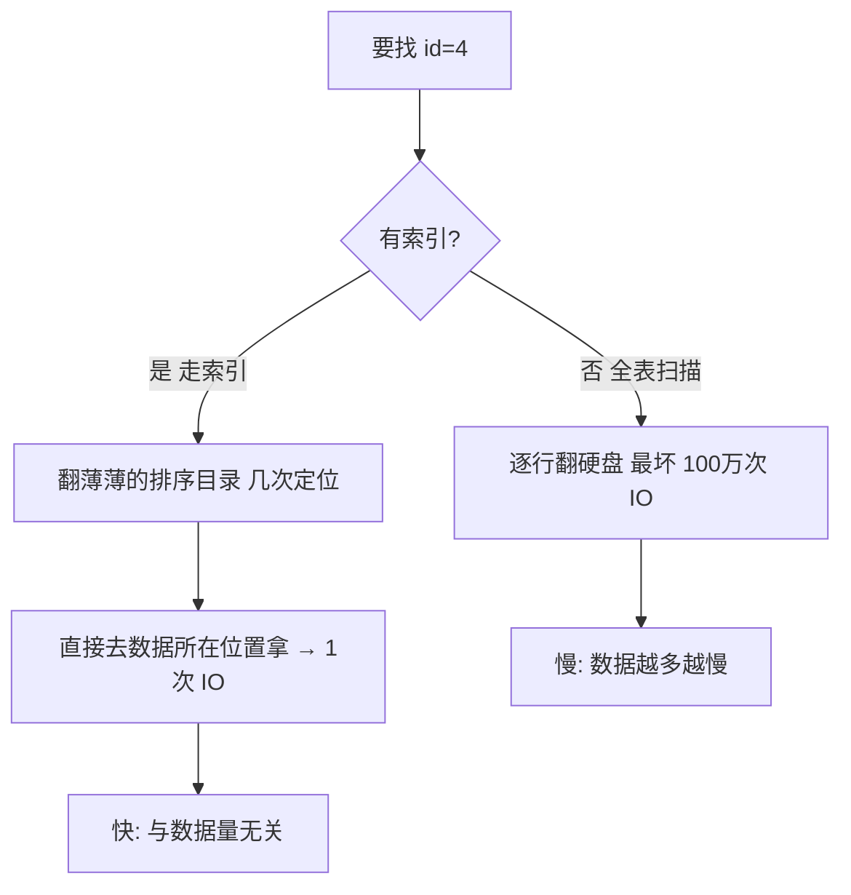

---

title: "索引为什么这么快"

created: "2025-07-12"

tags:

  - 八股文

  - mysql

---

# 索引为什么这么快

## 一、从一个生活场景开始：没有索引有多慢？
### 1.1 假设你有一张用户表

你的程序里有一张 `user` 表，存了 5 个用户的数据，保存在**电脑硬盘**上：

```text

硬盘上的样子（数据按插入的先后顺序随便堆放）：

位置1: | id=3, name="王五", age=25, city="上海" |

位置2: | id=1, name="张三", age=20, city="北京" |

位置3: | id=5, name="赵七", age=30, city="深圳" |

位置4: | id=2, name="李四", age=22, city="广州" |

位置5: | id=4, name="钱六", age=28, city="杭州" |

```

### 1.2 如果我要找 id=4 的人

MySQL 只能这样做：

```text

从位置1开始，读第一条 → id=3，不是4，跳过

读位置2 → id=1，不是4，跳过

读位置3 → id=5，不是4，跳过

读位置4 → id=2，不是4，跳过

读位置5 → id=4，找到了！

```

5 条数据里找一个，最坏要翻 5 次。如果表里有 **100 万条**数据呢？最坏要翻 100 万次。每一次翻动都是一次**磁盘读取**（硬盘读写），而硬盘的速度比内存慢几千倍。

> **核心问题**：数据在硬盘上是乱序堆着的，找东西只能一行一行翻。数据越多越慢。

### 1.3 生活中我们怎么解决这个问题？

**字典的目录**。你要查"张"字，不会从第一页翻到最后一页，而是：

```text

1. 翻到"拼音目录"（这个目录很薄，只有几页）

2. 找到"Z"开头的部分

3. 目录告诉你："张"字在第 528 页

4. 直接翻到 528 页

```

这个**拼音目录**，就是索引。

### 1.4 数据库里索引是什么？

> **索引 = 给数据额外建一个"目录"，这个目录排好序了，查起来飞快。**

目录长什么样？比如给 `id` 列建索引：

```text

id 索引（排好序的小本本）：

索引项: | id=1 → 数据在位置2 |

        | id=2 → 数据在位置4 |

        | id=3 → 数据在位置1 |

        | id=4 → 数据在位置5 |

        | id=5 → 数据在位置3 |

现在找 id=4：

  看索引中间：id=3，4>3 → 往后看

  看到 id=4 → 数据在位置5 → 直接去位置5拿数据

  只翻了几次索引（很小的目录）+ 1次拿数据，而不是翻遍全表

```

**所以索引的本质就是**：花一点额外的存储空间，建一个排序好的"目录"，让查找从"翻遍全部"变成"翻几下目录 + 直接定位"。

*（这也是为什么里常说"索引是用空间换时间"——多占用一些硬盘空间存目录，换来找数据的速度。）*

### 1.5 索引不是免费的

| 代价 | 什么意思 |

| :--- | :--- |

| **占硬盘空间** | 索引本身也要存，数据越多索引越大 |

| **拖慢增删改** | 每次新增、删除、修改数据，索引这个"目录"也要同步更新 |

| **不能乱建** | 建了不用的索引，白占空间还拖慢写入 |

---

## 二、一图流（Mermaid）



##

> ▶ 对应实操：[[08-EXPLAIN执行计划分析|08-EXPLAIN执行计划分析]]

## 速记卡（面试闪卡）

**Q1：一句话讲清「索引为什么这么快」到底是什么？**

A：数据库索引是给数据额外建的排好序的"目录"，把查找从全表逐行翻硬盘变成翻几下目录再直接定位，本质用空间换时间。

**Q2：没有索引多慢（full table scan） —— 怎么理解？**

A：类比：没索引的数据像乱堆的仓库，找 id=4 得从位置1翻到尾，100万行最坏翻100万次磁盘（disk IO），硬盘比内存慢几千倍。数据越多越慢，纯靠蛮力。（Brute scan）

**Q3：索引怎么加速（B+ tree） —— 怎么理解？**

A：类比：索引像字典的拼音目录——薄薄几页、排好序。找"张"先翻目录定位第528页再直取，而不是从第一页翻到末页。B+树（B+ tree）索引树高约3层，100万行也只需约3次 IO 而非100万次。（Sorted index）

**Q4：索引不是免费的（trade-offs） —— 怎么理解？**

A：类比：索引像办了张会员目录卡：占硬盘空间（数据越多索引越大）；拖慢增删改（每次写都得同步更新目录）；不能乱建（用不上的索引白占空间还拖累写入）。空间换时间，账单别忘付。（Costs）

**Q5：B+ 树为什么适合（why B+ tree） —— 怎么理解？**

A：类比：B+树（B+ tree）像一棵矮胖查找树：节点排好序、叶子串成链表，三层就能管百万数据，每次比较砍掉一大半。相比二叉树它更"矮"，减少磁盘寻道次数——IO 次数是性能命门。（Short & wide）

**Q6：核心速记主线有哪些？**

- 索引=排好序的目录，把全表扫描变成目录定位+直接取，空间换时间

- 无索引最坏 IO 次数=数据行数；B+树索引约树高（~3）次

- 代价：占空间、拖慢写（增删改同步更新）、不能滥用

- B+树矮胖、叶子链表有序，减少磁盘寻道

- 本质：用额外存储换查找速度

**口诀**

A：索引就是排序目录，空间换时间；

无索引翻全书，有索引查几页；

B+树矮又胖，三层管百万；

写入略买单，别建用不上的。

相关链接

- 📋 目录：[[00-MySQL]]

- 📚 学习清单：[[八股文学习路线图]]

## 相关链接

- [[笔记/语言与框架/MySQL/八股/11-事务ACID四大特性|事务ACID四大特性]]

- [[笔记/语言与框架/MySQL/八股/09-索引下推ICP|索引下推 ICP（MySQL 5.6+）]]

- [[笔记/语言与框架/MySQL/八股/03-联合索引与最左前缀|联合索引与最左前缀]]

- [[笔记/语言与框架/MySQL/八股/10-建索引实战原则|建索引实战原则]]

- [[笔记/语言与框架/MySQL/八股/02-聚簇索引与非聚簇索引|聚簇索引与非聚簇索引]]

