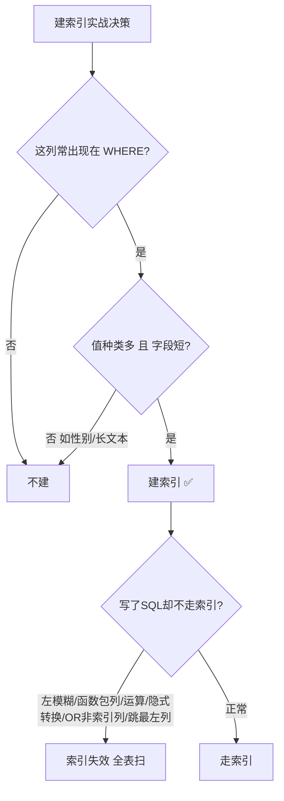

# 建索引实战原则
## 六、建索引的实战原则

### 6.1 哪些列该建索引？

| 该建 | 不该建 |
| :--- | :--- |
| WHERE 后实践经验常出现的列 | 从来不查的列 |
| 值种类多的列（如用户ID） | 值种类很少的列（如性别，只有男/女） |
| 字段短的列（如 int） | 很长的列（如 TEXT 文章内容） |
| 经常排序的列 | 频繁修改的列 |

### 6.2 写了 SQL 索引却不生效的常见原因

| 你的写法 | 为什么不走索引 |
| :--- | :--- |
| `WHERE name LIKE '%张'` | 前面带 %，索引不知道从哪开始找 |
| `WHERE YEAR(birthday) = 2000` | 索引列被函数包住了 |
| `WHERE id + 1 = 10` | 索引列参与了运算 |
| `WHERE phone = 13800138000` | phone 是 varchar，你给了数字，MySQL 偷偷转了类型 |
| `WHERE a=1 OR b=2` | b 没索引，OR 导致扫全表 |
| `WHERE status != 1` | 不等于通常不走索引 |
| `WHERE b = 1`（联合索引是 (a,b)） | 跳过了最左列 a |

### 6.3 用 EXPLAIN 看索引用了没

```sql
EXPLAIN SELECT * FROM user WHERE id = 1;
```

看这几个字段：

| 字段 | 怎么看 |
| :--- | :--- |
| **type** | `ALL` = 全表扫描 = 出问题了；`ref` / `const` = 走索引了 |
| **key** | 显示实际用了哪个索引 |
| **rows** | 预计要扫多少行，越小越好 |
| **Extra** | `Using index` = 覆盖索引（好）；`Using filesort` = 额外排序（差） |

---


## 七、一图流（Mermaid）



## 八、速记卡（面试闪卡）

**Q1：哪些列该建索引，哪些不该？**  
A：该建——WHERE 后常出现的列、值种类多的列（如用户 ID）、字段短的列（如 int）、经常排序的列。不该建——从来不查的列、值种类很少的列（如性别）、很长的列（如 TEXT）、频繁修改的列。

**Q2：常见"写了 SQL 索引却不生效"的原因有哪些？**  
A：① 左模糊 `LIKE '%张'`；② 索引列被函数包住 `YEAR(birthday)=2000`；③ 索引列参与运算 `id+1=10`；④ 隐式类型转换（varchar 列给了数字）；⑤ `OR` 包含非索引列；⑥ 不等于 `!=`；⑦ 跳过联合索引最左列。

**Q3：怎么用 EXPLAIN 确认索引用没用？**  
A：看四个字段——`type`：`ALL` 全表扫描（出问题），`ref`/`const` 走索引；`key`：实际用的索引；`rows`：预计扫描行数，越小越好；`Extra`：`Using index` 覆盖索引（好），`Using filesort` 额外排序（差）。

> 🔑 口诀：常查、多值、短字段，才配建索引；左模糊、包函数、跳最左，索引全白给。

---

## 相关链接

- 📋 目录：[[00-MySQL]]
- 📚 学习清单：[[八股文学习清单]]

