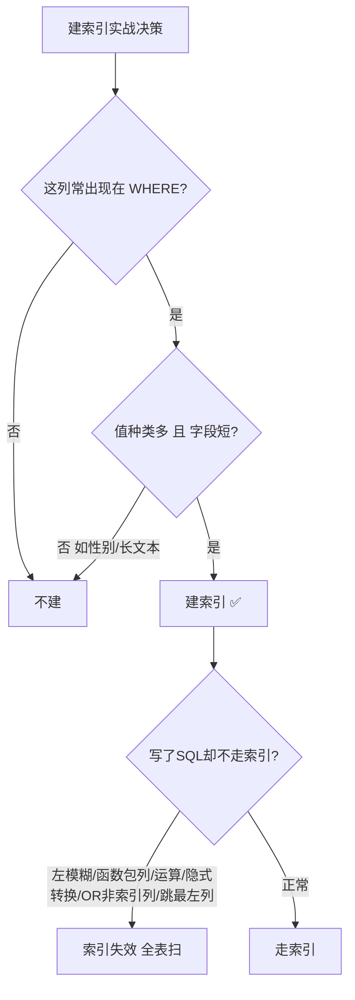

---

title: "建索引实战原则"

created: "2025-07-12"

tags:

  - 八股文

  - mysql

---

# 建索引实战原则

## 一、建索引的实战原则
### 1.1 哪些列该建索引？

| 该建 | 不该建 |
| :--- | :--- |
| WHERE 后实践经验常出现的列 | 从来不查的列 |
| 值种类多的列（如用户ID） | 值种类很少的列（如性别，只有男/女） |
| 字段短的列（如 int） | 很长的列（如 TEXT 文章内容） |
| 经常排序的列 | 频繁修改的列 |

### 1.2 写了 SQL 索引却不生效的常见原因

| 你的写法 | 为什么不走索引 |
| :--- | :--- |
| `WHERE name LIKE '%张'` | 前面带 %，索引不知道从哪开始找 |
| `WHERE YEAR(birthday) = 2000` | 索引列被函数包住了 |
| `WHERE id + 1 = 10` | 索引列参与了运算 |
| `WHERE phone = 13800138000` | phone 是 varchar，你给了数字，MySQL 偷偷转了类型 |
| `WHERE a=1 OR b=2` | b 没索引，OR 导致扫全表 |
| `WHERE status != 1` | 不等于通常不走索引 |
| `WHERE b = 1`（联合索引是 (a,b)） | 跳过了最左列 a |

### 1.3 用 EXPLAIN 看索引用了没

```sql

EXPLAIN SELECT * FROM user WHERE id = 1;

```

看这几个字段：

| 字段 | 怎么看 |
| :--- | :--- |
| **type** | `ALL` = 全表扫描 = 出问题了；`ref` / `const` = 走索引了 |
| **key** | 显示实际用了哪个索引 |
| **rows** | 预计要扫多少行，越小越好 |
| **Extra** | `Using index` = 覆盖索引（好）；`Using filesort` = 额外排序（差） |

---

## 二、一图流（Mermaid）



## 速记卡（面试闪卡）

**Q1：一句话讲清「建索引实战原则」到底是什么？**

A：建索引实战就两条心法：挑对列（常查、值多、字段短的才建），写对 SQL（避开左模糊、函数包列、运算、隐式转换、OR、跳最左这些让索引失效的坑）。

**Q2：六、哪些列该建索引 —— 怎么理解？**

A：建索引像给书贴便利贴：你常翻的页（WHERE 常查的列）、目录种类多的（用户 ID 而非性别）、纸薄的（int 而非 TEXT）、常排序的，才值得贴。反过来从不查、种类少（性别）、超长（TEXT）、频繁改的列贴了也是浪费——索引本身也占空间、拖慢写入。

**Q3：六、索引为什么不生效 —— 怎么理解？**

A：索引失效就像你按拼音找人，却被人改名/戴面具/换位：左模糊 LIKE '%张'（不知从哪找起）、函数包列 YEAR(birthday)、列参与运算 id+1、隐式转换（varchar 列给了数字）、OR 带非索引列、!=、跳联合索引最左列——任一发生，索引直接罢工改全表扫。

**Q4：用 EXPLAIN 验证索引生效 —— 怎么理解？**

A：EXPLAIN 是查索引有没有在干的"监控器"：看 type——ALL 是全表扫描（出事），ref/const 是走索引了；key 显示实际用了哪个索引；rows 是预计扫多少行（越小越好）；Extra 里 Using index 是覆盖索引（好），Using filesort 是额外排序（差）。

**Q5：七、决策一图流（建对 + 写对） —— 怎么理解？**

A：一图流把原则串成决策树：先问"这列常出现在 WHERE 吗"——否就不建；是再问"值多且字段短吗"——否（如性别/长文本）也不建；建了之后若 SQL 踩了左模糊/函数/跳最左等坑，索引照样失效。一句话：建对列 + 写对 SQL，才算真用上索引。

**Q6：核心速记主线有哪些？**

- 该建：常查、值种类多、字段短、常排序的列

- 不该建：不查、种类少（性别）、超长（TEXT）、频繁修改的列

- 失效七大坑：左模糊、函数包列、列运算、隐式转换、OR 非索引列、!=、跳最左

- EXPLAIN 看 type/key/rows/Extra 验证索引是否生效

- 覆盖索引（Using index）最优，Using filesort 要优化

**口诀**

A：常查多值短字段，

才配建索莫嫌烦；

左模糊包函数转，

跳最左全白干。

## 相关链接

- 📋 目录：[[00-MySQL]]

- 📚 学习清单：[[八股文学习路线图]]

