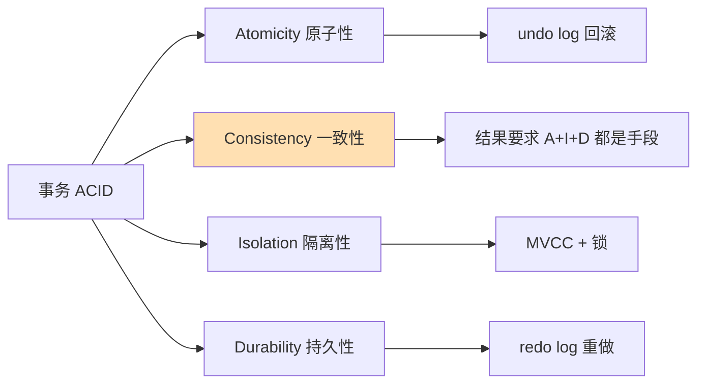

# 事务ACID四大特性
## 一、从一个转账场景开始：为什么要事务？

### 1.1 没有事务会怎样？

你和朋友聚餐后 AA，你给他微信转账 100 块：

```sql
-- 银行系统内部做了两步操作：
UPDATE account SET balance = balance - 100 WHERE id = 1;   -- 你的账户减 100
UPDATE account SET balance = balance + 100 WHERE id = 2;   -- 朋友的账户加 100
```

这中间如果出问题了——

| 意外场景 | 后果 |
| :--- | :--- |
| 第一条执行完，第二条执行前，**服务器断电** | 你的钱扣了，朋友没收到 — 100 块凭空消失 |
| 第一条执行完，第二条执行时**违反约束报错** | 同上 |
| 两个 SQL 之间，**另一个程序改了你朋友的余额** | 数据错乱 |

> 两条 SQL 必须**要么全成功，要么全失败。** 这就是事务。

### 1.2 事务是什么？

> **事务 = 把一组 SQL 操作打包成一个"不可分割的整体"**。这个整体要么全部执行成功，要么全部撤销回滚，不存在"一半成功一半失败"。

```sql
-- 用事务包起来
START TRANSACTION;
  UPDATE account SET balance = balance - 100 WHERE id = 1;
  UPDATE account SET balance = balance + 100 WHERE id = 2;
COMMIT;   -- 确认，真正写入
-- 如果出错就 ROLLBACK，全部撤销
```

**通俗比喻**：就像婚礼上牧师问"你愿意吗？"
- 你说"我愿意"→ COMMIT（确认，生效）
- 你跑出教堂 → ROLLBACK（回滚，就当这事没发生）
- 不存在"结了一半的婚"

---


## 二、ACID 四大特性（必考）

> ACID = Atomicity（原子性）+ Consistency（一致性）+ Isolation（隔离性）+ Durability（持久性）

### 2.1 原子性 Atomicity

> **要么全做，要么全不做。不存在做一半。**

```text
转账 100 元的两步：减你的钱 + 加朋友的钱
结果只能有两种：
  ✅ 两步全完成 → 转账成功
  ✅ 两步全撤销 → 回到转账前
  ❌ 减了你的钱但没加朋友的钱 → 绝不可能
```

**MySQL 怎么实现的**：通过 **undo log（回滚日志）**。每条修改操作前，先把**改之前的值**记在 undo log 里。需要回滚时，根据 undo log 把数据恢复原样。

```text
执行 UPDATE balance = balance - 100 之前：
  undo log 记一笔："balance 原来是 500"
  然后改 balance = 400

如果回滚：
  读 undo log："哦，原来是 500"→ balance 改回 500
```

> undo log 像一个**后悔药箱子**，每次改数据前先把"旧值"存进去。回滚就是按旧值恢复。

---

### 2.2 一致性 Consistency

> **事务执行前后，数据必须符合同一个业务规则。** 规则不会因为事务被打破。

```text
规则：账户余额不能为负数

事务前 → 双方余额都是正数，符合规则
事务中 → 你的余额可能会暂时变成负数
事务后 → 要么全部成功（余额都是正数），要么全部回滚（回到原来的正数）

总之最后状态一定符合规则，不会出现"你的余额是 -100"
```

**通俗比喻**：就像玩积木 — 你可以把积木拆散再搭起来，但搭完后积木总数不会多也不会少。

> ❗ 一致性是**结果要求**，原子性、隔离性、持久性都是**实现手段**。经常问"ACID 四个特性的关系"——答案就是：A、I、D 都是为了 C。

---

### 2.3 隔离性 Isolation

> **多个事务同时执行时，互相不干扰。** 每个事务都以为自己是唯一在运行的事务。

```text
场景：你和另一个人同时给同一个朋友转账

没有隔离性时可能出现：
  事务A 读余额 = 500（刚被事务B 改了，但还没提交）
  事务A 基于 500 做操作
  事务B 回滚了，余额其实是 600
  事务A 算错了

有隔离性时：
  事务A 看到的余额 = 600（事务B 的修改在提交前对 A 不可见）
```

**MySQL 怎么实现的**：通过 **MVCC**（多版本并发控制）+ 锁。重点详见 [[13-MVCC原理ReadView与UndoLog|MVCC 原理]]。

---

### 2.4 持久性 Durability

> **一旦事务提交成功，数据就永久保存了。** 就算数据库立刻崩溃，重启后数据还在。

```text
你转账成功后，银行返回"转账成功"
即使下一秒机房断电，你的钱仍然在对方账户里
```

**MySQL 怎么实现的**：通过 **redo log（重做日志）**。提交事务时，不是直接写数据文件，而是先写 redo log（顺序写，极快），数据文件**异步慢慢刷**。

```text
提交一个事务：
  ① 把修改内容写到 redo log（顺序追加，飞快）→ 写完了就算提交成功
  ② 后台慢慢把数据刷到真正的数据文件

崩溃恢复：
  重启时读 redo log → 找到已提交但还没真正写入数据文件的修改 → 补写
```

**通俗比喻**：
> - **redo log** = 餐厅前台小本子，你来点菜，服务员飞快在小本子上记一笔，然后让你坐下等
> - **数据文件** = 后厨，慢慢做菜
> - 点菜后服务员晕倒了（服务器崩溃）→ 醒来后翻小本子，继续把没上的菜补上

---

### 2.5 ACID 一张表总结

| 特性      | 一句话      | 实现手段       | 通俗比喻          |
| :------ | :------- | :--------- | :------------ |
| **原子性** | 全做或全不做   | undo log   | 后悔药 — 回滚就恢复原样 |
| **一致性** | 数据始终符合规则 | A+I+D 共同保证 | 积木总数量不能变      |
| **隔离性** | 并发事务互不干扰 | MVCC + 锁   | 各自在独立房间办事     |
| **持久性** | 提交后就永存   | redo log   | 餐厅小本子记着，后厨补做  |

---

## 三、一图流（Mermaid）



## 四、速记卡（面试闪卡）

**Q1：事务的 ACID 分别是什么，各自靠什么实现？**  
A：原子性（Atomicity）——要么全做要么全不做，靠 **undo log** 回滚；一致性（Consistency）——数据始终符合业务规则，是结果要求；隔离性（Isolation）——并发事务互不干扰，靠 **MVCC + 锁**；持久性（Durability）——提交后永久保存，靠 **redo log** 重做。

**Q2：四个特性之间是什么关系？**  
A：一致性是目标，原子性、隔离性、持久性都是实现手段——A、I、D 都是为了 C。常考题"ACID 四个特性的关系"答案就这句。

**Q3：undo log 和 redo log 分别解决什么？**  
A：undo log 是"后悔药箱子"，每次改数据前先存旧值，回滚时按旧值恢复（保原子性）；redo log 是"餐厅小本子"，提交时顺序写日志（极快），崩溃重启后按日志补写未落盘的数据（保持久性）。

> 🔑 口诀：原子 undo、持久 redo、隔离 MVCC+锁；一致性是 boss，三个小弟保它。

---

## 相关链接

- 📋 目录：[[00-MySQL]]
- 📚 学习清单：[[八股文学习清单]]

