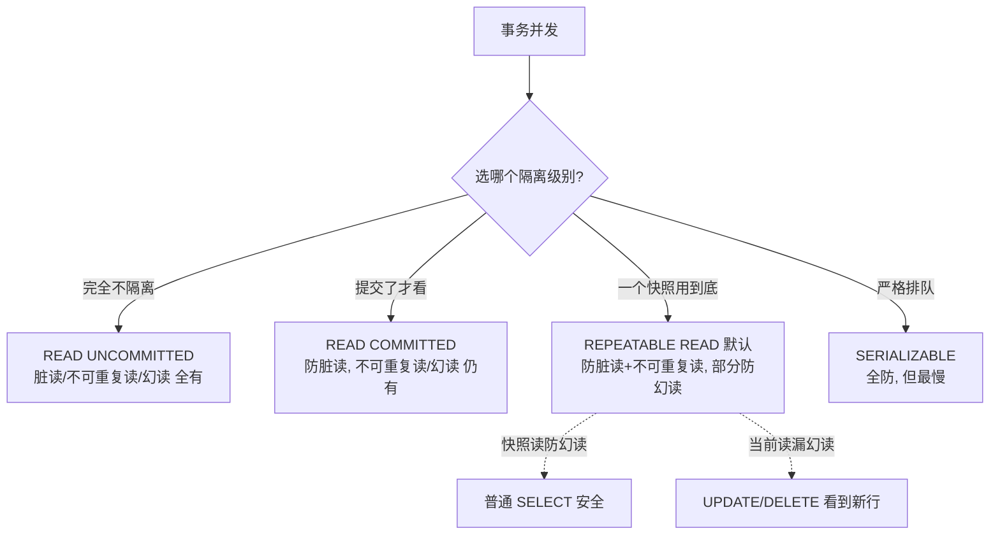

---

title: "四种隔离级别详解"

created: "2025-07-12"

tags:

  - 八股文

  - mysql

---


# 四种隔离级别详解

## 四、四种隔离级别（核心）


> 隔离级别就是你在"安全"和"速度"之间做的选择。越安全 → 并发性能越差 → 系统处理请求越慢。


| 隔离级别 | 脏读 | 不可重复读 | 幻读 | 通俗理解 |

| :--- | :---: | :---: | :---: | :--- |

| **READ UNCOMMITTED**（读未提交） | ❌ 有 | ❌ 有 | ❌ 有 | 完全不隔离，你改到一半别人就能看到 |

| **READ COMMITTED**（读已提交） | ✅ 防 | ❌ 有 | ❌ 有 | 提交了才给别人看，但同一事务两次读可能不同 |

| **REPEATABLE READ**（可重复读） | ✅ 防 | ✅ 防 | ⚠️ 部分防 | 同一事务每次读都一样。**MySQL 默认** |

| **SERIALIZABLE**（串行化） | ✅ 防 | ✅ 防 | ✅ 防 | 事务排队执行，完全没问题，但最慢 |


### 4.1 READ UNCOMMITTED — 读未提交


> 最低隔离级别。一个事务可以读到其他事务**还没提交**的修改。


```text

事务A 改了数据但没提交 → 事务B 立马能看到改后的值

如果 A 回滚了 → B 之前读到的就是"脏数据"

```


**为什么几乎没人用**：会读到不存在的数据，后果不可控。几乎不存在实践场景。


---


### 4.2 READ COMMITTED — 读已提交


> 一个事务只能读到其他事务**已经提交**的修改。每次 SELECT 可能读到不同的快照。


```text

解决脏读的原理（一句话版）：

  每次 SELECT 时，MySQL 会建立一个 Read View（快照）

  这个快照只包含"这条语句执行时"已经提交了的数据版本

  语句执行后，快照就作废了，下次 SELECT 重建新的

```


**不可重复读为什么还在**：


```text

事务B 第一次 SELECT → RC 创建快照，看到 age=25

事务A UPDATE + COMMIT → age 变成 30

事务B 第二次 SELECT → RC 重建快照，看到 age=30

```


**实际用在哪**：Oracle 数据库的默认隔离级别。


---


### 4.3 REPEATABLE READ — 可重复读（MySQL 默认）


> 一个事务从开始到结束，读到的数据始终一样。就算中间别人修改并提交了，也看不见。


```text

解决不可重复读的原理（一句话版）：

  RR 在一个事务开始时建立一个 Read View，整个事务期间都用这一个快照

  不会因为别人提交了而更新快照

  所以每次 SELECT 看到的数据完全一样

```


**MySQL 的 RR 还能防大部分幻读**（但并非 100%，后面会讲）。


---


### 4.4 SERIALIZABLE — 串行化


> 最高隔离级别。事务严格排队执行，相当于关了并发。绝对安全，但吞吐量极低。


```text

事务A 在执行 SELECT → 默认有 SHARED LOCK（读锁）

事务B 在执行 INSERT → 必须等事务A 释放读锁


这就是"排队"——一次跑一个事务，不会有任何并发问题。

```


---


### 4.5 为什么 MySQL 默认选 RR 而不是 RC？


| 考量 | RR | RC |

| :--- | :--- | :--- |

| 数据一致性 | 更强，不会出现两次读不一样 | 弱一些 |

| binlog 兼容 | MySQL 5.0 之前 statement-based binlog 依赖 RR | RC 需要 row-based binlog |

| 实际场景 | 转账场景要保证两次读一致 | 报表之类的可以接受不一致 |


> 大部分互联网公司实际用的还是 RC（比如阿里很多业务），因为 RC 并发性能更好，加上应用层可以接受少量不一致。


---


### 4.6 RR 没办法完全防住幻读？


**RR 能防住大部分幻读**（普通 SELECT 查询），但有一种特殊情况：


```text

事务B：

  SELECT * FROM user WHERE age > 20;           → 5 条（MVCC 保证不会变）


事务A：

  INSERT INTO user VALUES(6, '新用户', 25);     → 插入新行

  COMMIT;


事务B：

  SELECT * FROM user WHERE age > 20;           → 还是 5 条（MVCC 生效了，确实没幻读）


  -- 但是！

  UPDATE user SET city = '北京' WHERE age > 20; → 影响了 6 行！（包括了 A 新插入的那行）


  SELECT * FROM user WHERE age > 20;           → 竟然变成了 6 条！

```


**为什么**？因为 UPDATE 使用的是**当前读**（读最新版本），不是快照读。UPDATE 读到了事务A 插入的新行并修改了它，这行从此"正式进入"事务B 的视野。


> **结论**：RR 快照读防幻读，但涉及 UPDATE/DELETE 等当前读时，幻读依然可能发生。


---


## 五、一图流（Mermaid）





## 速记卡（面试闪卡）


**Q1：一句话讲清「四种隔离级别详解」到底是什么？**

A：MySQL 四种隔离级别从松到严：RU→RC→RR(默认)→SERIALIZABLE，越严越安全、并发越差。


**Q2：RU 与 RC —— 怎么理解？**

A：RU（读未提交）能读到别人没提交的修改，对方一回滚你就读了"脏数据"，几乎没人用。RC（读已提交）每次 SELECT 重建 Read View 快照，只看得见"语句执行时已提交"的数据，防住脏读；但别人提交了下次读就变，所以仍有不可重复读。就像看实时弹幕 vs 看已审核的留言。这叫 dirty read（脏读）与 Read View（快照）。


**Q3：RR 可重复读 —— 怎么理解？**

A：RR 在事务开始建一次 Read View，整个事务复用同一快照，别人提交也不更新，所以每次读都一样——防住不可重复读。它是 MySQL 默认级别。但注意：这只是"快照读"的保证。这叫 repeatable read（可重复读）与 MVCC（多版本并发控制）。


**Q4：幻读与当前读 —— 怎么理解？**

A：RR 普通 SELECT 靠 MVCC 快照读防住幻读；但 UPDATE/DELETE 用的是"当前读"（读最新版本），仍可能读到别人刚插入的新行——UPDATE 后影响行数多了，幻读就出现了。SERIALIZABLE 最严，事务排队加读锁，全防但最慢。这叫 phantom read（幻读）与 current read（当前读）。


**Q5：为什么默认 RR 而非 RC —— 怎么理解？**

A：MySQL 默认 RR 因数据一致性更强（两次读一致），且老版本 statement binlog 依赖 RR；但阿里等很多公司实际用 RC，因为并发更好、应用层能接受少量不一致。选型本质是在"安全"和"速度"间权衡。这叫 isolation level（隔离级别）的权衡。


**Q6：核心速记主线有哪些？**

- RU：读未提交，脏读全有，几乎不用

- RC：读已提交，防脏读，仍有不可重复读/幻读

- RR（默认）：一个快照用到底，防脏读+不可重复读，部分防幻读

- SERIALIZABLE：全防但排队最慢；RR 当前读仍漏幻读


**口诀**

A：RU 裸奔 RC 防脏，

RR 防重靠快照；

串行全防代价慢，

当前读漏幻难逃。


## 相关链接


- 📋 目录：[[00-MySQL]]

- 📚 学习清单：[[八股文学习路线图]]


